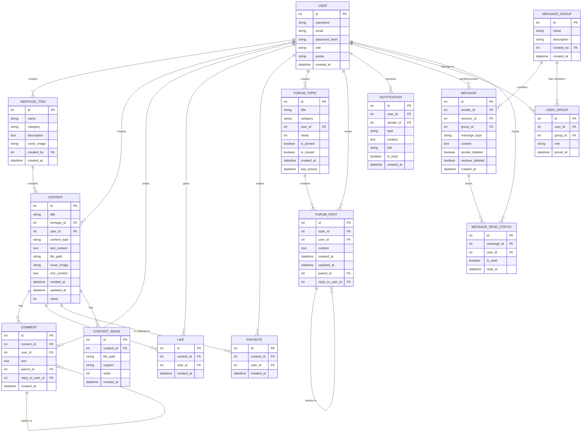

# 体育非遗数字展示平台技术文档

## 目录

- [体育非遗数字展示平台技术文档](#体育非遗数字展示平台技术文档)
  - [目录](#目录)
  - [1. 项目概述](#1-项目概述)
    - [1.1 项目背景与意义](#11-项目背景与意义)
    - [1.2 项目目标与价值](#12-项目目标与价值)
    - [1.3 目标用户群体](#13-目标用户群体)
  - [2. 系统架构](#2-系统架构)
    - [2.1 技术栈概述](#21-技术栈概述)
    - [2.2 系统架构图](#22-系统架构图)
    - [2.3 核心组件说明](#23-核心组件说明)
      - [2.3.1 应用初始化与配置 (`app/__init__.py` 和 `config.py`)](#231-应用初始化与配置-app__init__py-和-configpy)
      - [2.3.2 数据模型层 (`app/models/`)](#232-数据模型层-appmodels)
      - [2.3.3 视图与路由层 (`app/routes/`)](#233-视图与路由层-approutes)
      - [2.3.4 表单处理层 (`app/forms/`)](#234-表单处理层-appforms)
      - [2.3.5 API接口层 (`app/api/`)](#235-api接口层-appapi)
      - [2.3.6 WebSocket实时通信 (`app/socket_events.py`)](#236-websocket实时通信-appsocket_eventspy)
      - [2.3.7 工具函数层 (`app/utils/`)](#237-工具函数层-apputils)
  - [3. 后端设计与实现](#3-后端设计与实现)
    - [3.1 数据库设计](#31-数据库设计)
      - [3.1.1 ER图](#311-er图)
      - [3.1.2 主要数据表说明](#312-主要数据表说明)
    - [3.2 核心模型设计](#32-核心模型设计)
      - [3.2.1 用户模型(User)](#321-用户模型user)
      - [3.2.2 非遗项目模型(HeritageItem)](#322-非遗项目模型heritageitem)
      - [3.2.3 内容模型(Content)](#323-内容模型content)
      - [3.2.4 互动模型(Comment, Like, Favorite)](#324-互动模型comment-like-favorite)
      - [3.2.5 论坛模型(ForumTopic, ForumPost)](#325-论坛模型forumtopic-forumpost)
      - [3.2.6 通知模型(Notification)](#326-通知模型notification)
      - [3.2.7 消息模型(Message, MessageGroup)](#327-消息模型message-messagegroup)
    - [3.3 API接口设计](#33-api接口设计)
      - [3.3.1 RESTful API规范](#331-restful-api规范)
      - [3.3.2 主要API端点说明](#332-主要api端点说明)
    - [3.4 路由与视图函数](#34-路由与视图函数)
      - [3.4.1 主要路由模块说明](#341-主要路由模块说明)
      - [3.4.2 关键视图函数实现](#342-关键视图函数实现)
    - [3.5 实时通信实现](#35-实时通信实现)
      - [3.5.1 WebSocket架构](#351-websocket架构)
      - [3.5.2 主要事件处理函数](#352-主要事件处理函数)
  - [4. 核心功能实现](#4-核心功能实现)
    - [4.1 用户认证与授权](#41-用户认证与授权)
      - [4.1.1 登录与注册](#411-登录与注册)
      - [4.1.2 基于角色的权限控制](#412-基于角色的权限控制)
    - [4.2 非遗项目管理](#42-非遗项目管理)
      - [4.2.1 项目创建与编辑](#421-项目创建与编辑)
      - [4.2.2 项目展示与检索](#422-项目展示与检索)
    - [4.3 内容发布与管理](#43-内容发布与管理)
      - [4.3.1 多媒体内容处理](#431-多媒体内容处理)
      - [4.3.2 富文本编辑](#432-富文本编辑)
    - [4.4 社区互动功能](#44-社区互动功能)
      - [4.4.1 评论与回复系统](#441-评论与回复系统)
      - [4.4.2 点赞与收藏功能](#442-点赞与收藏功能)
    - [4.5 即时通讯系统](#45-即时通讯系统)
      - [4.5.1 私信功能](#451-私信功能)
        - [系统架构设计](#系统架构设计)
        - [数据模型设计](#数据模型设计)
        - [表单设计](#表单设计)
        - [路由与视图函数](#路由与视图函数)
        - [WebSocket实时通信](#websocket实时通信)
        - [WebSocket连接管理](#websocket连接管理)
        - [前端实现](#前端实现)
        - [安全性考量](#安全性考量)
        - [性能优化](#性能优化)
        - [扩展性设计](#扩展性设计)
      - [4.5.2 群组消息功能](#452-群组消息功能)
        - [系统架构设计](#系统架构设计-1)
        - [数据模型设计](#数据模型设计-1)
        - [表单设计](#表单设计-1)
        - [群组管理功能](#群组管理功能)
        - [群组消息发送与接收](#群组消息发送与接收)
        - [前端实现](#前端实现-1)
  - [5. 工具与辅助模块](#5-工具与辅助模块)
    - [5.1 安全工具](#51-安全工具)
      - [5.1.1 CSRF防护](#511-csrf防护)
        - [CSRF防护原理](#csrf防护原理)
        - [实现方式](#实现方式)
        - [安全考量](#安全考量)
        - [最佳实践](#最佳实践)
      - [5.1.2 XSS防护](#512-xss防护)
        - [XSS防护原理](#xss防护原理)
        - [HTML内容清理](#html内容清理)
        - [模板自动转义](#模板自动转义)
        - [内容安全策略（CSP）](#内容安全策略csp)
        - [安全HTTP头部](#安全http头部)
        - [应用场景](#应用场景)
        - [实现示例](#实现示例)
      - [5.1.3 速率限制](#513-速率限制)
        - [速率限制原理](#速率限制原理)
        - [实现方式](#实现方式-1)
          - [Flask-Limiter实现](#flask-limiter实现)
          - [自定义内存实现](#自定义内存实现)
        - [应用场景](#应用场景-1)
        - [实现示例](#实现示例-1)
        - [错误处理](#错误处理)
        - [性能考量](#性能考量)
    - [5.2 文件处理工具](#52-文件处理工具)
      - [5.2.1 图片处理](#521-图片处理)
        - [图片处理原理](#图片处理原理)
        - [图片验证](#图片验证)
        - [图片压缩](#图片压缩)
        - [水印添加](#水印添加)
        - [文件保存](#文件保存)
        - [应用场景](#应用场景-2)
        - [实现示例](#实现示例-2)
        - [安全考量](#安全考量-1)
        - [性能优化](#性能优化-1)
      - [5.2.2 文件上传与验证](#522-文件上传与验证)
        - [文件上传原理](#文件上传原理)
        - [文件上传表单](#文件上传表单)
        - [文件类型验证](#文件类型验证)
        - [文件上传处理](#文件上传处理)
        - [前端实现](#前端实现-2)
        - [安全考量](#安全考量-2)
        - [性能优化](#性能优化-2)
    - [5.3 响应处理工具](#53-响应处理工具)
      - [5.3.1 标准化API响应](#531-标准化api响应)
        - [响应格式设计](#响应格式设计)
        - [实现方式](#实现方式-2)
        - [特定类型错误响应](#特定类型错误响应)
        - [应用场景](#应用场景-3)
        - [错误处理](#错误处理-1)
        - [状态码使用](#状态码使用)
        - [安全考量](#安全考量-3)
        - [性能优化](#性能优化-3)
      - [5.3.2 错误处理机制](#532-错误处理机制)
        - [全局HTTP错误处理](#全局http错误处理)
        - [API错误处理](#api错误处理)
        - [异常捕获与日志记录](#异常捕获与日志记录)
        - [数据库事务处理](#数据库事务处理)
        - [WebSocket错误处理](#websocket错误处理)
        - [错误页面设计](#错误页面设计)
        - [安全考量](#安全考量-4)
        - [性能优化](#性能优化-4)
    - [5.4 日志与监控](#54-日志与监控)
      - [5.4.1 日志配置](#541-日志配置)
        - [日志系统设计](#日志系统设计)
        - [日志配置实现](#日志配置实现)
        - [访问日志记录](#访问日志记录)
        - [性能日志记录](#性能日志记录)
        - [访问日志装饰器](#访问日志装饰器)
        - [环境特定配置](#环境特定配置)
        - [日志使用示例](#日志使用示例)
        - [安全考量](#安全考量-5)
        - [性能优化](#性能优化-5)
      - [5.4.2 性能监控](#542-性能监控)
        - [性能监控设计](#性能监控设计)
        - [请求性能监控](#请求性能监控)
        - [函数执行性能监控](#函数执行性能监控)
        - [访问日志装饰器](#访问日志装饰器-1)
        - [数据库性能优化](#数据库性能优化)
        - [系统活动统计](#系统活动统计)
        - [速率限制](#速率限制)
        - [缓存控制](#缓存控制)
        - [安全考量](#安全考量-6)
        - [性能优化](#性能优化-6)
  - [6. 关键代码分析](#6-关键代码分析)
    - [6.1 用户认证流程](#61-用户认证流程)
      - [认证架构设计](#认证架构设计)
      - [用户模型设计](#用户模型设计)
      - [登录功能实现](#登录功能实现)
      - [注册功能实现](#注册功能实现)
      - [登出功能实现](#登出功能实现)
      - [密码管理功能](#密码管理功能)
      - [API认证实现](#api认证实现)
      - [密码安全策略](#密码安全策略)
      - [会话管理](#会话管理)
      - [访问控制](#访问控制)
      - [前端实现](#前端实现-3)
      - [安全考量](#安全考量-7)
      - [性能优化](#性能优化-7)
    - [6.2 文件上传与处理](#62-文件上传与处理)
      - [6.2.1 文件类型验证](#621-文件类型验证)
        - [允许的文件类型定义](#允许的文件类型定义)
        - [扩展名验证](#扩展名验证)
        - [内容验证](#内容验证)
        - [装饰器级别验证](#装饰器级别验证)
      - [6.2.2 图片处理功能](#622-图片处理功能)
        - [图片压缩](#图片压缩-1)
        - [水印添加](#水印添加-1)
        - [图片处理应用](#图片处理应用)
      - [6.2.3 文件存储与安全](#623-文件存储与安全)
        - [安全文件名处理](#安全文件名处理)
        - [唯一文件名生成](#唯一文件名生成)
        - [目录结构管理](#目录结构管理)
        - [文件保存函数](#文件保存函数)
        - [文件删除函数](#文件删除函数)
      - [6.2.4 文件上传路由实现](#624-文件上传路由实现)
        - [内容创建中的文件上传](#内容创建中的文件上传)
        - [封面图片上传](#封面图片上传)
        - [富文本编辑器图片上传](#富文本编辑器图片上传)
        - [错误处理](#错误处理-2)
      - [6.2.5 前端文件上传实现](#625-前端文件上传实现)
        - [基本文件上传表单](#基本文件上传表单)
        - [AJAX文件上传](#ajax文件上传)
        - [文件预览功能](#文件预览功能)
        - [富文本编辑器集成](#富文本编辑器集成)
        - [拖放上传支持](#拖放上传支持)
    - [6.3 实时消息发送](#63-实时消息发送)
      - [6.3.1 WebSocket架构概述](#631-websocket架构概述)
        - [服务器端架构](#服务器端架构)
        - [客户端架构](#客户端架构)
        - [通信流程](#通信流程)
      - [6.3.2 WebSocket事件处理函数](#632-websocket事件处理函数)
        - [连接管理事件](#连接管理事件)
        - [房间管理事件](#房间管理事件)
        - [消息发送事件](#消息发送事件)
        - [消息状态事件](#消息状态事件)
        - [论坛评论事件](#论坛评论事件)
        - [通知发送函数](#通知发送函数)
      - [6.3.3 前端WebSocket实现](#633-前端websocket实现)
        - [WebSocket客户端模块](#websocket客户端模块)
        - [事件处理系统](#事件处理系统)
        - [消息发送功能](#消息发送功能)
        - [房间管理功能](#房间管理功能)
        - [基础模板集成](#基础模板集成)
        - [论坛主题页面集成](#论坛主题页面集成)
        - [群组聊天页面集成](#群组聊天页面集成)
      - [6.3.4 通知系统实现](#634-通知系统实现)
        - [通知模型](#通知模型)
        - [通知发送函数](#通知发送函数-1)
        - [通知路由](#通知路由)
        - [通知前端实现](#通知前端实现)
        - [论坛回复模型](#论坛回复模型)
        - [数据库索引优化](#数据库索引优化)
      - [6.4.2 嵌套评论路由实现](#642-嵌套评论路由实现)
        - [内容评论路由](#内容评论路由)
        - [论坛回复路由](#论坛回复路由)
        - [WebSocket事件处理](#websocket事件处理)
      - [6.4.3 嵌套评论前端实现](#643-嵌套评论前端实现)
        - [内容评论界面](#内容评论界面)
        - [论坛回复界面](#论坛回复界面)
  - [7. 部署与维护](#7-部署与维护)
    - [7.1 部署环境要求](#71-部署环境要求)
      - [7.1.1 服务器要求](#711-服务器要求)
        - [最低配置要求](#最低配置要求)
        - [推荐配置要求](#推荐配置要求)
        - [高性能配置要求](#高性能配置要求)
      - [7.1.2 软件依赖](#712-软件依赖)
        - [基础软件环境](#基础软件环境)
        - [Python依赖包](#python依赖包)
      - [7.1.3 数据库要求](#713-数据库要求)
        - [MySQL配置](#mysql配置)
        - [数据库用户权限](#数据库用户权限)
      - [7.1.4 网络要求](#714-网络要求)
        - [端口配置](#端口配置)
        - [防火墙配置](#防火墙配置)
      - [7.1.5 存储要求](#715-存储要求)
        - [文件存储](#文件存储)
        - [存储权限](#存储权限)
      - [7.1.6 环境变量配置](#716-环境变量配置)
    - [7.2 部署步骤](#72-部署步骤)
      - [7.2.1 系统准备](#721-系统准备)
        - [更新系统](#更新系统)
        - [安装基础软件包](#安装基础软件包)
        - [安装Python开发工具](#安装python开发工具)
      - [7.2.2 代码部署](#722-代码部署)
        - [创建应用目录](#创建应用目录)
        - [克隆代码仓库](#克隆代码仓库)
        - [创建虚拟环境](#创建虚拟环境)
        - [安装依赖包](#安装依赖包)
      - [7.2.3 配置应用](#723-配置应用)
        - [创建环境变量文件](#创建环境变量文件)
        - [创建上传目录](#创建上传目录)
      - [7.2.4 配置数据库](#724-配置数据库)
        - [创建数据库和用户](#创建数据库和用户)
        - [初始化数据库](#初始化数据库)
      - [7.2.5 配置Web服务器](#725-配置web服务器)
        - [创建Nginx配置文件](#创建nginx配置文件)
        - [启用Nginx配置](#启用nginx配置)
      - [7.2.6 配置Supervisor](#726-配置supervisor)
        - [创建Supervisor配置文件](#创建supervisor配置文件)
        - [启用Supervisor配置](#启用supervisor配置)
      - [7.2.7 配置HTTPS（可选但推荐）](#727-配置https可选但推荐)
        - [安装Certbot](#安装certbot)
        - [获取SSL证书](#获取ssl证书)
      - [7.2.8 验证部署](#728-验证部署)
        - [检查应用状态](#检查应用状态)
        - [访问应用](#访问应用)
      - [7.2.9 部署脚本（可选）](#729-部署脚本可选)
        - [创建部署脚本](#创建部署脚本)
        - [设置脚本权限](#设置脚本权限)
        - [执行部署](#执行部署)
    - [7.3 数据库初始化与迁移](#73-数据库初始化与迁移)
      - [7.3.1 数据库初始化](#731-数据库初始化)
        - [初始化脚本](#初始化脚本)
        - [运行初始化脚本](#运行初始化脚本)
        - [初始用户账户](#初始用户账户)
      - [7.3.2 数据库迁移](#732-数据库迁移)
        - [迁移初始化](#迁移初始化)
        - [创建迁移脚本](#创建迁移脚本)
        - [应用迁移](#应用迁移)
        - [回滚迁移](#回滚迁移)
        - [查看迁移历史](#查看迁移历史)
      - [7.3.3 数据库备份与恢复](#733-数据库备份与恢复)
        - [数据库备份](#数据库备份)
        - [自动备份脚本](#自动备份脚本)
        - [数据库恢复](#数据库恢复)
      - [7.3.4 数据库维护](#734-数据库维护)
        - [优化表](#优化表)
        - [分析表](#分析表)
        - [检查和修复表](#检查和修复表)
      - [7.3.5 数据库监控](#735-数据库监控)
        - [查看数据库状态](#查看数据库状态)
        - [查看进程列表](#查看进程列表)
        - [查看表信息](#查看表信息)
    - [7.4 日常维护与故障排除](#74-日常维护与故障排除)
      - [7.4.1 日常维护任务](#741-日常维护任务)
        - [日志管理](#日志管理)
        - [文件系统维护](#文件系统维护)
        - [系统更新](#系统更新)
        - [数据库维护](#数据库维护)
        - [备份验证](#备份验证)
        - [安全检查](#安全检查)
      - [7.4.2 常见问题及解决方法](#742-常见问题及解决方法)
        - [应用无法启动](#应用无法启动)
        - [数据库连接错误](#数据库连接错误)
        - [文件上传失败](#文件上传失败)
        - [WebSocket连接问题](#websocket连接问题)
      - [7.4.3 系统监控](#743-系统监控)
        - [应用日志监控](#应用日志监控)
        - [系统资源监控](#系统资源监控)
        - [数据库监控](#数据库监控)
        - [自动监控工具](#自动监控工具)
      - [7.4.4 性能优化](#744-性能优化)
        - [应用性能优化](#应用性能优化)
        - [数据库性能优化](#数据库性能优化-1)
        - [Web服务器优化](#web服务器优化)
        - [静态资源优化](#静态资源优化)
  - [8. 总结与展望](#8-总结与展望)
    - [8.1 项目总结](#81-项目总结)
    - [8.2 技术特点](#82-技术特点)
    - [8.3 未来展望](#83-未来展望)

## 1. 项目概述

### 1.1 项目背景与意义

体育类非物质文化遗产（简称"体育非遗"）是中华优秀传统文化的重要组成部分，包括传统武术、民族体育项目、龙舟竞渡等，蕴含着丰富的历史信息、独特的技艺体系和深厚的文化价值。然而，在现代化进程加速的背景下，这些珍贵的文化遗产面临着传承断裂、资料分散、推广受限等挑战。

传统的体育非遗传承主要依靠口传心授，这种方式在当今社会环境下受到了严峻挑战：传承人老龄化、后继乏人现象普遍；技艺要领、历史渊源等信息缺乏系统化的记录与保存；受地域和形式限制，难以吸引年轻一代的关注与参与；爱好者、学习者、研究者和传承人之间缺少便捷有效的交流平台。

"体育非遗数字展示平台"正是为应对这些挑战而开发的，旨在利用现代信息技术，为体育类非物质文化遗产的保护、传承、研究与推广提供一个集成化、数字化、互动化的解决方案。

### 1.2 项目目标与价值

本项目的核心目标是构建一个专注于体育非遗领域的综合性数字平台，实现以下价值：

1. **系统性保护**：建立结构化的体育非遗数字资源库，对珍贵的文字、图片、音视频资料进行有效管理和长期保存，防止随时间流逝而消失。通过数字化记录和标准化分类，确保技艺细节和文化内涵得到完整保存。

2. **创新性传承**：突破时空限制，利用多媒体展示和在线互动功能，为教学、学习和实践提供新的途径，激发年轻一代的兴趣。建立师徒、同好间的线上交流机制，拓展传统口传心授的传承模式。

3. **促进学术研究**：为研究人员提供便捷的资料检索和数据分析支持，推动体育非遗的理论研究与学科发展。整合分散资源，构建知识图谱，促进跨学科研究与创新。

4. **扩大社会影响**：打造一个开放的展示窗口和交流社区，提升体育非遗的社会可见度和公众参与度。通过数字化内容创作与分享，促进传统体育文化与现代生活方式的融合。

项目的创新点在于：

- **领域聚焦**：专注于体育非遗领域，内容更具深度和专业性，填补了体育非遗数字化保护的专业平台空白。
- **教、学、研、展一体化**：平台不仅是静态展示，更融合了教学管理（教师/学生角色）、社区交流（论坛/即时通讯）和内容创作功能，形成一个动态的生态系统。
- **技术赋能**：采用WebSocket实现实时互动，结合高效的文件处理（自动压缩、水印等），优化用户体验和数据管理。
- **精细化权限管理**：基于角色的访问控制确保了信息安全和管理的有序性，满足不同用户群体的需求。
- **可持续发展机制**：通过用户生成内容(UGC)与专家审核相结合的模式，实现内容的持续更新与质量把控。

### 1.3 目标用户群体

本平台主要服务于以下用户群体：

1. **非遗传承人与管理者**：作为平台的核心内容提供者，他们可以发布权威信息，管理项目资料，与学习者互动，扩大传承范围。平台为他们提供了一个突破地域限制的数字化传承渠道。

2. **教师与学生**：教育机构中的教师可以利用平台资源进行教学，发布教学内容，组织学习活动；学生则可以在线学习体育非遗知识与技能，提交作业或成果，参与讨论交流。

3. **研究人员**：学者和研究人员可以查阅系统化的资料，了解项目动态，进行学术交流，获取研究素材，推动体育非遗的理论研究与学科建设。

4. **体育非遗爱好者与公众**：普通用户可以了解体育非遗项目，参与讨论，观看学习资源，培养兴趣，从而扩大体育非遗的社会影响力和参与度。

5. **平台管理员**：负责系统维护、用户管理和内容审核，确保平台的健康运行和内容质量。

通过满足这些不同用户群体的需求，平台形成了一个完整的体育非遗数字化生态系统，促进了知识的循环流动与价值提升。

## 2. 系统架构

### 2.1 技术栈概述

本项目采用了现代化的Web应用技术栈，主要包括：

**后端技术栈**：
- **核心框架**：Flask (Python 3.9+)
- **数据库**：MySQL (通过SQLAlchemy ORM访问)
- **用户认证**：Flask-Login (会话管理和用户认证)
- **表单处理**：Flask-WTF (表单验证和CSRF保护)
- **数据库迁移**：Flask-Migrate (基于Alembic的数据库版本控制)
- **实时通信**：Flask-SocketIO (基于WebSocket的双向通信)
- **安全组件**：
  - Flask-Talisman (安全HTTP头部)
  - Flask-Limiter (API请求速率限制)
  - Bleach (HTML清理，防XSS攻击)
- **文件处理**：
  - Pillow (图像处理，压缩和水印)
  - Werkzeug (安全文件名处理)
- **跨域支持**：Flask-CORS (跨域资源共享)

**前端技术栈**：
- **页面渲染**：Jinja2 (Flask模板引擎)
- **样式框架**：Bootstrap 5
- **JavaScript库**：
  - jQuery (DOM操作和AJAX请求)
  - Socket.IO客户端 (实时通信)
- **富文本编辑**：CKEditor (内容创建和编辑)
- **Markdown支持**：用于文章内容和技术文档

**部署环境**：
- **开发环境**：本地Flask开发服务器
- **生产环境推荐**：Gunicorn/uWSGI + Nginx
- **数据库**：MySQL 5.7+
- **可选缓存**：Redis (配置已预留)

### 2.2 系统架构图

```
┌─────────────────────────────────────────────────────────────┐
│                        客户端浏览器                          │
│  ┌─────────────┐  ┌─────────────┐  ┌─────────────────────┐  │
│  │  HTML/CSS/JS │  │  AJAX请求   │  │  WebSocket连接     │  │
│  └─────────────┘  └─────────────┘  └─────────────────────┘  │
└───────────────────────────┬─────────────────────────────────┘
                            │
┌───────────────────────────▼─────────────────────────────────┐
│                         Web服务器                           │
│                    (Nginx/Apache/etc.)                      │
└───────────────────────────┬─────────────────────────────────┘
                            │
┌───────────────────────────▼─────────────────────────────────┐
│                      WSGI应用服务器                         │
│                    (Gunicorn/uWSGI)                         │
└───────────────────────────┬─────────────────────────────────┘
                            │
┌───────────────────────────▼─────────────────────────────────┐
│                       Flask应用                             │
│                                                             │
│  ┌─────────────┐  ┌─────────────┐  ┌─────────────────────┐  │
│  │  蓝图/路由   │  │  模板渲染   │  │  WebSocket事件处理  │  │
│  └─────────────┘  └─────────────┘  └─────────────────────┘  │
│                                                             │
│  ┌─────────────┐  ┌─────────────┐  ┌─────────────────────┐  │
│  │  表单处理   │  │  用户认证   │  │  文件上传处理       │  │
│  └─────────────┘  └─────────────┘  └─────────────────────┘  │
│                                                             │
│  ┌─────────────────────────────────────────────────────┐    │
│  │                    数据模型层                        │    │
│  │  ┌─────────┐ ┌─────────┐ ┌─────────┐ ┌─────────┐    │    │
│  │  │  用户   │ │ 非遗项目 │ │  内容  │ │  论坛   │    │    │
│  │  └─────────┘ └─────────┘ └─────────┘ └─────────┘    │    │
│  │                                                     │    │
│  │  ┌─────────┐ ┌─────────┐ ┌─────────┐ ┌─────────┐    │    │
│  │  │  评论   │ │  点赞   │ │  收藏  │ │  通知   │    │    │
│  │  └─────────┘ └─────────┘ └─────────┘ └─────────┘    │    │
│  └─────────────────────────────────────────────────────┘    │
│                                                             │
│  ┌─────────────────────────────────────────────────────┐    │
│  │                    工具函数层                        │    │
│  │  ┌─────────┐ ┌─────────┐ ┌─────────┐ ┌─────────┐    │    │
│  │  │ 响应处理 │ │ 文件处理 │ │ 安全工具 │ │ 日志配置 │    │    │
│  │  └─────────┘ └─────────┘ └─────────┘ └─────────┘    │    │
│  └─────────────────────────────────────────────────────┘    │
└───────────────────────────┬─────────────────────────────────┘
                            │
┌───────────────────────────▼─────────────────────────────────┐
│                         数据库                              │
│                        (MySQL)                              │
└─────────────────────────────────────────────────────────────┘
```

### 2.3 核心组件说明

项目采用模块化设计，主要由以下核心组件构成：

#### 2.3.1 应用初始化与配置 (`app/__init__.py` 和 `config.py`)

- **应用工厂模式**：通过`create_app()`函数创建Flask应用实例，支持不同环境配置
- **环境配置**：开发环境(DevelopmentConfig)和生产环境(ProductionConfig)的差异化配置
- **扩展初始化**：统一初始化SQLAlchemy、Flask-Login、CSRF保护等扩展
- **蓝图注册**：将不同功能模块的蓝图注册到应用实例

**配置系统详解**：

项目采用分层配置架构，通过`config.py`模块实现不同环境的配置管理：

1. **配置类继承关系**：
   - `Config`：基础配置类，包含所有环境共享的配置
   - `DevelopmentConfig`：开发环境配置，继承自`Config`，启用调试模式
   - `ProductionConfig`：生产环境配置，继承自`Config`，关闭调试，提高安全性

2. **核心配置项**：
   - **安全配置**：密钥设置、CSRF保护、密码策略
   - **数据库配置**：连接参数、连接池设置、ORM选项
   - **文件上传**：上传目录、文件大小限制
   - **速率限制**：使用内存存储实现API请求速率限制
   - **日志系统**：日志级别、格式、文件配置

3. **日志系统配置**：
   ```python
   # 根据环境选择日志目录路径
   if app.config['DEBUG']:
       # 开发环境使用相对路径
       log_dir = os.path.join(os.path.dirname(app.root_path), 'logs')
   else:
       # 生产环境使用绝对路径
       log_dir = '/var/www/heritage_platform/logs'
   ```

   - **日志文件**：app.log, error.log, access.log, performance.log
   - **日志级别**：开发环境INFO级别，生产环境ERROR级别
   - **文件轮转**：自动限制文件大小，创建备份文件

4. **安全配置**：
   ```python
   # 配置密码策略
   app.config['PASSWORD_POLICY'] = {
       'MIN_LENGTH': 8,
       'REQUIRE_UPPER': True,
       'REQUIRE_LOWER': True,
       'REQUIRE_NUMBERS': True,
       'REQUIRE_SPECIAL': True,
       'MAX_AGE_DAYS': 90,
   }
   ```

   - **请求速率限制**：使用`Flask-Limiter`防止API滥用
   - **内容安全策略**：使用`Flask-Talisman`控制资源加载
   - **密码策略**：长度、复杂度要求
   - **会话安全**：Cookie设置、过期时间

5. **环境变量支持**：
   ```python
   # 应用安全配置
   SECRET_KEY = os.environ.get('SECRET_KEY') or 'dev-key-for-testing'

   # 数据库连接配置
   DB_USER = os.environ.get('DB_USER') or 'root'
   DB_PASSWORD = os.environ.get('DB_PASSWORD') or 'password'
   DB_HOST = os.environ.get('DB_HOST') or 'localhost'
   DB_NAME = os.environ.get('DB_NAME') or 'heritage_platform'
   ```

   - 支持通过环境变量覆盖默认配置
   - 提供合理的默认值，便于开发和测试

#### 2.3.2 数据模型层 (`app/models/`)

- **用户模型**：用户账号、认证和权限管理
- **非遗项目模型**：体育非遗项目的核心数据结构
- **内容模型**：支持多种内容类型(文章、图片、视频、富文本)
- **互动模型**：评论、点赞、收藏等用户互动功能
- **论坛模型**：主题和帖子，支持嵌套回复
- **通知模型**：系统通知和用户间通知
- **消息模型**：私信和群组消息，支持已读状态跟踪

#### 2.3.3 视图与路由层 (`app/routes/`)

- **主页路由**：首页和静态页面
- **认证路由**：用户注册、登录和退出
- **非遗项目路由**：项目展示、创建、编辑和管理
- **内容路由**：内容展示、创建、编辑和管理
- **用户路由**：用户个人中心和管理员功能
- **论坛路由**：论坛主题和帖子管理
- **消息路由**：私信和群组消息管理
- **通知路由**：通知管理和公告发布

#### 2.3.4 表单处理层 (`app/forms/`)

- **认证表单**：登录和注册表单
- **内容表单**：内容创建和编辑表单，支持多种内容类型
- **评论表单**：评论和回复表单
- **非遗项目表单**：项目创建和编辑表单
- **论坛表单**：主题创建和回复表单
- **消息表单**：私信、群组消息和广播表单
- **用户表单**：个人资料编辑和密码修改表单

#### 2.3.5 API接口层 (`app/api/`)

- **RESTful API**：提供JSON格式的数据接口
- **CSRF豁免**：API路由豁免CSRF保护，便于前端框架调用
- **标准化响应**：统一的成功/错误响应格式

#### 2.3.6 WebSocket实时通信 (`app/socket_events.py`)

- **连接管理**：用户连接和断开连接的处理
- **房间管理**：用户私人房间和群组房间的加入与离开
- **消息发送**：实时消息的发送和广播
- **通知推送**：实时通知的推送

#### 2.3.7 工具函数层 (`app/utils/`)

- **响应处理**：标准化API响应格式
- **文件处理**：文件上传、验证、压缩和水印
- **安全工具**：CSRF保护、XSS防护和速率限制
- **日志配置**：应用日志、错误日志和访问日志
- **装饰器**：权限控制和访问限制
- **WebSocket管理**：WebSocket连接和状态管理

这种模块化的架构设计使得项目具有良好的可维护性和可扩展性，各个组件之间职责明确，耦合度低，便于团队协作开发和后期功能扩展。

## 3. 后端设计与实现

### 3.1 数据库设计

#### 3.1.1 ER图



#### 3.1.2 主要数据表说明

项目使用SQLAlchemy ORM进行数据库操作，主要数据表及其功能如下：

1. **users** - 用户表
   - 存储用户基本信息，包括用户名、邮箱、密码哈希、角色等
   - 支持多种用户角色：admin(管理员)、teacher(教师)、student(学生)
   - 与其他表建立一对多或多对多关系，实现用户与内容、互动等的关联

2. **heritage_items** - 非遗项目表
   - 存储非物质文化遗产项目的基本信息
   - 包含项目名称、分类、描述、封面图片等字段
   - 与内容表建立一对多关系，一个非遗项目可以包含多个内容

3. **contents** - 内容表
   - 存储与非遗项目相关的各类内容
   - 支持多种内容类型：article(文章)、video(视频)、image(图片)、multimedia(多媒体)
   - 包含标题、内容类型、文本内容、文件路径、富文本内容等字段
   - 记录浏览量、创建时间和更新时间

4. **content_images** - 内容图片表
   - 存储与内容关联的多个图片
   - 支持图片排序、添加说明文字
   - 与内容表建立多对一关系

5. **comments** - 评论表
   - 存储用户对内容的评论
   - 支持嵌套回复功能，通过parent_id和reply_to_user_id实现
   - 记录评论内容、创建时间等信息

6. **likes** - 点赞表
   - 记录用户对内容的点赞
   - 通过user_id和content_id建立用户与内容的多对多关系

7. **favorites** - 收藏表
   - 记录用户对内容的收藏
   - 通过user_id和content_id建立用户与内容的多对多关系

8. **forum_topics** - 论坛主题表
   - 存储论坛讨论主题
   - 包含标题、分类、浏览量、是否置顶、是否关闭等字段
   - 记录最后活动时间，用于排序

9. **forum_posts** - 论坛帖子表
   - 存储论坛主题下的回复
   - 支持嵌套回复功能，通过parent_id和reply_to_user_id实现
   - 记录回复内容、创建时间和更新时间

10. **notifications** - 通知表
    - 存储系统通知和用户间通知
    - 支持多种通知类型：reply(回复)、like(点赞)、announcement(公告)等
    - 记录通知内容、相关链接、是否已读等信息

11. **messages** - 消息表
    - 存储用户私信和群组消息
    - 支持多种消息类型：personal(私人)、group(群组)、broadcast(广播)
    - 实现软删除功能，通过sender_deleted和receiver_deleted标记

12. **message_groups** - 消息群组表
    - 存储消息群组信息
    - 包含群组名称、描述、创建者等字段

13. **user_groups** - 用户群组关联表
    - 建立用户与消息群组的多对多关系
    - 记录用户在群组中的角色和加入时间

14. **message_read_status** - 消息已读状态表
    - 精确跟踪群组消息的已读状态
    - 记录每个用户对每条群组消息的阅读状态和阅读时间

数据库设计遵循以下原则：
- **规范化**：合理分表，避免数据冗余
- **关系完整性**：使用外键约束确保数据一致性
- **性能优化**：为常用查询字段建立索引
- **灵活性**：支持多种内容类型和交互方式
- **可扩展性**：预留字段和关系，便于功能扩展

### 3.2 核心模型设计

#### 3.2.1 用户模型(User)

用户模型是整个应用的核心模型之一，定义在`app/models/user.py`文件中，实现了用户账号管理、身份验证和权限控制功能。

```python
class User(UserMixin, db.Model):
    __tablename__ = 'users'

    # 基本字段
    id = db.Column(db.Integer, primary_key=True)
    username = db.Column(db.String(50), unique=True, nullable=False)
    email = db.Column(db.String(100), unique=True, nullable=False)
    password_hash = db.Column(db.String(255), nullable=False)
    role = db.Column(db.String(20), default='student')  # 用户角色: admin, teacher, student
    avatar = db.Column(db.String(255))  # 头像图片路径
    created_at = db.Column(db.DateTime, default=beijing_time)

    # 关系定义
    heritage_items = db.relationship('HeritageItem', backref='creator', lazy='dynamic')
    comments = db.relationship('Comment', backref='author', lazy='dynamic', foreign_keys='Comment.user_id')
    comment_replies = db.relationship('Comment', lazy='dynamic', foreign_keys='Comment.reply_to_user_id')
    likes = db.relationship('Like', backref='user', lazy='dynamic')
    favorites = db.relationship('Favorite', backref='user', lazy='dynamic')
    forum_topics = db.relationship('ForumTopic', backref='creator', lazy='dynamic', foreign_keys='ForumTopic.user_id')
    forum_posts = db.relationship('ForumPost', backref='author', lazy='dynamic', foreign_keys='ForumPost.user_id')
```

**主要特性：**

1. **用户认证**：
   - 继承`UserMixin`类，支持Flask-Login的用户认证功能
   - 使用`werkzeug.security`模块进行密码哈希和验证，确保密码安全存储
   - 提供`password`属性setter和`verify_password`方法进行密码设置和验证

2. **角色系统**：
   - 支持三种用户角色：admin(管理员)、teacher(教师)、student(学生)
   - 提供角色判断的便捷属性：`is_admin`、`is_teacher`、`is_student`
   - 基于角色的权限控制，不同角色拥有不同的操作权限

3. **关系定义**：
   - 与非遗项目、内容、评论等多个模型建立一对多关系
   - 使用`backref`定义反向引用，方便从关联对象访问用户
   - 使用`lazy='dynamic'`实现延迟加载，提高查询性能

4. **用户加载**：
   - 实现`load_user`函数，支持Flask-Login的用户会话管理
   - 根据用户ID从数据库加载用户对象

**代码示例 - 密码处理：**

```python
@property
def password(self):
    """密码属性getter，阻止直接读取密码"""
    raise AttributeError('password is not a readable attribute')

@password.setter
def password(self, password):
    """密码属性setter，设置密码时自动进行哈希处理"""
    self.password_hash = generate_password_hash(password)

def verify_password(self, password):
    """验证密码，比较提供的明文密码与存储的密码哈希是否匹配"""
    return check_password_hash(self.password_hash, password)
```

**代码示例 - 角色判断：**

```python
@property
def is_admin(self):
    """判断用户是否为管理员"""
    return self.role == 'admin'

@property
def is_teacher(self):
    """判断用户是否为教师"""
    return self.role == 'teacher'

@property
def is_student(self):
    """判断用户是否为学生"""
    return self.role == 'student'
```

**用户加载函数：**

```python
@login_manager.user_loader
def load_user(user_id):
    """根据用户ID加载用户对象，用于Flask-Login的用户会话管理"""
    return User.query.get(int(user_id))
```

用户模型的设计充分考虑了安全性、可扩展性和性能，为整个应用提供了可靠的用户管理和认证基础。

#### 3.2.2 非遗项目模型(HeritageItem)

非遗项目模型是平台的核心数据实体之一，定义在`app/models/heritage.py`文件中，用于存储和管理体育非遗项目的基本信息。

```python
class HeritageItem(db.Model):
    __tablename__ = 'heritage_items'

    # 基本字段
    id = db.Column(db.Integer, primary_key=True)
    name = db.Column(db.String(100), nullable=False)
    category = db.Column(db.String(50), nullable=False)
    description = db.Column(db.Text)
    cover_image = db.Column(db.String(255))
    created_by = db.Column(db.Integer, db.ForeignKey('users.id'))
    created_at = db.Column(db.DateTime, default=beijing_time)

    # 关系定义
    contents = db.relationship('Content', back_populates='heritage', lazy=True)
```

**主要特性：**

1. **基本信息管理**：
   - 存储项目名称、分类、描述和封面图片等基本信息
   - 记录创建者和创建时间，便于追踪项目来源和历史

2. **分类系统**：
   - 支持多种体育非遗分类，如武术、舞蹈、民俗体育、传统体育等
   - 通过分类字段实现项目的分类展示和筛选

3. **内容关联**：
   - 与内容模型(Content)建立一对多关系，一个非遗项目可以包含多个内容
   - 使用`back_populates`定义双向关系，便于从项目访问内容，也可从内容访问项目

4. **数据序列化**：
   - 提供`to_dict`方法，将模型实例转换为字典格式，便于API响应和JSON序列化
   - 支持可选参数`include_contents`，控制是否包含关联的内容数据

**代码示例 - 数据序列化：**

```python
def to_dict(self, include_contents=False):
    """将模型实例转换为字典格式，用于API响应

    Args:
        include_contents (bool): 是否包含关联的内容数据，默认为False

    Returns:
        dict: 包含模型数据的字典
    """
    from app.models import User
    # 获取创建者信息
    creator = User.query.get(self.created_by)

    # 构建基本数据字典
    result = {
        'id': self.id,
        'name': self.name,
        'category': self.category,
        'description': self.description,
        'cover_image': self.cover_image,
        'created_by': self.created_by,
        'creator_name': creator.username if creator else None,
        'created_at': self.created_at.strftime('%Y-%m-%d %H:%M:%S'),
        'content_count': self.contents.count()
    }

    # 如果需要包含内容数据，则添加内容列表
    if include_contents:
        result['contents'] = [content.to_dict() for content in self.contents]

    return result
```

非遗项目模型的设计简洁而功能完备，为平台提供了管理和展示体育非遗项目的核心数据结构。通过与内容模型的关联，实现了项目信息与具体内容的有效组织，便于用户浏览和学习。

#### 3.2.3 内容模型(Content)

内容模型是平台的核心功能载体，定义在`app/models/content.py`文件中，用于存储和管理与非遗项目相关的各类内容，包括文章、视频、图片和多媒体内容。

```python
class Content(db.Model):
    __tablename__ = 'contents'

    id = db.Column(db.Integer, primary_key=True)
    title = db.Column(db.String(100), nullable=False)
    heritage_id = db.Column(db.Integer, db.ForeignKey('heritage_items.id'))
    user_id = db.Column(db.Integer, db.ForeignKey('users.id'))
    content_type = db.Column(db.String(20), nullable=False)  # article, video, image, multimedia
    text_content = db.Column(db.Text)  # for article type
    file_path = db.Column(db.String(255))  # for video and image type
    cover_image = db.Column(db.String(255))  # 封面图片路径
    rich_content = db.Column(db.Text)  # 富文本内容字段，包含HTML
    created_at = db.Column(db.DateTime, default=beijing_time)
    updated_at = db.Column(db.DateTime, default=beijing_time, onupdate=beijing_time)
    views = db.Column(db.Integer, default=0)  # 浏览量字段

    # 关系定义
    heritage = db.relationship('HeritageItem', back_populates='contents')
    author = db.relationship('User', backref='contents', lazy=True, foreign_keys=[user_id])
    comments = db.relationship('Comment', backref='content', lazy='dynamic')
    likes = db.relationship('Like', backref='content', lazy='dynamic')
    favorites = db.relationship('Favorite', backref='content', lazy='dynamic')
    images = db.relationship('ContentImage', backref='content', lazy='dynamic', cascade='all, delete-orphan')
```

**主要特性：**

1. **多类型内容支持**：
   - 支持四种内容类型：article(文章)、video(视频)、image(图片)、multimedia(多媒体)
   - 根据内容类型，灵活使用不同的字段存储内容：文本内容、文件路径、富文本内容等

2. **丰富的元数据**：
   - 记录标题、封面图片、创建时间、更新时间、浏览量等元数据
   - 通过关联字段跟踪内容的创建者和所属非遗项目

3. **多重关联关系**：
   - 与非遗项目(HeritageItem)建立多对一关系
   - 与用户(User)建立多对一关系，记录内容作者
   - 与评论(Comment)、点赞(Like)、收藏(Favorite)建立一对多关系
   - 与内容图片(ContentImage)建立一对多关系，支持多图片内容

4. **统计功能**：
   - 记录内容浏览量
   - 通过关系查询获取评论数、点赞数和收藏数

5. **数据序列化**：
   - 提供`to_dict`方法，将模型实例转换为字典格式，便于API响应和JSON序列化
   - 支持可选参数`include_comments`，控制是否包含关联的评论数据

**内容图片模型**：

为支持一个内容关联多个图片的需求，项目还定义了ContentImage模型：

```python
class ContentImage(db.Model):
    __tablename__ = 'content_images'

    id = db.Column(db.Integer, primary_key=True)
    content_id = db.Column(db.Integer, db.ForeignKey('contents.id'))
    file_path = db.Column(db.String(255), nullable=False)  # 图片路径
    caption = db.Column(db.String(255))  # 图片说明/标题
    order = db.Column(db.Integer, default=0)  # 图片顺序
    created_at = db.Column(db.DateTime, default=beijing_time)
```

**代码示例 - 内容序列化：**

```python
def to_dict(self, include_comments=False):
    """将内容转换为字典格式，用于API响应和JSON序列化

    Args:
        include_comments (bool): 是否包含最近的评论，默认为False

    Returns:
        dict: 包含内容数据的字典，包括统计信息和关联数据
    """
    # 导入HeritageItem以便获取关联的非遗项目
    from app.models import HeritageItem

    # 获取关联的非遗项目
    heritage_item = HeritageItem.query.get(self.heritage_id) if self.heritage_id else None

    result = {
        'id': self.id,
        'title': self.title,
        'heritage_id': self.heritage_id,
        'heritage_name': heritage_item.name if heritage_item else None,
        'user_id': self.user_id,
        'author_name': self.author.username if self.author else None,
        'author_avatar': self.author.avatar if self.author else None,
        'content_type': self.content_type,
        'text_content': self.text_content,
        'file_path': self.file_path,
        'cover_image': self.cover_image,
        'rich_content': self.rich_content,
        'created_at': self.created_at.strftime('%Y-%m-%d %H:%M:%S'),
        'updated_at': self.updated_at.strftime('%Y-%m-%d %H:%M:%S'),
        'comment_count': self.comments.count(),
        'like_count': self.likes.count(),
        'favorite_count': self.favorites.count(),
        'views': self.views
    }

    # 如果需要包含评论，则添加最近的评论
    if include_comments:
        recent_comments = self.comments.order_by(Comment.created_at.desc()).limit(5).all()
        result['recent_comments'] = [comment.to_dict() for comment in recent_comments]

    return result
```

内容模型的设计灵活而强大，能够适应多种内容类型的需求，为平台提供了丰富的内容管理和展示能力。通过与其他模型的关联，实现了内容的社交互动功能，增强了用户参与度和平台活跃度。

#### 3.2.4 互动模型(Comment, Like, Favorite)

互动模型定义在`app/models/interaction.py`文件中，包含评论(Comment)、点赞(Like)和收藏(Favorite)三个模型，用于实现用户与内容的互动功能。

**评论模型(Comment)**：

```python
class Comment(db.Model):
    __tablename__ = 'comments'

    id = db.Column(db.Integer, primary_key=True)
    content_id = db.Column(db.Integer, db.ForeignKey('contents.id'))
    user_id = db.Column(db.Integer, db.ForeignKey('users.id'))
    text = db.Column(db.Text, nullable=False)
    created_at = db.Column(db.DateTime, default=beijing_time)

    # 嵌套回复支持
    parent_id = db.Column(db.Integer, db.ForeignKey('comments.id'), nullable=True)
    reply_to_user_id = db.Column(db.Integer, db.ForeignKey('users.id'), nullable=True)

    # 关系定义
    replies = db.relationship('Comment', backref=db.backref('parent', remote_side=[id]), lazy='dynamic')
    reply_to_user = db.relationship('User', foreign_keys=[reply_to_user_id])
```

**点赞模型(Like)**：

```python
class Like(db.Model):
    __tablename__ = 'likes'

    id = db.Column(db.Integer, primary_key=True)
    content_id = db.Column(db.Integer, db.ForeignKey('contents.id'))
    user_id = db.Column(db.Integer, db.ForeignKey('users.id'))
    created_at = db.Column(db.DateTime, default=beijing_time)
```

**收藏模型(Favorite)**：

```python
class Favorite(db.Model):
    __tablename__ = 'favorites'

    id = db.Column(db.Integer, primary_key=True)
    content_id = db.Column(db.Integer, db.ForeignKey('contents.id'))
    user_id = db.Column(db.Integer, db.ForeignKey('users.id'))
    created_at = db.Column(db.DateTime, default=beijing_time)
```

**主要特性：**

1. **评论系统**：
   - 支持对内容发表评论
   - 实现嵌套回复功能，可以回复特定评论
   - 记录回复目标用户，实现"回复@某用户"的功能
   - 提供`to_dict`方法，便于API响应和JSON序列化

2. **点赞功能**：
   - 记录用户对内容的点赞
   - 通过用户ID和内容ID的组合确保一个用户只能对同一内容点赞一次
   - 支持取消点赞操作

3. **收藏功能**：
   - 记录用户对内容的收藏
   - 通过用户ID和内容ID的组合确保一个用户只能收藏同一内容一次
   - 支持取消收藏操作

4. **时间跟踪**：
   - 记录互动操作的时间，便于时间线展示和排序

**代码示例 - 评论序列化：**

```python
def to_dict(self):
    """将评论转换为字典格式，用于API响应和JSON序列化

    Returns:
        dict: 包含评论数据的字典，包括作者信息和回复关系
    """
    from app.models import User
    author = User.query.get(self.user_id)
    reply_to = User.query.get(self.reply_to_user_id) if self.reply_to_user_id else None

    return {
        'id': self.id,
        'content_id': self.content_id,
        'user_id': self.user_id,
        'author_name': author.username if author else None,
        'author_avatar': author.avatar if author else None,
        'text': self.text,
        'created_at': self.created_at.strftime('%Y-%m-%d %H:%M:%S'),
        'parent_id': self.parent_id,
        'reply_to_user_id': self.reply_to_user_id,
        'reply_to_username': reply_to.username if reply_to else None,
        'reply_count': self.replies.count()
    }
```

**代码示例 - 检查用户是否点赞/收藏：**

```python
# 在Content模型中添加的辅助方法
def is_liked_by(self, user):
    """检查内容是否被指定用户点赞

    Args:
        user: 用户对象

    Returns:
        bool: 如果用户已点赞则返回True，否则返回False
    """
    if user.is_anonymous:
        return False
    return self.likes.filter_by(user_id=user.id).first() is not None

def is_favorited_by(self, user):
    """检查内容是否被指定用户收藏

    Args:
        user: 用户对象

    Returns:
        bool: 如果用户已收藏则返回True，否则返回False
    """
    if user.is_anonymous:
        return False
    return self.favorites.filter_by(user_id=user.id).first() is not None
```

互动模型的设计使平台具备了丰富的社交互动功能，用户可以通过评论、点赞和收藏等方式与内容进行互动，增强了用户参与度和平台活跃度。特别是嵌套评论功能的实现，使用户之间的讨论更加便捷和有序。

#### 3.2.5 论坛模型(ForumTopic, ForumPost)

论坛模型定义在`app/models/forum.py`文件中，包含论坛主题(ForumTopic)和论坛帖子(ForumPost)两个模型，用于实现平台的论坛讨论功能。

**论坛主题模型(ForumTopic)**：

```python
class ForumTopic(db.Model):
    __tablename__ = 'forum_topics'

    id = db.Column(db.Integer, primary_key=True)
    title = db.Column(db.String(100), nullable=False)
    category = db.Column(db.String(50), default='讨论')
    user_id = db.Column(db.Integer, db.ForeignKey('users.id'))
    views = db.Column(db.Integer, default=0)
    is_pinned = db.Column(db.Boolean, default=False)
    is_closed = db.Column(db.Boolean, default=False)
    created_at = db.Column(db.DateTime, default=beijing_time)
    last_activity = db.Column(db.DateTime, default=beijing_time)

    # 关系
    posts = db.relationship('ForumPost', backref='topic', lazy='dynamic')
```

**论坛帖子模型(ForumPost)**：

```python
class ForumPost(db.Model):
    __tablename__ = 'forum_posts'

    id = db.Column(db.Integer, primary_key=True)
    topic_id = db.Column(db.Integer, db.ForeignKey('forum_topics.id'))
    user_id = db.Column(db.Integer, db.ForeignKey('users.id'))
    content = db.Column(db.Text, nullable=False)
    created_at = db.Column(db.DateTime, default=beijing_time)
    updated_at = db.Column(db.DateTime, default=beijing_time, onupdate=beijing_time)

    # 嵌套回复支持
    parent_id = db.Column(db.Integer, db.ForeignKey('forum_posts.id'), nullable=True)
    reply_to_user_id = db.Column(db.Integer, db.ForeignKey('users.id'), nullable=True)

    # 关系定义
    replies = db.relationship(
        'ForumPost',
        backref=db.backref('parent', remote_side=[id]),
        lazy='dynamic'
    )
    reply_to_user = db.relationship('User', foreign_keys=[reply_to_user_id])
```

**主要特性：**

1. **主题管理**：
   - 支持多种主题分类，如"讨论"、"教学"、"活动"、"资源分享"、"问答"等
   - 提供置顶功能，重要主题可以置顶显示
   - 支持关闭功能，关闭后不允许新回复
   - 记录浏览次数，便于统计热门主题

2. **帖子系统**：
   - 支持在主题下发表帖子
   - 实现嵌套回复功能，可以回复特定帖子
   - 记录回复目标用户，实现"回复@某用户"的功能
   - 跟踪创建和更新时间

3. **活动跟踪**：
   - 记录主题的最后活动时间，用于排序和显示最新活动
   - 通过计算属性获取主题下的帖子数量

4. **数据序列化**：
   - 提供`to_dict`方法，将模型实例转换为字典格式，便于API响应和JSON序列化
   - 在序列化时包含创建者和回复目标用户信息，减少前端查询次数

**代码示例 - 主题序列化：**

```python
def to_dict(self):
    """将主题转换为字典格式，用于API响应和JSON序列化

    Returns:
        dict: 包含主题数据的字典，包括创建者信息和统计数据
    """
    from app.models import User
    creator = User.query.get(self.user_id)

    return {
        'id': self.id,
        'title': self.title,
        'category': self.category,
        'user_id': self.user_id,
        'creator': creator.username if creator else None,
        'views': self.views,
        'post_count': self.post_count,
        'is_pinned': self.is_pinned,
        'is_closed': self.is_closed,
        'created_at': self.created_at.strftime('%Y-%m-%d %H:%M:%S'),
        'last_activity': self.last_activity.strftime('%Y-%m-%d %H:%M:%S')
    }
```

**代码示例 - 帖子序列化：**

```python
def to_dict(self):
    """将帖子转换为字典格式，用于API响应和JSON序列化

    Returns:
        dict: 包含帖子数据的字典，包括作者信息和回复关系
    """
    from app.models import User
    author = User.query.get(self.user_id)
    reply_to = User.query.get(self.reply_to_user_id) if self.reply_to_user_id else None

    return {
        'id': self.id,
        'topic_id': self.topic_id,
        'user_id': self.user_id,
        'author': author.username if author else None,
        'author_avatar': author.avatar if author else None,
        'content': self.content,
        'created_at': self.created_at.strftime('%Y-%m-%d %H:%M:%S'),
        'updated_at': self.updated_at.strftime('%Y-%m-%d %H:%M:%S'),
        'parent_id': self.parent_id,
        'reply_to_user_id': self.reply_to_user_id,
        'reply_to_username': reply_to.username if reply_to else None
    }
```

**代码示例 - 帖子数量计算属性：**

```python
@property
def post_count(self):
    """获取主题下的帖子数量

    计算与主题关联的帖子总数，用于显示回复数量。

    Returns:
        int: 帖子数量
    """
    return self.posts.count()
```

论坛模型的设计为平台提供了完善的讨论功能，用户可以创建主题、发表帖子、回复讨论，促进了用户之间的交流和知识分享。特别是嵌套回复功能的实现，使讨论更加有序和便捷，增强了用户体验。

#### 3.2.6 通知模型(Notification)

通知模型定义在`app/models/notification.py`文件中，用于实现系统通知和用户间通知功能，是平台实时通信系统的重要组成部分。

```python
class Notification(db.Model):
    __tablename__ = 'notifications'

    id = db.Column(db.Integer, primary_key=True)
    # 接收通知的用户
    user_id = db.Column(db.Integer, db.ForeignKey('users.id'), nullable=False)
    # 发送通知的用户(可以为空,比如系统通知)
    sender_id = db.Column(db.Integer, db.ForeignKey('users.id'))
    # 通知类型: reply(回复)、like(点赞)、announcement(公告)等
    type = db.Column(db.String(20), nullable=False)
    # 通知内容
    content = db.Column(db.Text, nullable=False)
    # 相关链接(可选)
    link = db.Column(db.String(255))
    # 是否已读
    is_read = db.Column(db.Boolean, default=False)
    # 创建时间
    created_at = db.Column(db.DateTime, default=beijing_time)

    # 关系
    user = db.relationship('User', foreign_keys=[user_id], backref='notifications')
    sender = db.relationship('User', foreign_keys=[sender_id])
```

**主要特性：**

1. **多类型通知支持**：
   - 支持多种通知类型，如reply(回复)、like(点赞)、announcement(公告)、mention(提及)等
   - 根据通知类型，可以定制不同的通知内容和处理逻辑

2. **发送者与接收者关系**：
   - 记录通知的接收者，必填字段
   - 可选记录通知的发送者，系统通知可以没有发送者
   - 通过外键关联用户表，建立发送者和接收者与用户的关系

3. **通知内容与链接**：
   - 存储通知的具体内容，如"用户小明回复了你的评论"
   - 可选存储相关链接，如帖子URL，便于用户点击跳转到相关内容

4. **已读状态跟踪**：
   - 记录通知是否已被用户阅读
   - 提供标记已读功能，用户可以将通知标记为已读

5. **数据序列化**：
   - 提供`to_dict`方法，将通知实例转换为字典格式，便于API响应和JSON序列化

**代码示例 - 通知序列化：**

```python
def to_dict(self):
    """将通知转换为字典格式，用于API响应和JSON序列化

    Returns:
        dict: 包含通知数据的字典，包括发送者信息
    """
    return {
        'id': self.id,
        'type': self.type,
        'content': self.content,
        'link': self.link,
        'is_read': self.is_read,
        'created_at': self.created_at.strftime('%Y-%m-%d %H:%M:%S'),
        'sender': self.sender.username if self.sender else None
    }
```

**代码示例 - 发送通知辅助函数：**

```python
# 在app/routes/notification.py中定义的辅助函数
def send_notification(user_id, content, notification_type, link=None, sender_id=None):
    """发送通知的辅助函数

    创建并保存通知记录，同时通过WebSocket发送实时通知。
    这个函数被其他模块调用，用于在各种交互场景中发送通知。

    Args:
        user_id (int): 接收通知的用户ID
        content (str): 通知内容
        notification_type (str): 通知类型 (reply/like/announcement等)
        link (str, optional): 可选的相关链接，如帖子URL
        sender_id (int, optional): 可选的发送者ID，系统通知可为空

    Returns:
        bool: 通知发送成功返回True，失败返回False
    """
    notification = Notification(
        user_id=user_id,
        content=content,
        type=notification_type,
        link=link,
        sender_id=sender_id
    )
    db.session.add(notification)
    try:
        db.session.commit()

        # 添加WebSocket实时通知功能
        try:
            # 获取发送者用户名
            sender_username = None
            if sender_id:
                sender = User.query.get(sender_id)
                if sender:
                    sender_username = sender.username

            # 准备通知数据
            notification_data = {
                'id': notification.id,
                'type': notification_type,
                'content': content,
                'link': link,
                'sender_id': sender_id,
                'sender_username': sender_username,
                'created_at': notification.created_at.strftime('%Y-%m-%d %H:%M:%S')
            }

            # 发送WebSocket通知
            emit_notification(user_id, notification_data)

        except Exception as e:
            current_app.logger.error(f"发送WebSocket实时通知失败: {str(e)}")
            # 即使WebSocket通知失败，也不影响通知已经保存到数据库

        return True
    except Exception as e:
        db.session.rollback()
        current_app.logger.error(f"发送通知失败: {str(e)}")
        return False
```

通知模型的设计为平台提供了完善的通知系统，用户可以及时收到与自己相关的互动信息，如评论回复、内容点赞等。结合WebSocket技术，实现了通知的实时推送，大大提升了用户体验和平台的互动性。

#### 3.2.7 消息模型(Message, MessageGroup)

消息模型定义在`app/models/message.py`文件中，包含消息(Message)、消息群组(MessageGroup)、用户群组关联(UserGroup)和消息已读状态(MessageReadStatus)四个模型，用于实现平台的即时通讯功能。

**消息模型(Message)**：

```python
class Message(db.Model):
    __tablename__ = 'messages'

    id = db.Column(db.Integer, primary_key=True)
    sender_id = db.Column(db.Integer, db.ForeignKey('users.id'))
    receiver_id = db.Column(db.Integer, db.ForeignKey('users.id'), nullable=True)
    group_id = db.Column(db.Integer, db.ForeignKey('message_groups.id'), nullable=True)
    message_type = db.Column(db.String(20), default='personal')  # personal, group, broadcast
    content = db.Column(db.Text, nullable=False)
    sender_deleted = db.Column(db.Boolean, default=False)
    receiver_deleted = db.Column(db.Boolean, default=False)
    created_at = db.Column(db.DateTime, default=beijing_time)

    # 关系定义
    sender = db.relationship('User', foreign_keys=[sender_id])
    receiver = db.relationship('User', foreign_keys=[receiver_id])
    group = db.relationship('MessageGroup', back_populates='messages')
    read_status = db.relationship('MessageReadStatus', back_populates='message', cascade='all, delete-orphan')
```

**消息群组模型(MessageGroup)**：

```python
class MessageGroup(db.Model):
    __tablename__ = 'message_groups'

    id = db.Column(db.Integer, primary_key=True)
    name = db.Column(db.String(100), nullable=False)
    description = db.Column(db.String(255))
    created_by = db.Column(db.Integer, db.ForeignKey('users.id'))
    created_at = db.Column(db.DateTime, default=beijing_time)

    # 关系定义
    creator = db.relationship('User', foreign_keys=[created_by])
    messages = db.relationship('Message', back_populates='group', lazy='dynamic')
    user_groups = db.relationship('UserGroup', back_populates='group', cascade='all, delete-orphan')
```

**用户群组关联模型(UserGroup)**：

```python
class UserGroup(db.Model):
    __tablename__ = 'user_groups'

    id = db.Column(db.Integer, primary_key=True)
    user_id = db.Column(db.Integer, db.ForeignKey('users.id'))
    group_id = db.Column(db.Integer, db.ForeignKey('message_groups.id'))
    role = db.Column(db.String(20), default='member')  # admin, member
    joined_at = db.Column(db.DateTime, default=beijing_time)

    # 关系定义
    user = db.relationship('User', backref='user_groups')
    group = db.relationship('MessageGroup', back_populates='user_groups')
```

**消息已读状态模型(MessageReadStatus)**：

```python
class MessageReadStatus(db.Model):
    __tablename__ = 'message_read_status'

    id = db.Column(db.Integer, primary_key=True)
    message_id = db.Column(db.Integer, db.ForeignKey('messages.id'))
    user_id = db.Column(db.Integer, db.ForeignKey('users.id'))
    is_read = db.Column(db.Boolean, default=False)
    read_at = db.Column(db.DateTime, nullable=True)

    # 关系定义
    message = db.relationship('Message', back_populates='read_status')
    user = db.relationship('User')
```

**主要特性：**

1. **多类型消息支持**：
   - 支持三种消息类型：personal(私人)、group(群组)、broadcast(广播)
   - 根据消息类型，灵活处理接收者：私人消息指定单个接收者，群组消息关联到群组，广播消息发送给多个用户

2. **群组管理**：
   - 支持创建和管理消息群组
   - 记录群组名称、描述、创建者和创建时间
   - 通过UserGroup模型实现用户与群组的多对多关系
   - 支持群组角色：admin(管理员)和member(成员)

3. **软删除功能**：
   - 实现消息的软删除，使用sender_deleted和receiver_deleted标记
   - 只有当发送者和接收者都删除了消息时，才会真正从数据库中删除
   - 保护用户数据，避免一方删除消息导致另一方也无法查看

4. **精确的已读状态跟踪**：
   - 通过MessageReadStatus模型精确跟踪每个用户对每条群组消息的已读状态
   - 记录消息的阅读时间，便于统计和分析
   - 支持标记已读功能，用户可以将消息标记为已读

5. **数据序列化**：
   - 提供`to_dict`方法，将模型实例转换为字典格式，便于API响应和JSON序列化

**代码示例 - 消息序列化：**

```python
def to_dict(self):
    """将消息转换为字典格式，用于API响应和JSON序列化

    Returns:
        dict: 包含消息数据的字典，包括发送者和接收者信息
    """
    from app.models import User
    sender = User.query.get(self.sender_id) if self.sender_id else None
    receiver = User.query.get(self.receiver_id) if self.receiver_id else None

    result = {
        'id': self.id,
        'sender_id': self.sender_id,
        'sender_name': sender.username if sender else None,
        'sender_avatar': sender.avatar if sender else None,
        'receiver_id': self.receiver_id,
        'receiver_name': receiver.username if receiver else None,
        'group_id': self.group_id,
        'message_type': self.message_type,
        'content': self.content,
        'created_at': self.created_at.strftime('%Y-%m-%d %H:%M:%S')
    }

    # 如果是群组消息，添加群组信息
    if self.group_id and self.group:
        result['group_name'] = self.group.name

    return result
```

**代码示例 - 获取用户的未读消息数：**

```python
# 在User模型中添加的辅助方法
def get_unread_message_count(self):
    """获取用户的未读消息数量

    计算用户收到的未读私人消息和群组消息的总数。

    Returns:
        int: 未读消息数量
    """
    from app.models import Message, MessageReadStatus

    # 计算未读私人消息数量
    personal_count = Message.query.filter_by(
        receiver_id=self.id,
        message_type='personal',
        receiver_deleted=False
    ).filter(
        ~db.exists().where(
            MessageReadStatus.message_id == Message.id,
            MessageReadStatus.user_id == self.id,
            MessageReadStatus.is_read == True
        )
    ).count()

    # 计算未读群组消息数量
    group_count = db.session.query(Message).join(
        UserGroup, UserGroup.group_id == Message.group_id
    ).filter(
        UserGroup.user_id == self.id,
        Message.message_type == 'group',
        ~db.exists().where(
            MessageReadStatus.message_id == Message.id,
            MessageReadStatus.user_id == self.id,
            MessageReadStatus.is_read == True
        )
    ).count()

    return personal_count + group_count
```

消息模型的设计为平台提供了完善的即时通讯功能，支持私人消息、群组消息和广播消息，满足了用户多样化的沟通需求。特别是精确的已读状态跟踪和软删除功能的实现，大大提升了用户体验和数据管理的灵活性。结合WebSocket技术，实现了消息的实时发送和接收，使平台具备了现代化的即时通讯能力。

### 3.3 API接口设计

#### 3.3.1 RESTful API规范

项目采用RESTful架构风格设计API接口，提供标准化的数据交互方式，便于前端和移动端应用调用。API接口通过`app/api/`目录下的蓝图(`api_bp`)进行组织，并豁免了CSRF保护，以便于前端框架和外部应用直接调用。

**API基本规范：**

1. **URL路径设计**：
   - 使用名词复数形式表示资源集合，如`/api/heritage_items`
   - 使用资源ID标识特定资源，如`/api/heritage_items/1`
   - 使用嵌套路径表示资源关系，如`/api/contents/1/comments`

2. **HTTP方法使用**：
   - GET：获取资源，如获取非遗项目列表或详情
   - POST：创建资源，如创建新的内容或评论
   - PUT/PATCH：更新资源，如更新用户资料
   - DELETE：删除资源，如删除评论

3. **查询参数**：
   - 使用查询参数进行筛选、排序和分页，如`?page=1&per_page=10&category=武术`
   - 常用参数：page(页码)、per_page(每页数量)、sort(排序字段)、order(排序方向)

4. **标准化响应格式**：
   - 所有API返回统一的JSON格式响应
   - 成功响应包含success标志、消息和数据
   - 错误响应包含success标志、错误消息、错误代码和详情

5. **状态码使用**：
   - 200 OK：请求成功
   - 400 Bad Request：请求参数错误
   - 401 Unauthorized：未授权访问
   - 403 Forbidden：权限不足
   - 404 Not Found：资源不存在
   - 422 Unprocessable Entity：表单验证失败
   - 500 Internal Server Error：服务器内部错误

**标准响应格式：**

成功响应：
```json
{
    "success": true,
    "message": "操作成功",
    "data": {
        // 响应数据
    }
}
```

错误响应：
```json
{
    "success": false,
    "message": "操作失败原因",
    "error_code": "ERROR_CODE",
    "details": {
        // 详细错误信息
    }
}
```

分页列表响应：
```json
{
    "success": true,
    "message": "获取列表成功",
    "data": {
        "items": [
            // 列表项数据
        ],
        "pagination": {
            "total": 100,
            "page": 1,
            "per_page": 10,
            "pages": 10
        }
    }
}
```

**API响应工具函数：**

项目在`app/utils/response.py`中定义了一组用于生成标准化API响应的工具函数：

- `api_success(data, message, status_code)`：生成标准成功响应
- `api_error(message, status_code, error_code, details)`：生成标准错误响应
- `api_list_response(items, total, page, per_page, message)`：生成分页列表响应
- `api_validation_error(errors)`：生成表单验证错误响应
- `api_not_found(resource, message)`：生成资源未找到响应
- `api_unauthorized(message)`：生成未授权访问响应
- `api_forbidden(message)`：生成禁止访问响应

这些工具函数确保了所有API接口返回一致的响应格式，便于前端处理和用户体验统一。

#### 3.3.2 主要API端点说明

项目提供了以下主要API端点，按功能模块分类：

**1. 非遗项目API (`/api/heritage_items`)**

| 端点 | 方法 | 描述 | 权限 |
|------|------|------|------|
| `/api/heritage_items` | GET | 获取非遗项目列表，支持分页和分类筛选 | 无需登录 |
| `/api/heritage_items/<id>` | GET | 获取单个非遗项目详情，包括关联内容 | 无需登录 |
| `/api/heritage_items` | POST | 创建新的非遗项目 | 教师/管理员 |

**2. 内容API (`/api/contents`)**

| 端点 | 方法 | 描述 | 权限 |
|------|------|------|------|
| `/api/contents` | GET | 获取内容列表，支持分页和筛选 | 无需登录 |
| `/api/contents/<id>` | GET | 获取内容详情，包括最近评论 | 无需登录 |
| `/api/contents` | POST | 创建新内容 | 需要登录 |
| `/api/contents/<id>/like` | POST | 点赞/取消点赞内容 | 需要登录 |
| `/api/contents/<id>/favorite` | POST | 收藏/取消收藏内容 | 需要登录 |
| `/api/contents/<id>/comments` | GET | 获取内容的评论列表 | 无需登录 |
| `/api/contents/<id>/comments` | POST | 发表评论 | 需要登录 |

**3. 论坛API (`/api/forum`)**

| 端点 | 方法 | 描述 | 权限 |
|------|------|------|------|
| `/api/forum/topics` | GET | 获取论坛主题列表，支持分页和分类筛选 | 无需登录 |
| `/api/forum/topics/latest` | GET | 获取最新论坛主题 | 无需登录 |
| `/api/forum/topics` | POST | 创建新论坛主题 | 需要登录 |
| `/api/forum/topics/<id>` | GET | 获取论坛主题详情 | 无需登录 |
| `/api/forum/topics/<id>/posts` | GET | 获取主题下的帖子列表，支持分页 | 无需登录 |
| `/api/forum/topics/<id>/posts` | POST | 发表主题回复 | 需要登录 |

**4. 用户API (`/api/user`)**

| 端点 | 方法 | 描述 | 权限 |
|------|------|------|------|
| `/api/user/profile` | GET | 获取当前用户资料和统计信息 | 需要登录 |
| `/api/user/contents` | GET | 获取当前用户发布的内容列表 | 需要登录 |
| `/api/user/favorites` | GET | 获取当前用户收藏的内容列表 | 需要登录 |
| `/api/user/password` | PUT | 修改当前用户密码 | 需要登录 |

**5. 通知API (`/api/notification`)**

| 端点 | 方法 | 描述 | 权限 |
|------|------|------|------|
| `/api/notification/unread_count` | GET | 获取当前用户未读通知数量 | 需要登录 |
| `/api/notification/<id>/read` | PUT | 将单个通知标记为已读 | 需要登录 |
| `/api/notification/read_all` | PUT | 将所有通知标记为已读 | 需要登录 |
| `/api/notification/message_count` | GET | 获取当前用户未读私信数量 | 需要登录 |

这些API端点为前端应用提供了完整的数据交互能力，支持平台的所有核心功能，包括非遗项目展示、内容管理、社区互动、用户管理和通知系统。所有API都遵循RESTful设计原则，返回标准化的JSON响应，便于前端处理和用户体验统一。

### 3.4 路由与视图函数

#### 3.4.1 主要路由模块说明

项目采用Flask蓝图(Blueprint)组织路由和视图函数，将不同功能模块的路由分散到不同的Python文件中，提高了代码的可维护性和可读性。每个蓝图文件通常对应一个功能模块，并在应用初始化时注册到Flask应用实例。

**主要路由模块：**

1. **主页路由 (`app/routes/main.py`)**
   - 蓝图名称：`main_bp`
   - URL前缀：无（根路径）
   - 主要功能：处理首页、关于我们、技术文档等静态页面
   - 特点：首页动态加载最新非遗项目和内容

2. **认证路由 (`app/routes/auth.py`)**
   - 蓝图名称：`auth_bp`
   - URL前缀：`/auth`
   - 主要功能：处理用户注册、登录、退出
   - 特点：集成Flask-Login，支持"记住我"功能和登录后重定向

3. **非遗项目路由 (`app/routes/heritage.py`)**
   - 蓝图名称：`heritage_bp`
   - URL前缀：`/heritage`
   - 主要功能：非遗项目的列表、详情、创建、编辑、删除
   - 特点：基于角色的权限控制，教师/管理员可创建项目

4. **内容路由 (`app/routes/content.py`)**
   - 蓝图名称：`content_bp`
   - URL前缀：`/content`
   - 主要功能：内容的列表、详情、创建、编辑、删除，以及评论、点赞、收藏
   - 特点：支持多种内容类型，集成富文本编辑器，文件上传处理

5. **论坛路由 (`app/routes/forum.py`)**
   - 蓝图名称：`forum_bp`
   - URL前缀：`/forum`
   - 主要功能：论坛主题和帖子的管理，支持嵌套回复
   - 特点：复杂的数据库查询优化，实时通知集成

6. **用户路由 (`app/routes/user.py`)**
   - 蓝图名称：`user_bp`
   - URL前缀：`/user`
   - 主要功能：用户个人中心、资料编辑、内容管理，管理员后台
   - 特点：基于角色的权限控制，管理员特权功能

7. **通知路由 (`app/routes/notification.py`)**
   - 蓝图名称：`notification_bp`
   - URL前缀：`/notification`
   - 主要功能：通知列表、公告发布、通知标记已读
   - 特点：WebSocket实时推送，多种通知类型支持

8. **消息路由 (`app/routes/message.py`)**
   - 蓝图名称：`message_bp`
   - URL前缀：`/message`
   - 主要功能：私信、群组消息、广播消息的管理
   - 特点：复杂的消息系统，精确的已读状态跟踪

9. **错误处理路由 (`app/routes/errors.py`)**
   - 不是蓝图，而是全局错误处理器
   - 主要功能：处理404、403、500等HTTP错误
   - 特点：根据请求类型返回HTML或JSON格式的错误响应

**路由注册：**

在应用初始化时，这些蓝图被注册到Flask应用实例：

```python
# 注册视图蓝图
app.register_blueprint(main_bp)
app.register_blueprint(auth_bp, url_prefix='/auth')
app.register_blueprint(heritage_bp, url_prefix='/heritage')
app.register_blueprint(content_bp, url_prefix='/content')
app.register_blueprint(forum_bp, url_prefix='/forum')
app.register_blueprint(user_bp, url_prefix='/user')
app.register_blueprint(notification_bp, url_prefix='/notification')
app.register_blueprint(message_bp, url_prefix='/message')

# 注册全局错误处理器
app.register_error_handler(404, errors.page_not_found)
app.register_error_handler(500, errors.internal_server_error)
app.register_error_handler(403, errors.forbidden)
```

这种模块化的路由组织方式使得项目结构清晰，便于团队协作开发和后期维护。

#### 3.4.2 关键视图函数实现

项目中的视图函数遵循Flask的标准实现模式，结合了Flask-Login、Flask-WTF等扩展的功能。以下是几个关键视图函数的实现示例：

**1. 用户登录视图函数：**

```python
@auth_bp.route('/login', methods=['GET', 'POST'])
def login():
    """用户登录"""
    # 如果用户已登录，直接重定向到首页
    if current_user.is_authenticated:
        return redirect(url_for('main.index'))

    # 创建登录表单实例
    form = LoginForm()

    # 如果是POST请求且表单验证通过
    if form.validate_on_submit():
        # 根据用户名查询用户
        user = User.query.filter_by(username=form.username.data).first()

        # 验证用户存在且密码正确
        if user is not None and user.verify_password(form.password.data):
            # 登录用户，设置记住我选项
            login_user(user, remember=form.remember_me.data)

            # 获取next参数，用于登录后重定向
            next_page = request.args.get('next')

            # 安全检查：确保next参数是相对URL（防止开放重定向漏洞）
            if next_page is None or not next_page.startswith('/'):
                next_page = url_for('main.index')  # 默认重定向到首页

            # 重定向到目标页面
            return redirect(next_page)

        # 用户名或密码错误，显示错误消息
        flash('用户名或密码错误', 'danger')

    # GET请求或表单验证失败时，渲染登录表单
    return render_template('auth/login.html', form=form)
```

**2. 非遗项目详情视图函数：**

```python
@heritage_bp.route('/detail/<int:id>')
def detail(id):
    """非遗项目详情页"""
    # 获取指定ID的项目，如不存在则返回404错误
    item = HeritageItem.query.get_or_404(id)

    try:
        # 获取所有关联内容并按类型分组
        contents = item.contents
        # 将内容按类型分类为文章、视频、图片和多媒体
        articles = [c for c in contents if c.content_type == 'article']
        videos = [c for c in contents if c.content_type == 'video']
        images = [c for c in contents if c.content_type == 'image']
        multimedia = [c for c in contents if c.content_type == 'multimedia']

        # 记录内容获取成功的日志
        current_app.logger.info(f"Found contents for heritage {id}: {len(articles)} articles, {len(videos)} videos, {len(images)} images, {len(multimedia)} rich texts")

        # 获取创建者信息
        creator = User.query.get(item.created_by)

        # 渲染详情页模板，传递项目信息和分类后的内容
        return render_template('heritage/detail.html',
                               item=item,
                               creator=creator,
                               articles=articles,
                               videos=videos,
                               images=images,
                               multimedia=multimedia)
    except Exception as e:
        # 记录错误日志
        current_app.logger.error(f"Error in heritage detail view: {str(e)}")
        # 显示错误消息并重定向到列表页
        flash('获取项目详情时出错', 'danger')
        return redirect(url_for('heritage.list'))
```

**3. 论坛主题详情视图函数：**

```python
@forum_bp.route('/topic/<int:id>', methods=['GET', 'POST'])
def topic(id):
    """主题详情页 - 显示主题内容和回复"""
    topic = ForumTopic.query.get_or_404(id)

    # 增加浏览次数
    topic.views += 1

    # 回复表单
    form = PostForm()

    # 处理回复表单提交
    if form.validate_on_submit() and current_user.is_authenticated:
        # 检查主题是否已关闭
        if topic.is_closed and not current_user.is_admin:
            flash('该主题已关闭，无法回复', 'warning')
            return redirect(url_for('forum.topic', id=id))

        # 创建新回复
        post = ForumPost(
            topic_id=id,
            user_id=current_user.id,
            content=form.content.data
        )

        # 处理嵌套回复
        if form.parent_id.data:
            post.parent_id = form.parent_id.data

        if form.reply_to_user_id.data:
            post.reply_to_user_id = form.reply_to_user_id.data

        # 保存回复
        db.session.add(post)

        # 更新主题最后活动时间
        topic.last_activity = beijing_time()

        try:
            db.session.commit()

            # 发送通知给相关用户
            if form.reply_to_user_id.data and int(form.reply_to_user_id.data) != current_user.id:
                send_notification(
                    user_id=int(form.reply_to_user_id.data),
                    content=f"{current_user.username} 回复了你在主题 '{topic.title}' 中的发言",
                    notification_type="reply",
                    link=url_for('forum.topic', id=id, _external=True),
                    sender_id=current_user.id
                )
            elif topic.user_id != current_user.id:
                send_notification(
                    user_id=topic.user_id,
                    content=f"{current_user.username} 回复了你的主题 '{topic.title}'",
                    notification_type="reply",
                    link=url_for('forum.topic', id=id, _external=True),
                    sender_id=current_user.id
                )

            # 清空表单
            form = PostForm()

        except SQLAlchemyError as e:
            db.session.rollback()
            current_app.logger.error(f"保存回复失败: {str(e)}")
            flash('保存回复失败', 'danger')

    # --- 处理 GET 请求，查询并组织页面数据 ---
    page = request.args.get('page', 1, type=int) # 获取分页参数

    # 查询顶级帖子(parent_id is None)并 JOIN 加载作者信息
    posts_query = db.session.query(
        ForumPost,
        User.username.label('author_name'), # 获取作者用户名
        User.avatar.label('author_avatar')  # 获取作者头像
    ).outerjoin(User, ForumPost.user_id == User.id # 左连接 User 表
    ).filter(ForumPost.topic_id == id, ForumPost.parent_id == None # 筛选条件
    ).order_by(ForumPost.created_at.asc()) # 按创建时间升序

    # 对顶级帖子进行分页
    posts_pagination = posts_query.paginate(page=page, per_page=20, error_out=False)

    # 获取主题创建者信息
    creator = User.query.get(topic.user_id)
    topic_data = { # 整理主题信息传递给模板
        'id': topic.id,
        'title': topic.title,
        'category': topic.category,
        'is_pinned': topic.is_pinned,
        'is_closed': topic.is_closed,
        'views': topic.views,
        'post_count': topic.post_count, # 依赖模型中的计算属性或查询
        'created_at': topic.created_at,
        'last_activity': topic.last_activity,
        'creator': creator.username if creator else "未知用户"
    }

    # 准备包含嵌套回复的帖子数据列表
    posts_with_authors = []
    for post, author_name, author_avatar in posts_pagination.items: # 遍历当前页的顶级帖子
        # --- 查询当前顶级帖子的所有回复 ---
        replies_data = []

        # 使用 SQLAlchemy 的 aliased() 函数为 User 表创建别名，以处理自连接查询中的歧义
        ReplyUser = aliased(User)       # 回复者的 User 表别名
        ReplyToUser = aliased(User)     # 被回复者的 User 表别名

        # 查询回复及其作者、被回复者用户名
        replies = db.session.query(
            ForumPost,                          # 回复帖子对象
            ReplyUser.username.label('author_name'), # 回复者用户名
            ReplyUser.avatar.label('author_avatar'), # 回复者头像
            ReplyToUser.username.label('reply_to_username') # 被回复者用户名
        ).outerjoin(ReplyUser, ForumPost.user_id == ReplyUser.id # 连接回复者
        ).outerjoin(ReplyToUser, ForumPost.reply_to_user_id == ReplyToUser.id # 连接被回复者
        ).filter(ForumPost.parent_id == post.id # 筛选条件：父帖子ID是当前顶级帖子ID
        ).order_by(ForumPost.created_at.asc()).all() # 按时间排序

        # 处理回复数据
        for reply, reply_author_name, reply_author_avatar, reply_to_username in replies:
            replies_data.append({
                'id': reply.id,
                'content': reply.content,
                'author_name': reply_author_name,
                'author_avatar': reply_author_avatar,
                'created_at': reply.created_at,
                'reply_to_username': reply_to_username,
                'user_id': reply.user_id,
                'reply_to_user_id': reply.reply_to_user_id
            })

        # 将当前顶级帖子及其所有回复添加到结果列表
        posts_with_authors.append({
            'id': post.id,
            'content': post.content,
            'author_name': author_name,
            'author_avatar': author_avatar,
            'created_at': post.created_at,
            'user_id': post.user_id,
            'replies': replies_data
        })

    # 提交浏览量更新
    try:
        db.session.commit()
    except SQLAlchemyError:
        db.session.rollback()

    # 渲染模板，传递所有准备好的数据
    return render_template('forum/topic.html',
                           topic=topic_data,
                           posts=posts_with_authors,
                           pagination=posts_pagination,
                           form=form)
```

**4. 内容创建视图函数：**

```python
@content_bp.route('/create', methods=['GET', 'POST'])
@login_required
def create():
    """创建内容页面"""
    form = ContentForm()

    # 动态加载非遗项目选项
    form.heritage_id.choices = [(h.id, h.name) for h in HeritageItem.query.all()]

    if form.validate_on_submit():
        # 创建新内容对象
        content = Content(
            title=form.title.data,
            heritage_id=form.heritage_id.data,
            user_id=current_user.id,
            content_type=form.content_type.data,
            text_content=form.text_content.data if form.text_content.data else None,
            rich_content=form.rich_content.data if form.rich_content.data else None
        )

        # 处理封面图片上传
        if form.cover_image.data:
            cover_path = save_file(form.cover_image.data, 'images')
            if cover_path:
                content.cover_image = cover_path

        # 根据内容类型处理特定字段
        if form.content_type.data == 'video' and form.video_file.data:
            video_path = save_file(form.video_file.data, 'videos')
            if video_path:
                content.file_path = video_path

        # 保存内容
        db.session.add(content)
        try:
            db.session.commit()

            # 处理图片内容的多图片上传
            if form.content_type.data == 'image' and form.images.data:
                for i, image_data in enumerate(form.images.data):
                    if image_data:
                        image_path = save_file(image_data, 'images')
                        if image_path:
                            # 如果是第一张图片且没有设置封面，则设为封面
                            if i == 0 and not content.cover_image:
                                content.cover_image = image_path
                                db.session.add(content)

                            # 创建内容图片关联
                            content_image = ContentImage(
                                content_id=content.id,
                                file_path=image_path,
                                caption=f"图片 {i+1}",
                                order=i
                            )
                            db.session.add(content_image)

                db.session.commit()

            flash('内容创建成功', 'success')
            return redirect(url_for('content.detail', id=content.id))
        except Exception as e:
            db.session.rollback()
            current_app.logger.error(f"创建内容失败: {str(e)}")
            flash('创建内容失败', 'danger')

    return render_template('content/create.html', form=form)
```

这些视图函数展示了项目中常见的实现模式：

1. **表单处理**：使用Flask-WTF处理表单验证和提交
2. **数据库操作**：使用SQLAlchemy ORM进行数据库查询和修改
3. **错误处理**：使用try-except捕获异常，记录日志并显示用户友好的错误消息
4. **权限控制**：使用装饰器（如`@login_required`）和条件判断控制访问权限
5. **复杂查询**：使用JOIN、别名和子查询优化数据库性能
6. **事务管理**：使用`db.session.commit()`和`db.session.rollback()`确保数据一致性
7. **模板渲染**：使用`render_template`渲染HTML模板，传递必要的上下文数据

这种标准化的实现方式使得代码结构清晰，易于理解和维护，同时确保了应用的稳定性和安全性。

### 3.5 实时通信实现

#### 3.5.1 WebSocket架构

项目使用Flask-SocketIO实现WebSocket通信，为平台提供实时通信能力，包括即时消息、实时通知和论坛实时更新等功能。WebSocket架构由服务器端和客户端两部分组成，通过Socket.IO协议进行双向通信。

**服务器端架构：**

1. **WebSocket初始化**：
   - 在应用初始化时创建Flask-SocketIO实例
   - 初始化WebSocket管理器，用于管理连接和会话
   - 导入Socket.IO事件处理模块，设置事件监听

2. **WebSocket管理器**：
   - 定义在`app/utils/websocket_manager.py`中
   - 负责管理用户连接、会话和活动状态
   - 提供连接注册、注销、错误处理和超时检测功能
   - 使用线程锁确保多线程环境下的安全操作

3. **房间管理机制**：
   - 个人房间：每个用户有一个专属房间，格式为`user_{user_id}`
   - 群组房间：每个消息群组有一个房间，格式为`group_{group_id}`
   - 主题房间：每个论坛主题有一个房间，格式为`topic_{topic_id}`
   - 通知房间：每个用户有一个通知房间，格式为`notification_{user_id}`

4. **错误处理机制**：
   - 使用`websocket_error_handler`装饰器包装事件处理函数
   - 捕获并记录WebSocket事件处理过程中的异常
   - 支持连接错误重试和优雅降级

**客户端架构：**

1. **WebSocket客户端**：
   - 定义在`app/static/js/websocket.js`中
   - 使用模块模式(Module Pattern)封装WebSocket功能
   - 提供连接初始化、事件监听和消息发送接口

2. **连接管理**：
   - 自动连接和重连机制
   - 连接状态跟踪和错误处理
   - 支持多种传输方式(WebSocket和长轮询)

3. **事件处理系统**：
   - 基于发布-订阅模式的事件处理机制
   - 支持多种事件类型：连接、断开、通知、消息等
   - 提供事件注册和触发接口

4. **集成到基础模板**：
   - 在`base.html`中初始化WebSocket客户端
   - 设置全局事件监听器，处理通知和消息
   - 更新UI元素，如通知徽章和消息提示

**通信流程：**

1. **连接建立**：
   - 客户端页面加载时初始化WebSocket连接
   - 服务器验证用户身份并注册连接
   - 用户自动加入个人房间和通知房间

2. **消息发送**：
   - 客户端调用WebSocket客户端API发送消息
   - 服务器接收消息，处理并保存到数据库
   - 服务器向目标房间广播消息
   - 接收方的客户端接收消息并更新UI

3. **通知推送**：
   - 服务器端事件触发通知（如评论、点赞）
   - 调用`emit_notification`函数向用户房间发送通知
   - 客户端接收通知并显示提示

4. **房间管理**：
   - 用户进入特定页面时加入相应房间
   - 用户离开页面时离开房间
   - 服务器跟踪用户在各房间的状态

**代码示例 - 服务器端WebSocket管理器：**

```python
class WebSocketManager:
    """WebSocket连接管理器类"""
    def __init__(self):
        """初始化WebSocket管理器"""
        self._connections = {}  # 用户ID到连接信息的映射
        self._lock = Lock()  # 创建线程锁
        self.max_retries = 3  # 最大重试次数
        self.retry_delay = 1  # 重试延迟（秒）
        self.connection_timeout = 30  # 连接超时时间（秒）

    def register_connection(self, user_id, session_id):
        """注册新的WebSocket连接"""
        with self._lock:  # 使用线程锁保护共享资源
            self._connections[user_id] = {
                'session_id': session_id,  # Socket.IO会话ID
                'connected_at': time.time(),  # 连接时间戳
                'retry_count': 0,  # 重试计数器
                'last_activity': time.time()  # 最后活动时间戳
            }

    def unregister_connection(self, user_id):
        """注销WebSocket连接"""
        with self._lock:  # 使用线程锁保护共享资源
            if user_id in self._connections:
                del self._connections[user_id]  # 删除用户连接信息
```

**代码示例 - 客户端WebSocket初始化：**

```javascript
function initWebSocket() {
    if (typeof io === 'undefined') {
        console.error('Socket.IO库未加载');
        return;
    }

    // 如果已经连接，则不重复连接
    if (isConnected && socket) {
        return;
    }

    try {
        // 获取CSRF令牌
        const csrfToken = document.querySelector('meta[name="csrf-token"]')?.content;

        // 创建Socket.IO连接，增加配置选项
        socket = io({
            path: '/socket.io',
            transports: ['websocket', 'polling'], // 优先使用WebSocket，备用长轮询
            reconnection: true,                    // 启用自动重连
            reconnectionDelay: 1000,              // 重连延迟
            reconnectionAttempts: 5,              // 重连尝试次数
            timeout: 20000,                        // 连接超时时间
            withCredentials: true,                 // 启用跨域凭证
            auth: csrfToken ? { csrf_token: csrfToken } : {} // 添加CSRF令牌
        });

        // 设置各种事件监听器...
    } catch (e) {
        console.error('初始化WebSocket时出错:', e);
        // 触发所有错误事件的回调
        triggerEventHandlers('error', e);
    }
}
```

这种基于Flask-SocketIO和Socket.IO客户端的WebSocket架构为平台提供了可靠的实时通信能力，支持即时消息、实时通知和论坛实时更新等功能，大大提升了用户体验和平台的互动性。

#### 3.5.2 主要事件处理函数

项目在`app/socket_events.py`文件中定义了一系列WebSocket事件处理函数，用于处理各种实时通信场景。这些事件处理函数与前端Socket.IO客户端交互，实现了平台的实时通信功能。

**1. 连接管理事件：**

```python
@socketio.on('connect')
@websocket_error_handler
def handle_connect(_=None):
    """处理客户端连接事件"""
    if current_user.is_authenticated:
        # 在WebSocket管理器中注册用户连接
        current_app.websocket_manager.register_connection(current_user.id, request.sid)
        current_app.logger.info(f"用户 {current_user.username} (ID: {current_user.id}) 已连接")

        # 连接后自动加入用户私人房间
        user_room = f"user_{current_user.id}"
        join_room(user_room)
        current_app.logger.info(f"用户 {current_user.username} (ID: {current_user.id}) 已加入个人房间: {user_room}")

@socketio.on('disconnect')
@websocket_error_handler
def handle_disconnect():
    """处理客户端断开连接事件"""
    if current_user.is_authenticated:
        # 在WebSocket管理器中注销用户连接
        current_app.websocket_manager.unregister_connection(current_user.id)
        current_app.logger.info(f"用户 {current_user.username} (ID: {current_user.id}) 已断开连接")
```

**2. 房间管理事件：**

```python
@socketio.on('join_group')
@websocket_error_handler
def handle_join_group(data):
    """处理用户加入群组聊天室事件"""
    if current_user.is_authenticated:
        group_id = data.get('group_id')
        if group_id:
            room_name = f"group_{group_id}"
            join_room(room_name)
            current_app.websocket_manager.update_activity(current_user.id)
            current_app.logger.info(f"用户 {current_user.username} (ID: {current_user.id}) 加入群组聊天室: {room_name}")
            return {'status': 'success', 'message': f'已加入群组聊天室: {room_name}'}

@socketio.on('leave_group')
@websocket_error_handler
def handle_leave_group(data):
    """处理用户离开群组聊天室事件"""
    if current_user.is_authenticated:
        group_id = data.get('group_id')
        if group_id:
            room_name = f"group_{group_id}"
            leave_room(room_name)
            current_app.websocket_manager.update_activity(current_user.id)
            current_app.logger.info(f"用户 {current_user.username} (ID: {current_user.id}) 离开群组聊天室: {room_name}")
            return {'status': 'success', 'message': f'已离开群组聊天室: {room_name}'}
```

**3. 消息发送事件：**

```python
@socketio.on('send_private_message')
@websocket_error_handler
def handle_private_message(data):
    """处理私信发送事件"""
    if not current_user.is_authenticated:
        return {'status': 'error', 'message': '请先登录再发送消息'}

    receiver_id = data.get('receiver_id')
    content = data.get('content')

    if not receiver_id or not content:
        return {'status': 'error', 'message': '消息内容或接收者ID不能为空'}

    try:
        # 创建新消息
        message = Message(
            sender_id=current_user.id,
            receiver_id=receiver_id,
            message_type='personal',
            content=content
        )
        db.session.add(message)
        db.session.commit()

        # 获取接收者信息
        receiver = User.query.get(receiver_id)

        # 准备消息数据
        message_data = {
            'id': message.id,
            'sender_id': current_user.id,
            'sender_name': current_user.username,
            'sender_avatar': current_user.avatar,
            'content': content,
            'created_at': message.created_at.strftime('%Y-%m-%d %H:%M:%S')
        }

        # 向接收者发送消息
        receiver_room = f"user_{receiver_id}"
        emit('new_private_message', message_data, to=receiver_room)

        # 向发送者确认消息已发送
        emit('sent_private_message', message_data)

        # 记录日志
        current_app.logger.info(f"用户 {current_user.username} (ID: {current_user.id}) 向用户 {receiver.username} (ID: {receiver_id}) 发送了私信")

        return {'status': 'success', 'message': '消息已发送', 'message_id': message.id}

    except Exception as e:
        db.session.rollback()
        current_app.logger.error(f"发送私信出错: {str(e)}")
        return {'status': 'error', 'message': f'发送消息失败: {str(e)}'}
```

**4. 群组消息事件：**

```python
@socketio.on('send_group_message')
@websocket_error_handler
def handle_group_message(data):
    """处理群组消息发送事件"""
    if not current_user.is_authenticated:
        return {'status': 'error', 'message': '请先登录再发送消息'}

    group_id = data.get('group_id')
    content = data.get('content')

    if not group_id or not content:
        return {'status': 'error', 'message': '消息内容或群组ID不能为空'}

    try:
        # 检查用户是否在群组中
        user_group = UserGroup.query.filter_by(user_id=current_user.id, group_id=group_id).first()
        if not user_group:
            return {'status': 'error', 'message': '您不是该群组的成员'}

        # 创建新消息
        message = Message(
            sender_id=current_user.id,
            group_id=group_id,
            message_type='group',
            content=content
        )
        db.session.add(message)

        # 获取群组信息
        group = MessageGroup.query.get(group_id)

        # 为群组中的每个成员创建消息已读状态记录
        for member in group.user_groups:
            # 发送者的消息自动标记为已读
            is_read = member.user_id == current_user.id
            read_at = datetime.datetime.now() if is_read else None

            read_status = MessageReadStatus(
                message_id=message.id,
                user_id=member.user_id,
                is_read=is_read,
                read_at=read_at
            )
            db.session.add(read_status)

        db.session.commit()

        # 准备消息数据
        message_data = {
            'id': message.id,
            'sender_id': current_user.id,
            'sender_name': current_user.username,
            'sender_avatar': current_user.avatar,
            'group_id': group_id,
            'group_name': group.name,
            'content': content,
            'created_at': message.created_at.strftime('%Y-%m-%d %H:%M:%S')
        }

        # 向群组房间广播消息
        room_name = f"group_{group_id}"
        emit('new_group_message', message_data, to=room_name)

        # 记录日志
        current_app.logger.info(f"用户 {current_user.username} (ID: {current_user.id}) 向群组 {group.name} (ID: {group_id}) 发送了消息")

        return {'status': 'success', 'message': '消息已发送', 'message_id': message.id}

    except Exception as e:
        db.session.rollback()
        current_app.logger.error(f"发送群组消息出错: {str(e)}")
        return {'status': 'error', 'message': f'发送消息失败: {str(e)}'}
```

**5. 通知推送函数：**

```python
def emit_notification(user_id, notification_data):
    """发送实时通知到指定用户

    通过WebSocket向指定用户发送实时通知。通知将被发送到用户的个人房间，
    前端Socket.IO客户端可以监听'new_notification'事件来接收和显示这些通知。

    参数:
        user_id (int): 接收通知的用户ID
        notification_data (dict): 通知数据字典，通常包含以下字段:
            - type: 通知类型，如'reply'、'like'、'message'等
            - sender_id: 发送者ID
            - sender_username: 发送者用户名
            - content: 通知内容
            - link: 相关链接
            - created_at: 创建时间

    返回:
        无返回值

    示例:
        notification_data = {
            'type': 'reply',
            'sender_id': 1,
            'sender_username': '用户名',
            'content': '有人回复了你的评论',
            'link': '/forum/topic/1',
            'created_at': '2023-01-01 12:00:00'
        }
        emit_notification(user_id=2, notification_data=notification_data)
    """
    # 构建用户个人房间名称
    room_name = f"user_{user_id}"
    # 向指定房间发送通知事件
    socketio.emit('new_notification', notification_data, to=room_name)
```

**6. 消息已读状态事件：**

```python
@socketio.on('mark_message_read')
@websocket_error_handler
def handle_mark_message_read(data):
    """处理标记消息已读事件"""
    if not current_user.is_authenticated:
        return {'status': 'error', 'message': '请先登录'}

    message_id = data.get('message_id')
    if not message_id:
        return {'status': 'error', 'message': '消息ID不能为空'}

    try:
        # 查找消息
        message = Message.query.get(message_id)
        if not message:
            return {'status': 'error', 'message': '消息不存在'}

        # 检查用户是否有权限标记此消息为已读
        if message.message_type == 'personal':
            # 私人消息只有接收者可以标记为已读
            if message.receiver_id != current_user.id:
                return {'status': 'error', 'message': '无权标记此消息为已读'}

            # 创建或更新已读状态
            read_status = MessageReadStatus.query.filter_by(
                message_id=message_id,
                user_id=current_user.id
            ).first()

            if not read_status:
                read_status = MessageReadStatus(
                    message_id=message_id,
                    user_id=current_user.id,
                    is_read=True,
                    read_at=datetime.datetime.now()
                )
                db.session.add(read_status)
            else:
                read_status.is_read = True
                read_status.read_at = datetime.datetime.now()

        elif message.message_type == 'group':
            # 群组消息只有群组成员可以标记为已读
            user_group = UserGroup.query.filter_by(
                user_id=current_user.id,
                group_id=message.group_id
            ).first()

            if not user_group:
                return {'status': 'error', 'message': '您不是该群组的成员'}

            # 创建或更新已读状态
            read_status = MessageReadStatus.query.filter_by(
                message_id=message_id,
                user_id=current_user.id
            ).first()

            if not read_status:
                read_status = MessageReadStatus(
                    message_id=message_id,
                    user_id=current_user.id,
                    is_read=True,
                    read_at=datetime.datetime.now()
                )
                db.session.add(read_status)
            else:
                read_status.is_read = True
                read_status.read_at = datetime.datetime.now()

        db.session.commit()

        return {'status': 'success', 'message': '消息已标记为已读'}

    except Exception as e:
        db.session.rollback()
        current_app.logger.error(f"标记消息已读出错: {str(e)}")
        return {'status': 'error', 'message': f'操作失败: {str(e)}'}
```

这些事件处理函数共同构成了平台的实时通信系统，支持用户连接管理、房间管理、消息发送、通知推送和状态跟踪等功能。通过WebSocket技术，平台实现了低延迟、高效率的实时通信，大大提升了用户体验和互动性。

特别是通知推送和即时消息功能，使用户能够及时收到与自己相关的互动信息，如评论回复、内容点赞和私信，增强了平台的社交属性和用户粘性。

## 4. 核心功能实现

### 4.1 用户认证与授权

#### 4.1.1 登录与注册

项目使用Flask-Login实现用户认证功能，包括登录、注册和会话管理。认证系统的核心组件包括用户模型、认证表单、认证路由和登录管理器。

**登录功能实现：**

1. **登录表单 (`app/forms/auth.py`)**：
   - 使用Flask-WTF定义表单类，包含用户名、密码和"记住我"字段
   - 实现表单验证，确保输入数据符合要求
   - 支持CSRF保护，防止跨站请求伪造攻击

```python
class LoginForm(FlaskForm):
    """登录表单"""
    username = StringField('用户名', validators=[
        DataRequired(message='用户名不能为空'),
        Length(1, 50, message='用户名长度必须在1-50个字符之间')
    ])
    password = PasswordField('密码', validators=[
        DataRequired(message='密码不能为空')
    ])
    remember_me = BooleanField('记住我')
    submit = SubmitField('登录')
```

2. **登录路由 (`app/routes/auth.py`)**：
   - 处理GET请求，显示登录表单
   - 处理POST请求，验证用户身份并创建会话
   - 支持"记住我"功能，延长会话有效期
   - 支持登录后重定向到原请求页面

```python
@auth_bp.route('/login', methods=['GET', 'POST'])
def login():
    """用户登录"""
    # 如果用户已登录，直接重定向到首页
    if current_user.is_authenticated:
        return redirect(url_for('main.index'))

    # 创建登录表单实例
    form = LoginForm()

    # 如果是POST请求且表单验证通过
    if form.validate_on_submit():
        # 根据用户名查询用户
        user = User.query.filter_by(username=form.username.data).first()

        # 验证用户存在且密码正确
        if user is not None and user.verify_password(form.password.data):
            # 登录用户，设置记住我选项
            login_user(user, remember=form.remember_me.data)

            # 获取next参数，用于登录后重定向
            next_page = request.args.get('next')

            # 安全检查：确保next参数是相对URL（防止开放重定向漏洞）
            if next_page is None or not next_page.startswith('/'):
                next_page = url_for('main.index')  # 默认重定向到首页

            # 重定向到目标页面
            return redirect(next_page)

        # 用户名或密码错误，显示错误消息
        flash('用户名或密码错误', 'danger')

    # GET请求或表单验证失败时，渲染登录表单
    return render_template('auth/login.html', form=form)
```

3. **密码验证 (`app/models/user.py`)**：
   - 使用Werkzeug的安全模块进行密码哈希和验证
   - 不存储明文密码，只存储密码哈希值
   - 提供`verify_password`方法验证密码

```python
@property
def password(self):
    """密码属性getter，阻止直接读取密码"""
    raise AttributeError('password is not a readable attribute')

@password.setter
def password(self, password):
    """密码属性setter，设置密码时自动进行哈希处理"""
    self.password_hash = generate_password_hash(password)

def verify_password(self, password):
    """验证密码，比较提供的明文密码与存储的密码哈希是否匹配"""
    return check_password_hash(self.password_hash, password)
```

**注册功能实现：**

1. **注册表单 (`app/forms/auth.py`)**：
   - 包含用户名、邮箱、密码和确认密码字段
   - 实现复杂的表单验证，包括字段格式、长度和一致性检查
   - 实现自定义验证方法，检查用户名和邮箱的唯一性

```python
class RegistrationForm(FlaskForm):
    """注册表单"""
    username = StringField('用户名', validators=[
        DataRequired(message='用户名不能为空'),
        Length(1, 50, message='用户名长度必须在1-50个字符之间'),
        Regexp('^[A-Za-z][A-Za-z0-9_.]*$', 0,
               '用户名只能包含字母、数字、点和下划线')
    ])
    email = StringField('邮箱', validators=[
        DataRequired(message='邮箱不能为空'),
        Length(1, 100, message='邮箱长度必须在1-100个字符之间'),
        Email(message='请输入有效的邮箱地址')
    ])
    password = PasswordField('密码', validators=[
        DataRequired(message='密码不能为空'),
        Length(8, 128, message='密码长度必须在8-128个字符之间'),
        EqualTo('password2', message='两次输入的密码不匹配')
    ])
    password2 = PasswordField('确认密码', validators=[
        DataRequired(message='确认密码不能为空')
    ])
    submit = SubmitField('注册')

    def validate_username(self, field):
        """验证用户名是否已存在"""
        if User.query.filter_by(username=field.data).first():
            raise ValidationError('该用户名已被使用')

    def validate_email(self, field):
        """验证邮箱是否已被注册"""
        if User.query.filter_by(email=field.data).first():
            raise ValidationError('该邮箱已被注册')
```

2. **注册路由 (`app/routes/auth.py`)**：
   - 处理GET请求，显示注册表单
   - 处理POST请求，创建新用户并保存到数据库
   - 注册成功后重定向到登录页面

```python
@auth_bp.route('/register', methods=['GET', 'POST'])
def register():
    """用户注册"""
    # 如果用户已登录，直接重定向到首页
    if current_user.is_authenticated:
        return redirect(url_for('main.index'))

    # 创建注册表单实例
    form = RegistrationForm()

    # 如果是POST请求且表单验证通过
    if form.validate_on_submit():
        # 创建新用户对象
        user = User(
            username=form.username.data,
            email=form.email.data,
            password=form.password.data  # 密码会在模型中自动哈希处理
        )

        # 添加到数据库并提交
        db.session.add(user)
        db.session.commit()

        # 显示成功消息
        flash('注册成功，现在您可以登录了', 'success')

        # 重定向到登录页面
        return redirect(url_for('auth.login'))

    # GET请求或表单验证失败时，渲染注册表单
    return render_template('auth/register.html', form=form)
```

**登出功能实现：**

```python
@auth_bp.route('/logout')
@login_required
def logout():
    """用户登出"""
    # 登出当前用户，清除会话
    logout_user()

    # 显示成功消息
    flash('您已成功登出', 'success')

    # 重定向到首页
    return redirect(url_for('main.index'))
```

**登录管理器配置：**

在应用初始化时，配置Flask-Login的登录管理器，设置登录视图、登录消息和会话保护级别：

```python
# 配置登录管理器
login_manager.login_view = 'auth.login'  # 设置未登录用户重定向的目标视图
login_manager.login_message = '请先登录再访问此页面'  # 设置登录提示消息
login_manager.login_message_category = 'info'  # 设置消息类别为info类型
```

**用户加载函数：**

实现Flask-Login所需的用户加载函数，根据用户ID从数据库加载用户对象：

```python
@login_manager.user_loader
def load_user(user_id):
    """根据用户ID加载用户对象，用于Flask-Login的用户会话管理"""
    return User.query.get(int(user_id))
```

通过这些组件的协同工作，项目实现了完整的用户认证功能，包括登录、注册和会话管理，为平台的其他功能提供了用户身份验证的基础。

#### 4.1.2 基于角色的权限控制

项目实现了基于角色的访问控制(RBAC)系统，通过用户角色和装饰器实现权限管理，确保不同角色的用户只能访问其权限范围内的功能。

**角色系统设计：**

1. **用户角色定义 (`app/models/user.py`)**：
   - 在User模型中定义role字段，存储用户角色
   - 支持三种角色：admin(管理员)、teacher(教师)和student(学生)
   - 提供角色判断的便捷属性：`is_admin`、`is_teacher`、`is_student`

```python
class User(UserMixin, db.Model):
    # 其他字段...
    role = db.Column(db.String(20), default='student')  # 用户角色: admin, teacher, student

    @property
    def is_admin(self):
        """判断用户是否为管理员"""
        return self.role == 'admin'

    @property
    def is_teacher(self):
        """判断用户是否为教师"""
        return self.role == 'teacher'

    @property
    def is_student(self):
        """判断用户是否为学生"""
        return self.role == 'student'
```

2. **权限装饰器 (`app/utils/decorators.py`)**：
   - 实现`role_required`装饰器，限制只有特定角色的用户才能访问被装饰的视图函数
   - 提供`admin_required`和`teacher_required`便捷装饰器，简化常用权限控制
   - 未登录用户会被重定向到登录页面，权限不足的用户会收到403错误

```python
def role_required(role: Union[str, list]):
    """角色要求装饰器

    限制只有特定角色的用户才能访问被装饰的视图函数。
    如果用户未登录，会重定向到登录页面。
    如果用户已登录但角色不符，会返回403错误。

    Args:
        role: 所需角色，可以是单个角色名(str)或角色列表(list)

    Returns:
        装饰器函数
    """
    def decorator(f: Callable):
        @wraps(f)
        def decorated_function(*args, **kwargs):
            if not current_user.is_authenticated:
                flash('请先登录', 'warning')
                return redirect(url_for('auth.login', next=request.url))

            roles = [role] if isinstance(role, str) else role
            if not any(getattr(current_user, f'is_{r}', False) for r in roles):
                abort(403)
            return f(*args, **kwargs)
        return decorated_function
    return decorator

def admin_required(f: Callable):
    """管理员权限装饰器"""
    return role_required('admin')(f)

def teacher_required(f: Callable):
    """教师权限装饰器"""
    return role_required(['teacher', 'admin'])(f)
```

**权限控制应用：**

1. **非遗项目创建权限**：
   - 只有教师和管理员可以创建非遗项目
   - 使用`@teacher_required`装饰器限制访问

```python
@heritage_bp.route('/create', methods=['GET', 'POST'])
@login_required
@teacher_required
def create():
    """创建非遗项目页面"""
    # 创建表单实例
    form = HeritageItemForm()

    # 处理表单提交
    if form.validate_on_submit():
        # 创建新的非遗项目
        item = HeritageItem(
            name=form.name.data,
            category=form.category.data,
            description=form.description.data,
            created_by=current_user.id
        )

        # 处理封面图片上传
        if form.cover_image.data:
            cover_path = save_file(form.cover_image.data, 'images')
            if cover_path:
                item.cover_image = cover_path

        # 保存到数据库
        db.session.add(item)
        db.session.commit()

        flash('非遗项目创建成功', 'success')
        return redirect(url_for('heritage.detail', id=item.id))

    # 渲染创建表单页面
    return render_template('heritage/create.html', form=form)
```

2. **用户管理权限**：
   - 只有管理员可以访问用户管理功能
   - 使用`@admin_required`装饰器限制访问

```python
@user_bp.route('/admin/users')
@login_required
@admin_required
def admin_users():
    """管理员用户管理页面"""
    # 获取所有用户
    users = User.query.all()

    # 渲染用户管理页面
    return render_template('user/admin_users.html', users=users)
```

3. **内容编辑权限**：
   - 只有内容创建者和管理员可以编辑内容
   - 使用条件判断实现更细粒度的权限控制

```python
@content_bp.route('/edit/<int:id>', methods=['GET', 'POST'])
@login_required
def edit(id):
    """编辑内容页面"""
    # 获取内容
    content = Content.query.get_or_404(id)

    # 检查权限：只有内容创建者和管理员可以编辑
    if content.user_id != current_user.id and not current_user.is_admin:
        flash('您没有权限编辑此内容', 'danger')
        return redirect(url_for('content.detail', id=id))

    # 创建表单实例并填充现有数据
    form = ContentForm(obj=content)

    # 处理表单提交
    if form.validate_on_submit():
        # 更新内容
        content.title = form.title.data
        content.content_type = form.content_type.data
        content.text_content = form.text_content.data
        content.rich_content = form.rich_content.data

        # 处理封面图片上传
        if form.cover_image.data:
            cover_path = save_file(form.cover_image.data, 'images')
            if cover_path:
                content.cover_image = cover_path

        # 保存到数据库
        db.session.commit()

        flash('内容更新成功', 'success')
        return redirect(url_for('content.detail', id=id))

    # 渲染编辑表单页面
    return render_template('content/edit.html', form=form, content=content)
```

**错误处理：**

为权限不足的情况提供友好的错误页面，在`app/routes/errors.py`中定义全局错误处理器：

```python
@app.errorhandler(403)
def forbidden(e):
    """403错误处理器 - 权限不足"""
    return render_template('errors/403.html'), 403
```

通过这种基于角色的权限控制系统，项目实现了细粒度的访问控制，确保用户只能访问其权限范围内的功能，提高了平台的安全性和可管理性。同时，使用装饰器模式简化了权限控制的实现，使代码更加清晰和可维护。

### 4.2 非遗项目管理

#### 4.2.1 项目创建与编辑

非遗项目是平台的核心数据实体，项目创建与编辑功能允许教师和管理员用户添加和维护非遗项目信息。这些功能通过表单处理、文件上传和权限控制等技术实现，确保数据的完整性和安全性。

**项目表单设计：**

项目表单定义在`app/forms/heritage.py`文件中，包含项目名称、分类、描述和封面图片等字段，并实现了相应的数据验证：

```python
class HeritageItemForm(FlaskForm):
    """非遗项目表单类"""
    name = StringField('项目名称', validators=[
        DataRequired(message='项目名称不能为空'),
        Length(1, 100, message='项目名称长度必须在1-100字符之间')
    ])

    category = SelectField('项目分类', validators=[DataRequired(message='必须选择一个分类')], choices=[
        ('武术', '武术'),           # 武术类非遗项目
        ('舞蹈', '舞蹈'),           # 舞蹈类非遗项目
        ('民俗体育', '民俗体育'),    # 民俗体育类非遗项目
        ('传统体育', '传统体育'),    # 传统体育类非遗项目
        ('其他', '其他')            # 其他类型非遗项目
    ])

    description = TextAreaField('项目描述', validators=[DataRequired(message='项目描述不能为空')])

    cover_image = FileField('封面图片', validators=[
        FileAllowed(['jpg', 'jpeg', 'png', 'gif'], '只允许上传jpg、jpeg、png或gif格式的图片!')
    ])

    submit = SubmitField('提交')
```

**项目创建功能：**

项目创建功能定义在`app/routes/heritage.py`文件中，通过`create`视图函数实现：

```python
@heritage_bp.route('/create', methods=['GET', 'POST'])
@login_required  # 需要用户登录
@teacher_required  # 需要教师权限
def create():
    """创建非遗项目页面"""
    # 创建表单实例
    form = HeritageItemForm()

    # 如果是POST请求且表单验证通过
    if form.validate_on_submit():
        try:
            # 处理封面图片上传
            cover_image = ''
            if form.cover_image.data:
                # 确保cover_image.data是文件对象而不是字符串
                if hasattr(form.cover_image.data, 'filename'):
                    # 保存上传的图片文件，返回存储路径
                    cover_image = save_file(form.cover_image.data, 'image')

            # 创建新的非遗项目实例
            heritage_item = HeritageItem(
                name=form.name.data,
                category=form.category.data,
                description=form.description.data,
                cover_image=cover_image,
                created_by=current_user.id  # 记录创建者ID
            )

            # 添加到数据库会话并提交
            db.session.add(heritage_item)
            db.session.commit()

            # 显示成功消息
            flash('非遗项目创建成功', 'success')
            # 重定向到新创建项目的详情页
            return redirect(url_for('heritage.detail', id=heritage_item.id))
        except Exception as e:
            # 发生错误时回滚数据库事务
            db.session.rollback()
            # 记录错误日志
            current_app.logger.error(f"创建非遗项目失败: {str(e)}")
            # 显示错误消息
            flash('创建非遗项目失败，请稍后重试', 'danger')

    # GET请求或表单验证失败时，渲染创建表单
    return render_template('heritage/create.html', form=form)
```

**项目编辑功能：**

项目编辑功能也定义在`app/routes/heritage.py`文件中，通过`edit`视图函数实现：

```python
@heritage_bp.route('/edit/<int:id>', methods=['GET', 'POST'])
@login_required  # 需要用户登录
@teacher_required  # 需要教师权限
def edit(id):
    """编辑非遗项目页面"""
    # 获取指定ID的项目，如不存在则返回404错误
    heritage_item = HeritageItem.query.get_or_404(id)

    # 权限检查：只有创建者或管理员可以编辑
    if heritage_item.created_by != current_user.id and not current_user.is_admin:
        flash('您没有权限编辑此项目', 'danger')
        return redirect(url_for('heritage.detail', id=id))

    # 创建表单实例，预填充现有数据
    form = HeritageItemForm(obj=heritage_item)

    # 如果是POST请求且表单验证通过
    if form.validate_on_submit():
        try:
            # 更新项目基本信息
            heritage_item.name = form.name.data
            heritage_item.category = form.category.data
            heritage_item.description = form.description.data

            # 处理封面图片更新
            if form.cover_image.data:
                # 确保cover_image.data是文件对象而不是字符串
                if hasattr(form.cover_image.data, 'filename'):
                    # 保存新上传的图片文件
                    cover_image = save_file(form.cover_image.data, 'image')
                    if cover_image:
                        heritage_item.cover_image = cover_image

            # 提交数据库事务
            db.session.commit()

            # 显示成功消息
            flash('非遗项目更新成功', 'success')
            # 重定向到更新后的项目详情页
            return redirect(url_for('heritage.detail', id=heritage_item.id))

        except Exception as e:
            # 发生错误时回滚数据库事务
            db.session.rollback()
            # 记录错误日志
            current_app.logger.error(f"更新非遗项目失败: {str(e)}")
            # 显示错误消息
            flash('更新非遗项目失败，请稍后重试', 'danger')

    # GET请求或表单验证失败时，渲染编辑表单
    return render_template('heritage/edit.html', form=form, item=heritage_item)
```

**项目删除功能：**

项目删除功能同样定义在`app/routes/heritage.py`文件中，通过`delete`视图函数实现：

```python
@heritage_bp.route('/delete/<int:id>', methods=['POST'])
@login_required  # 需要用户登录
@teacher_required  # 需要教师权限
def delete(id):
    """删除非遗项目"""
    # 获取指定ID的项目，如不存在则返回404错误
    heritage_item = HeritageItem.query.get_or_404(id)

    # 权限检查：只有创建者或管理员可以删除
    if not (current_user.is_admin or heritage_item.created_by == current_user.id):
        flash('您没有权限删除此项目', 'danger')
        return redirect(url_for('heritage.detail', id=id))

    try:
        # 检查项目是否有关联内容
        if heritage_item.contents.count() > 0:
            # 只有管理员可以删除有关联内容的项目
            if not current_user.is_admin:
                flash('此项目包含内容，只有管理员可以删除', 'danger')
                return redirect(url_for('heritage.detail', id=id))

            # 管理员可以删除项目及其关联内容
            for content in heritage_item.contents:
                db.session.delete(content)

        # 删除项目
        db.session.delete(heritage_item)
        db.session.commit()

        flash('非遗项目已成功删除', 'success')
        return redirect(url_for('heritage.list'))

    except Exception as e:
        db.session.rollback()
        current_app.logger.error(f"删除非遗项目失败: {str(e)}")
        flash('删除非遗项目失败，请稍后重试', 'danger')
        return redirect(url_for('heritage.detail', id=id))
```

**文件上传处理：**

项目创建和编辑过程中的文件上传处理通过`app/utils/file_handlers.py`中的`save_file`函数实现：

```python
def save_file(file_data, file_type):
    """保存上传的文件

    处理用户上传的文件，包括验证、重命名和保存。
    支持图片、视频和其他类型的文件。

    Args:
        file_data: 上传的文件对象
        file_type: 文件类型，如'image'、'video'等

    Returns:
        str: 保存后的文件相对路径，如果保存失败则返回空字符串
    """
    if not file_data:
        return ''

    # 获取安全的文件名
    filename = secure_filename(file_data.filename)

    # 生成唯一文件名，避免文件名冲突
    unique_filename = f"{uuid.uuid4().hex}_{filename}"

    # 根据文件类型确定存储目录
    if file_type == 'image':
        upload_folder = current_app.config['UPLOAD_IMAGE_FOLDER']
        allowed_extensions = current_app.config['ALLOWED_IMAGE_EXTENSIONS']
    elif file_type == 'video':
        upload_folder = current_app.config['UPLOAD_VIDEO_FOLDER']
        allowed_extensions = current_app.config['ALLOWED_VIDEO_EXTENSIONS']
    else:
        upload_folder = current_app.config['UPLOAD_FOLDER']
        allowed_extensions = current_app.config['ALLOWED_EXTENSIONS']

    # 检查文件扩展名是否允许
    if not allowed_file(filename, allowed_extensions):
        current_app.logger.warning(f"不允许的文件类型: {filename}")
        return ''

    # 确保上传目录存在
    os.makedirs(upload_folder, exist_ok=True)

    # 构建完整的文件路径
    file_path = os.path.join(upload_folder, unique_filename)

    try:
        # 保存文件
        file_data.save(file_path)

        # 如果是图片，进行处理（压缩、添加水印等）
        if file_type == 'image':
            process_image(file_path)

        # 返回相对路径，用于存储在数据库中
        return os.path.join(os.path.basename(upload_folder), unique_filename)

    except Exception as e:
        current_app.logger.error(f"保存文件失败: {str(e)}")
        return ''
```

**API接口支持：**

除了Web界面，项目还提供了RESTful API接口，支持通过API创建非遗项目，定义在`app/api/heritage.py`文件中：

```python
@api_bp.route('/heritage_items', methods=['POST'])
@login_required  # 要求用户登录
@teacher_required  # 要求用户具有教师权限
def create_heritage_item():
    """创建非遗项目API"""
    try:
        # 获取请求数据
        data = request.get_json()

        # 验证必填字段
        if not data or not data.get('name') or not data.get('category'):
            return api_error('项目名称和分类为必填字段', 400)

        # 创建新的非遗项目
        heritage_item = HeritageItem(
            name=data.get('name'),
            category=data.get('category'),
            description=data.get('description', ''),
            cover_image=data.get('cover_image', ''),
            created_by=current_user.id
        )

        # 保存到数据库
        db.session.add(heritage_item)
        db.session.commit()

        # 返回成功响应
        return api_success(
            heritage_item.to_dict(),
            '非遗项目创建成功',
            201
        )

    except Exception as e:
        # 回滚数据库事务
        db.session.rollback()
        # 记录错误日志
        current_app.logger.error(f"API创建非遗项目失败: {str(e)}\n{traceback.format_exc()}")
        # 返回错误响应
        return api_error(f'创建非遗项目失败: {str(e)}', 500)
```

通过这些功能的实现，平台提供了完整的非遗项目管理能力，包括创建、编辑、删除和API接口支持，同时确保了数据的安全性和完整性。权限控制机制确保只有具有适当权限的用户才能执行相应的操作，文件上传处理确保了媒体文件的安全存储和处理。

#### 4.2.2 项目展示与检索

非遗项目展示与检索功能是平台的核心用户界面，允许用户浏览、筛选和查看非遗项目信息。这些功能通过列表页、详情页和搜索功能实现，为用户提供了便捷的项目访问体验。

**项目列表功能：**

项目列表功能定义在`app/routes/heritage.py`文件中，通过`list`视图函数实现：

```python
@heritage_bp.route('/list')
def list():
    """非遗项目列表页"""
    # 获取页码参数，默认为第1页
    page = request.args.get('page', 1, type=int)
    # 获取分类筛选参数
    category = request.args.get('category')

    # 构建查询对象
    query = HeritageItem.query

    # 如果提供了分类参数，应用分类筛选
    if category:
        query = query.filter_by(category=category)

    # 执行分页查询，每页显示9个项目
    pagination = query.order_by(HeritageItem.created_at.desc()).paginate(
        page=page, per_page=9, error_out=False)

    # 获取当前页的项目列表
    items = pagination.items

    # 获取所有可用的分类列表，用于筛选器
    categories = db.session.query(HeritageItem.category).distinct().all()
    categories = [c[0] for c in categories]

    # 渲染列表页模板
    return render_template('heritage/list.html',
                           items=items,
                           pagination=pagination,
                           categories=categories,
                           current_category=category)
```

**项目详情功能：**

项目详情功能也定义在`app/routes/heritage.py`文件中，通过`detail`视图函数实现：

```python
@heritage_bp.route('/detail/<int:id>')
def detail(id):
    """非遗项目详情页"""
    # 获取指定ID的项目，如不存在则返回404错误
    item = HeritageItem.query.get_or_404(id)

    try:
        # 获取所有关联内容并按类型分组
        contents = item.contents
        # 将内容按类型分类为文章、视频、图片和多媒体
        articles = [c for c in contents if c.content_type == 'article']
        videos = [c for c in contents if c.content_type == 'video']
        images = [c for c in contents if c.content_type == 'image']
        multimedia = [c for c in contents if c.content_type == 'multimedia']

        # 记录内容获取成功的日志
        current_app.logger.info(f"Found contents for heritage {id}: {len(articles)} articles, {len(videos)} videos, {len(images)} images, {len(multimedia)} rich texts")

        # 获取创建者信息
        creator = User.query.get(item.created_by)

        # 渲染详情页模板，传递项目信息和分类后的内容
        return render_template('heritage/detail.html',
                               item=item,
                               creator=creator,
                               articles=articles,
                               videos=videos,
                               images=images,
                               multimedia=multimedia)
    except Exception as e:
        # 记录错误日志
        current_app.logger.error(f"Error in heritage detail view: {str(e)}")
        # 显示错误消息并重定向到列表页
        flash('获取项目详情时出错', 'danger')
        return redirect(url_for('heritage.list'))
```

**API接口支持：**

平台还提供了RESTful API接口，支持通过API获取非遗项目列表和详情，定义在`app/api/heritage.py`文件中：

```python
@api_bp.route('/heritage_items', methods=['GET'])
def get_heritage_items():
    """获取非遗项目列表API"""
    try:
        # 获取查询参数
        page = request.args.get('page', 1, type=int)
        per_page = request.args.get('per_page', 10, type=int)
        category = request.args.get('category')

        # 构建查询对象
        query = HeritageItem.query

        # 应用分类筛选
        if category:
            query = query.filter_by(category=category)

        # 执行分页查询
        pagination = query.order_by(HeritageItem.created_at.desc()).paginate(
            page=page, per_page=per_page, error_out=False)

        # 准备响应数据
        items = [item.to_dict() for item in pagination.items]

        # 返回成功响应
        return api_success({
            'items': items,
            'pagination': {
                'total': pagination.total,
                'page': page,
                'per_page': per_page,
                'pages': pagination.pages
            }
        }, '获取非遗项目列表成功')

    except Exception as e:
        # 记录错误日志
        current_app.logger.error(f"API获取非遗项目列表失败: {str(e)}")
        # 返回错误响应
        return api_error(f'获取非遗项目列表失败: {str(e)}', 500)

@api_bp.route('/heritage_items/<int:id>', methods=['GET'])
def get_heritage_item(id):
    """获取单个非遗项目详情API"""
    try:
        # 获取指定ID的项目
        item = HeritageItem.query.get_or_404(id)

        # 获取查询参数
        include_contents = request.args.get('include_contents', 'false').lower() == 'true'

        # 返回成功响应
        return api_success(
            item.to_dict(include_contents=include_contents),
            '获取非遗项目详情成功'
        )

    except Exception as e:
        # 记录错误日志
        current_app.logger.error(f"API获取非遗项目详情失败: {str(e)}")
        # 返回错误响应
        return api_error(f'获取非遗项目详情失败: {str(e)}', 500)
```

**搜索功能：**

平台实现了全局搜索功能，支持搜索非遗项目和内容，定义在`app/routes/main.py`文件中：

```python
@main_bp.route('/search')
def search():
    """全局搜索功能

    支持搜索非遗项目和内容，根据关键词匹配标题和描述。
    结果按类型分组显示，并支持分页。

    URL参数:
        q (str): 搜索关键词
        page (int): 当前页码，默认为1

    Returns:
        HTML: 渲染后的搜索结果页面
    """
    # 获取搜索关键词
    query = request.args.get('q', '')
    # 获取页码
    page = request.args.get('page', 1, type=int)

    # 如果没有提供搜索关键词，重定向到首页
    if not query:
        return redirect(url_for('main.index'))

    # 构建搜索条件
    search_term = f"%{query}%"

    # 搜索非遗项目
    heritage_items = HeritageItem.query.filter(
        db.or_(
            HeritageItem.name.ilike(search_term),
            HeritageItem.description.ilike(search_term)
        )
    ).order_by(HeritageItem.created_at.desc()).limit(5).all()

    # 搜索内容
    contents = Content.query.filter(
        db.or_(
            Content.title.ilike(search_term),
            Content.text_content.ilike(search_term),
            Content.rich_content.ilike(search_term)
        )
    ).order_by(Content.created_at.desc()).paginate(
        page=page, per_page=10, error_out=False
    )

    # 渲染搜索结果页面
    return render_template('main/search.html',
                           query=query,
                           heritage_items=heritage_items,
                           contents=contents.items,
                           pagination=contents)
```

**分类浏览功能：**

平台还实现了按分类浏览非遗项目的功能，通过在列表页添加分类筛选器实现：

```html
<!-- 分类筛选器 -->
<div class="category-filter mb-4">
    <h5>按分类筛选</h5>
    <div class="list-group">
        <a href="{{ url_for('heritage.list') }}"
           class="list-group-item list-group-item-action active">
            全部分类
        </a>
        
        <a href="{{ url_for('heritage.list', category=category) }}"
           class="list-group-item list-group-item-action active">
            {{ category }}
        </a>
        
    </div>
</div>
```

通过这些功能的实现，平台提供了完整的非遗项目展示与检索能力，包括列表浏览、详情查看、分类筛选、搜索和API接口支持，为用户提供了便捷的项目访问体验。分页功能确保了在大量数据的情况下仍能保持良好的性能，分类筛选和搜索功能则提供了精确定位项目的能力。

### 4.3 内容发布与管理

#### 4.3.1 多媒体内容处理

平台支持多种类型的内容发布和管理，包括文章、图片、视频和富文本内容。多媒体内容处理功能通过内容模型、表单处理和文件上传等技术实现，为用户提供了丰富的内容创建和展示能力。

**内容模型设计：**

内容模型定义在`app/models/content.py`文件中，支持多种内容类型和相关功能：

```python
class Content(db.Model):
    """内容模型"""
    __tablename__ = 'contents'

    id = db.Column(db.Integer, primary_key=True)
    title = db.Column(db.String(100), nullable=False)
    heritage_id = db.Column(db.Integer, db.ForeignKey('heritage_items.id'))
    user_id = db.Column(db.Integer, db.ForeignKey('users.id'))
    content_type = db.Column(db.String(20), nullable=False)  # article, video, image, multimedia
    text_content = db.Column(db.Text)  # for article type
    file_path = db.Column(db.String(255))  # for video and image type
    cover_image = db.Column(db.String(255))  # 封面图片路径
    rich_content = db.Column(db.Text)  # 富文本内容字段，包含HTML，支持嵌入图片和视频
    created_at = db.Column(db.DateTime, default=beijing_time)
    updated_at = db.Column(db.DateTime, default=beijing_time, onupdate=beijing_time)
    views = db.Column(db.Integer, default=0)  # 添加浏览量字段

    # 关系定义
    heritage = db.relationship('HeritageItem', back_populates='contents')
    author = db.relationship('User', backref='contents', lazy=True, foreign_keys=[user_id])
    comments = db.relationship('Comment', backref='content', lazy='dynamic')
    likes = db.relationship('Like', backref='content', lazy='dynamic')
    favorites = db.relationship('Favorite', backref='content', lazy='dynamic')
    images = db.relationship('ContentImage', backref='content', lazy='dynamic', cascade='all, delete-orphan')
```

为了支持多图片内容，平台还定义了`ContentImage`模型：

```python
class ContentImage(db.Model):
    """内容图片模型"""
    __tablename__ = 'content_images'

    id = db.Column(db.Integer, primary_key=True)
    content_id = db.Column(db.Integer, db.ForeignKey('contents.id'))
    file_path = db.Column(db.String(255), nullable=False)  # 图片路径
    caption = db.Column(db.String(255))  # 图片说明/标题
    order = db.Column(db.Integer, default=0)  # 图片顺序
    created_at = db.Column(db.DateTime, default=beijing_time)
```

**内容表单设计：**

内容表单定义在`app/forms/content.py`文件中，支持多种内容类型的创建和编辑：

```python
class ContentForm(FlaskForm):
    """内容创建与编辑表单类"""
    title = StringField('标题', validators=[
        DataRequired(message='标题不能为空'),
        Length(1, 100, message='标题长度必须在1-100字符之间')
    ])

    heritage_id = SelectField('所属非遗项目', validators=[
        DataRequired(message='必须选择一个非遗项目')
    ], coerce=int)

    content_type = SelectField('内容类型', validators=[DataRequired(message='必须选择内容类型')], choices=[
        ('article', '文章'),         # 纯文本文章
        ('image', '图片'),           # 图片内容
        ('video', '视频'),           # 视频内容
        ('multimedia', '富文本文章')  # 包含格式化文本、图片等的富文本文章
    ])

    cover_image = FileField('封面图片', validators=[
        Optional(),
        FileAllowed(['jpg', 'jpeg', 'png', 'gif'], '只允许上传JPG、JPEG、PNG和GIF格式的图片!')
    ])

    text_content = TextAreaField('纯文本内容', validators=[Optional()])

    rich_content = TextAreaField('富文本内容', validators=[Optional()])

    file = FileField('文件', validators=[
        FileAllowed(['jpg', 'jpeg', 'png', 'gif', 'mp4', 'mov', 'avi'], '只允许上传图片或视频!')
    ])

    multiple_images = FileField('上传多张图片', validators=[
        Optional(),
        FileAllowed(['jpg', 'jpeg', 'png', 'gif'], '只允许上传JPG、JPEG、PNG和GIF格式的图片!')
    ], render_kw={"multiple": True})

    image_captions = HiddenField('图片说明')
    uploaded_images = HiddenField('已上传图片')

    submit = SubmitField('发布')
```

**内容创建功能：**

内容创建功能定义在`app/routes/content.py`文件中，通过`create`视图函数实现：

```python
@content_bp.route('/create', methods=['GET', 'POST'])
@login_required
def create():
    """创建内容页面"""
    form = ContentForm()

    # 动态加载非遗项目选项
    form.heritage_id.choices = [(h.id, h.name) for h in HeritageItem.query.all()]

    if form.validate_on_submit():
        try:
            content = Content(
                title=form.title.data,
                heritage_id=form.heritage_id.data,
                user_id=current_user.id,
                content_type=form.content_type.data
            )

            # 处理封面图片（适用于所有内容类型）
            if form.cover_image.data and form.cover_image.data.filename:
                cover_path = save_file(form.cover_image.data, 'image')
                if cover_path:
                    content.cover_image = cover_path

            # 根据内容类型处理不同字段
            if form.content_type.data == 'article':
                content.text_content = form.text_content.data
            elif form.content_type.data == 'multimedia':
                content.rich_content = form.rich_content.data
            elif form.content_type.data == 'image':
                # 处理多图片上传
                if form.multiple_images.data:
                    files = request.files.getlist('multiple_images')
                    for file in files:
                        if hasattr(file, 'filename') and file.filename:
                            file_path = save_file(file, 'image')
                            if file_path:
                                # 创建图片记录
                                image = ContentImage(
                                    content_id=content.id,
                                    file_path=file_path,
                                    caption=''
                                )
                                db.session.add(image)
            elif form.content_type.data == 'video':
                if form.file.data:
                    file_path = save_file(form.file.data, 'video')
                    if file_path:
                        content.file_path = file_path

            db.session.add(content)
            db.session.commit()

            flash('内容创建成功', 'success')
            return redirect(url_for('content.detail', id=content.id))

        except Exception as e:
            db.session.rollback()
            current_app.logger.error(f"创建内容失败: {str(e)}")
            flash('创建内容失败，请稍后重试', 'danger')

    return render_template('content/create.html', form=form)
```

**文件上传处理：**

内容创建和编辑过程中的文件上传处理通过`app/utils/file_handlers.py`中的`save_file`函数实现：

```python
def save_file(file_data, file_type):
    """保存上传的文件"""
    if not file_data:
        return ''

    # 获取安全的文件名
    filename = secure_filename(file_data.filename)

    # 生成唯一文件名，避免文件名冲突
    unique_filename = f"{uuid.uuid4().hex}_{filename}"

    # 根据文件类型确定存储目录
    if file_type == 'image':
        upload_folder = current_app.config['UPLOAD_IMAGE_FOLDER']
        allowed_extensions = current_app.config['ALLOWED_IMAGE_EXTENSIONS']
    elif file_type == 'video':
        upload_folder = current_app.config['UPLOAD_VIDEO_FOLDER']
        allowed_extensions = current_app.config['ALLOWED_VIDEO_EXTENSIONS']
    else:
        upload_folder = current_app.config['UPLOAD_FOLDER']
        allowed_extensions = current_app.config['ALLOWED_EXTENSIONS']

    # 检查文件扩展名是否允许
    if not allowed_file(filename, allowed_extensions):
        current_app.logger.warning(f"不允许的文件类型: {filename}")
        return ''

    # 确保上传目录存在
    os.makedirs(upload_folder, exist_ok=True)

    # 构建完整的文件路径
    file_path = os.path.join(upload_folder, unique_filename)

    try:
        # 保存文件
        file_data.save(file_path)

        # 如果是图片，进行处理（压缩、添加水印等）
        if file_type == 'image':
            process_image(file_path)

        # 返回相对路径，用于存储在数据库中
        return os.path.join(os.path.basename(upload_folder), unique_filename)

    except Exception as e:
        current_app.logger.error(f"保存文件失败: {str(e)}")
        return ''
```

**图片处理功能：**

对于上传的图片，平台实现了图片处理功能，包括压缩和水印添加：

```python
def process_image(file_path):
    """处理图片，包括压缩和添加水印"""
    try:
        # 打开图片
        img = Image.open(file_path)

        # 获取图片尺寸
        width, height = img.size

        # 如果图片尺寸超过最大限制，进行压缩
        max_size = current_app.config.get('MAX_IMAGE_SIZE', (1920, 1080))
        if width > max_size[0] or height > max_size[1]:
            # 计算压缩比例
            ratio = min(max_size[0] / width, max_size[1] / height)
            new_size = (int(width * ratio), int(height * ratio))

            # 压缩图片
            img = img.resize(new_size, Image.LANCZOS)

        # 如果配置了水印，添加水印
        if current_app.config.get('ADD_WATERMARK', False):
            watermark_text = current_app.config.get('WATERMARK_TEXT', '体育非遗数字展示平台')

            # 创建绘图对象
            draw = ImageDraw.Draw(img)

            # 加载字体
            font_path = os.path.join(current_app.root_path, 'static', 'fonts', 'simsun.ttc')
            font_size = int(min(width, height) * 0.03)  # 水印大小为图片较小边的3%
            font = ImageFont.truetype(font_path, font_size)

            # 计算水印位置（右下角）
            text_width, text_height = draw.textsize(watermark_text, font=font)
            position = (width - text_width - 10, height - text_height - 10)

            # 绘制半透明水印
            draw.text(position, watermark_text, fill=(255, 255, 255, 128), font=font)

        # 保存处理后的图片
        img.save(file_path, quality=85)  # 保存为85%质量的JPEG

        return True

    except Exception as e:
        current_app.logger.error(f"处理图片失败: {str(e)}")
        return False
```

**内容列表功能：**

内容列表功能定义在`app/routes/content.py`文件中，通过`list`视图函数实现：

```python
@content_bp.route('/list')
def list():
    """内容列表页"""
    # 获取查询参数
    page = request.args.get('page', 1, type=int)
    content_type = request.args.get('type')
    heritage_id = request.args.get('heritage_id', type=int)
    search_query = request.args.get('q')

    # 构建查询对象
    query = Content.query

    # 应用筛选条件
    if content_type:
        query = query.filter_by(content_type=content_type)
    if heritage_id:
        query = query.filter_by(heritage_id=heritage_id)
    if search_query:
        query = query.filter(
            db.or_(
                Content.title.ilike(f'%{search_query}%'),
                Content.text_content.ilike(f'%{search_query}%'),
                Content.rich_content.ilike(f'%{search_query}%')
            )
        )

    # 执行分页查询
    pagination = query.order_by(Content.created_at.desc()).paginate(
        page=page, per_page=12, error_out=False)

    # 获取所有非遗项目，用于筛选器
    heritage_items = HeritageItem.query.all()

    # 渲染列表页模板
    return render_template('content/list.html',
                           items=pagination.items,
                           pagination=pagination,
                           heritage_items=heritage_items,
                           current_type=content_type,
                           current_heritage_id=heritage_id,
                           search_query=search_query)
```

**内容详情功能：**

内容详情功能也定义在`app/routes/content.py`文件中，通过`detail`视图函数实现：

```python
@content_bp.route('/detail/<int:id>', methods=['GET', 'POST'])
def detail(id):
    """内容详情页"""
    # 获取指定ID的内容
    content = Content.query.get_or_404(id)

    # 更新浏览量
    content.views += 1
    db.session.commit()

    # 获取相关内容推荐
    related_contents = Content.query.filter(
        Content.heritage_id == content.heritage_id,
        Content.id != content.id
    ).order_by(Content.created_at.desc()).limit(4).all()

    # 获取评论表单和评论列表
    form = CommentForm()
    page = request.args.get('page', 1, type=int)
    comments = Comment.query.filter_by(
        content_id=id, parent_id=None
    ).order_by(Comment.created_at.desc()).paginate(
        page=page, per_page=10, error_out=False)

    # 检查当前用户是否已点赞和收藏
    has_liked = False
    has_favorited = False
    if current_user.is_authenticated:
        has_liked = Like.query.filter_by(
            content_id=id, user_id=current_user.id
        ).first() is not None
        has_favorited = Favorite.query.filter_by(
            content_id=id, user_id=current_user.id
        ).first() is not None

    # 处理评论表单提交
    if form.validate_on_submit() and current_user.is_authenticated:
        comment = Comment(
            content_id=id,
            user_id=current_user.id,
            text=form.text.data,
            parent_id=form.parent_id.data if form.parent_id.data else None
        )
        db.session.add(comment)
        db.session.commit()

        # 发送通知给内容作者
        if content.user_id != current_user.id:
            send_notification(
                user_id=content.user_id,
                content=f"{current_user.username} 评论了你的内容 '{content.title}'",
                notification_type="comment",
                link=url_for('content.detail', id=id, _external=True),
                sender_id=current_user.id
            )

        flash('评论发表成功', 'success')
        return redirect(url_for('content.detail', id=id))

    # 渲染详情页模板
    return render_template('content/detail.html',
                           content=content,
                           form=form,
                           comments=comments.items,
                           pagination=comments,
                           has_liked=has_liked,
                           has_favorited=has_favorited,
                           related_contents=related_contents)
```

通过这些功能的实现，平台提供了完整的多媒体内容处理能力，支持多种内容类型的创建、编辑、展示和管理。文件上传处理确保了媒体文件的安全存储和处理，图片处理功能提供了图片压缩和水印添加等高级功能，内容列表和详情功能则提供了便捷的内容浏览和查看体验。

#### 4.3.2 富文本编辑

平台集成了CKEditor富文本编辑器，为用户提供了强大的内容编辑能力，支持格式化文本、插入图片、表格和特殊字符等功能。富文本编辑功能主要用于创建和编辑多媒体类型的内容，通过前端JavaScript集成和后端上传处理实现。

**CKEditor集成：**

平台在内容创建和编辑页面集成了CKEditor富文本编辑器，通过以下方式实现：

1. **引入CKEditor库**：
   在模板文件中引入CKEditor的JavaScript库：
   ```html
   <!-- 引入CKEditor -->
   <script src="{{ url_for('static', filename='vendor/ckeditor/ckeditor.js') }}"></script>
   ```

2. **初始化编辑器**：
   在页面加载完成后，使用JavaScript初始化CKEditor：
   ```javascript
   // 初始化编辑器
   CKEDITOR.replace('rich-editor', {
       height: 400,
       filebrowserUploadUrl: '{{ url_for("content.upload_image") }}',
       filebrowserImageUploadUrl: '{{ url_for("content.upload_image") }}',
       uploadUrl: '{{ url_for("content.upload_image") }}',
       imageUploadUrl: '{{ url_for("content.upload_image") }}',
       allowedContent: true, // 允许所有内容
       // 指定自定义配置文件
       customConfig: '{{ url_for("static", filename="vendor/ckeditor/config.js") }}'
   });
   ```

3. **自定义配置**：
   在`app/static/vendor/ckeditor/config.js`文件中定义了CKEditor的自定义配置：
   ```javascript
   CKEDITOR.editorConfig = function(config) {
       // 设置语言为中文
       config.language = 'zh-cn';

       // 禁用 PDF 导出功能，消除警告
       config.removePlugins = 'exportpdf';

       // 图片上传相关配置
       config.filebrowserUploadUrl = '/content/upload_image';
       config.uploadUrl = '/content/upload_image';
       config.filebrowserImageUploadUrl = '/content/upload_image';
       config.imageUploadUrl = '/content/upload_image';

       // 设置允许上传的图片格式
       config.imageAllowedContent = 'img[alt,src,width,height,data-*]{*}(*);';

       // 启用拖放上传图片功能
       config.extraAllowedContent = 'img[alt,src,width,height,data-*]{*}(*);';
       config.imageResize = { maxWidth: 1000, maxHeight: 800 };

       // 确保使用绝对路径URL
       config.baseHref = '/';

       // 定义工具栏组
       config.toolbarGroups = [
           { name: 'document', groups: [ 'mode', 'document', 'doctools' ] },
           { name: 'clipboard', groups: [ 'clipboard', 'undo' ] },
           { name: 'editing', groups: [ 'find', 'selection', 'spellchecker', 'editing' ] },
           { name: 'forms', groups: [ 'forms' ] },
           '/',
           { name: 'basicstyles', groups: [ 'basicstyles', 'cleanup' ] },
           { name: 'paragraph', groups: [ 'list', 'indent', 'blocks', 'align', 'bidi', 'paragraph' ] },
           { name: 'links', groups: [ 'links' ] },
           { name: 'insert', groups: [ 'insert' ] },
           '/',
           { name: 'styles', groups: [ 'styles' ] },
           { name: 'colors', groups: [ 'colors' ] },
           { name: 'tools', groups: [ 'tools' ] },
           { name: 'others', groups: [ 'others' ] },
           { name: 'about', groups: [ 'about' ] }
       ];

       // 移除一些不需要的按钮
       config.removeButtons = 'Save,Preview,Print,Templates,PasteFromWord,Scayt,Form,Checkbox,Radio,TextField,Textarea,Select,Button,ImageButton,HiddenField,CopyFormatting,CreateDiv,BidiLtr,BidiRtl,Language,Anchor,Flash,Iframe,ShowBlocks,About';
   };
   ```

**图片上传处理：**

富文本编辑器的图片上传功能通过`app/routes/content.py`中的`upload_image`视图函数实现：

```python
@content_bp.route('/upload_image', methods=['POST'])
@login_required
@csrf.exempt   # 添加CSRF豁免
def upload_image():
    """富文本编辑器的图片上传处理"""
    try:
        current_app.logger.info("收到富文本编辑器图片上传请求")

        # 检查请求中是否包含文件
        if 'upload' not in request.files:
            current_app.logger.warning("请求中没有'upload'文件")
            return jsonify({
                'uploaded': 0,
                'error': {'message': '没有文件上传'}
            })

        file = request.files['upload']
        if file.filename == '':
            current_app.logger.warning("上传了空文件名")
            return jsonify({
                'uploaded': 0,
                'error': {'message': '未选择文件'}
            })

        # 记录请求信息用于调试
        current_app.logger.info(f"文件名: {file.filename}")
        current_app.logger.info(f"Content-Type: {file.content_type}")

        # 检查文件类型
        if not allowed_file(file.filename, ALLOWED_IMAGE_EXTENSIONS):
            current_app.logger.warning(f"不支持的文件类型: {file.filename}")
            return jsonify({
                'uploaded': 0,
                'error': {'message': '不支持的文件类型，请上传jpg, jpeg, png或gif格式'}
            })

        # 重置文件指针位置，确保能正确读取文件内容
        file.seek(0)

        try:
            # 创建上传目录
            upload_path = os.path.join(
                current_app.root_path,
                'static', 'uploads', 'images'
            )
            current_app.logger.info(f"上传路径: {upload_path}")
            os.makedirs(upload_path, exist_ok=True)

            # 创建安全的文件名
            filename = secure_filename(file.filename)
            unique_filename = f"{uuid.uuid4().hex}_{filename}"
            file_path = os.path.join(upload_path, unique_filename)

            # 直接保存文件
            file.save(file_path)
            current_app.logger.info(f"文件保存到: {file_path}")

            # 构建绝对URL路径（确保以/static/开头）
            url = url_for('static', filename=f"uploads/images/{unique_filename}")

            # 记录生成的URL
            current_app.logger.info(f"生成的图片URL: {url}")

            # 确认文件已成功保存
            if os.path.exists(file_path):
                current_app.logger.info(f"文件确认存在: {file_path}")
                # 返回CKEditor需要的格式
                return jsonify({
                    'uploaded': 1,
                    'fileName': filename,
                    'url': url  # 绝对URL路径，以/static/开头
                })
            else:
                current_app.logger.error(f"文件保存后不存在: {file_path}")
                return jsonify({
                    'uploaded': 0,
                    'error': {'message': '文件保存失败，请稍后重试'}
                })

        except Exception as e:
            current_app.logger.error(f"处理上传图片时出错: {str(e)}")
            current_app.logger.error(traceback.format_exc())
            return jsonify({
                'uploaded': 0,
                'error': {'message': f'上传处理失败: {str(e)}'}
            })

    except Exception as e:
        current_app.logger.error(f"图片上传过程中发生未处理的错误: {str(e)}")
        current_app.logger.error(traceback.format_exc())
        return jsonify({
            'uploaded': 0,
            'error': {'message': f'服务器错误: {str(e)}'}
        })
```

**高级功能支持：**

平台的富文本编辑功能还支持以下高级特性：

1. **图片粘贴处理**：
   支持直接从剪贴板粘贴图片到编辑器中，通过监听粘贴事件实现：
   ```javascript
   // 添加图片粘贴处理
   CKEDITOR.instances['rich-editor'].on('paste', function(e) {
       logger.info('检测到粘贴事件');
       var data = e.data;

       // 检查是否有图片数据
       if (data && data.dataTransfer && data.dataTransfer.getFilesCount() > 0) {
           var file = data.dataTransfer.getFile(0);
           logger.info('粘贴包含文件: ' + file.name + ', 类型: ' + file.type);

           // 检查是否是图片
           if (file.type.indexOf('image') === 0) {
               logger.info('开始处理粘贴的图片...');

               // 准备FormData
               var formData = new FormData();
               formData.append('upload', file);

               // 使用原生AJAX上传
               var xhr = new XMLHttpRequest();
               xhr.open('POST', '{{ url_for("content.upload_image") }}', true);
               // 处理上传响应...
           }
       }
   });
   ```

2. **拖放上传**：
   支持将图片文件拖放到编辑器中上传，通过CKEditor的内置功能实现。

3. **图片对话框增强**：
   自定义图片上传对话框，提供更友好的用户提示：
   ```javascript
   // 监听图片上传事件以显示更友好的反馈
   CKEDITOR.on('dialogDefinition', function(ev) {
       logger.info('对话框定义事件: ' + ev.data.name);
       var dialogName = ev.data.name;
       var dialogDefinition = ev.data.definition;

       if (dialogName === 'image') {
           // 获取上传标签页
           var uploadTab = dialogDefinition.getContents('Upload');

           if (uploadTab) {
               // 添加更详细的上传说明
               uploadTab.elements[0].children[0].label = '选择要上传的图片文件 (支持JPG, JPEG, PNG, GIF)';
           }
       }
   });
   ```

4. **内容类型切换**：
   根据选择的内容类型动态显示或隐藏富文本编辑器：
   ```javascript
   function toggleContentFields() {
       const contentType = document.getElementById('content_type').value;
       const contentFields = document.querySelectorAll('.content-field');
       const textContentField = document.getElementById('text-content-field');
       const fileField = document.getElementById('file-field');
       const multimediaField = document.getElementById('multimedia-content-field');

       // 隐藏所有字段
       contentFields.forEach(field => field.classList.add('d-none'));

       // 根据内容类型显示相应字段
       if (contentType === 'article') {
           textContentField.classList.remove('d-none');
       } else if (contentType === 'multimedia') {
           multimediaField.classList.remove('d-none');
       } else if (contentType === 'image' || contentType === 'video') {
           fileField.classList.remove('d-none');
       }
   }
   ```

通过这些功能的实现，平台提供了强大的富文本编辑能力，支持用户创建包含格式化文本、图片、表格等元素的多媒体内容。图片上传处理确保了媒体文件的安全存储和处理，高级功能支持则提供了更便捷的内容创建体验。

### 4.4 社区互动功能

#### 4.4.1 评论与回复系统

平台实现了完整的评论与回复系统，支持用户对内容进行评论，以及对评论进行回复，形成嵌套的评论结构。评论系统通过数据模型、表单处理和视图函数实现，并集成了通知功能，提升了平台的社交互动性。

**评论数据模型：**

评论系统的核心是`Comment`模型，定义在`app/models/interaction.py`文件中：

```python
class Comment(db.Model):
    """评论模型"""
    __tablename__ = 'comments'

    id = db.Column(db.Integer, primary_key=True)
    user_id = db.Column(db.Integer, db.ForeignKey('users.id'))
    content_id = db.Column(db.Integer, db.ForeignKey('contents.id'))
    text = db.Column(db.Text, nullable=False)
    created_at = db.Column(db.DateTime, default=beijing_time)

    # 添加嵌套回复支持
    parent_id = db.Column(db.Integer, db.ForeignKey('comments.id'), nullable=True)
    reply_to_user_id = db.Column(db.Integer, db.ForeignKey('users.id'), nullable=True)

    # 添加嵌套回复关系
    replies = db.relationship(
        'Comment',
        backref=db.backref('parent', remote_side=[id]),
        lazy='dynamic'
    )

    # 添加回复目标用户关系
    reply_to_user = db.relationship(
        'User',
        foreign_keys=[reply_to_user_id],
        overlaps="comment_replies"
    )

    @property
    def is_reply(self):
        """判断是否为嵌套回复"""
        return self.parent_id is not None

    def to_dict(self):
        """将评论转换为字典格式"""
        from app.models import User
        author = User.query.get(self.user_id)
        reply_to = User.query.get(self.reply_to_user_id) if self.reply_to_user_id else None

        return {
            'id': self.id,
            'user_id': self.user_id,
            'content_id': self.content_id,
            'author_name': author.username if author else None,
            'author_avatar': author.avatar if author else None,
            'text': self.text,
            'created_at': self.created_at.strftime('%Y-%m-%d %H:%M:%S'),
            'parent_id': self.parent_id,
            'reply_to_user_id': self.reply_to_user_id,
            'reply_to_name': reply_to.username if reply_to else None
        }
```

**评论表单设计：**

评论表单定义在`app/forms/content.py`文件中，支持评论和嵌套回复：

```python
class CommentForm(FlaskForm):
    """评论和回复表单类"""
    text = TextAreaField('评论内容', validators=[
        DataRequired(message='评论内容不能为空'),
        Length(1, 1000, message='评论长度必须在1-1000字符之间')
    ])

    # 父评论ID，用于实现评论嵌套结构
    # 如果为空，表示这是一级评论；否则表示这是对某条评论的回复
    parent_id = HiddenField('父评论ID')

    # 回复目标用户ID，用于标识回复的是哪个用户
    # 与parent_id配合使用，实现"回复@某用户"的功能
    reply_to_user_id = HiddenField('回复用户ID')

    submit = SubmitField('发表评论')
```

**评论功能实现：**

评论功能主要在内容详情页实现，定义在`app/routes/content.py`文件中的`detail`视图函数：

```python
@content_bp.route('/detail/<int:id>', methods=['GET', 'POST'])
def detail(id):
    """内容详情页"""
    # 获取指定ID的内容
    content = Content.query.get_or_404(id)

    # 更新浏览量
    content.views += 1
    db.session.commit()

    # 获取相关内容推荐
    related_contents = Content.query.filter(
        Content.heritage_id == content.heritage_id,
        Content.id != content.id
    ).order_by(Content.created_at.desc()).limit(4).all()

    # 获取评论表单和评论列表
    form = CommentForm()
    page = request.args.get('page', 1, type=int)
    comments = Comment.query.filter_by(
        content_id=id, parent_id=None
    ).order_by(Comment.created_at.desc()).paginate(
        page=page, per_page=10, error_out=False)

    # 检查当前用户是否已点赞和收藏
    has_liked = False
    has_favorited = False
    if current_user.is_authenticated:
        has_liked = Like.query.filter_by(
            content_id=id, user_id=current_user.id
        ).first() is not None
        has_favorited = Favorite.query.filter_by(
            content_id=id, user_id=current_user.id
        ).first() is not None

    # 处理评论表单提交
    if form.validate_on_submit() and current_user.is_authenticated:
        comment = Comment(
            content_id=id,
            user_id=current_user.id,
            text=form.text.data,
            parent_id=form.parent_id.data if form.parent_id.data else None
        )
        db.session.add(comment)
        db.session.commit()

        # 发送通知给内容作者
        if content.user_id != current_user.id:
            send_notification(
                user_id=content.user_id,
                content=f"{current_user.username} 评论了你的内容 '{content.title}'",
                notification_type="comment",
                link=url_for('content.detail', id=id, _external=True),
                sender_id=current_user.id
            )

        flash('评论发表成功', 'success')
        return redirect(url_for('content.detail', id=id))

    # 渲染详情页模板
    return render_template('content/detail.html',
                           content=content,
                           form=form,
                           comments=comments.items,
                           pagination=comments,
                           has_liked=has_liked,
                           has_favorited=has_favorited,
                           related_contents=related_contents)
```

**回复功能实现：**

回复功能通过专门的路由实现，定义在`app/routes/content.py`文件中的`reply_comment`视图函数：

```python
@content_bp.route('/comment/<int:comment_id>/reply', methods=['GET', 'POST'])
@login_required
def reply_comment(comment_id):
    """回复评论"""
    # 获取要回复的评论
    parent_comment = Comment.query.get_or_404(comment_id)
    content_id = parent_comment.content_id
    content = Content.query.get_or_404(content_id)

    # 创建回复表单
    form = CommentForm()

    if form.validate_on_submit():
        try:
            reply = Comment(
                user_id=current_user.id,
                content_id=content_id,
                text=form.text.data,
                parent_id=comment_id,
                reply_to_user_id=parent_comment.user_id
            )

            db.session.add(reply)

            # 发送通知给被回复的用户（如果回复者不是被回复者本人）
            if current_user.id != parent_comment.user_id:
                from app.routes.notification import send_notification
                content_msg = f"{current_user.username} 回复了你在内容 \"{content.title}\" 中的评论"
                send_notification(
                    user_id=parent_comment.user_id,
                    content=content_msg,
                    notification_type='reply',
                    link=url_for('content.detail', id=content_id),
                    sender_id=current_user.id
                )

            db.session.commit()
            flash('回复发布成功', 'success')
        except Exception as e:
            db.session.rollback()
            current_app.logger.error(f"发布回复失败: {str(e)}")
            flash('发布回复失败，请稍后重试', 'danger')

        return redirect(url_for('content.detail', id=content_id))

    # GET请求，显示回复表单
    return render_template('content/reply.html',
                           form=form,
                           parent_comment=parent_comment,
                           content=content)
```

**API接口支持：**

平台还提供了评论的API接口，支持通过API发表评论，定义在`app/api/content.py`文件中：

```python
@api_bp.route('/contents/<int:id>/comments', methods=['POST'])
@login_required
def comment_content(id):
    """评论内容API"""
    try:
        content = Content.query.get_or_404(id)
        data = request.get_json()

        if not data or not data.get('text'):
            return api_error("评论内容不能为空")

        comment = Comment(
            user_id=current_user.id,
            content_id=id,
            text=data['text']
        )

        db.session.add(comment)
        db.session.commit()

        return api_success(comment.to_dict(), "评论成功")
    except Exception as e:
        db.session.rollback()
        current_app.logger.error(f"评论内容出错：{str(e)}")
        return api_error("评论失败")
```

**论坛回复系统：**

除了内容评论系统，平台还实现了论坛回复系统，支持主题帖子的回复和嵌套回复，定义在`app/routes/forum.py`文件中：

```python
@forum_bp.route('/topic/<int:id>', methods=['GET', 'POST'])
def topic(id):
    """主题详情页 - 显示主题内容和回复"""
    topic = ForumTopic.query.get_or_404(id)

    # 增加浏览次数
    topic.views += 1

    # 回复表单
    form = PostForm()

    # 处理回复表单提交
    if form.validate_on_submit() and current_user.is_authenticated:
        # 检查主题是否已关闭
        if topic.is_closed and not current_user.is_admin:
            flash('该主题已关闭，无法回复', 'warning')
            return redirect(url_for('forum.topic', id=id))

        # 创建新回复
        post = ForumPost(
            topic_id=id,
            user_id=current_user.id,
            content=form.content.data
        )

        # 处理嵌套回复
        if form.parent_id.data:
            post.parent_id = form.parent_id.data

        if form.reply_to_user_id.data:
            post.reply_to_user_id = form.reply_to_user_id.data

        # 保存回复
        db.session.add(post)

        # 更新主题最后活动时间
        topic.last_activity = beijing_time()

        try:
            db.session.commit()

            # 发送通知给相关用户
            if form.reply_to_user_id.data and int(form.reply_to_user_id.data) != current_user.id:
                send_notification(
                    user_id=int(form.reply_to_user_id.data),
                    content=f"{current_user.username} 回复了你在主题 '{topic.title}' 中的发言",
                    notification_type="reply",
                    link=url_for('forum.topic', id=id, _external=True),
                    sender_id=current_user.id
                )
            elif topic.user_id != current_user.id:
                send_notification(
                    user_id=topic.user_id,
                    content=f"{current_user.username} 回复了你的主题 '{topic.title}'",
                    notification_type="reply",
                    link=url_for('forum.topic', id=id, _external=True),
                    sender_id=current_user.id
                )

            # 清空表单
            form = PostForm()

        except SQLAlchemyError as e:
            db.session.rollback()
            current_app.logger.error(f"保存回复失败: {str(e)}")
            flash('保存回复失败', 'danger')
```

**WebSocket实时更新：**

论坛回复系统还集成了WebSocket实时更新功能，当有新回复时，通过WebSocket推送给所有正在查看该主题的用户：

```python
# 添加WebSocket实时更新功能
try:
    from app.socket_events import socketio

    # 准备评论数据
    post_data = {
        'id': post.id,
        'content': post.content,
        'user_id': post.user_id,
        'user_username': current_user.username,
        'user_avatar': current_user.avatar if hasattr(current_user, 'avatar') else None,
        'parent_id': post.parent_id,
        'reply_to_user_id': post.reply_to_user_id,
        'created_at': post.created_at.strftime('%Y-%m-%d %H:%M:%S')
    }

    # 发送到主题房间
    room_name = f"topic_{id}"
    socketio.emit('new_forum_post', post_data, to=room_name)

except Exception as e:
    current_app.logger.error(f"发送WebSocket实时评论更新失败: {str(e)}")
    # 即使WebSocket发送失败，也不影响评论已保存到数据库
```

**评论与回复的前端实现：**

前端通过JavaScript实现评论和回复的交互功能，包括显示回复表单、提交评论和回复、实时更新等：

```javascript
// 显示回复表单
function showReplyForm(commentId, username) {
    // 隐藏所有其他回复表单
    document.querySelectorAll('.reply-form').forEach(form => {
        form.classList.add('d-none');
    });

    // 显示当前回复表单
    const replyForm = document.getElementById(`reply-form-${commentId}`);
    replyForm.classList.remove('d-none');

    // 设置父评论ID和回复用户ID
    document.getElementById(`parent-id-${commentId}`).value = commentId;

    // 设置回复提示文本
    const replyText = document.getElementById(`reply-text-${commentId}`);
    replyText.focus();
    replyText.placeholder = `回复 @${username}：`;
}

// 提交评论表单
document.getElementById('comment-form').addEventListener('submit', function(e) {
    const commentText = document.getElementById('comment-text').value.trim();
    if (!commentText) {
        e.preventDefault();
        alert('评论内容不能为空');
    }
});

// WebSocket实时更新（论坛页面）
socket.on('new_forum_post', function(data) {
    // 处理新回复数据，动态添加到页面
    if (data.parent_id) {
        // 嵌套回复，添加到父回复下
        addNestedReply(data);
    } else {
        // 顶级回复，添加到回复列表
        addTopLevelReply(data);
    }
});
```

通过这些功能的实现，平台提供了完整的评论与回复系统，支持用户对内容进行评论，以及对评论进行回复，形成嵌套的评论结构。通知功能确保用户能够及时收到与自己相关的评论和回复，WebSocket实时更新功能则提供了更好的用户体验。

#### 4.4.2 点赞与收藏功能

平台实现了完整的点赞与收藏功能，支持用户对内容进行点赞和收藏，增强了用户与内容的互动性，并提供了个人收藏内容的管理功能。点赞与收藏功能通过数据模型、路由函数和前端交互实现，并集成了通知功能，提升了平台的社交属性。

**点赞与收藏数据模型：**

点赞和收藏功能的核心是`Like`和`Favorite`模型，定义在`app/models/interaction.py`文件中：

```python
class Like(db.Model):
    """点赞模型"""
    __tablename__ = 'likes'

    id = db.Column(db.Integer, primary_key=True)
    user_id = db.Column(db.Integer, db.ForeignKey('users.id'))
    content_id = db.Column(db.Integer, db.ForeignKey('contents.id'))
    created_at = db.Column(db.DateTime, default=beijing_time)

    def __repr__(self):
        """返回点赞记录的字符串表示"""
        return f'<Like {self.id}>'

class Favorite(db.Model):
    """收藏模型"""
    __tablename__ = 'favorites'

    id = db.Column(db.Integer, primary_key=True)
    user_id = db.Column(db.Integer, db.ForeignKey('users.id'))
    content_id = db.Column(db.Integer, db.ForeignKey('contents.id'))
    created_at = db.Column(db.DateTime, default=beijing_time)

    def __repr__(self):
        """返回收藏记录的字符串表示"""
        return f'<Favorite {self.id}>'
```

这些模型与`Content`模型和`User`模型建立了关联关系，在`Content`模型中定义了相应的反向关系：

```python
class Content(db.Model):
    # 其他字段...

    # 关系定义
    likes = db.relationship('Like', backref='content', lazy='dynamic')
    favorites = db.relationship('Favorite', backref='content', lazy='dynamic')
```

**点赞功能实现：**

点赞功能通过`app/routes/content.py`文件中的`like`视图函数实现：

```python
@content_bp.route('/like/<int:id>', methods=['POST'])
@login_required
def like(id):
    """点赞内容"""
    content = Content.query.get_or_404(id)

    # 检查是否已点赞
    existing_like = Like.query.filter_by(
        user_id=current_user.id,
        content_id=id
    ).first()

    try:
        if existing_like:
            # 取消点赞
            db.session.delete(existing_like)
            message = '取消点赞成功'
        else:
            # 添加点赞
            like = Like(user_id=current_user.id, content_id=id)
            db.session.add(like)
            message = '点赞成功'

            # 如果点赞者不是内容作者本人，发送通知
            if current_user.id != content.user_id:
                from app.routes.notification import send_notification
                content_msg = f"{current_user.username} 点赞了你的内容\"{content.title}\""
                send_notification(
                    user_id=content.user_id,
                    content=content_msg,
                    notification_type='like',
                    link=url_for('content.detail', id=id),
                    sender_id=current_user.id
                )

        db.session.commit()
        flash(message, 'success')

    except Exception as e:
        db.session.rollback()
        current_app.logger.error(f"点赞操作失败: {str(e)}")
        flash('操作失败，请稍后重试', 'danger')

    return redirect(url_for('content.detail', id=id))
```

**收藏功能实现：**

收藏功能通过`app/routes/content.py`文件中的`favorite`视图函数实现：

```python
@content_bp.route('/favorite/<int:id>', methods=['POST'])
@login_required
def favorite(id):
    """收藏内容"""
    content = Content.query.get_or_404(id)

    # 检查是否已收藏
    existing_favorite = Favorite.query.filter_by(
        user_id=current_user.id,
        content_id=id
    ).first()

    try:
        if existing_favorite:
            # 取消收藏
            db.session.delete(existing_favorite)
            message = '取消收藏成功'
        else:
            # 添加收藏
            favorite = Favorite(user_id=current_user.id, content_id=id)
            db.session.add(favorite)
            message = '收藏成功'

        db.session.commit()
        flash(message, 'success')

        # 检查请求来源，如果来自 Referer 头包含 my_favorites，则返回到收藏页面
        referrer = request.referrer
        if referrer and 'my_favorites' in referrer:
            return redirect(url_for('user.my_favorites'))

        # 处理AJAX请求
        if request.headers.get('X-Requested-With') == 'XMLHttpRequest' or request.is_json:
            return jsonify({'success': True, 'message': message})

    except Exception as e:
        db.session.rollback()
        current_app.logger.error(f"收藏操作失败: {str(e)}")
        flash('操作失败，请稍后重试', 'danger')

        # 如果是AJAX请求，返回错误JSON
        if request.headers.get('X-Requested-With') == 'XMLHttpRequest' or request.is_json:
            return jsonify({'success': False, 'message': '操作失败，请稍后重试'})

    return redirect(url_for('content.detail', id=id))
```

**API接口支持：**

平台还提供了点赞的API接口，支持通过API进行点赞操作，定义在`app/api/content.py`文件中：

```python
@api_bp.route('/contents/<int:id>/like', methods=['POST'])
@login_required
def like_content(id):
    """点赞内容API"""
    try:
        content = Content.query.get_or_404(id)

        # 检查是否已点赞
        existing_like = Like.query.filter_by(
            user_id=current_user.id,
            content_id=id
        ).first()

        if existing_like:
            return api_error("您已经点赞过该内容")

        like = Like(user_id=current_user.id, content_id=id)
        db.session.add(like)
        db.session.commit()

        return api_success({"likes_count": content.likes.count()}, "点赞成功")
    except Exception as e:
        db.session.rollback()
        current_app.logger.error(f"点赞内容出错：{str(e)}")
        return api_error("点赞失败")
```

**内容详情页中的点赞和收藏状态：**

在内容详情页中，需要检查当前用户是否已经点赞和收藏该内容，以便正确显示点赞和收藏按钮的状态：

```python
# 检查当前用户是否已点赞
has_liked = False
if current_user.is_authenticated:
    has_liked = Like.query.filter_by(
        user_id=current_user.id,
        content_id=id
    ).first() is not None

# 检查当前用户是否已收藏
has_favorited = False
if current_user.is_authenticated:
    has_favorited = Favorite.query.filter_by(
        user_id=current_user.id,
        content_id=id
    ).first() is not None
```

**前端实现：**

在前端模板中，根据用户的点赞和收藏状态显示不同的按钮样式：

```html
<form method="POST" action="{{ url_for('content.like', id=content.id) }}" class="d-inline">
    <input type="hidden" name="csrf_token" value="{{ csrf_token() }}"/>
    <button type="submit" class="btn btn-sm btn-primarybtn-outline-primary">
        <i class="fasfar fa-thumbs-up me-1"></i>
        已点赞点赞
    </button>
</form>
<form method="POST" action="{{ url_for('content.favorite', id=content.id) }}" class="d-inline">
    <input type="hidden" name="csrf_token" value="{{ csrf_token() }}"/>
    <button type="submit" class="btn btn-sm btn-warningbtn-outline-warning">
        <i class="fasfar fa-star me-1"></i>
        已收藏收藏
    </button>
</form>
```

**我的收藏页面：**

平台还提供了"我的收藏"页面，用户可以查看自己收藏的所有内容，定义在`app/routes/user.py`文件中：

```python
@user_bp.route('/my_favorites')
@login_required
def my_favorites():
    """我的收藏页面"""
    page = request.args.get('page', 1, type=int)

    # 获取用户收藏的内容ID
    favorite_ids = db.session.query(Favorite.content_id).filter_by(
        user_id=current_user.id).all()
    favorite_ids = [f[0] for f in favorite_ids]

    # 查询这些内容
    pagination = Content.query.filter(Content.id.in_(favorite_ids)).order_by(
        Content.created_at.desc()).paginate(
        page=page, per_page=10, error_out=False)

    contents = pagination.items

    return render_template('user/my_favorites.html',
                           contents=contents,
                           pagination=pagination)
```

**通知集成：**

点赞操作会触发通知，通知内容作者有人点赞了他的内容：

```python
# 如果点赞者不是内容作者本人，发送通知
if current_user.id != content.user_id:
    from app.routes.notification import send_notification
    content_msg = f"{current_user.username} 点赞了你的内容\"{content.title}\""
    send_notification(
        user_id=content.user_id,
        content=content_msg,
        notification_type='like',
        link=url_for('content.detail', id=id),
        sender_id=current_user.id
    )
```

**AJAX支持：**

收藏功能支持AJAX请求，可以在不刷新页面的情况下进行收藏操作：

```javascript
// 收藏按钮点击事件
$('.favorite-btn').click(function(e) {
    e.preventDefault();
    const contentId = $(this).data('content-id');
    const url = `/content/favorite/${contentId}`;

    $.post(url, function(response) {
        if (response.success) {
            // 更新按钮样式
            const btn = $(`.favorite-btn[data-content-id="${contentId}"]`);
            if (response.message.includes('取消')) {
                btn.removeClass('btn-warning').addClass('btn-outline-warning');
                btn.find('i').removeClass('fas').addClass('far');
                btn.find('span').text('收藏');
            } else {
                btn.removeClass('btn-outline-warning').addClass('btn-warning');
                btn.find('i').removeClass('far').addClass('fas');
                btn.find('span').text('已收藏');
            }

            // 显示提示消息
            showToast(response.message, 'success');
        } else {
            showToast(response.message, 'danger');
        }
    });
});
```

通过这些功能的实现，平台提供了完整的点赞与收藏功能，支持用户对内容进行点赞和收藏，增强了用户与内容的互动性。点赞功能集成了通知系统，当用户点赞内容时，会自动通知内容作者。收藏功能则提供了个人收藏内容的管理功能，用户可以在"我的收藏"页面查看和管理自己收藏的内容。

### 4.5 即时通讯系统

#### 4.5.1 私信功能

平台实现了完整的私信功能，支持用户之间的一对一实时通信，是即时通讯系统的核心组成部分。私信功能通过数据模型、路由函数、WebSocket实时通信和前端交互实现，提供了高效、可靠的用户间通信能力。

##### 系统架构设计

私信功能采用了混合架构设计，结合了传统的HTTP请求-响应模式和WebSocket实时通信模式，实现了高效且可靠的消息传递：

1. **数据持久层**：使用SQLAlchemy ORM与MySQL数据库交互，确保消息的可靠存储和检索
2. **业务逻辑层**：通过Flask路由和视图函数处理消息的创建、查询和管理
3. **实时通信层**：基于Flask-SocketIO实现WebSocket通信，支持消息的实时推送
4. **前端交互层**：使用JavaScript和Socket.IO客户端库处理消息的显示和用户交互

这种混合架构设计具有以下优势：
- **可靠性**：即使WebSocket连接失败，消息仍然可以通过HTTP请求发送和接收
- **实时性**：在WebSocket连接正常的情况下，消息可以实时推送给接收者
- **扩展性**：可以轻松扩展支持更多的消息类型和通信模式
- **容错性**：包含完善的错误处理和重试机制，确保系统的稳定运行

##### 数据模型设计

私信功能的核心是`Message`模型，定义在`app/models/message.py`文件中：

```python
class Message(db.Model):
    """消息模型"""
    __tablename__ = 'messages'

    id = db.Column(db.Integer, primary_key=True)
    sender_id = db.Column(db.Integer, db.ForeignKey('users.id'))
    receiver_id = db.Column(db.Integer, db.ForeignKey('users.id'), nullable=True)
    group_id = db.Column(db.Integer, db.ForeignKey('message_groups.id'), nullable=True)
    content = db.Column(db.Text, nullable=False)
    created_at = db.Column(db.DateTime, default=datetime.now)
    is_read = db.Column(db.Boolean, default=False)
    sender_deleted = db.Column(db.Boolean, default=False)
    receiver_deleted = db.Column(db.Boolean, default=False)
    message_type = db.Column(db.String(20), default='personal')  # personal, group, broadcast

    # 关系
    sender = db.relationship('User', foreign_keys=[sender_id], backref='sent_messages')
    receiver = db.relationship('User', foreign_keys=[receiver_id], backref='received_messages')
    group = db.relationship('MessageGroup', back_populates='messages')
    read_status = db.relationship('MessageReadStatus', back_populates='message', cascade='all, delete-orphan')
```

**数据模型的关键设计特点：**

1. **消息类型区分**：通过`message_type`字段区分不同类型的消息（私信、群组消息、广播消息）
2. **软删除机制**：使用`sender_deleted`和`receiver_deleted`字段实现软删除，只有当发送者和接收者都删除消息时，才会真正从数据库中删除
3. **关系设计**：与`User`模型建立双向关系，分别表示发送者和接收者，便于从用户角度查询发送和接收的消息
4. **已读状态**：使用`is_read`字段跟踪私信的已读状态，对于群组消息则使用`MessageReadStatus`模型进行更精细的控制

##### 表单设计

私信功能使用了两个主要表单，定义在`app/forms/message.py`文件中：

```python
class MessageForm(FlaskForm):
    """发送私信表单"""
    receiver = StringField('收件人', validators=[DataRequired(), Length(1, 50)])
    content = TextAreaField('私信内容', validators=[DataRequired(), Length(1, 2000)])
    submit = SubmitField('发送')

    def validate_receiver(self, field):
        """验证收件人是否存在"""
        user = User.query.filter_by(username=field.data).first()
        if not user:
            raise ValidationError('该用户不存在')

class ReplyMessageForm(FlaskForm):
    """回复私信表单"""
    content = TextAreaField('回复内容', validators=[DataRequired(), Length(1, 2000)])
    receiver_id = HiddenField('收件人ID', validators=[DataRequired()])
    submit = SubmitField('发送')
```

**表单设计的关键特点：**

1. **数据验证**：使用WTForms验证器确保输入数据符合要求，包括必填字段验证和长度限制
2. **自定义验证**：实现`validate_receiver`方法验证收件人是否存在，提供更友好的用户体验
3. **安全考虑**：通过Flask-WTF提供的CSRF保护机制防止跨站请求伪造攻击
4. **表单分离**：将发送新私信和回复私信的表单分开，简化回复流程，提高用户体验

##### 路由与视图函数

私信功能的主要路由和视图函数定义在`app/routes/message.py`文件中：

```python
@bp.route('/messages')
@login_required
def message_list():
    """显示私信列表页面"""
    # 查询当前用户发送或接收的消息，且未被删除的消息
    sent_messages = Message.query.filter(
        Message.sender_id == current_user.id,
        Message.sender_deleted == False,
        or_(
            Message.message_type == 'personal',
            Message.message_type == 'broadcast'  # 包含群发消息
        )
    ).order_by(Message.created_at.desc()).all()

    received_messages = Message.query.filter(
        Message.receiver_id == current_user.id,
        Message.receiver_deleted == False,
        or_(
            Message.message_type == 'personal',
            Message.message_type == 'broadcast'  # 包含群发消息
        )
    ).order_by(Message.created_at.desc()).all()

    # 查询当前用户所在的群组
    user_groups = MessageGroup.query.join(MessageGroup.members).filter(
        UserGroup.user_id == current_user.id
    ).all()

    # 渲染模板
    return render_template('message/list.html',
                           sent_messages=sent_messages,
                           received_messages=received_messages,
                           user_groups=user_groups)
```

```python
@bp.route('/messages/compose', methods=['GET', 'POST'])
@login_required
def compose():
    """发送新私信页面和处理函数"""
    form = MessageForm()

    # 如果URL中有receiver参数，预填收件人
    if request.method == 'GET' and request.args.get('receiver'):
        form.receiver.data = request.args.get('receiver')

    if form.validate_on_submit():
        # 根据用户名查找收件人
        receiver = User.query.filter_by(username=form.receiver.data).first()
        if not receiver:
            flash('收件人不存在', 'danger')
            return render_template('message/compose.html', form=form)

        # 不能给自己发私信
        if receiver.id == current_user.id:
            flash('不能给自己发送私信', 'warning')
            return render_template('message/compose.html', form=form)

        # 创建私信
        message = Message(
            sender_id=current_user.id,
            receiver_id=receiver.id,
            content=form.content.data,
            message_type='personal'
        )

        try:
            db.session.add(message)
            db.session.commit()

            # 添加WebSocket实时通知功能
            try:
                from app.socket_events import socketio

                # 准备消息数据
                message_data = {
                    'id': message.id,
                    'content': message.content,
                    'sender_id': message.sender_id,
                    'sender_username': current_user.username,
                    'sender_avatar': current_user.avatar if hasattr(current_user, 'avatar') else None,
                    'receiver_id': message.receiver_id,
                    'created_at': message.created_at.strftime('%Y-%m-%d %H:%M:%S')
                }

                # 发送到接收者的WebSocket
                receiver_room = f"user_{receiver.id}"
                socketio.emit('new_private_message', message_data, to=receiver_room)

            except Exception as e:
                current_app.logger.error(f"发送WebSocket实时私信失败: {str(e)}")
                # 即使WebSocket发送失败，也不影响私信已保存到数据库

            flash('私信已发送', 'success')
            return redirect(url_for('message.message_list'))
        except Exception as e:
            db.session.rollback()
            current_app.logger.error(f"发送私信失败: {str(e)}")
            flash('发送失败，请重试', 'danger')

    return render_template('message/compose.html', form=form)
```

**路由与视图函数的关键设计特点：**

1. **权限控制**：使用`@login_required`装饰器确保只有登录用户才能访问私信功能
2. **查询优化**：使用精确的查询条件和适当的索引，确保在大量消息的情况下仍能保持良好的性能
3. **事务管理**：使用`try-except`块和`db.session.rollback()`确保数据库操作的原子性和一致性
4. **错误处理**：捕获并记录异常，向用户显示友好的错误消息，提高系统的可用性
5. **WebSocket集成**：在消息创建成功后，通过WebSocket向接收者推送消息，实现实时通信
6. **容错设计**：即使WebSocket推送失败，消息仍然会保存到数据库，确保消息的可靠传递

##### WebSocket实时通信

私信功能的实时通信部分通过WebSocket实现，相关代码定义在`app/socket_events.py`文件中：

```python
@socketio.on('send_private_message')
@websocket_error_handler
def handle_private_message(data):
    """处理私信发送事件"""
    if not current_user.is_authenticated:
        return {'status': 'error', 'message': '请先登录再发送消息'}

    receiver_id = data.get('receiver_id')
    content = data.get('content')

    if not receiver_id or not content:
        return {'status': 'error', 'message': '消息内容或接收者ID不能为空'}

    try:
        # 查询接收者是否存在
        receiver = User.query.get(receiver_id)
        if not receiver:
            return {'status': 'error', 'message': '接收者不存在'}

        # 不能给自己发私信
        if int(receiver_id) == current_user.id:
            return {'status': 'error', 'message': '不能给自己发送私信'}

        # 创建私信
        message = Message(
            sender_id=current_user.id,
            receiver_id=receiver_id,
            content=content,
            message_type='personal',
            created_at=datetime.datetime.now()
        )

        db.session.add(message)
        db.session.commit()

        # 准备发送给客户端的消息数据
        message_data = {
            'id': message.id,
            'content': message.content,
            'sender_id': message.sender_id,
            'sender_username': current_user.username,
            'sender_avatar': current_user.avatar if hasattr(current_user, 'avatar') else None,
            'receiver_id': message.receiver_id,
            'created_at': message.created_at.strftime('%Y-%m-%d %H:%M:%S')
        }

        # 将消息发送到接收者的私人房间
        receiver_room = f"user_{receiver_id}"
        emit('new_private_message', message_data, to=receiver_room)

        # 同时更新消息发送者的界面
        sender_room = f"user_{current_user.id}"
        emit('sent_private_message', message_data, to=sender_room)

        return {'status': 'success', 'message': '私信发送成功', 'data': message_data}

    except Exception as e:
        db.session.rollback()
        current_app.logger.error(f"发送私信出错: {str(e)}")
        return {'status': 'error', 'message': f'发送私信失败: {str(e)}'}
```

**WebSocket实现的关键设计特点：**

1. **错误处理装饰器**：使用`@websocket_error_handler`装饰器捕获和处理WebSocket事件处理过程中的异常
2. **权限验证**：检查用户是否已登录，确保只有授权用户才能发送消息
3. **输入验证**：验证接收者ID和消息内容是否有效，防止无效数据
4. **数据库操作**：将消息保存到数据库，确保消息的持久化存储
5. **房间机制**：使用Socket.IO的房间机制，将消息精确地发送给特定用户
6. **双向通知**：同时向发送者和接收者发送消息，确保双方界面的一致性
7. **事务管理**：使用`try-except`块和`db.session.rollback()`确保数据库操作的原子性

##### WebSocket连接管理

为了确保WebSocket连接的可靠性和安全性，平台实现了专门的WebSocket连接管理器，定义在`app/utils/websocket_manager.py`文件中：

```python
class WebSocketManager:
    """WebSocket连接管理器类"""
    def __init__(self):
        """初始化WebSocket管理器"""
        self._connections = {}  # 用户ID到连接信息的映射
        self._lock = Lock()  # 创建线程锁
        self.max_retries = 3  # 最大重试次数
        self.retry_delay = 1  # 重试延迟（秒）
        self.connection_timeout = 30  # 连接超时时间（秒）

    def register_connection(self, user_id, session_id):
        """注册新的WebSocket连接"""
        with self._lock:  # 使用线程锁保护共享资源
            self._connections[user_id] = {
                'session_id': session_id,  # Socket.IO会话ID
                'connected_at': time.time(),  # 连接时间戳
                'retry_count': 0,  # 重试计数器
                'last_activity': time.time()  # 最后活动时间戳
            }

    def unregister_connection(self, user_id):
        """注销WebSocket连接"""
        with self._lock:  # 使用线程锁保护共享资源
            if user_id in self._connections:
                del self._connections[user_id]  # 删除用户连接信息

    def update_activity(self, user_id):
        """更新用户活动时间戳"""
        with self._lock:  # 使用线程锁保护共享资源
            if user_id in self._connections:
                self._connections[user_id]['last_activity'] = time.time()
                self._connections[user_id]['retry_count'] = 0  # 重置重试计数器
```

**WebSocket连接管理的关键设计特点：**

1. **线程安全**：使用线程锁保护共享资源，确保在多线程环境下的安全操作
2. **连接跟踪**：记录每个用户的连接信息，包括会话ID、连接时间和活动状态
3. **重试机制**：实现连接错误重试机制，提高系统的容错性
4. **活动监控**：跟踪用户的活动状态，可以用于检测僵尸连接和实现自动断开
5. **超时处理**：设置连接超时时间，防止资源泄漏

##### 前端实现

私信功能的前端实现主要包括WebSocket客户端和用户界面交互，相关代码定义在`app/static/js/websocket.js`和各个模板文件中：

```javascript
// WebSocketClient命名空间
const WebSocketClient = (function() {

// WebSocket连接状态
let socket = null;
let isConnected = false;
let reconnectAttempts = 0;
const MAX_RECONNECT_ATTEMPTS = 5;
const RECONNECT_DELAY = 3000; // 3秒

// 用于存储回调函数的对象
const eventHandlers = {
    'connect': [],
    'disconnect': [],
    'reconnect': [],
    'error': [],
    'new_notification': [],
    'new_private_message': [],
    'sent_private_message': [],
    'new_group_message': [],
    'new_forum_post': [],
    'message_deleted': []
};

/**
 * 初始化WebSocket连接
 */
function initWebSocket() {
    if (typeof io === 'undefined') {
        console.error('Socket.IO库未加载');
        return;
    }

    // 如果已经连接，则不重复连接
    if (isConnected && socket) {
        return;
    }

    try {
        // 获取CSRF令牌
        const csrfToken = document.querySelector('meta[name="csrf-token"]')?.content;

        // 创建Socket.IO连接，增加配置选项
        socket = io({
            path: '/socket.io',
            transports: ['websocket', 'polling'], // 优先使用WebSocket，备用长轮询
            reconnection: true,                    // 启用自动重连
            reconnectionDelay: 1000,              // 重连延迟
            reconnectionAttempts: 5,              // 重连尝试次数
            timeout: 20000,                        // 连接超时时间
            withCredentials: true,                 // 启用跨域凭证
            auth: csrfToken ? { csrf_token: csrfToken } : {} // 添加CSRF令牌
        });

        // 连接建立事件
        socket.on('connect', function() {
            isConnected = true;
            reconnectAttempts = 0;

            // 自动加入个人通知房间
            socket.emit('join_notification_room');

            // 触发所有连接事件的回调
            triggerEventHandlers('connect');
        });

        // 收到新私信事件
        socket.on('new_private_message', function(data) {
            triggerEventHandlers('new_private_message', data);
        });

        // 发送私信成功事件
        socket.on('sent_private_message', function(data) {
            triggerEventHandlers('sent_private_message', data);
        });
    } catch (e) {
        console.error('初始化WebSocket时出错:', e);
        // 触发所有错误事件的回调
        triggerEventHandlers('error', e);
    }
}
```

**前端实现的关键设计特点：**

1. **模块化设计**：使用立即执行函数表达式(IIFE)创建模块，避免全局命名空间污染
2. **事件处理系统**：实现基于发布-订阅模式的事件处理系统，支持多个处理函数注册到同一事件
3. **连接管理**：实现连接状态跟踪和自动重连机制，提高连接的可靠性
4. **传输回退**：配置WebSocket和长轮询两种传输方式，在WebSocket不可用时自动回退到长轮询
5. **安全考虑**：在连接时传递CSRF令牌，防止跨站WebSocket劫持攻击
6. **错误处理**：捕获并处理初始化和连接过程中的错误，提高系统的稳定性

##### 安全性考量

私信功能的实现考虑了多方面的安全因素：

1. **身份验证**：所有私信相关的路由和WebSocket事件都要求用户登录，防止未授权访问
2. **CSRF保护**：使用Flask-WTF提供的CSRF保护机制，防止跨站请求伪造攻击
3. **输入验证**：对所有用户输入进行严格验证，防止注入攻击和XSS攻击
4. **权限控制**：确保用户只能访问自己的私信，防止信息泄露
5. **数据加密**：WebSocket连接使用与HTTPS相同的TLS加密，保护消息传输的安全
6. **软删除机制**：使用软删除而非硬删除，防止数据丢失和潜在的法律问题
7. **错误处理**：捕获并记录异常，但不向用户暴露敏感的错误信息

##### 性能优化

为了确保私信功能在高负载情况下仍能保持良好的性能，实现了以下优化措施：

1. **查询优化**：使用精确的查询条件和适当的索引，减少数据库查询的开销
2. **延迟加载**：使用SQLAlchemy的延迟加载功能，只在需要时才加载关联数据
3. **连接池**：使用数据库连接池，减少连接建立和断开的开销
4. **缓存策略**：对频繁访问的数据进行缓存，减少数据库查询
5. **批量操作**：在适当的情况下使用批量插入和更新，减少数据库事务的数量
6. **异步处理**：使用WebSocket的异步特性，避免阻塞主线程
7. **资源限制**：限制每个用户的连接数和消息发送频率，防止资源耗尽

##### 扩展性设计

私信功能的设计考虑了未来的扩展需求：

1. **模块化架构**：将不同功能分离到不同的模块，便于独立扩展和维护
2. **抽象接口**：定义清晰的接口，便于替换底层实现或添加新功能
3. **配置驱动**：使用配置文件控制功能的行为，便于调整和定制
4. **事件系统**：使用事件驱动的设计，便于添加新的事件处理程序
5. **版本兼容**：在API设计中考虑向后兼容性，便于平滑升级
6. **可插拔组件**：设计可插拔的组件，便于添加新功能或替换现有功能

通过这些设计和实现，平台提供了功能完善、安全可靠、性能优良的私信功能，支持用户之间的实时通信，增强了平台的社交属性和用户粘性。

#### 4.5.2 群组消息功能

平台实现了完整的群组消息功能，支持用户创建群组、管理成员、发送群组消息和实时接收消息，是即时通讯系统的重要组成部分。群组消息功能通过数据模型、路由函数、WebSocket实时通信和前端交互实现，提供了高效、可靠的群组通信能力。

##### 系统架构设计

群组消息功能采用了与私信功能类似的混合架构设计，结合了传统的HTTP请求-响应模式和WebSocket实时通信模式，但增加了更复杂的群组管理和权限控制机制：

1. **数据持久层**：使用SQLAlchemy ORM与MySQL数据库交互，通过多个关联模型实现群组、成员和消息的管理
2. **业务逻辑层**：通过Flask路由和视图函数处理群组的创建、管理、消息发送和查询
3. **实时通信层**：基于Flask-SocketIO实现WebSocket通信，支持群组消息的实时推送
4. **前端交互层**：使用JavaScript和Socket.IO客户端库处理消息的显示和用户交互

这种架构设计在群组消息场景下具有以下特点：

- **多对多关系管理**：通过关联表实现用户与群组的多对多关系，支持用户加入多个群组
- **角色与权限控制**：实现群组内的角色系统（管理员、普通成员），不同角色拥有不同的权限
- **房间机制**：使用Socket.IO的房间机制实现群组消息的精确推送
- **已读状态跟踪**：为每个用户对每条群组消息单独记录已读状态，实现精确的已读状态管理
- **实时更新**：当有新消息时，实时推送给所有在线的群组成员

##### 数据模型设计

群组消息功能涉及三个核心数据模型：`MessageGroup`（群组）、`UserGroup`（用户-群组关系）和`Message`（消息），定义在`app/models/message.py`文件中：

1. **MessageGroup模型**：

```python
class MessageGroup(db.Model):
    """消息群组模型

    定义消息群组的基本信息和关系。
    支持不同类型的群组（班级、小组、自定义等）。

    特性：
    - 记录创建者信息，用于权限控制
    - 支持群组描述和类型分类
    - 自动更新时间戳
    - 与成员和消息的关联关系
    """
    __tablename__ = 'message_groups'

    id = db.Column(db.Integer, primary_key=True)
    name = db.Column(db.String(100), nullable=False)
    description = db.Column(db.Text)
    created_at = db.Column(db.DateTime, default=datetime.now)
    updated_at = db.Column(db.DateTime, default=datetime.now, onupdate=datetime.now)
    creator_id = db.Column(db.Integer, db.ForeignKey('users.id'), nullable=False)
    group_type = db.Column(db.String(20), default='standard')  # standard, class, department, etc.

    # 关系
    creator = db.relationship('User', backref='created_groups')
    members = db.relationship('UserGroup', back_populates='group', cascade='all, delete-orphan')
    messages = db.relationship('Message', back_populates='group', cascade='all, delete-orphan')
```

2. **UserGroup模型**：

```python
class UserGroup(db.Model):
    """用户-群组关系模型

    定义用户与群组之间的多对多关系，并包含用户在群组中的角色信息。

    特性：
    - 支持不同角色：普通成员(member)和管理员(admin)
    - 记录加入时间
    - 使用唯一约束确保一个用户在同一群组中只有一条记录
    - 双向关联关系，便于从用户或群组角度查询
    """
    __tablename__ = 'user_groups'

    id = db.Column(db.Integer, primary_key=True)
    user_id = db.Column(db.Integer, db.ForeignKey('users.id'), nullable=False)
    group_id = db.Column(db.Integer, db.ForeignKey('message_groups.id'), nullable=False)
    role = db.Column(db.String(20), default='member')  # member, admin
    joined_at = db.Column(db.DateTime, default=datetime.now)

    # 关系
    user = db.relationship('User', backref='group_memberships')
    group = db.relationship('MessageGroup', back_populates='members')

    __table_args__ = (
        db.UniqueConstraint('user_id', 'group_id', name='uq_user_group'),
    )
```

3. **Message模型**（群组消息部分）：

```python
class Message(db.Model):
    """消息模型

    支持三种类型的消息：
    - personal: 私人消息，一对一通信
    - group: 群组消息，一对多通信
    - broadcast: 广播消息，管理员/教师向多个用户发送的系统通知

    实现了软删除功能，使用sender_deleted和receiver_deleted标记，
    只有当双方都删除了消息时，才会真正从数据库中删除。
    """
    __tablename__ = 'messages'

    id = db.Column(db.Integer, primary_key=True)
    sender_id = db.Column(db.Integer, db.ForeignKey('users.id'))
    receiver_id = db.Column(db.Integer, db.ForeignKey('users.id'), nullable=True)
    group_id = db.Column(db.Integer, db.ForeignKey('message_groups.id'), nullable=True)
    content = db.Column(db.Text, nullable=False)
    created_at = db.Column(db.DateTime, default=datetime.now)
    is_read = db.Column(db.Boolean, default=False)
    sender_deleted = db.Column(db.Boolean, default=False)
    receiver_deleted = db.Column(db.Boolean, default=False)
    message_type = db.Column(db.String(20), default='personal')  # personal, group, broadcast

    # 关系
    sender = db.relationship('User', foreign_keys=[sender_id], backref='sent_messages')
    receiver = db.relationship('User', foreign_keys=[receiver_id], backref='received_messages')
    group = db.relationship('MessageGroup', back_populates='messages')
    read_status = db.relationship('MessageReadStatus', back_populates='message', cascade='all, delete-orphan')
```

4. **MessageReadStatus模型**：

```python
class MessageReadStatus(db.Model):
    """消息已读状态模型

    为群组消息提供精确的已读状态跟踪。
    每个用户对每条群组消息都有一条记录，表示该用户是否已读该消息。

    特性：
    - 记录用户对消息的已读状态
    - 记录已读时间
    - 使用唯一约束确保每个用户对每条消息只有一条记录
    """
    __tablename__ = 'message_read_status'

    id = db.Column(db.Integer, primary_key=True)
    message_id = db.Column(db.Integer, db.ForeignKey('messages.id'), nullable=False)
    user_id = db.Column(db.Integer, db.ForeignKey('users.id'), nullable=False)
    is_read = db.Column(db.Boolean, default=False)
    read_at = db.Column(db.DateTime, nullable=True)

    # 关系
    message = db.relationship('Message', back_populates='read_status')
    user = db.relationship('User', backref='message_read_status')

    __table_args__ = (
        db.UniqueConstraint('message_id', 'user_id', name='uq_message_user'),
    )
```

**数据模型的关键设计特点：**

1. **多对多关系**：通过`UserGroup`关联表实现用户与群组的多对多关系，一个用户可以加入多个群组，一个群组可以包含多个用户
2. **角色系统**：在`UserGroup`模型中通过`role`字段定义用户在群组中的角色，支持普通成员和管理员两种角色
3. **消息类型区分**：在`Message`模型中通过`message_type`字段区分不同类型的消息，群组消息的类型为`'group'`
4. **精确的已读状态**：通过`MessageReadStatus`模型为每个用户对每条群组消息单独记录已读状态，实现精确的已读状态管理
5. **级联删除**：使用`cascade='all, delete-orphan'`参数确保在删除群组时，相关的成员关系和消息也会被删除
6. **唯一约束**：使用唯一约束确保数据的一致性，例如一个用户在同一群组中只能有一条记录

##### 表单设计

群组消息功能使用了多个表单，定义在`app/forms/message.py`文件中，用于创建群组、添加成员和发送群组消息：

1. **创建群组表单**：

```python
class CreateGroupForm(FlaskForm):
    """创建消息群组表单

    用于创建新的消息群组，包含群组基本信息和初始成员选择。

    特性：
    - 动态加载可选成员：根据当前用户角色显示不同的可选成员
    - 教师只能添加学生作为成员
    - 管理员可以添加任何用户作为成员
    - 自动排除当前用户，因为创建者会自动成为群组管理员
    - 支持多种群组类型：班级、小组、自定义
    """
    name = StringField('群组名称', validators=[DataRequired(), Length(1, 100)])
    description = TextAreaField('群组描述', validators=[Optional(), Length(0, 500)])
    group_type = SelectField('群组类型', choices=[
        ('class', '班级'),
        ('team', '小组'),
        ('custom', '自定义')
    ], validators=[DataRequired()])
    members = SelectMultipleField('添加成员', coerce=int)
    submit = SubmitField('创建群组')

    def __init__(self, *args, **kwargs):
        super(CreateGroupForm, self).__init__(*args, **kwargs)
        # 动态加载可选成员
        if current_user.is_authenticated:
            if current_user.is_admin:
                # 管理员可以添加任何用户
                users = User.query.filter(User.id != current_user.id).all()
            elif current_user.is_teacher:
                # 教师只能添加学生
                users = User.query.filter(
                    User.role == 'student',
                    User.id != current_user.id
                ).all()
            else:
                # 学生不能创建群组，但为了防止错误，提供空列表
                users = []

            self.members.choices = [(u.id, u.username) for u in users]
```

2. **添加成员表单**：

```python
class AddMembersForm(FlaskForm):
    """添加群组成员表单

    用于向现有群组添加新成员。
    根据当前用户角色和群组类型动态加载可选成员。
    """
    members = SelectMultipleField('选择成员', coerce=int)
    submit = SubmitField('添加成员')

    def __init__(self, group_id=None, *args, **kwargs):
        super(AddMembersForm, self).__init__(*args, **kwargs)

        if current_user.is_authenticated and group_id:
            # 获取群组
            group = MessageGroup.query.get(group_id)

            if group:
                # 获取已有成员ID
                existing_member_ids = [m.user_id for m in group.members]

                # 根据用户角色筛选可选成员
                if current_user.is_admin:
                    # 管理员可以添加任何用户
                    users = User.query.filter(
                        ~User.id.in_(existing_member_ids)
                    ).all()
                elif current_user.is_teacher and group.creator_id == current_user.id:
                    # 教师只能添加学生，且必须是群组创建者
                    users = User.query.filter(
                        User.role == 'student',
                        ~User.id.in_(existing_member_ids)
                    ).all()
                else:
                    users = []

                self.members.choices = [(u.id, u.username) for u in users]
```

3. **发送群组消息表单**：

```python
class GroupMessageForm(FlaskForm):
    """发送群组消息表单

    用于向群组发送消息，包含消息内容和隐藏的群组ID字段。
    设计为在群组详情页面内使用，群组ID通过隐藏字段传递。
    """
    group_id = HiddenField('群组ID', validators=[DataRequired()])
    content = TextAreaField('消息内容', validators=[DataRequired(), Length(1, 2000)])
    submit = SubmitField('发送到群组')
```

**表单设计的关键特点：**

1. **动态加载**：根据当前用户的角色和权限动态加载表单选项，例如可选成员列表
2. **角色限制**：根据用户角色限制可执行的操作，例如教师只能添加学生作为群组成员
3. **数据验证**：使用WTForms验证器确保输入数据符合要求，包括必填字段验证和长度限制
4. **安全考虑**：通过Flask-WTF提供的CSRF保护机制防止跨站请求伪造攻击
5. **用户体验**：使用适当的表单字段类型提升用户体验，例如使用`SelectMultipleField`实现多选功能

##### 群组管理功能

群组管理功能包括创建群组、查看群组列表、查看群组详情、编辑群组信息、管理成员和离开群组等，定义在`app/routes/message.py`文件中：

1. **群组列表**：

```python
@bp.route('/groups')
@login_required
def group_list():
    """显示当前用户的群组列表"""
    # 查询当前用户所在的群组
    user_groups = MessageGroup.query.join(MessageGroup.members).filter(
        UserGroup.user_id == current_user.id
    ).all()

    # 获取当前用户创建的群组
    created_groups = MessageGroup.query.filter_by(creator_id=current_user.id).all()

    return render_template('message/groups.html',
                           user_groups=user_groups,
                           created_groups=created_groups)
```

2. **创建群组**：

```python
@bp.route('/groups/create', methods=['GET', 'POST'])
@login_required
@role_required(['admin', 'teacher'])
def create_group():
    """创建新消息群组"""
    form = CreateGroupForm()

    if form.validate_on_submit():
        try:
            # 创建新群组
            group = MessageGroup(
                name=form.name.data,
                description=form.description.data,
                group_type=form.group_type.data,
                creator_id=current_user.id
            )
            db.session.add(group)
            db.session.flush()  # 获取group.id

            # 创建者自动成为管理员
            creator_membership = UserGroup(
                user_id=current_user.id,
                group_id=group.id,
                role='admin'
            )
            db.session.add(creator_membership)

            # 添加选择的成员
            for member_id in form.members.data:
                member = UserGroup(
                    user_id=member_id,
                    group_id=group.id,
                    role='member'
                )
                db.session.add(member)

            db.session.commit()
            flash(f'群组 "{form.name.data}" 创建成功', 'success')
            return redirect(url_for('message.group_list'))
        except Exception as e:
            db.session.rollback()
            current_app.logger.error(f"创建群组失败: {str(e)}")
            flash('创建群组失败，请重试', 'danger')

    return render_template('message/create_group.html', form=form)
```

3. **查看群组详情**：

```python
@bp.route('/groups/<int:id>')
@login_required
def view_group(id):
    """查看群组详情和消息页面

    显示指定群组的详细信息、成员列表和消息历史。
    自动将所有未读消息标记为已读。
    提供发送新消息的表单。

    实现了以下功能：
    - 权限检查：确保只有群组成员可以访问
    - 消息加载：按时间顺序显示所有群组消息
    - 已读状态管理：自动将未读消息标记为已读
    - 成员列表：显示所有群组成员
    """
    # 确保当前用户是群组成员
    membership = UserGroup.query.filter_by(
        user_id=current_user.id,
        group_id=id
    ).first_or_404()

    group = MessageGroup.query.get_or_404(id)

    # 查询群组消息，按时间升序排列，以便最早的消息显示在上方
    messages = Message.query.filter_by(
        group_id=id
    ).order_by(Message.created_at.asc()).all()

    # 将所有未读消息标记为已读
    unread_statuses = MessageReadStatus.query.filter_by(
        user_id=current_user.id,
        is_read=False
    ).join(MessageReadStatus.message).filter(
        Message.group_id == id
    ).all()

    for status in unread_statuses:
        status.is_read = True
        status.read_at = datetime.datetime.now()

    # 获取群组成员列表
    members = User.query.join(UserGroup).filter(
        UserGroup.group_id == id
    ).all()

    # 准备发送消息表单
    form = GroupMessageForm()
    form.group_id.data = id  # 预选当前群组

    try:
        db.session.commit()  # 提交已读状态变更
    except Exception as e:
        db.session.rollback()
        current_app.logger.error(f"更新消息已读状态失败: {str(e)}")

    return render_template('message/view_group.html',
                           group=group,
                           messages=messages,
                           members=members,
                           form=form,
                           membership=membership)
```

4. **管理群组成员**：

```python
@bp.route('/groups/<int:id>/members')
@login_required
def group_members(id):
    """管理群组成员"""
    # 确保当前用户是群组管理员
    membership = UserGroup.query.filter_by(
        user_id=current_user.id,
        group_id=id,
        role='admin'
    ).first_or_404()

    group = MessageGroup.query.get_or_404(id)

    # 获取成员信息
    members = db.session.query(User, UserGroup).join(
        UserGroup, User.id == UserGroup.user_id
    ).filter(
        UserGroup.group_id == id
    ).all()

    # 准备添加成员表单
    form = AddMembersForm(group_id=id)

    return render_template('message/group_members.html',
                           group=group,
                           members=members,
                           form=form)
```

5. **添加群组成员**：

```python
@bp.route('/groups/<int:id>/members/add', methods=['POST'])
@login_required
def add_members(id):
    """添加群组成员"""
    # 确保当前用户是群组管理员
    membership = UserGroup.query.filter_by(
        user_id=current_user.id,
        group_id=id,
        role='admin'
    ).first_or_404()

    form = AddMembersForm(group_id=id)

    if form.validate_on_submit():
        try:
            # 添加所选成员到群组
            added_count = 0
            for user_id in form.members.data:
                # 检查用户是否已经是成员
                existing = UserGroup.query.filter_by(
                    user_id=user_id,
                    group_id=id
                ).first()

                if not existing:
                    member = UserGroup(
                        user_id=user_id,
                        group_id=id,
                        role='member'
                    )
                    db.session.add(member)
                    added_count += 1

            if added_count > 0:
                db.session.commit()
                flash(f'成功添加 {added_count} 名成员', 'success')
            else:
                flash('未添加任何新成员', 'info')
        except Exception as e:
            db.session.rollback()
            current_app.logger.error(f"添加群组成员失败: {str(e)}")
            flash('添加成员失败，请重试', 'danger')

    return redirect(url_for('message.group_members', id=id))
```

6. **离开群组**：

```python
@bp.route('/groups/<int:id>/leave', methods=['POST'])
@login_required
def leave_group(id):
    """离开群组"""
    # 查找用户的群组成员关系
    membership = UserGroup.query.filter_by(
        user_id=current_user.id,
        group_id=id
    ).first_or_404()

    # 获取群组信息
    group = MessageGroup.query.get_or_404(id)

    # 如果是创建者，需要特殊处理
    if group.creator_id == current_user.id:
        # 查找其他管理员
        other_admin = UserGroup.query.filter(
            UserGroup.group_id == id,
            UserGroup.role == 'admin',
            UserGroup.user_id != current_user.id
        ).first()

        if not other_admin:
            flash('您是群组创建者，请先指定新的管理员', 'warning')
            return redirect(url_for('message.view_group', id=id))

    try:
        # 删除成员关系
        db.session.delete(membership)
        db.session.commit()
        flash(f'您已成功离开群组 "{group.name}"', 'success')
        return redirect(url_for('message.group_list'))
    except Exception as e:
        db.session.rollback()
        current_app.logger.error(f"离开群组失败: {str(e)}")
        flash('离开群组失败，请重试', 'danger')
        return redirect(url_for('message.view_group', id=id))
```

**群组管理功能的关键设计特点：**

1. **权限控制**：使用装饰器和条件判断确保只有具有适当权限的用户才能执行相应的操作
2. **角色限制**：只有管理员和教师可以创建群组，只有群组管理员可以管理成员
3. **成员管理**：支持添加和移除群组成员，创建者自动成为管理员
4. **事务管理**：使用`try-except`块和`db.session.rollback()`确保数据库操作的原子性和一致性
5. **错误处理**：捕获并记录异常，向用户显示友好的错误消息，提高系统的可用性
6. **用户体验**：使用Flash消息提供操作反馈，使用重定向避免表单重复提交

##### 群组消息发送与接收

群组消息的发送和接收功能通过HTTP请求和WebSocket实时通信两种方式实现，确保消息的可靠传递和实时更新：

1. **HTTP方式发送群组消息**：

```python
@bp.route('/groups/<int:id>/send', methods=['POST'])
@login_required
def send_group_message(id):
    """发送群组消息"""
    # 确保当前用户是群组成员
    membership = UserGroup.query.filter_by(
        user_id=current_user.id,
        group_id=id
    ).first_or_404()

    form = GroupMessageForm()

    if form.validate_on_submit():
        try:
            # 创建群组消息
            message = Message(
                sender_id=current_user.id,
                content=form.content.data,
                group_id=id,
                message_type='group'
            )
            db.session.add(message)
            db.session.flush()  # 获取message.id

            # 为每个群组成员创建阅读状态记录
            group = MessageGroup.query.get(id)
            for member in group.members:
                # 发送者自动标记为已读
                is_read = member.user_id == current_user.id
                read_at = datetime.datetime.now() if is_read else None

                status = MessageReadStatus(
                    message_id=message.id,
                    user_id=member.user_id,
                    is_read=is_read,
                    read_at=read_at
                )
                db.session.add(status)

            db.session.commit()

            # 添加WebSocket实时通知功能
            try:
                from app.socket_events import socketio

                # 准备消息数据
                message_data = {
                    'id': message.id,
                    'content': message.content,
                    'sender_id': message.sender_id,
                    'sender_username': current_user.username,
                    'sender_avatar': current_user.avatar if hasattr(current_user, 'avatar') else None,
                    'created_at': message.created_at.strftime('%Y-%m-%d %H:%M:%S'),
                    'group_id': id
                }

                # 将消息广播到群组聊天室
                room_name = f"group_{id}"
                socketio.emit('new_group_message', message_data, to=room_name)

            except Exception as e:
                current_app.logger.error(f"发送WebSocket实时群组消息失败: {str(e)}")
                # 即使WebSocket发送失败，也不影响消息已保存到数据库

            flash('消息已发送到群组', 'success')
        except Exception as e:
            db.session.rollback()
            current_app.logger.error(f"发送群组消息失败: {str(e)}")
            flash('发送失败，请重试', 'danger')

    return redirect(url_for('message.view_group', id=id))
```

2. **WebSocket方式发送群组消息**：

```python
@socketio.on('send_group_message')
@websocket_error_handler
def handle_group_message(data):
    """处理群组消息发送事件"""
    if not current_user.is_authenticated:
        return {'status': 'error', 'message': '请先登录再发送消息'}

    group_id = data.get('group_id')
    content = data.get('content')

    if not group_id or not content:
        return {'status': 'error', 'message': '消息内容或群组ID不能为空'}

    try:
        # 查询群组是否存在
        group = MessageGroup.query.get(group_id)
        if not group:
            return {'status': 'error', 'message': '群组不存在'}

        # 检查当前用户是否为群组成员
        is_member = db.session.query(User).join(
            User.group_memberships
        ).filter(
            User.id == current_user.id,
            User.group_memberships.any(group_id=group_id)
        ).first() is not None

        if not is_member:
            return {'status': 'error', 'message': '您不是该群组的成员'}

        # 创建新消息
        new_message = Message(
            sender_id=current_user.id,
            content=content,
            group_id=group_id,
            message_type='group',
            created_at=datetime.datetime.now()
        )
        db.session.add(new_message)
        db.session.flush()  # 获取消息ID

        # 为群组内每个成员创建阅读状态记录
        for member in group.members:
            # 发送者自动标记为已读
            is_read = member.user_id == current_user.id
            read_at = datetime.datetime.now() if is_read else None

            status = MessageReadStatus(
                message_id=new_message.id,
                user_id=member.user_id,
                is_read=is_read,
                read_at=read_at
            )
            db.session.add(status)

        db.session.commit()

        # 准备发送给客户端的消息数据
        message_data = {
            'id': new_message.id,
            'content': new_message.content,
            'sender_id': new_message.sender_id,
            'sender_username': current_user.username,
            'sender_avatar': current_user.avatar if hasattr(current_user, 'avatar') else None,
            'created_at': new_message.created_at.strftime('%Y-%m-%d %H:%M:%S'),
            'group_id': group_id
        }

        # 将消息广播到群组聊天室
        room_name = f"group_{group_id}"
        emit('new_group_message', message_data, to=room_name)

        return {'status': 'success', 'message': '消息发送成功', 'data': message_data}

    except Exception as e:
        db.session.rollback()
        current_app.logger.error(f"发送群组消息出错: {str(e)}")
        return {'status': 'error', 'message': f'发送消息失败: {str(e)}'}
```

3. **WebSocket房间管理**：

```python
@socketio.on('join_group')
@websocket_error_handler
def handle_join_group(data):
    """处理用户加入群组聊天室事件"""
    if current_user.is_authenticated:
        group_id = data.get('group_id')
        if group_id:
            room_name = f"group_{group_id}"
            join_room(room_name)
            current_app.websocket_manager.update_activity(current_user.id)
            current_app.logger.info(f"用户 {current_user.username} (ID: {current_user.id}) 加入群组聊天室: {room_name}")
            return {'status': 'success', 'message': f'已加入群组聊天室: {room_name}'}

@socketio.on('leave_group')
@websocket_error_handler
def handle_leave_group(data):
    """处理用户离开群组聊天室事件"""
    if current_user.is_authenticated:
        group_id = data.get('group_id')
        if group_id:
            room_name = f"group_{group_id}"
            leave_room(room_name)
            current_app.websocket_manager.update_activity(current_user.id)
            current_app.logger.info(f"用户 {current_user.username} (ID: {current_user.id}) 离开群组聊天室: {room_name}")
            return {'status': 'success', 'message': f'已离开群组聊天室: {room_name}'}
```

4. **消息已读状态管理**：

```python
@socketio.on('mark_message_read')
@websocket_error_handler
def handle_mark_message_read(data):
    """处理标记消息已读事件"""
    if not current_user.is_authenticated:
        return {'status': 'error', 'message': '请先登录再操作'}

    message_id = data.get('message_id')

    if not message_id:
        return {'status': 'error', 'message': '消息ID不能为空'}

    try:
        # 查找消息
        message = Message.query.get(message_id)
        if not message:
            return {'status': 'error', 'message': '消息不存在'}

        # 检查用户是否有权限标记此消息为已读
        if message.message_type == 'personal':
            # 私人消息只有接收者可以标记为已读
            if message.receiver_id != current_user.id:
                return {'status': 'error', 'message': '无权标记此消息为已读'}

            # 创建或更新已读状态
            read_status = MessageReadStatus.query.filter_by(
                message_id=message_id,
                user_id=current_user.id
            ).first()

            if not read_status:
                read_status = MessageReadStatus(
                    message_id=message_id,
                    user_id=current_user.id,
                    is_read=True,
                    read_at=datetime.datetime.now()
                )
                db.session.add(read_status)
            else:
                read_status.is_read = True
                read_status.read_at = datetime.datetime.now()

        elif message.message_type == 'group':
            # 群组消息只有群组成员可以标记为已读
            user_group = UserGroup.query.filter_by(
                user_id=current_user.id,
                group_id=message.group_id
            ).first()

            if not user_group:
                return {'status': 'error', 'message': '您不是该群组的成员'}

            # 创建或更新已读状态
            read_status = MessageReadStatus.query.filter_by(
                message_id=message_id,
                user_id=current_user.id
            ).first()

            if not read_status:
                read_status = MessageReadStatus(
                    message_id=message_id,
                    user_id=current_user.id,
                    is_read=True,
                    read_at=datetime.datetime.now()
                )
                db.session.add(read_status)
            else:
                read_status.is_read = True
                read_status.read_at = datetime.datetime.now()

        db.session.commit()

        return {'status': 'success', 'message': '消息已标记为已读'}

    except Exception as e:
        db.session.rollback()
        current_app.logger.error(f"标记消息已读出错: {str(e)}")
        return {'status': 'error', 'message': f'操作失败: {str(e)}'}
```

**群组消息功能的关键设计特点：**

1. **双重实现**：同时支持HTTP和WebSocket两种方式发送消息，确保在WebSocket不可用时仍能通过HTTP发送消息
2. **房间机制**：使用Socket.IO的房间机制，将消息精确地发送给特定群组的所有成员
3. **已读状态**：为每个用户对每条群组消息单独记录已读状态，实现精确的已读状态管理
4. **权限检查**：在发送消息和标记已读前检查用户是否为群组成员，确保安全性
5. **错误处理**：使用`@websocket_error_handler`装饰器捕获和处理WebSocket事件处理过程中的异常
6. **容错设计**：即使WebSocket推送失败，消息仍然会保存到数据库，确保消息的可靠传递

##### 前端实现

群组消息功能的前端实现主要包括群组页面、WebSocket客户端和用户界面交互，相关代码定义在`app/templates/message/view_group.html`和`app/static/js/websocket.js`文件中：

1. **群组页面HTML结构**：

```html
<div class="container mt-4">
    <div class="row">
        <!-- 左侧群组信息 -->
        <div class="col-md-3">
            <div class="card shadow-sm mb-4">
                <div class="card-header bg-primary text-white">
                    <h5 class="mb-0">
                        <i class="fas fa-users me-2"></i>{{ group.name }}
                    </h5>
                </div>
                <div class="card-body">
                    <p class="text-muted">{{ group.description }}</p>
                    <p><strong>类型：</strong> {{ group.group_type }}</p>
                    <p><strong>创建于：</strong> {{ group.created_at.strftime('%Y-%m-%d') }}</p>
                    <p><strong>成员数：</strong> {{ members|length }}</p>

                    <div class="d-grid gap-2">
                        
                        <a href="{{ url_for('message.group_members', id=group.id) }}" class="btn btn-outline-primary">
                            <i class="fas fa-user-cog me-1"></i>管理成员
                        </a>
                        <a href="{{ url_for('message.edit_group', id=group.id) }}" class="btn btn-outline-secondary">
                            <i class="fas fa-edit me-1"></i>编辑群组
                        </a>
                        
                        <form method="POST" action="{{ url_for('message.leave_group', id=group.id) }}" onsubmit="return confirm('确定要离开此群组吗？');">
                            <input type="hidden" name="csrf_token" value="{{ csrf_token() }}"/>
                            <button type="submit" class="btn btn-outline-danger w-100">
                                <i class="fas fa-sign-out-alt me-1"></i>离开群组
                            </button>
                        </form>
                    </div>
                </div>
            </div>

            <!-- 成员列表 -->
            <div class="card shadow-sm">
                <div class="card-header bg-light">
                    <h6 class="mb-0">
                        <i class="fas fa-user-friends me-2"></i>群组成员
                    </h6>
                </div>
                <div class="card-body p-0">
                    <ul class="list-group list-group-flush">
                        
                        <li class="list-group-item d-flex align-items-center">
                            <div class="avatar-sm me-2">
                                
                                
                                
                                <i class="fas fa-user-circle fa-2x"></i>
                                
                            </div>
                            <div>
                                {{ member.username }}
                                
                                <span class="badge bg-primary ms-1">创建者</span>
                                
                            </div>
                        </li>
                        
                    </ul>
                </div>
            </div>
        </div>

        <!-- 右侧聊天区域 -->
        <div class="col-md-9">
            <div class="card shadow-sm">
                <div class="card-header bg-light">
                    <h5 class="mb-0">
                        <i class="fas fa-comments me-2"></i>群组聊天
                    </h5>
                </div>
                <div class="card-body">
                    <!-- 聊天记录区域 -->
                    <div id="chat-messages" class="chat-messages mb-4">
                        
                            
                                
                                <div class="message-item own-message" data-message-id="{{ message.id }}">
                                    <div class="message-content">
                                        
                                            <div class="avatar-sm me-2">
                                                
                                                    
                                                
                                                    <i class="fas fa-user-circle fa-2x"></i>
                                                
                                            </div>
                                        

                                        <div class="message-bubble">
                                            
                                                <div class="message-sender">{{ message.sender.username }}</div>
                                            
                                            <div class="message-text">{{ message.content }}</div>
                                            <div class="message-time">{{ message.created_at.strftime('%Y-%m-%d %H:%M') }}</div>
                                        </div>

                                        
                                            <div class="avatar-sm ms-2">
                                                
                                                    
                                                
                                                    <i class="fas fa-user-circle fa-2x"></i>
                                                
                                            </div>
                                        
                                    </div>
                                </div>
                            
                        
                            <div id="no-messages-alert" class="alert alert-info">
                                <i class="fas fa-info-circle me-2"></i>暂无消息，发送第一条消息开始聊天吧！
                            </div>
                        
                    </div>

                    <!-- 发送消息表单 -->
                    <form id="message-form" method="POST" action="{{ url_for('message.send_group_message', id=group.id) }}">
                        {{ form.hidden_tag() }}
                        <div class="mb-3">
                            {{ form.content(id="message-content", class="form-control" + (" is-invalid" if form.content.errors else ""), rows=3, placeholder="输入消息内容...") }}
                            
                                <div class="invalid-feedback">{{ error }}</div>
                            
                        </div>
                        <div class="d-flex justify-content-end">
                            <button type="submit" class="btn btn-primary">
                                <i class="fas fa-paper-plane me-1"></i>发送消息
                            </button>
                        </div>
                    </form>
                </div>
            </div>
        </div>
    </div>
</div>
```

2. **WebSocket客户端初始化**：

```javascript
// 页面加载完成后初始化WebSocket
document.addEventListener('DOMContentLoaded', function() {
    // 初始化WebSocket连接
    WebSocketClient.init();

    // 获取群组ID
    const groupId = {{ group.id }};

    // 加入群组聊天室
    WebSocketClient.joinGroup(groupId);

    // 监听群组消息事件
    WebSocketClient.onEvent('new_group_message', handleNewGroupMessage);

    // 页面关闭前离开群组聊天室
    window.addEventListener('beforeunload', function() {
        WebSocketClient.leaveGroup(groupId);
    });
});
```

3. **发送消息处理**：

```javascript
// 发送消息表单处理
const messageForm = document.getElementById('message-form');
const messageContent = document.getElementById('message-content');

messageForm.addEventListener('submit', function(e) {
    e.preventDefault();

    const content = messageContent.value.trim();
    if (!content) return;

    // 使用Socket.IO发送消息
    WebSocketClient.socket.emit('send_group_message', {
        group_id: groupId,
        content: content
    }, function(response) {
        if (response && response.status === 'error') {
            alert('发送失败: ' + response.message);
        } else {
            // 清空输入框
            messageContent.value = '';
        }
    });
});
```

4. **接收消息处理**：

```javascript
// 处理新群组消息
function handleNewGroupMessage(data) {
    // 如果消息已存在（可能是自己发的），则不重复添加
    if (document.querySelector(`.message-item[data-message-id="${data.id}"]`)) {
        return;
    }

    // 隐藏"暂无消息"提示（如果存在）
    const noMessagesAlert = document.getElementById('no-messages-alert');
    if (noMessagesAlert) {
        noMessagesAlert.style.display = 'none';
    }

    // 创建新消息HTML
    const isOwnMessage = data.sender_id == {{ current_user.id }};
    const messageHtml = `
        <div class="message-item ${isOwnMessage ? 'own-message' : ''}" data-message-id="${data.id}">
            <div class="message-content">
                ${!isOwnMessage ? `
                <div class="avatar-sm me-2">
                    ${data.sender_avatar ? `
                    
                    ` : `
                    <i class="fas fa-user-circle fa-2x"></i>
                    `}
                </div>
                ` : ''}

                <div class="message-bubble">
                    ${!isOwnMessage ? `
                    <div class="message-sender">${data.sender_username}</div>
                    ` : ''}
                    <div class="message-text">${data.content}</div>
                    <div class="message-time">${data.created_at}</div>
                </div>

                ${isOwnMessage ? `
                <div class="avatar-sm ms-2">
                    ${currentUserAvatar ? `
                    
                    ` : `
                    <i class="fas fa-user-circle fa-2x"></i>
                    `}
                </div>
                ` : ''}
            </div>
        </div>
    `;

    // 将新消息添加到聊天记录
    const chatMessages = document.getElementById('chat-messages');
    chatMessages.insertAdjacentHTML('beforeend', messageHtml);

    // 滚动到底部
    scrollToBottom();
}

// 滚动聊天记录到底部
function scrollToBottom() {
    const chatMessages = document.getElementById('chat-messages');
    chatMessages.scrollTop = chatMessages.scrollHeight;
}
```

**前端实现的关键设计特点：**

1. **响应式布局**：使用Bootstrap的栅格系统实现响应式布局，适应不同屏幕尺寸
2. **实时通信**：使用WebSocket实现实时消息发送和接收，提供即时的用户体验
3. **消息样式区分**：区分自己发送的消息和他人发送的消息，使用不同的样式和布局
4. **自动滚动**：接收到新消息时自动滚动到底部，确保用户能看到最新消息
5. **优雅降级**：同时支持WebSocket和HTTP两种方式发送消息，在WebSocket不可用时自动降级到HTTP
6. **用户体验优化**：提供友好的用户界面，包括消息气泡、时间戳、用户头像等元素

通过这些设计和实现，平台提供了功能完善、安全可靠、性能优良的群组消息功能，支持用户创建群组、管理成员、发送群组消息和实时接收消息，增强了平台的社交属性和用户粘性。

## 5. 工具与辅助模块

### 5.1 安全工具

#### 5.1.1 CSRF防护

跨站请求伪造（Cross-Site Request Forgery，CSRF）是一种常见的Web安全漏洞，攻击者诱导已认证用户执行非本意的操作。平台通过Flask-WTF扩展实现了全面的CSRF防护机制，确保所有表单提交和AJAX请求的安全性。

##### CSRF防护原理

CSRF防护的核心原理是在每个表单中添加一个随机生成的令牌（token），并在服务器端验证该令牌的有效性。这确保了只有从平台自身页面发起的请求才会被接受，从而防止跨站点的伪造请求。

1. **令牌生成**：服务器为每个用户会话生成一个唯一的CSRF令牌
2. **令牌嵌入**：将令牌嵌入到表单和AJAX请求中
3. **令牌验证**：服务器验证接收到的请求中的令牌是否有效
4. **防护策略**：对不同类型的请求采用不同的防护策略

##### 实现方式

平台的CSRF防护在应用初始化时配置，并通过多种方式应用于不同类型的请求：

1. **应用初始化**：

```python
# 初始化CSRF保护
csrf = CSRFProtect()

def create_app(config_name='default'):
    # 创建Flask应用实例
    app = Flask(__name__)
    # 从配置对象加载应用配置
    app.config.from_object(config[config_name])

    # 初始化CSRF保护
    csrf.init_app(app)

    # 注册API蓝图（前后端分离的API接口）
    from app.api import api_bp
    csrf.exempt(api_bp)  # 豁免API路由的CSRF保护，便于前端框架和移动应用调用
    app.register_blueprint(api_bp, url_prefix='/api')

    # 注册其他蓝图...

    return app
```

2. **表单中的CSRF保护**：

```python
class LoginForm(FlaskForm):
    """登录表单"""
    username = StringField('用户名', validators=[DataRequired(), Length(1, 64)])
    password = PasswordField('密码', validators=[DataRequired()])
    remember_me = BooleanField('记住我')
    submit = SubmitField('登录')
```

3. **模板中的CSRF令牌**：

```html
<form method="POST" action="{{ url_for('auth.login') }}">
    {{ form.hidden_tag() }}
    <div class="mb-3">
        {{ form.username.label(class="form-label") }}
        {{ form.username(class="form-control") }}
    </div>
    <div class="mb-3">
        {{ form.password.label(class="form-label") }}
        {{ form.password(class="form-control") }}
    </div>
    <div class="mb-3 form-check">
        {{ form.remember_me(class="form-check-input") }}
        {{ form.remember_me.label(class="form-check-label") }}
    </div>
    {{ form.submit(class="btn btn-primary") }}
</form>
```

4. **AJAX请求中的CSRF保护**：

```html
<script>
    // 获取CSRF令牌
    const csrfToken = document.querySelector('meta[name="csrf-token"]').content;

    // 发送AJAX请求
    fetch('/api/data', {
        method: 'POST',
        headers: {
            'Content-Type': 'application/json',
            'X-CSRFToken': csrfToken  // 添加CSRF令牌到请求头
        },
        body: JSON.stringify({ data: 'example' })
    })
    .then(response => response.json())
    .then(data => console.log(data))
    .catch(error => console.error('Error:', error));
</script>
```

5. **API豁免**：

```python
# 创建API蓝图
api_bp = Blueprint('api', __name__)

# 配置CSRF保护
csrf = CSRFProtect()
# 豁免API蓝图的CSRF保护，允许外部应用和前端框架直接调用API
csrf.exempt(api_bp)
```

##### 安全考量

平台的CSRF防护实现考虑了以下安全因素：

1. **令牌安全性**：CSRF令牌使用密码学安全的随机数生成器生成，确保不可预测性
2. **令牌传递**：令牌通过HTTP头部或表单字段传递，而不是URL参数，避免令牌泄露
3. **令牌验证**：服务器端严格验证令牌的有效性，包括令牌值和关联的用户会话
4. **令牌过期**：令牌与用户会话绑定，会话过期时令牌自动失效
5. **选择性豁免**：只对特定的API路由豁免CSRF保护，其他所有路由都受到保护

##### 最佳实践

平台在实现CSRF防护时遵循了以下最佳实践：

1. **默认保护**：所有表单和非GET请求默认启用CSRF保护
2. **显式豁免**：只有经过明确豁免的路由才会禁用CSRF保护
3. **双重检查**：对于关键操作，除了CSRF保护外，还会进行额外的身份验证
4. **错误处理**：CSRF验证失败时，返回明确的错误消息，并记录安全日志
5. **安全头部**：配合使用其他安全HTTP头部，如`X-Content-Type-Options`和`X-Frame-Options`，提供多层次的安全防护

通过这些措施，平台有效防止了CSRF攻击，保护用户免受未授权操作的威胁，同时保持了良好的用户体验和API可用性。

#### 5.1.2 XSS防护

跨站脚本攻击（Cross-Site Scripting，XSS）是一种常见的Web安全漏洞，攻击者通过在网页中注入恶意脚本，获取用户敏感信息或执行未授权操作。平台实现了多层次的XSS防护机制，确保用户输入的安全处理和输出的安全显示。

##### XSS防护原理

XSS防护的核心原理是对所有不可信数据（用户输入）进行严格的验证、过滤和转义，确保它们不能被解释为可执行的脚本。平台采用了"深度防御"策略，在多个层面实施防护措施：

1. **输入验证**：验证用户输入的格式和内容，拒绝明显不合法的数据
2. **输入净化**：清理用户输入中的潜在危险内容，移除或转义可能导致XSS的代码
3. **输出编码**：在显示用户提供的内容时，根据上下文进行适当的编码
4. **内容安全策略**：通过HTTP头部限制浏览器执行脚本的来源和方式

##### HTML内容清理

平台使用`bleach`库实现了强大的HTML内容清理功能，特别是对于富文本内容（如文章、评论等）。这确保了用户可以使用有限的HTML格式化功能，同时防止恶意脚本的注入：

```python
def sanitize_html(content):
    """清理HTML内容，防止XSS攻击

    使用bleach库清理用户输入的HTML内容，移除不安全的标签和属性，
    防止跨站脚本攻击(XSS)。只允许安全的HTML标签、属性和样式。

    安全策略:
    - 白名单机制：只允许明确列出的标签、属性和样式
    - 移除所有JavaScript：不允许任何脚本标签和事件处理属性
    - 清理样式：只允许安全的CSS属性，防止CSS注入攻击
    - 清理链接：确保链接不包含javascript:协议

    Args:
        content (str): 待清理的HTML内容

    Returns:
        str: 清理后的安全HTML内容
    """
    # 允许的HTML标签白名单
    allowed_tags = [
        'a', 'abbr', 'acronym', 'b', 'blockquote', 'code',
        'em', 'i', 'li', 'ol', 'p', 'strong', 'ul',
        'br', 'span', 'div', 'img', 'h1', 'h2', 'h3', 'h4', 'h5', 'h6'
    ]

    # 允许的HTML属性白名单
    allowed_attrs = {
        'a': ['href', 'title'],  # 链接标签允许href和title属性
        'img': ['src', 'alt', 'title'],  # 图片标签允许src、alt和title属性
        '*': ['class', 'style']  # 所有标签允许class和style属性
    }

    # 允许的CSS样式属性白名单
    allowed_styles = [
        'color', 'background-color', 'font-size', 'font-weight',
        'text-align', 'margin', 'padding', 'border'
    ]

    # 使用bleach库清理HTML
    return bleach.clean(
        content,
        tags=allowed_tags,
        attributes=allowed_attrs,
        styles=allowed_styles,
        strip=True  # 移除不允许的标签，而不是转义它们
    )
```

##### 模板自动转义

平台使用Jinja2模板引擎，默认启用了自动转义功能，确保模板中的变量在渲染时自动进行HTML转义，防止XSS攻击：

```html
<!-- 变量自动转义示例 -->
<div class="user-content">
    {{ user_content }}  <!-- 自动HTML转义 -->
</div>

<!-- 显式标记为安全的内容（已经过清理） -->
<div class="article-content">
    {{ article.content|safe }}  <!-- 已通过sanitize_html处理，标记为安全 -->
</div>
```

##### 内容安全策略（CSP）

平台通过Flask-Talisman扩展实现了内容安全策略（Content Security Policy，CSP），限制浏览器加载和执行资源的来源，进一步防止XSS攻击：

```python
# 配置CSP策略
csp = {
    'default-src': [
        "'self'",
        "'unsafe-inline'",  # 允许内联样式，根据需要调整
        "'unsafe-eval'",   # 允许内联脚本，根据需要调整
        "data:",           # 允许data: URLs
        "blob:",          # 允许blob: URLs
        "https:",         # 允许https资源
    ],
    'img-src': [
        "'self'",
        "data:",
        "https:",
    ],
    'script-src': [
        "'self'",
        "'unsafe-inline'",
        "'unsafe-eval'",
        "https:",
    ],
    'style-src': [
        "'self'",
        "'unsafe-inline'",
        "https:",
    ],
}

# 启用Talisman进行安全头部配置
Talisman(
    app,
    content_security_policy=csp,
    force_https=False,  # 确保不强制HTTPS，由CloudFlare处理
    session_cookie_secure=False,  # 确保不强制HTTPS Cookie
    session_cookie_http_only=True,
    force_file_save=False,  # 禁用强制文件下载
    strict_transport_security=False,  # 禁用HSTS，由CloudFlare处理
    frame_options="SAMEORIGIN"  # 允许同域名框架
)
```

##### 安全HTTP头部

平台配置了多个安全相关的HTTP头部，进一步增强XSS防护：

```python
@app.after_request
def add_security_headers(response: Response):
    # 安全响应头设置
    response.headers.setdefault('X-Content-Type-Options', 'nosniff')
    response.headers.setdefault('X-Frame-Options', 'SAMEORIGIN')
    response.headers.setdefault('X-XSS-Protection', '1; mode=block')

    # 缓存控制...

    return response
```

##### 应用场景

平台在多个场景中应用了XSS防护措施：

1. **富文本内容**：文章、评论等用户生成的富文本内容通过`sanitize_html`函数清理
2. **简单文本**：用户名、标题等简单文本通过模板自动转义处理
3. **Markdown内容**：支持Markdown格式的内容先转换为HTML，再通过`sanitize_html`清理
4. **AJAX响应**：返回的JSON数据中的HTML内容也经过适当清理

##### 实现示例

以下是平台中应用XSS防护的几个具体示例：

1. **文章内容处理**：

```python
@content_bp.route('/create', methods=['GET', 'POST'])
@login_required
def create():
    form = ContentForm()

    if form.validate_on_submit():
        # 创建内容对象
        content = Content(
            title=form.title.data,
            content_type=form.content_type.data,
            # 清理HTML内容，防止XSS攻击
            content=sanitize_html(form.content.data) if form.content_type.data == 'article' else form.content.data,
            author_id=current_user.id
        )

        # 保存到数据库...
```

2. **评论处理**：

```python
@bp.route('/topics/<int:id>/reply', methods=['POST'])
@login_required
def reply(id):
    form = ReplyForm()

    if form.validate_on_submit():
        # 创建回复
        post = ForumPost(
            topic_id=id,
            author_id=current_user.id,
            # 清理HTML内容，防止XSS攻击
            content=sanitize_html(form.content.data)
        )

        # 保存到数据库...
```

3. **模板中的安全显示**：

```html
<!-- 文章详情页 -->
<div class="article-content">
    <!-- 已清理的HTML内容，可以安全显示 -->
    {{ article.content|safe }}
</div>

<!-- 用户评论列表 -->
<div class="comments-section">
    
    <div class="comment">
        <div class="comment-author">{{ comment.author.username }}</div>
        <!-- 已清理的HTML内容，可以安全显示 -->
        <div class="comment-content">{{ comment.content|safe }}</div>
    </div>
    
</div>
```

通过这些多层次的XSS防护措施，平台有效防止了跨站脚本攻击，保护用户数据安全和系统完整性，同时保持了良好的用户体验和内容展示效果。

#### 5.1.3 速率限制

速率限制（Rate Limiting）是一种重要的安全机制，用于控制用户或客户端在特定时间段内可以发送的请求数量，防止API滥用、暴力攻击和拒绝服务（DoS）攻击。平台实现了多层次的速率限制机制，确保系统的稳定性和可用性。

##### 速率限制原理

速率限制的核心原理是跟踪和限制特定时间窗口内的请求数量。平台采用了滑动窗口算法，实现了精确且灵活的速率限制：

1. **请求计数**：记录每个限制键（如IP地址、用户ID）的请求时间戳
2. **窗口滑动**：随着时间推移，窗口不断滑动，过期的请求记录被移除
3. **限制检查**：检查当前窗口内的请求数量是否超过限制
4. **限制执行**：超过限制时，拒绝请求并返回适当的错误响应

##### 实现方式

平台使用 Flask-Limiter 扩展实现速率限制机制，提供全局和路由级别的速率限制：

1. **Flask-Limiter集成**：用于全局和路由级别的速率限制，基于Redis或内存存储

###### Flask-Limiter实现

平台在应用初始化时配置了Flask-Limiter扩展，实现了全局和路由级别的速率限制：

```python
def setup_security(app):
    """设置应用的安全配置"""
    # 抑制内存存储的警告
    warnings.filterwarnings("ignore", message="Using the in-memory storage for tracking rate limits")

    # 配置Limiter使用Redis存储（如果可用），否则回退到内存存储
    redis_uri = app.config.get('REDIS_URL', None)
    storage_uri = redis_uri if redis_uri else "memory://"

    limiter = Limiter(
        app=app,
        key_func=get_remote_address,  # 基于IP地址进行限制
        storage_uri=storage_uri,      # 存储URI，优先使用Redis
        headers_enabled=True,         # 启用HTTP头部，便于客户端了解限制状态
        header_name_mapping={
            "X-RateLimit-Limit": "X-RateLimit-Limit",
            "X-RateLimit-Remaining": "X-RateLimit-Remaining",
            "X-RateLimit-Reset": "X-RateLimit-Reset"
        },
        default_limits=["20000000 per day", "50000 per hour"],  # 默认限制
    )

    # 为通知相关API设置更宽松的限制
    limiter.limit("3000000000000 per minute")(app.route("/api/notifications/unread-count"))
    limiter.limit("3000000000000 per minute")(app.route("/api/messages/unread-count"))

    # 存储limiter实例以供其他模块使用
    app.config['LIMITER'] = limiter
```

Flask-Limiter提供了一个自定义装饰器，用于为特定路由设置速率限制：

```python
def rate_limit(limits=None):
    """自定义速率限制装饰器

    为视图函数添加速率限制，防止API滥用和DoS攻击。
    使用应用配置中的Limiter实例检查请求是否超过限制。
    可以指定多个限制规则，任何一个规则超过限制都会导致请求被拒绝。

    Args:
        limits (list, optional): 限制规则列表，如["5 per minute", "100 per day"]

    Returns:
        decorator: 装饰器函数

    Raises:
        429 Too Many Requests: 当请求超过限制时
    """
    def decorator(f):
        @wraps(f)
        def wrapped(*args, **kwargs):
            limiter = current_app.config.get('LIMITER')
            if limiter:
                for limit in limits or []:
                    limiter.check(limit)  # 检查是否超过限制，超过则抛出429异常
            return f(*args, **kwargs)
        return wrapped
    return decorator
```


##### 应用场景

平台在多个场景中应用了速率限制措施：

1. **全局限制**：为所有请求设置基本的速率限制，防止整体滥用
2. **API限制**：为敏感或资源密集型API设置更严格的限制
3. **认证限制**：为登录、注册等认证相关操作设置特别严格的限制，防止暴力攻击
4. **特殊豁免**：为某些需要高频访问的API（如通知计数）设置更宽松的限制

##### 实现示例

以下是平台中应用速率限制的几个具体示例：

1. **登录接口限制**：

```python
@auth_bp.route('/login', methods=['POST'])
@rate_limit(["5 per minute", "20 per hour"])
def login_api():
    """登录API接口

    处理用户登录请求，验证用户名和密码。
    使用速率限制防止暴力破解攻击。
    """
    # 登录逻辑实现...
```

2. **敏感操作限制**：

```python
@admin_bp.route('/users/<int:id>/reset-password', methods=['POST'])
@admin_required
@rate_limit(["3 per minute", "10 per hour"])
def reset_user_password(id):
    """管理员重置用户密码

    允许管理员重置指定用户的密码。
    使用速率限制防止批量操作和潜在的滥用。
    """
    # 密码重置逻辑实现...
```

3. **资源密集型API限制**：

```python
@api_bp.route('/search', methods=['GET'])
@rate_limit(["10 per minute", "100 per hour"])
def search_api():
    """搜索API

    提供全文搜索功能，可能消耗大量资源。
    使用速率限制装饰器限制访问频率。
    """
    # 搜索逻辑实现...
```

4. **文件上传限制**：

```python
@content_bp.route('/upload', methods=['POST'])
@login_required
@rate_limit(["5 per 5 minutes", "20 per hour"])
def upload_file():
    """文件上传处理

    处理用户上传的文件，保存到服务器。
    使用速率限制，每5分钟最多上传5个文件。
    """
    # 文件上传逻辑实现...
```

##### 错误处理

当请求超过速率限制时，平台会返回429 Too Many Requests状态码，并提供友好的错误消息和重试建议：

```python
@app.errorhandler(429)
def ratelimit_handler(e):
    """速率限制错误处理器

    处理请求超过速率限制时的错误响应。
    返回429状态码和友好的错误消息。
    """
    return render_template('errors/429.html'), 429
```

API请求超过限制时，会返回JSON格式的错误响应：

```json
{
  "status": "error",
  "message": "请求过于频繁，请稍后再试",
  "error_code": "RATE_LIMIT_EXCEEDED",
  "retry_after": 60
}
```

##### 性能考量

平台的速率限制实现考虑了性能因素：

1. **存储选择**：优先使用Redis存储，提供更好的性能和可扩展性
2. **内存回退**：在Redis不可用时，自动回退到内存存储，确保功能可用
3. **高效算法**：Flask-Limiter使用滑动窗口算法，提供精确的限制，同时保持良好的性能
4. **选择性应用**：只对需要保护的路由应用速率限制，避免不必要的开销
5. **配置灵活**：通过配置文件和装饰器参数，灵活调整不同路由的限制规则

通过这些多层次的速率限制措施，平台有效防止了API滥用和拒绝服务攻击，保护系统资源和服务可用性，同时为正常用户提供良好的体验。

### 5.2 文件处理工具

#### 5.2.1 图片处理

图片处理是平台内容管理的重要组成部分，用于处理用户上传的图片，确保图片符合平台要求，并提供良好的用户体验。平台实现了全面的图片处理功能，包括图片验证、压缩、水印添加和安全存储。

##### 图片处理原理

图片处理的核心原理是使用Python Imaging Library (PIL/Pillow)库对图片进行操作，结合Flask的文件上传机制，实现图片的安全处理和优化：

1. **图片验证**：验证上传文件是否为有效的图片文件，防止恶意文件上传
2. **图片压缩**：调整图片尺寸和质量，减少存储空间和加载时间
3. **水印添加**：为图片添加文字水印，保护图片版权
4. **安全存储**：使用安全的文件名和路径，防止路径遍历攻击

##### 图片验证

平台实现了多层次的图片验证机制，确保只有有效的图片文件才能被上传和处理：

```python
def validate_image_content(file_storage) -> bool:
    """验证文件内容确实是图片

    使用多种方法验证上传的文件是否为有效的图片文件，
    包括文件头检查和MIME类型验证，防止恶意文件上传。

    Args:
        file_storage: FileStorage对象

    Returns:
        bool: 是否是有效的图片文件
    """
    try:
        # 保存临时文件进行验证
        temp_path = os.path.join(current_app.config['UPLOAD_FOLDER'], 'temp_' + str(uuid.uuid4()))
        file_storage.save(temp_path)

        # 使用imghdr验证图片
        image_type = imghdr.what(temp_path)

        # 使用mimetypes检查MIME类型
        mime_type, _ = mimetypes.guess_type(file_storage.filename)

        # 清理临时文件
        os.remove(temp_path)

        return (image_type is not None and
                mime_type is not None and
                mime_type.startswith('image/'))
    except Exception as e:
        current_app.logger.error(f"验证图片内容时出错: {str(e)}")
        if os.path.exists(temp_path):
            os.remove(temp_path)
        return False
```

验证过程包括以下步骤：

1. **临时文件保存**：将上传的文件临时保存到磁盘，以便进行深入检查
2. **文件头检查**：使用`imghdr.what()`函数检查文件头，确认文件是否为有效的图片格式
3. **MIME类型验证**：使用`mimetypes.guess_type()`函数检查文件的MIME类型
4. **清理临时文件**：验证完成后删除临时文件，防止磁盘空间浪费
5. **综合判断**：只有当文件头和MIME类型都验证通过时，才认为文件是有效的图片

##### 图片压缩

平台实现了图片压缩功能，减少图片文件大小，提高加载速度和用户体验：

```python
def compress_image(image: Image, max_size: Tuple[int, int] = (800, 800)) -> Image:
    """压缩图片

    按比例缩小图片尺寸，保持宽高比，并确保图片格式兼容性。
    使用LANCZOS重采样算法，提供高质量的图片缩放效果。

    Args:
        image: PIL Image对象
        max_size: 最大尺寸，默认为(800, 800)

    Returns:
        PIL Image对象
    """
    # 调整大小
    image.thumbnail(max_size, Image.Resampling.LANCZOS)

    # 转换为RGB（确保JPEG兼容）
    if image.mode in ('RGBA', 'P'):
        image = image.convert('RGB')

    return image
```

压缩过程包括以下步骤：

1. **尺寸调整**：使用`thumbnail()`方法按比例缩小图片尺寸，保持宽高比
2. **高质量重采样**：使用LANCZOS重采样算法，提供高质量的图片缩放效果
3. **格式兼容性**：将RGBA或P模式的图片转换为RGB模式，确保与JPEG格式兼容
4. **质量控制**：在保存时设置适当的压缩质量，平衡文件大小和图片质量

##### 水印添加

平台实现了水印添加功能，为图片添加文字水印，保护图片版权：

```python
def add_watermark(image: Image, text: str) -> Image:
    """添加文字水印

    在图片右下角添加半透明文字水印，保护图片版权。
    水印大小根据图片尺寸动态调整，确保水印清晰可见但不喧宾夺主。

    Args:
        image: PIL Image对象
        text: 水印文字

    Returns:
        PIL Image对象
    """
    # 创建一个可以绘图的图层
    draw = ImageDraw.Draw(image)

    # 计算合适的字体大小
    width, height = image.size
    font_size = min(width, height) // 20

    try:
        # 尝试加载自定义字体，如果失败则使用默认字体
        font = ImageFont.truetype("simhei.ttf", font_size)
    except Exception:
        font = ImageFont.load_default()

    # 计算文字大小和位置
    text_bbox = draw.textbbox((0, 0), text, font=font)
    text_width = text_bbox[2] - text_bbox[0]
    text_height = text_bbox[3] - text_bbox[1]

    # 在右下角绘制水印
    x = width - text_width - 10
    y = height - text_height - 10

    # 绘制半透明背景
    draw.rectangle([x-5, y-5, x+text_width+5, y+text_height+5],
                  fill=(255, 255, 255, 128))

    # 绘制文字
    draw.text((x, y), text, fill=(0, 0, 0), font=font)

    return image
```

水印添加过程包括以下步骤：

1. **创建绘图图层**：使用`ImageDraw.Draw()`创建可以绘图的图层
2. **动态字体大小**：根据图片尺寸计算合适的字体大小，确保水印比例适当
3. **字体加载**：尝试加载自定义字体，如果失败则使用默认字体
4. **位置计算**：计算水印在右下角的精确位置
5. **半透明背景**：绘制半透明背景，提高水印的可读性
6. **文字绘制**：在计算好的位置绘制水印文字

##### 文件保存

平台实现了安全的文件保存功能，确保图片文件安全存储，并防止常见的安全问题：

```python
def save_file(file, file_type: str, watermark: Optional[str] = None) -> Optional[str]:
    """保存上传的文件

    安全地处理和保存上传的文件，包括验证文件类型、处理文件名、
    压缩图片和添加水印（如果需要）。生成唯一文件名避免冲突。

    Args:
        file: 文件对象，通常是request.files中的FileStorage对象
        file_type: 文件类型，可选值为'image'或'video'
        watermark: 可选的水印文字，仅适用于图片

    Returns:
        str or None: 保存成功返回相对于static目录的文件路径，失败返回None
    """
    if not file:
        return None

    # 检查文件类型
    if file_type == 'image':
        allowed_extensions = ALLOWED_IMAGE_EXTENSIONS
        save_folder = 'images'
    elif file_type == 'video':
        allowed_extensions = ALLOWED_VIDEO_EXTENSIONS
        save_folder = 'videos'
    else:
        return None

    if not allowed_file(file.filename, allowed_extensions):
        current_app.logger.warning(f"不允许的文件类型: {file.filename}")
        return None

    # 对于图片，进行额外的内容验证
    if file_type == 'image' and not validate_image_content(file):
        current_app.logger.warning(f"无效的图片文件: {file.filename}")
        return None

    # 创建安全的文件名并保留扩展名
    filename = secure_filename(file.filename)
    if not filename:  # 如果secure_filename返回空字符串(如中文文件名)
        # 从原始文件名提取扩展名
        if '.' in file.filename:
            ext = file.filename.rsplit('.', 1)[1].lower()
            if ext in ALLOWED_IMAGE_EXTENSIONS or ext in ALLOWED_VIDEO_EXTENSIONS:
                filename = f"file_{uuid.uuid4().hex[:8]}.{ext}"
            else:
                filename = f"file_{uuid.uuid4().hex[:8]}"
        else:
            filename = f"file_{uuid.uuid4().hex[:8]}"
    else:
        # 确保文件名有扩展名
        if '.' not in filename:
            if '.' in file.filename:
                ext = file.filename.rsplit('.', 1)[1].lower()
                if ext in ALLOWED_IMAGE_EXTENSIONS or ext in ALLOWED_VIDEO_EXTENSIONS:
                    filename = f"{filename}.{ext}"

    unique_filename = f"{uuid.uuid4().hex}_{filename}"

    # 确保上传目录存在
    upload_path = os.path.join(
        current_app.root_path,
        'static/uploads',
        save_folder
    )
    os.makedirs(upload_path, exist_ok=True)

    # 保存文件
    file_path = os.path.join(upload_path, unique_filename)

    try:
        if file_type == 'image':
            # 处理图片
            with Image.open(file) as image:
                # 压缩图片
                image = compress_image(image)

                # 添加水印
                if watermark:
                    image = add_watermark(image, watermark)

                # 保存处理后的图片
                image.save(file_path, quality=85, optimize=True)
        else:
            # 直接保存视频文件
            file.save(file_path)

        current_app.logger.info(f"文件已保存: {file_path}")
        return f"uploads/{save_folder}/{unique_filename}"
    except Exception as e:
        current_app.logger.error(f"保存文件时出错: {str(e)}")
        if os.path.exists(file_path):
            os.remove(file_path)  # 清理部分写入的文件
        return None
```

文件保存过程包括以下步骤：

1. **文件类型检查**：根据`file_type`参数确定允许的文件扩展名和保存目录
2. **扩展名验证**：检查文件扩展名是否在允许列表中
3. **内容验证**：对于图片文件，进行额外的内容验证
4. **安全文件名**：使用`secure_filename()`函数处理文件名，防止路径遍历攻击
5. **唯一文件名**：使用UUID生成唯一文件名，防止文件覆盖
6. **目录创建**：确保上传目录存在，如果不存在则创建
7. **图片处理**：对于图片文件，进行压缩和水印添加
8. **异常处理**：捕获并记录所有异常，确保应用稳定性
9. **清理机制**：在保存失败时，清理部分写入的文件

##### 应用场景

平台在多个场景中应用了图片处理功能：

1. **内容创建**：用户创建新内容时上传的图片
2. **用户头像**：用户上传的个人头像
3. **富文本编辑器**：在富文本编辑器中插入的图片
4. **封面图片**：内容的封面图片

##### 实现示例

以下是平台中应用图片处理的几个具体示例：

1. **内容创建中的图片上传**：

```python
@content_bp.route('/create', methods=['GET', 'POST'])
@login_required
def create():
    form = ContentForm()

    # 动态加载非遗项目选项
    form.heritage_id.choices = [(h.id, h.name) for h in HeritageItem.query.all()]

    if form.validate_on_submit():
        try:
            content = Content(
                title=form.title.data,
                heritage_id=form.heritage_id.data,
                user_id=current_user.id,
                content_type=form.content_type.data
            )

            # 处理封面图片
            if form.cover_image.data and form.cover_image.data.filename:
                cover_path = save_file(form.cover_image.data, 'image')
                if cover_path:
                    content.cover_image = cover_path
                else:
                    flash('封面图片上传失败', 'danger')

            # 根据内容类型处理不同字段
            if form.content_type.data == 'image':
                # 处理多图片上传
                if form.multiple_images.data:
                    files = request.files.getlist('multiple_images')
                    for file in files:
                        if hasattr(file, 'filename') and file.filename:
                            file_path = save_file(file, 'image')
                            if file_path:
                                # 创建图片记录
                                image = ContentImage(
                                    content_id=content.id,
                                    file_path=file_path,
                                    caption=''
                                )
                                db.session.add(image)
                            else:
                                flash(f'图片上传失败: {file.filename}', 'danger')

            db.session.commit()
            flash('内容创建成功', 'success')
            return redirect(url_for('content.detail', id=content.id))

        except Exception as e:
            db.session.rollback()
            flash('内容创建失败，请重试', 'danger')

    return render_template('content/create.html', form=form)
```

2. **富文本编辑器的图片上传**：

```python
@content_bp.route('/upload_image', methods=['POST'])
@login_required
def upload_image():
    """处理CKEditor图片上传"""
    try:
        # 检查请求中是否包含文件
        if 'upload' not in request.files:
            return jsonify({
                'uploaded': 0,
                'error': {'message': '没有文件上传'}
            })

        file = request.files['upload']
        if file.filename == '':
            return jsonify({
                'uploaded': 0,
                'error': {'message': '未选择文件'}
            })

        # 检查文件类型
        if not allowed_file(file.filename, ALLOWED_IMAGE_EXTENSIONS):
            return jsonify({
                'uploaded': 0,
                'error': {'message': '不支持的文件类型，请上传jpg, jpeg, png或gif格式'}
            })

        # 重置文件指针位置
        file.seek(0)

        # 使用统一的文件处理函数保存
        file_path = save_file(file, 'image')
        if not file_path:
            return jsonify({
                'uploaded': 0,
                'error': {'message': '文件保存失败'}
            })

        # 构建URL
        url = url_for('static', filename=file_path)

        return jsonify({
            'uploaded': 1,
            'fileName': file.filename,
            'url': url
        })

    except Exception as e:
        return jsonify({
            'uploaded': 0,
            'error': {'message': f'服务器错误: {str(e)}'}
        })
```

3. **用户头像上传**：

```python
@user_bp.route('/profile/update', methods=['GET', 'POST'])
@login_required
def update_profile():
    form = ProfileForm()

    if form.validate_on_submit():
        try:
            # 处理头像上传
            if form.avatar.data and form.avatar.data.filename:
                avatar_path = save_file(form.avatar.data, 'image')
                if avatar_path:
                    current_user.avatar = avatar_path
                else:
                    flash('头像上传失败', 'danger')

            # 更新其他用户信息
            current_user.username = form.username.data
            current_user.bio = form.bio.data

            db.session.commit()
            flash('个人资料更新成功', 'success')
            return redirect(url_for('user.profile'))

        except Exception as e:
            db.session.rollback()
            flash('更新个人资料失败，请重试', 'danger')

    return render_template('user/update_profile.html', form=form)
```

##### 安全考量

平台的图片处理实现考虑了以下安全因素：

1. **文件类型验证**：通过扩展名和内容验证，确保只有有效的图片文件才能被上传
2. **安全文件名**：使用`secure_filename()`函数处理文件名，防止路径遍历攻击
3. **唯一文件名**：使用UUID生成唯一文件名，防止文件覆盖和信息泄露
4. **异常处理**：捕获并记录所有异常，确保应用稳定性
5. **清理机制**：在验证和保存失败时，清理临时文件和部分写入的文件
6. **权限控制**：结合`@login_required`装饰器，确保只有授权用户才能上传图片

##### 性能优化

平台的图片处理实现考虑了以下性能因素：

1. **图片压缩**：通过调整尺寸和质量，减少图片文件大小，提高加载速度
2. **延迟加载**：在模板中使用延迟加载技术，减少初始页面加载时间
3. **缓存控制**：设置适当的缓存头，减少重复请求
4. **异步上传**：使用AJAX实现异步图片上传，提高用户体验
5. **批量处理**：支持多图片上传和批量处理，减少请求次数

通过这些设计和实现，平台提供了安全、高效、用户友好的图片处理功能，支持用户上传和管理各种类型的图片内容，增强了平台的内容展示能力和用户体验。

#### 5.2.2 文件上传与验证

文件上传是平台内容管理的基础功能，允许用户上传图片、视频等多媒体文件。平台实现了全面的文件上传与验证功能，确保上传过程的安全性、可靠性和用户友好性。

##### 文件上传原理

文件上传的核心原理是使用Flask的文件上传机制，结合自定义的验证和处理逻辑，实现文件的安全上传、验证和存储：

1. **表单设计**：使用Flask-WTF和WTForms设计文件上传表单
2. **文件接收**：通过request.files接收上传的文件
3. **文件验证**：验证文件类型、大小和内容
4. **文件处理**：根据需要处理文件（如图片压缩、水印添加）
5. **文件存储**：安全地存储文件，并记录文件路径

##### 文件上传表单

平台使用Flask-WTF和WTForms设计了多种文件上传表单，支持不同类型的文件上传需求：

```python
class ContentForm(FlaskForm):
    """内容创建与编辑表单类

    用于创建和编辑非遗项目相关的各类内容，支持多种内容类型，
    包括纯文本文章、图片、视频和富文本文章。表单根据选择的内容类型
    动态显示相应的输入字段。
    """
    title = StringField('标题', validators=[
        DataRequired(message='标题不能为空'),
        Length(1, 100, message='标题长度必须在1-100字符之间')
    ])

    heritage_id = SelectField('所属非遗项目', validators=[
        DataRequired(message='必须选择一个非遗项目')
    ], coerce=int)

    content_type = SelectField('内容类型', validators=[DataRequired(message='必须选择内容类型')], choices=[
        ('article', '文章'),         # 纯文本文章
        ('image', '图片'),           # 图片内容
        ('video', '视频'),           # 视频内容
        ('multimedia', '富文本文章')  # 包含格式化文本、图片等的富文本文章
    ])

    cover_image = FileField('封面图片', validators=[
        Optional(),  # 封面图片为可选字段
        FileAllowed(['jpg', 'jpeg', 'png', 'gif'], '只允许上传JPG、JPEG、PNG和GIF格式的图片!')
    ])

    file = FileField('文件', validators=[
        FileAllowed(['jpg', 'jpeg', 'png', 'gif', 'mp4', 'mov', 'avi'], '只允许上传图片或视频!')
    ])  # 用于上传单个图片或视频文件

    # 多图片上传字段，支持批量选择多个图片文件
    multiple_images = FileField('上传多张图片', validators=[
        Optional(),
        FileAllowed(['jpg', 'jpeg', 'png', 'gif'], '只允许上传JPG、JPEG、PNG和GIF格式的图片!')
    ], render_kw={"multiple": True})  # multiple属性允许选择多个文件

    # 其他字段...

    submit = SubmitField('发布')
```

表单设计的关键特点：

1. **文件类型验证**：使用`FileAllowed`验证器限制允许上传的文件类型
2. **多文件上传**：通过`render_kw={"multiple": True}`支持多文件上传
3. **错误消息**：提供友好的错误消息，提升用户体验
4. **动态表单**：根据内容类型动态显示不同的上传字段

##### 文件类型验证

平台实现了多层次的文件类型验证机制，确保只有允许的文件类型才能被上传：

```python
# 允许上传的文件类型
# 图片类型：PNG、JPG、JPEG、GIF
ALLOWED_IMAGE_EXTENSIONS = {'png', 'jpg', 'jpeg', 'gif'}
# 视频类型：MP4、MOV、AVI、WMV
ALLOWED_VIDEO_EXTENSIONS = {'mp4', 'mov', 'avi', 'wmv'}

def allowed_file(filename, allowed_extensions):
    """检查文件扩展名是否允许

    Args:
        filename: 文件名
        allowed_extensions: 允许的扩展名集合

    Returns:
        bool: 文件扩展名是否允许
    """
    return '.' in filename and \
           filename.rsplit('.', 1)[1].lower() in allowed_extensions
```

除了扩展名验证外，平台还实现了装饰器级别的文件类型验证：

```python
def check_file_type(allowed_extensions):
    """检查上传文件类型的装饰器

    验证上传文件的扩展名是否在允许的扩展名列表中，
    防止上传不支持的文件类型和潜在的恶意文件。

    Args:
        allowed_extensions (list): 允许的文件扩展名列表，如['.jpg', '.png', '.pdf']

    Returns:
        decorator: 装饰器函数

    Raises:
        400 Bad Request: 当上传的文件类型不在允许列表中时
    """
    def decorator(f):
        @wraps(f)
        def wrapped(*args, **kwargs):
            file = request.files.get('file')
            if file and not any(file.filename.lower().endswith(ext) for ext in allowed_extensions):
                abort(400, description='不支持的文件类型')
            return f(*args, **kwargs)
        return wrapped
    return decorator
```

对于图片文件，平台还实现了内容级别的验证，确保文件内容确实是图片：

```python
def validate_image_content(file_storage) -> bool:
    """验证文件内容确实是图片

    Args:
        file_storage: FileStorage对象

    Returns:
        bool: 是否是有效的图片文件
    """
    try:
        # 保存临时文件进行验证
        temp_path = os.path.join(current_app.config['UPLOAD_FOLDER'], 'temp_' + str(uuid.uuid4()))
        file_storage.save(temp_path)

        # 使用imghdr验证图片
        image_type = imghdr.what(temp_path)

        # 使用mimetypes检查MIME类型
        mime_type, _ = mimetypes.guess_type(file_storage.filename)

        # 清理临时文件
        os.remove(temp_path)

        return (image_type is not None and
                mime_type is not None and
                mime_type.startswith('image/'))
    except Exception as e:
        current_app.logger.error(f"验证图片内容时出错: {str(e)}")
        if os.path.exists(temp_path):
            os.remove(temp_path)
        return False
```

##### 文件上传处理

平台实现了多种文件上传处理函数，支持不同的上传场景：

1. **内容创建中的文件上传**：

```python
@content_bp.route('/create', methods=['GET', 'POST'])
@login_required
def create():
    form = ContentForm()

    # 动态加载非遗项目选项
    form.heritage_id.choices = [(h.id, h.name) for h in HeritageItem.query.all()]

    if form.validate_on_submit():
        try:
            content = Content(
                title=form.title.data,
                heritage_id=form.heritage_id.data,
                user_id=current_user.id,
                content_type=form.content_type.data
            )

            # 处理封面图片
            if form.cover_image.data and form.cover_image.data.filename:
                current_app.logger.info(f"处理封面图片上传: {form.cover_image.data.filename}")
                cover_path = save_file(form.cover_image.data, 'image')
                if cover_path:
                    current_app.logger.info(f"封面图片上传成功，路径: {cover_path}")
                    content.cover_image = cover_path
                else:
                    current_app.logger.error("封面图片上传失败")
                    flash('封面图片上传失败', 'danger')

            # 根据内容类型处理不同字段
            if form.content_type.data == 'image':
                # 处理多图片上传
                if form.multiple_images.data:
                    current_app.logger.info("处理多图片上传")
                    files = request.files.getlist('multiple_images')
                    for file in files:
                        if hasattr(file, 'filename') and file.filename:
                            current_app.logger.info(f"处理多图片上传: {file.filename}")
                            file_path = save_file(file, 'image')
                            if file_path:
                                current_app.logger.info(f"图片上传成功，路径: {file_path}")
                                # 创建图片记录
                                image = ContentImage(
                                    content_id=content.id,
                                    file_path=file_path,
                                    caption=''
                                )
                                db.session.add(image)
                            else:
                                current_app.logger.error(f"图片上传失败: {file.filename}")
                                flash(f'图片上传失败: {file.filename}', 'danger')
            elif form.content_type.data == 'video':
                if form.file.data:
                    current_app.logger.info(f"处理视频上传: {form.file.data.filename}")
                    file_path = save_file(form.file.data, 'video')
                    if file_path:
                        current_app.logger.info(f"视频上传成功，路径: {file_path}")
                        content.file_path = file_path
                    else:
                        current_app.logger.error("视频上传失败")
                        flash('视频上传失败', 'danger')
                        return render_template('content/create.html', form=form)

            db.session.commit()
            current_app.logger.info(f"内容创建成功：ID={content.id}, 标题={content.title}")

            flash('内容创建成功', 'success')
            return redirect(url_for('content.detail', id=content.id))

        except Exception as e:
            db.session.rollback()
            current_app.logger.error(f"创建内容失败: {str(e)}")
            flash('内容创建失败，请重试', 'danger')

    return render_template('content/create.html', form=form)
```

2. **AJAX文件上传**：

```python
@content_bp.route('/upload_cover', methods=['POST'])
@login_required
def upload_cover():
    """处理封面图片上传

    接收AJAX请求上传的封面图片，验证文件类型，保存文件，
    并返回JSON响应，包含文件URL或错误信息。

    安全措施:
        - 验证文件类型，只允许jpg、jpeg、png和gif格式
        - 使用secure_filename处理文件名
        - 生成随机文件名，避免文件名冲突
        - 记录详细日志，便于排查问题
    """
    try:
        current_app.logger.info("收到封面图片上传请求")

        # 检查请求中是否包含文件
        if 'cover_image' not in request.files:
            current_app.logger.warning("请求中没有'cover_image'文件")
            return jsonify({
                'success': False,
                'error': '没有文件上传'
            })

        file = request.files['cover_image']
        if file.filename == '':
            current_app.logger.warning("上传了空文件名")
            return jsonify({
                'success': False,
                'error': '未选择文件'
            })

        # 检查文件类型
        if not allowed_file(file.filename, ALLOWED_IMAGE_EXTENSIONS):
            current_app.logger.warning(f"不支持的文件类型: {file.filename}")
            return jsonify({
                'success': False,
                'error': '不支持的文件类型，请上传jpg, jpeg, png或gif格式'
            })

        # 重置文件指针位置
        file.seek(0)

        # 使用统一的文件处理函数保存
        file_path = save_file(file, 'image')
        if not file_path:
            return jsonify({
                'success': False,
                'error': '文件保存失败'
            })

        # 构建URL
        url = url_for('static', filename=file_path)

        return jsonify({
            'success': True,
            'url': url,
            'fileName': file.filename
        })

    except Exception as e:
        current_app.logger.error(f"封面图片上传失败: {str(e)}")
        current_app.logger.error(traceback.format_exc())
        return jsonify({
            'success': False,
            'error': str(e)
        })
```

3. **富文本编辑器的文件上传**：

```python
@content_bp.route('/upload_image', methods=['POST'])
@login_required
def upload_image():
    """处理CKEditor图片上传

    接收CKEditor编辑器上传的图片，验证文件类型，保存文件，
    并返回符合CKEditor要求的JSON响应，包含文件URL或错误信息。

    安全措施:
        - 验证文件类型，只允许jpg、jpeg、png和gif格式
        - 使用secure_filename处理文件名
        - 生成随机文件名，避免文件名冲突
        - 记录详细日志，便于排查问题
    """
    try:
        current_app.logger.info("收到CKEditor图片上传请求")

        # 检查请求中是否包含文件
        if 'upload' not in request.files:
            current_app.logger.warning("请求中没有'upload'文件")
            return jsonify({
                'uploaded': 0,
                'error': {'message': '没有文件上传'}
            })

        file = request.files['upload']
        if file.filename == '':
            current_app.logger.warning("上传了空文件名")
            return jsonify({
                'uploaded': 0,
                'error': {'message': '未选择文件'}
            })

        # 记录请求信息用于调试
        current_app.logger.info(f"文件名: {file.filename}")
        current_app.logger.info(f"Content-Type: {file.content_type}")

        # 检查文件类型
        if not allowed_file(file.filename, ALLOWED_IMAGE_EXTENSIONS):
            current_app.logger.warning(f"不支持的文件类型: {file.filename}")
            return jsonify({
                'uploaded': 0,
                'error': {'message': '不支持的文件类型，请上传jpg, jpeg, png或gif格式'}
            })

        # 重置文件指针位置，确保能正确读取文件内容
        file.seek(0)

        try:
            # 创建上传目录
            upload_path = os.path.join(
                current_app.root_path,
                'static', 'uploads', 'images'
            )
            current_app.logger.info(f"上传路径: {upload_path}")
            os.makedirs(upload_path, exist_ok=True)

            # 创建安全的文件名
            filename = secure_filename(file.filename)
            unique_filename = f"{uuid.uuid4().hex}_{filename}"
            file_path = os.path.join(upload_path, unique_filename)

            # 直接保存文件
            file.save(file_path)
            current_app.logger.info(f"文件保存到: {file_path}")

            # 构建绝对URL路径（确保以/static/开头）
            url = url_for('static', filename=f"uploads/images/{unique_filename}")

            # 记录生成的URL
            current_app.logger.info(f"生成的图片URL: {url}")

            # 确认文件已成功保存
            if os.path.exists(file_path):
                current_app.logger.info(f"文件确认存在: {file_path}")
                # 返回CKEditor需要的格式
                return jsonify({
                    'uploaded': 1,
                    'fileName': filename,
                    'url': url  # 绝对URL路径，以/static/开头
                })
            else:
                current_app.logger.error(f"文件保存后不存在: {file_path}")
                return jsonify({
                    'uploaded': 0,
                    'error': {'message': '文件保存失败，请稍后重试'}
                })

        except Exception as e:
            current_app.logger.error(f"处理上传图片时出错: {str(e)}")
            current_app.logger.error(traceback.format_exc())
            return jsonify({
                'uploaded': 0,
                'error': {'message': f'上传处理失败: {str(e)}'}
            })

    except Exception as e:
        current_app.logger.error(f"图片上传过程中发生未处理的错误: {str(e)}")
        current_app.logger.error(traceback.format_exc())
        return jsonify({
            'uploaded': 0,
            'error': {'message': f'服务器错误: {str(e)}'}
        })
```

##### 前端实现

平台实现了多种前端文件上传界面，提供友好的用户体验：

1. **基本文件上传表单**：

```html
<div id="file-field" class="mb-4 content-field d-none">
    <div class="mb-2 d-flex align-items-center">
        <i class="fas fa-file-upload text-primary me-2"></i>
        {{ form.file.label(class="form-label fw-bold mb-0") }}
    </div>
    <div class="input-group">
        {{ form.file(class="form-control", onchange="previewFile(this)", multiple=(content_type=='image')) }}
    </div>
    
        <div class="text-danger mt-1">
            
                <small><i class="fas fa-exclamation-circle me-1"></i>{{ error }}</small>
            
        </div>
    
    <small class="form-text text-muted mt-1">
        <span id="image-help" class="d-none">
            <i class="fas fa-info-circle me-1"></i>支持JPG、JPEG、PNG和GIF格式，最大文件大小20MB，可以选择多张图片
        </span>
        <span id="video-help" class="d-none">
            <i class="fas fa-info-circle me-1"></i>支持MP4、MOV、AVI和WMV格式，最大文件大小100MB
        </span>
    </small>
    <div id="file-preview" class="mt-3"></div>
</div>
```

2. **AJAX文件上传**：

```javascript
// 封面图片上传
function uploadCoverImage(file) {
    const formData = new FormData();
    formData.append('cover_image', file);

    // 显示上传进度
    $('#cover-upload-progress').removeClass('d-none');

    $.ajax({
        url: '/content/upload_cover',
        type: 'POST',
        data: formData,
        processData: false,
        contentType: false,
        xhr: function() {
            const xhr = new window.XMLHttpRequest();
            xhr.upload.addEventListener('progress', function(e) {
                if (e.lengthComputable) {
                    const percent = Math.round((e.loaded / e.total) * 100);
                    $('#cover-upload-progress .progress-bar').css('width', percent + '%').text(percent + '%');
                }
            }, false);
            return xhr;
        },
        success: function(response) {
            // 隐藏进度条
            $('#cover-upload-progress').addClass('d-none');

            if (response.success) {
                // 显示预览
                $('#cover-preview').html(`
                    <div class="position-relative">
                        
                        <button type="button" class="btn btn-sm btn-danger position-absolute top-0 end-0 m-1"
                                onclick="removeCoverImage()">
                            <i class="fas fa-times"></i>
                        </button>
                    </div>
                `);
                // 设置隐藏字段的值
                $('#cover_image_path').val(response.url);
            } else {
                // 显示错误
                showAlert('danger', `上传失败: ${response.error}`);
            }
        },
        error: function(xhr, status, error) {
            // 隐藏进度条
            $('#cover-upload-progress').addClass('d-none');
            // 显示错误
            showAlert('danger', `上传失败: ${error}`);
        }
    });
}
```

3. **文件预览**：

```javascript
// 文件预览
function previewFile(input) {
    const previewContainer = $('#file-preview');
    previewContainer.empty();

    const contentType = $('#content_type').val();

    if (contentType === 'image') {
        // 多图片预览
        const files = input.files;
        if (files.length > 0) {
            const previewGrid = $('<div class="row g-2"></div>');

            for (let i = 0; i < files.length; i++) {
                const file = files[i];
                if (file.type.startsWith('image/')) {
                    const reader = new FileReader();
                    reader.onload = function(e) {
                        const previewItem = $(`
                            <div class="col-md-3 col-sm-4 col-6">
                                <div class="position-relative">
                                    
                                    <div class="position-absolute bottom-0 start-0 end-0 p-1 bg-dark bg-opacity-50 text-white small text-truncate">
                                        ${file.name}
                                    </div>
                                </div>
                            </div>
                        `);
                        previewGrid.append(previewItem);
                    }
                    reader.readAsDataURL(file);
                }
            }

            previewContainer.append(previewGrid);
        }
    } else if (contentType === 'video') {
        // 视频预览
        const file = input.files[0];
        if (file && file.type.startsWith('video/')) {
            const videoPreview = $(`
                <div class="card">
                    <div class="card-body">
                        <h5 class="card-title"><i class="fas fa-video me-2"></i>${file.name}</h5>
                        <p class="card-text text-muted">
                            <small>类型: ${file.type} | 大小: ${formatFileSize(file.size)}</small>
                        </p>
                    </div>
                </div>
            `);
            previewContainer.append(videoPreview);
        }
    }
}
```

##### 安全考量

平台的文件上传与验证实现考虑了以下安全因素：

1. **文件类型验证**：通过扩展名和内容验证，确保只有允许的文件类型才能被上传
2. **文件大小限制**：通过配置和前端验证，限制上传文件的大小
3. **安全文件名**：使用`secure_filename()`函数处理文件名，防止路径遍历攻击
4. **唯一文件名**：使用UUID生成唯一文件名，防止文件覆盖和信息泄露
5. **权限控制**：结合`@login_required`装饰器，确保只有授权用户才能上传文件
6. **CSRF保护**：通过Flask-WTF的CSRF保护机制，防止跨站请求伪造攻击
7. **异常处理**：捕获并记录所有异常，确保应用稳定性
8. **日志记录**：详细记录上传过程，便于排查问题和安全审计

##### 性能优化

平台的文件上传与验证实现考虑了以下性能因素：

1. **异步上传**：使用AJAX实现异步文件上传，提高用户体验
2. **上传进度**：显示上传进度，提供更好的用户反馈
3. **批量处理**：支持多文件上传和批量处理，减少请求次数
4. **延迟验证**：在服务器端进行深入验证，减少客户端负担
5. **文件压缩**：对图片等文件进行压缩，减少存储空间和加载时间
6. **目录结构**：使用合理的目录结构，避免单个目录包含过多文件

通过这些设计和实现，平台提供了安全、高效、用户友好的文件上传与验证功能，支持用户上传和管理各种类型的文件，增强了平台的内容管理能力和用户体验。

### 5.3 响应处理工具

#### 5.3.1 标准化API响应

标准化API响应是平台API设计的核心组成部分，确保所有API接口返回一致的响应格式，便于前端处理和用户体验统一。平台实现了全面的标准化API响应机制，包括成功响应、错误响应、分页列表响应和特定类型错误响应。

##### 响应格式设计

平台定义了统一的API响应格式，确保所有API接口返回的数据结构一致：

1. **成功响应格式**：

```json
{
    "success": true,
    "message": "操作成功",
    "data": {
        // 响应数据
    }
}
```

2. **错误响应格式**：

```json
{
    "success": false,
    "message": "操作失败原因",
    "error_code": "ERROR_CODE",
    "details": {
        // 详细错误信息
    }
}
```

3. **分页列表响应格式**：

```json
{
    "success": true,
    "message": "获取列表成功",
    "data": {
        "items": [
            // 列表项数据
        ],
        "pagination": {
            "total": 100,  // 总记录数
            "page": 1,     // 当前页码
            "per_page": 10, // 每页记录数
            "pages": 10     // 总页数
        }
    }
}
```

##### 实现方式

平台在`app/utils/response.py`文件中实现了一组用于生成标准化API响应的工具函数：

```python
def api_success(data: Optional[Any] = None, message: str = "操作成功", status_code: int = HTTPStatus.OK) -> tuple:
    """标准API成功响应

    生成一个标准格式的API成功响应，包含成功标志、消息和可选的数据。

    Args:
        data: 响应数据，可以是任何可JSON序列化的对象，如字典、列表等
        message: 成功消息，描述操作结果
        status_code: HTTP状态码，默认为200 OK

    Returns:
        tuple: 包含JSON响应和HTTP状态码的元组，格式为(jsonify(response), status_code)

    示例:
        return api_success({"user_id": 1, "username": "admin"}, "用户创建成功")
        # 返回: ({"success": true, "message": "用户创建成功", "data": {"user_id": 1, "username": "admin"}}, 200)
    """
    response = {
        "success": True,
        "message": message
    }

    if data is not None:
        response["data"] = data

    return jsonify(response), status_code
```

```python
def api_error(
    message: str = "操作失败",
    status_code: int = HTTPStatus.BAD_REQUEST,
    error_code: Optional[str] = None,
    details: Optional[Dict] = None
) -> tuple:
    """标准API错误响应

    生成一个标准格式的API错误响应，包含错误标志、错误消息、可选的错误代码和详细信息。

    Args:
        message: 错误消息，描述错误原因
        status_code: HTTP状态码，默认为400 BAD_REQUEST
        error_code: 自定义错误代码，用于客户端识别特定错误类型
        details: 详细错误信息，可包含字段错误、调试信息等

    Returns:
        tuple: 包含JSON响应和HTTP状态码的元组，格式为(jsonify(response), status_code)

    示例:
        return api_error(
            message="用户名已存在",
            status_code=HTTPStatus.CONFLICT,
            error_code="USER_EXISTS",
            details={"field": "username", "value": "admin"}
        )
        # 返回: ({"success": false, "message": "用户名已存在",
        #         "error_code": "USER_EXISTS",
        #         "details": {"field": "username", "value": "admin"}}, 409)
    """
    response = {
        "success": False,
        "message": message
    }

    if error_code:
        response["error_code"] = error_code

    if details:
        response["details"] = details

    return jsonify(response), status_code
```

```python
def api_list_response(
    items: list,
    total: int,
    page: int,
    per_page: int,
    message: str = "获取列表成功"
) -> tuple:
    """分页列表响应

    生成一个标准格式的分页数据列表响应，包含数据项和分页信息。
    适用于所有需要分页的API接口，确保分页格式一致。

    Args:
        items: 当前页的数据列表，通常是模型对象转换后的字典列表
        total: 总记录数，用于计算总页数
        page: 当前页码，从1开始
        per_page: 每页记录数，用于计算总页数
        message: 响应消息，描述操作结果

    Returns:
        tuple: 包含JSON响应和HTTP状态码的元组

    响应格式:
    {
        "success": true,
        "message": "获取列表成功",
        "data": {
            "items": [...],  // 当前页数据
            "pagination": {
                "total": 100,  // 总记录数
                "page": 1,     // 当前页码
                "per_page": 10, // 每页记录数
                "pages": 10     // 总页数
            }
        }
    }

    示例:
        items = [user.to_dict() for user in users]
        return api_list_response(items, total=100, page=1, per_page=10)
    """
    response = {
        "success": True,
        "message": message,
        "data": {
            "items": items,
            "pagination": {
                "total": total,
                "page": page,
                "per_page": per_page,
                "pages": (total + per_page - 1) // per_page
            }
        }
    }

    return jsonify(response), HTTPStatus.OK
```

##### 特定类型错误响应

平台还实现了多个特定类型的错误响应函数，用于处理常见的错误情况：

```python
def api_validation_error(errors: Dict[str, list]) -> tuple:
    """表单验证错误响应

    Args:
        errors: 字段错误信息字典
    """
    return api_error(
        message="输入验证失败",
        status_code=HTTPStatus.UNPROCESSABLE_ENTITY,
        error_code="VALIDATION_ERROR",
        details={"fields": errors}
    )

def api_not_found(resource: str = "资源", message: Optional[str] = None) -> tuple:
    """资源未找到响应

    Args:
        resource: 资源名称
        message: 自定义消息
    """
    return api_error(
        message=message or f"{resource}不存在",
        status_code=HTTPStatus.NOT_FOUND,
        error_code="NOT_FOUND"
    )

def api_unauthorized(message: str = "未授权访问") -> tuple:
    """未授权访问响应"""
    return api_error(
        message=message,
        status_code=HTTPStatus.UNAUTHORIZED,
        error_code="UNAUTHORIZED"
    )

def api_forbidden(message: str = "没有操作权限") -> tuple:
    """禁止访问响应"""
    return api_error(
        message=message,
        status_code=HTTPStatus.FORBIDDEN,
        error_code="FORBIDDEN"
    )
```

##### 应用场景

平台在多个场景中应用了标准化API响应：

1. **非遗项目API**：

```python
@api_bp.route('/heritage_items', methods=['GET'])
def get_heritage_items():
    """获取非遗项目列表API"""
    try:
        # 获取查询参数
        page = request.args.get('page', 1, type=int)
        per_page = request.args.get('per_page', 10, type=int)
        category = request.args.get('category')

        # 构建查询
        query = HeritageItem.query

        # 应用分类筛选
        if category:
            query = query.filter_by(category=category)

        # 执行分页查询
        pagination = query.order_by(HeritageItem.created_at.desc()).paginate(
            page=page, per_page=per_page, error_out=False
        )

        # 转换为字典列表
        items = [item.to_dict() for item in pagination.items]

        # 返回分页列表响应
        return api_list_response(
            items=items,
            total=pagination.total,
            page=page,
            per_page=per_page,
            message='获取非遗项目列表成功'
        )

    except Exception as e:
        # 记录错误日志
        current_app.logger.error(f"API获取非遗项目列表失败: {str(e)}")
        # 返回错误响应
        return api_error(f'获取非遗项目列表失败: {str(e)}', 500)
```

2. **内容API**：

```python
@api_bp.route('/contents/<int:id>/like', methods=['POST'])
@login_required
def like_content(id):
    """点赞内容API"""
    try:
        content = Content.query.get_or_404(id)

        # 检查用户是否已经点赞过
        existing_like = Like.query.filter_by(
            user_id=current_user.id,
            content_id=id
        ).first()

        if existing_like:
            # 如果已经点赞过，则取消点赞
            db.session.delete(existing_like)
            db.session.commit()
            return api_success(
                {"likes_count": content.likes.count()},
                "取消点赞成功"
            )
        else:
            # 如果未点赞，则添加点赞
            like = Like(user_id=current_user.id, content_id=id)
            db.session.add(like)
            db.session.commit()
            return api_success(
                {"likes_count": content.likes.count()},
                "点赞成功"
            )
    except Exception as e:
        db.session.rollback()
        current_app.logger.error(f"点赞内容出错：{str(e)}")
        return api_error("点赞失败")
```

3. **论坛API**：

```python
@api_bp.route('/forum/topics/<int:topic_id>/posts', methods=['POST'])
@login_required
def create_post(topic_id):
    """创建主题回复API"""
    try:
        # 检查主题是否存在
        topic = ForumTopic.query.get_or_404(topic_id)

        # 检查主题是否已关闭
        if topic.is_closed:
            return api_error("主题已关闭，无法回复", 403, "TOPIC_CLOSED")

        # 获取请求数据
        data = request.get_json()
        if not data or not data.get('content'):
            return api_error("回复内容不能为空")

        # 创建回复
        post = ForumPost(
            topic_id=topic_id,
            user_id=current_user.id,
            content=data['content'],
            parent_id=data.get('parent_id'),
            reply_to_user_id=data.get('reply_to_user_id')
        )

        # 更新主题最后活动时间
        topic.last_activity = datetime.now()

        # 保存到数据库
        db.session.add(post)
        db.session.commit()

        # 返回成功响应
        return api_success(post.to_dict(), "回复成功")
    except Exception as e:
        db.session.rollback()
        current_app.logger.error(f"创建回复出错：{str(e)}")
        return api_error("创建回复失败")
```

##### 错误处理

平台实现了全局错误处理机制，确保所有未捕获的异常都能返回标准化的错误响应：

```python
@app.errorhandler(404)
def page_not_found(e):
    """处理404错误"""
    if request.path.startswith('/api/'):
        # API请求返回JSON格式的错误响应
        return api_not_found("请求的资源")
    # 普通请求返回错误页面
    return render_template('errors/404.html'), 404

@app.errorhandler(500)
def internal_server_error(e):
    """处理500错误"""
    if request.path.startswith('/api/'):
        # API请求返回JSON格式的错误响应
        return api_error("服务器内部错误", 500, "INTERNAL_SERVER_ERROR")
    # 普通请求返回错误页面
    return render_template('errors/500.html'), 500
```

##### 状态码使用

平台使用标准的HTTP状态码，确保响应的语义正确：

1. **200 OK**：请求成功
2. **400 Bad Request**：请求参数错误
3. **401 Unauthorized**：未授权访问
4. **403 Forbidden**：权限不足
5. **404 Not Found**：资源不存在
6. **422 Unprocessable Entity**：表单验证失败
7. **500 Internal Server Error**：服务器内部错误

##### 安全考量

平台的标准化API响应实现考虑了以下安全因素：

1. **错误信息控制**：在生产环境中，不向客户端暴露详细的错误信息，只返回必要的错误描述
2. **状态码一致性**：确保HTTP状态码与响应内容一致，避免混淆
3. **错误日志记录**：记录详细的错误日志，便于排查问题和安全审计
4. **输入验证**：对所有API输入进行验证，确保数据的有效性和安全性

##### 性能优化

平台的标准化API响应实现考虑了以下性能因素：

1. **响应大小控制**：只返回必要的数据，减少响应大小
2. **缓存控制**：设置适当的缓存头，减少重复请求
3. **分页机制**：对大量数据使用分页机制，减少响应时间和服务器负载
4. **延迟加载**：使用延迟加载和关系查询优化，减少数据库查询次数

通过这些设计和实现，平台提供了一致、可靠、安全的API响应机制，确保前后端交互的规范性和用户体验的一致性。

#### 5.3.2 错误处理机制

错误处理机制是平台稳定性和用户体验的重要保障，确保在发生异常情况时能够优雅地处理错误，并向用户提供友好的反馈。平台实现了全面的错误处理机制，包括全局HTTP错误处理、异常捕获与日志记录、API错误响应和WebSocket错误处理。

##### 全局HTTP错误处理

平台在`app/routes/errors.py`文件中定义了全局HTTP错误处理器，用于处理常见的HTTP错误：

```python
from flask import Blueprint, render_template, jsonify, request, current_app
from app import db

errors_bp = Blueprint('errors', __name__)

@errors_bp.app_errorhandler(404)
def page_not_found(_):
    """处理404页面未找到错误

    当用户请求不存在的页面或资源时触发此错误处理函数。
    返回自定义的404错误页面，提供友好的用户体验。

    参数:
        _: 异常对象，未使用

    返回:
        tuple: 包含渲染后的错误页面和404状态码
    """
    return render_template('errors/404.html'), 404

@errors_bp.app_errorhandler(500)
def internal_server_error(_):
    """处理500服务器内部错误

    当服务器发生内部错误时触发此错误处理函数。
    回滚数据库会话以防止数据不一致，并返回自定义的500错误页面。

    参数:
        _: 异常对象，未使用

    返回:
        tuple: 包含渲染后的错误页面和500状态码
    """
    # 回滚数据库会话，防止因异常导致的数据不一致
    db.session.rollback()
    return render_template('errors/500.html'), 500

@errors_bp.app_errorhandler(403)
def forbidden(_):
    """处理403禁止访问错误

    当用户尝试访问没有权限的资源时触发此错误处理函数。
    返回自定义的403错误页面，提示用户权限不足。

    参数:
        _: 异常对象，未使用

    返回:
        tuple: 包含渲染后的错误页面和403状态码
    """
    return render_template('errors/403.html'), 403
```

这些错误处理器在应用初始化时注册到Flask应用实例：

```python
# 注册全局错误处理器，统一处理不同类型的HTTP错误
from app.routes import errors
app.register_error_handler(404, errors.page_not_found)  # 页面未找到
app.register_error_handler(500, errors.internal_server_error)  # 服务器内部错误
app.register_error_handler(403, errors.forbidden)  # 权限不足
```

##### API错误处理

对于API请求，平台实现了专门的错误处理机制，根据请求类型返回不同格式的错误响应：

```python
@errors_bp.app_errorhandler(400)
def handle_bad_request(e):
    """处理400错误请求错误

    根据请求类型返回不同的响应：
    - 对于图片上传API请求，返回符合CKEditor上传接口规范的JSON响应
    - 对于普通页面请求，返回自定义的400错误页面

    这种区分处理方式使得前端JavaScript和用户界面都能正确处理错误。

    参数:
        e: 异常对象，用于记录错误日志

    返回:
        JSON或HTML: 根据请求类型返回不同格式的错误响应
    """
    # 检查是否是图片上传API请求
    if request.path.startswith('/content/upload_image'):
        # 对API请求返回JSON格式响应
        current_app.logger.error(f"API 400错误: {str(e)}")
        # 返回符合CKEditor上传接口规范的JSON
        return jsonify({
            'uploaded': 0,  # 上传失败
            'error': {'message': '请求格式错误'}  # 错误消息
        }), 400
    # 对普通页面请求返回HTML错误页面
    return render_template('errors/400.html'), 400
```

对于标准API请求，平台使用`app/utils/response.py`中定义的API错误响应函数：

```python
@app.errorhandler(404)
def api_not_found_handler(e):
    """处理API 404错误"""
    if request.path.startswith('/api/'):
        return api_not_found("请求的资源")
    return render_template('errors/404.html'), 404

@app.errorhandler(500)
def api_server_error_handler(e):
    """处理API 500错误"""
    if request.path.startswith('/api/'):
        return api_error("服务器内部错误", 500, "INTERNAL_SERVER_ERROR")
    return render_template('errors/500.html'), 500
```

##### 异常捕获与日志记录

平台在关键操作中使用`try-except`块捕获异常，并记录详细的错误日志：

```python
@main_bp.route('/')
def index():
    """主页"""
    # 调试信息：检查用户认证状态
    current_app.logger.info(f"当前用户认证状态: {current_user.is_authenticated}")
    if current_user.is_authenticated:
        current_app.logger.info(f"当前登录用户: {current_user.username}, 角色: {current_user.role}")

    # 尝试从数据库获取数据，添加错误处理
    try:
        # 获取精选非遗项目
        featured_items = HeritageItem.query.order_by(HeritageItem.created_at.desc()).limit(6).all()
        # 获取最新内容
        latest_contents = Content.query.order_by(Content.created_at.desc()).limit(8).all()
    except SQLAlchemyError as e:
        current_app.logger.error(f"数据库查询错误: {e}")
        featured_items = []
        latest_contents = []

    return render_template('main/index.html',
                           featured_items=featured_items,
                           latest_contents=latest_contents,
                           debug_auth=current_user.is_authenticated)
```

对于文件上传等复杂操作，平台使用多层嵌套的`try-except`块，确保每个步骤都有适当的错误处理：

```python
@content_bp.route('/upload_image', methods=['POST'])
@login_required
def upload_image():
    """处理CKEditor图片上传"""
    try:
        current_app.logger.info("收到CKEditor图片上传请求")

        # 检查请求中是否包含文件
        if 'upload' not in request.files:
            current_app.logger.warning("请求中没有'upload'文件")
            return jsonify({
                'uploaded': 0,
                'error': {'message': '没有文件上传'}
            })

        file = request.files['upload']
        if file.filename == '':
            current_app.logger.warning("上传了空文件名")
            return jsonify({
                'uploaded': 0,
                'error': {'message': '未选择文件'}
            })

        # 记录请求信息用于调试
        current_app.logger.info(f"文件名: {file.filename}")
        current_app.logger.info(f"Content-Type: {file.content_type}")

        # 检查文件类型
        if not allowed_file(file.filename, ALLOWED_IMAGE_EXTENSIONS):
            current_app.logger.warning(f"不支持的文件类型: {file.filename}")
            return jsonify({
                'uploaded': 0,
                'error': {'message': '不支持的文件类型，请上传jpg, jpeg, png或gif格式'}
            })

        # 重置文件指针位置，确保能正确读取文件内容
        file.seek(0)

        try:
            # 创建上传目录
            upload_path = os.path.join(
                current_app.root_path,
                'static', 'uploads', 'images'
            )
            current_app.logger.info(f"上传路径: {upload_path}")
            os.makedirs(upload_path, exist_ok=True)

            # 创建安全的文件名
            filename = secure_filename(file.filename)
            unique_filename = f"{uuid.uuid4().hex}_{filename}"
            file_path = os.path.join(upload_path, unique_filename)

            # 直接保存文件
            file.save(file_path)
            current_app.logger.info(f"文件保存到: {file_path}")

            # 构建绝对URL路径（确保以/static/开头）
            url = url_for('static', filename=f"uploads/images/{unique_filename}")

            # 记录生成的URL
            current_app.logger.info(f"生成的图片URL: {url}")

            # 确认文件已成功保存
            if os.path.exists(file_path):
                current_app.logger.info(f"文件确认存在: {file_path}")
                # 返回CKEditor需要的格式
                return jsonify({
                    'uploaded': 1,
                    'fileName': filename,
                    'url': url  # 绝对URL路径，以/static/开头
                })
            else:
                current_app.logger.error(f"文件保存后不存在: {file_path}")
                return jsonify({
                    'uploaded': 0,
                    'error': {'message': '文件保存失败，请稍后重试'}
                })

        except Exception as e:
            current_app.logger.error(f"处理上传图片时出错: {str(e)}")
            current_app.logger.error(traceback.format_exc())
            return jsonify({
                'uploaded': 0,
                'error': {'message': f'上传处理失败: {str(e)}'}
            })

    except Exception as e:
        current_app.logger.error(f"图片上传过程中发生未处理的错误: {str(e)}")
        current_app.logger.error(traceback.format_exc())
        return jsonify({
            'uploaded': 0,
            'error': {'message': f'服务器错误: {str(e)}'}
        })
```

##### 数据库事务处理

平台在涉及数据库操作的视图函数中，使用`try-except-finally`块和`db.session.rollback()`确保数据库事务的一致性：

```python
@content_bp.route('/create', methods=['GET', 'POST'])
@login_required
def create():
    form = ContentForm()

    # 动态加载非遗项目选项
    form.heritage_id.choices = [(h.id, h.name) for h in HeritageItem.query.all()]

    if form.validate_on_submit():
        try:
            content = Content(
                title=form.title.data,
                heritage_id=form.heritage_id.data,
                user_id=current_user.id,
                content_type=form.content_type.data
            )

            # 处理封面图片
            if form.cover_image.data and form.cover_image.data.filename:
                cover_path = save_file(form.cover_image.data, 'image')
                if cover_path:
                    content.cover_image = cover_path
                else:
                    flash('封面图片上传失败', 'danger')
                    return render_template('content/create.html', form=form)

            # 根据内容类型处理不同字段
            if form.content_type.data == 'article':
                content.content = form.text_content.data
            elif form.content_type.data == 'multimedia':
                content.content = form.rich_content.data
            elif form.content_type.data == 'image':
                # 处理多图片上传
                if form.multiple_images.data:
                    files = request.files.getlist('multiple_images')
                    for file in files:
                        if hasattr(file, 'filename') and file.filename:
                            file_path = save_file(file, 'image')
                            if file_path:
                                # 创建图片记录
                                image = ContentImage(
                                    content_id=content.id,
                                    file_path=file_path,
                                    caption=''
                                )
                                db.session.add(image)
                            else:
                                flash(f'图片上传失败: {file.filename}', 'danger')
            elif form.content_type.data == 'video':
                if form.file.data:
                    file_path = save_file(form.file.data, 'video')
                    if file_path:
                        content.file_path = file_path
                    else:
                        flash('视频上传失败', 'danger')
                        return render_template('content/create.html', form=form)

            db.session.add(content)
            db.session.commit()

            flash('内容创建成功', 'success')
            return redirect(url_for('content.detail', id=content.id))

        except Exception as e:
            db.session.rollback()
            current_app.logger.error(f"创建内容失败: {str(e)}")
            flash('内容创建失败，请重试', 'danger')

    return render_template('content/create.html', form=form)
```

##### WebSocket错误处理

平台为WebSocket事件处理函数实现了专门的错误处理装饰器，确保WebSocket连接的稳定性：

```python
def websocket_error_handler(f):
    """WebSocket错误处理装饰器

    捕获WebSocket事件处理函数中的异常，记录错误日志，
    并尝试使用WebSocket管理器处理连接错误。

    参数:
        f: 被装饰的函数

    返回:
        function: 包装后的函数

    示例:
        @socketio.on('connect')
        @websocket_error_handler
        def handle_connect(data=None):
            # 处理连接事件的代码
    """
    @wraps(f)  # 保留原函数的元数据
    def wrapped(*args, **kwargs):
        try:
            # 调用原函数
            return f(*args, **kwargs)
        except Exception as e:
            # 记录错误日志
            current_app.logger.error(f"WebSocket错误: {str(e)}")
            # 检查应用是否有WebSocket管理器
            if hasattr(current_app, 'websocket_manager'):
                # 尝试从关键字参数中获取用户ID
                user_id = kwargs.get('user_id')
                # 如果有用户ID，尝试使用WebSocket管理器处理连接错误
                if user_id and current_app.websocket_manager.handle_connection_error(user_id):
                    # 如果可以继续重试，返回错误响应
                    return {'status': 'error', 'message': f'操作失败，正在重试: {str(e)}'}
            # 返回通用错误响应
            return {'status': 'error', 'message': f'操作失败: {str(e)}'}
    return wrapped
```

WebSocket管理器实现了连接错误处理机制，支持自动重试和错误恢复：

```python
def handle_connection_error(self, user_id):
    """处理连接错误

    处理指定用户的连接错误，增加重试计数，并根据重试次数决定是否断开连接。

    参数:
        user_id (int): 用户ID

    返回:
        bool: 如果可以继续重试返回True，否则返回False
    """
    with self._lock:  # 使用线程锁保护共享资源
        if user_id in self._connections:
            # 获取连接信息
            conn_info = self._connections[user_id]
            # 增加重试计数
            conn_info['retry_count'] += 1

            # 检查是否超过最大重试次数
            if conn_info['retry_count'] > self.max_retries:
                # 记录警告日志
                current_app.logger.warning(f"用户 {user_id} 连接重试次数超过限制，断开连接")
                # 注销连接
                self.unregister_connection(user_id)
                # 断开Socket.IO连接
                disconnect()
                return False

            # 等待重试延迟时间
            time.sleep(self.retry_delay)
            # 记录重试信息
            current_app.logger.info(f"用户 {user_id} 正在进行第 {conn_info['retry_count']} 次重连")
            return True  # 可以继续重试
        return False  # 用户不在连接字典中，无法重试
```

##### 错误页面设计

平台为常见的HTTP错误设计了友好的错误页面，提供清晰的错误信息和返回首页的链接：

1. **404错误页面**：

```html


页面未找到 - 体育非遗数字展示平台


<div class="text-center py-5">
    <h1 class="display-1">404</h1>
    <p class="lead">抱歉，您访问的页面不存在</p>
    <p class="mb-4">可能是链接已过期或输入了错误的地址</p>
    <a href="{{ url_for('main.index') }}" class="btn btn-primary">返回首页</a>
</div>

```

2. **500错误页面**：

```html


服务器错误 - 体育非遗数字展示平台


<div class="text-center py-5">
    <h1 class="display-1">500</h1>
    <p class="lead">抱歉，服务器出现了错误</p>
    <p class="mb-4">我们已记录此问题，并将尽快修复</p>
    <a href="{{ url_for('main.index') }}" class="btn btn-primary">返回首页</a>
</div>

```

3. **403错误页面**：

```html


访问被拒绝 - 体育非遗数字展示平台


<div class="text-center py-5">
    <h1 class="display-1">403</h1>
    <p class="lead">抱歉，您没有权限访问此页面</p>
    <p class="mb-4">如需访问，请联系管理员或使用具有相应权限的账号</p>
    <a href="{{ url_for('main.index') }}" class="btn btn-primary">返回首页</a>
</div>

```

##### 安全考量

平台的错误处理机制考虑了以下安全因素：

1. **错误信息控制**：在生产环境中，不向客户端暴露详细的错误信息，只返回必要的错误描述
2. **数据库回滚**：在发生异常时回滚数据库事务，防止数据不一致
3. **日志记录**：记录详细的错误日志，便于排查问题和安全审计
4. **错误页面设计**：错误页面不暴露敏感信息，只提供必要的错误描述和返回首页的链接
5. **API错误响应**：API错误响应不暴露敏感信息，只返回必要的错误描述和错误代码

##### 性能优化

平台的错误处理机制考虑了以下性能因素：

1. **错误处理粒度**：根据错误类型和严重程度，采用不同粒度的错误处理策略
2. **资源清理**：在发生异常时，及时清理临时资源，如临时文件和数据库连接
3. **错误恢复**：对于可恢复的错误，实现自动重试和错误恢复机制
4. **错误分类**：根据错误类型，采用不同的处理策略，如对于WebSocket连接错误，实现自动重连机制

通过这些设计和实现，平台提供了全面、可靠的错误处理机制，确保在发生异常情况时能够优雅地处理错误，并向用户提供友好的反馈，提高了平台的稳定性和用户体验。

### 5.4 日志与监控

#### 5.4.1 日志配置

日志系统是平台运行监控和问题排查的重要组成部分，提供了详细的运行记录和错误信息。平台实现了多层次的日志系统，包括应用日志、错误日志、访问日志和性能日志，确保系统运行的可观测性和可维护性。

##### 日志系统设计

平台的日志系统基于Python标准库的logging模块和Flask的日志机制，实现了以下核心功能：

1. **多类型日志**：区分不同类型的日志，便于分析和排查问题
2. **日志轮转**：自动限制日志文件大小，创建备份文件，防止磁盘空间耗尽
3. **环境适应**：根据开发环境和生产环境配置不同的日志级别和存储位置
4. **格式化输出**：为不同类型的日志定制不同的输出格式，提高可读性
5. **异常捕获**：记录详细的异常信息，便于问题排查

##### 日志配置实现

日志系统的核心配置在`app/utils/logging_config.py`文件中实现：

```python
def setup_logging(app):
    """设置应用的日志系统

    为Flask应用配置完整的日志系统，包括应用日志、错误日志、访问日志和性能日志。
    创建必要的日志目录和文件，配置日志格式和轮转策略。
    将配置好的日志记录器添加到应用实例中，以便在整个应用中使用。
    """
    # 根据环境选择日志目录路径
    if app.config['DEBUG']:
        # 开发环境使用相对路径
        log_dir = os.path.join(os.path.dirname(app.root_path), 'logs')
    else:
        # 生产环境使用绝对路径
        log_dir = '/var/www/heritage_platform/logs'

    # 确保日志目录存在
    if not os.path.exists(log_dir):
        os.makedirs(log_dir, exist_ok=True)

    app.logger.info(f"日志系统初始化，使用目录: {log_dir}")

    # 配置基本日志格式
    log_format = logging.Formatter(
        '%(asctime)s [%(levelname)s] [%(module)s:%(lineno)d] - %(message)s'
    )

    # 应用日志配置
    app_log_file = os.path.join(log_dir, 'app.log')
    app_handler = RotatingFileHandler(
        app_log_file,
        maxBytes=10*1024*1024,  # 10MB
        backupCount=10,
        encoding='utf-8'
    )
    app_handler.setFormatter(log_format)
    app_handler.setLevel(logging.WARNING)
    app.logger.addHandler(app_handler)
    app.logger.setLevel(logging.WARNING)

    # 错误日志配置
    error_log_file = os.path.join(log_dir, 'error.log')
    error_handler = RotatingFileHandler(
        error_log_file,
        maxBytes=10*1024*1024,  # 10MB
        backupCount=10,
        encoding='utf-8'
    )
    error_handler.setFormatter(log_format)
    error_handler.setLevel(logging.ERROR)
    app.logger.addHandler(error_handler)

    # 访问日志配置
    access_log_file = os.path.join(log_dir, 'access.log')
    access_handler = RotatingFileHandler(
        access_log_file,
        maxBytes=10*1024*1024,  # 10MB
        backupCount=10,
        encoding='utf-8'
    )
    access_handler.setFormatter(logging.Formatter(
        '%(asctime)s - %(remote_addr)s - %(method)s %(url)s %(status)s - %(message)s'
    ))
    access_handler.setLevel(logging.INFO)

    # 性能日志配置
    perf_log_file = os.path.join(log_dir, 'performance.log')
    perf_handler = RotatingFileHandler(
        perf_log_file,
        maxBytes=10*1024*1024,  # 10MB
        backupCount=5,
        encoding='utf-8'
    )
    perf_handler.setFormatter(logging.Formatter(
        '%(asctime)s - [PERF] %(message)s'
    ))
    perf_handler.setLevel(logging.INFO)

    # 创建自定义日志记录器
    access_logger = logging.getLogger('access_log')
    access_logger.addHandler(access_handler)
    access_logger.setLevel(logging.INFO)

    perf_logger = logging.getLogger('perf_log')
    perf_logger.addHandler(perf_handler)
    perf_logger.setLevel(logging.INFO)

    # 设置日志记录器到应用配置中
    app.config['ACCESS_LOGGER'] = access_logger
    app.config['PERF_LOGGER'] = perf_logger
```

##### 访问日志记录

平台实现了HTTP请求的访问日志记录功能，记录每个请求的详细信息：

```python
def log_access(response):
    """记录HTTP请求的访问日志

    作为Flask的after_request处理函数，在每个请求处理完成后记录访问信息。
    记录的信息包括客户端IP地址、请求方法、URL路径和响应状态码。
    """
    from flask import request, current_app
    logger = current_app.config.get('ACCESS_LOGGER')
    if logger:
        logger.info(
            '',  # 实际消息内容为空，因为所有信息都通过extra参数传递
            extra={
                'remote_addr': request.remote_addr,
                'method': request.method,
                'url': request.full_path,
                'status': response.status_code
            }
        )
    return response
```

##### 性能日志记录

平台实现了函数执行性能的日志记录功能，记录函数的执行时间：

```python
def log_performance(func_name, execution_time):
    """记录函数执行性能日志

    记录函数的执行时间等性能指标，用于性能分析和优化。
    通常与性能监控装饰器配合使用，自动记录函数的执行时间。
    """
    from flask import current_app
    logger = current_app.config.get('PERF_LOGGER')
    if logger:
        logger.info(f'Function: {func_name} - Execution time: {execution_time:.2f}ms')
```

##### 访问日志装饰器

平台实现了访问日志装饰器，用于记录特定函数的访问信息：

```python
def log_access(f):
    """访问日志装饰器

    记录函数的访问信息，包括请求方法、URL、用户ID和IP地址。
    同时记录函数的执行时间和完成状态。
    """
    @wraps(f)
    def decorated_function(*args, **kwargs):
        start_time = time.time()

        # 记录请求开始
        current_app.logger.info(
            f"Access: {request.method} {request.url} "
            f"by {'User:' + str(current_user.id) if current_user.is_authenticated else 'Anonymous'} "
            f"from {request.remote_addr}"
        )

        try:
            result = f(*args, **kwargs)
            # 记录请求完成
            duration = time.time() - start_time
            current_app.logger.info(
                f"Completed: {request.method} {request.url} "
                f"in {duration:.2f}s"
            )
            return result
        except Exception as e:
            # 记录请求错误
            current_app.logger.error(
                f"Error in {f.__name__}: {str(e)}"
            )
            raise

    return decorated_function
```

##### 环境特定配置

平台根据不同的运行环境配置不同的日志级别和存储位置：

```python
class DevelopmentConfig(Config):
    """开发环境配置"""
    DEBUG = True
    LOG_LEVEL = logging.INFO  # 开发环境使用INFO级别，记录更多信息

class ProductionConfig(Config):
    """生产环境配置"""
    DEBUG = False
    LOG_LEVEL = logging.ERROR  # 生产环境使用ERROR级别，减少日志量

    @classmethod
    def init_app(cls, app):
        Config.init_app(app)

        # 配置文件日志系统，适合生产环境长期运行
        import logging
        from logging.handlers import RotatingFileHandler
        # 使用绝对路径指定日志文件位置
        log_file = '/var/www/heritage_platform/logs/heritage.log'
        # 创建旋转文件处理器，限制日志文件大小，并自动创建备份
        file_handler = RotatingFileHandler(
            log_file,
            maxBytes=10*1024*1024,  # 单个日志文件最大10MB
            backupCount=10)  # 保留10个备份文件
        # 配置详细的日志格式，包含文件路径和行号
        file_handler.setFormatter(logging.Formatter(
            '%(asctime)s %(levelname)s: %(message)s [in %(pathname)s:%(lineno)d]'
        ))
        file_handler.setLevel(logging.INFO)
        app.logger.addHandler(file_handler)
```

##### 日志文件管理

平台在应用初始化时确保日志目录存在，防止应用运行时因目录不存在而崩溃：

```python
# 确保日志目录存在，防止应用运行时因目录不存在而崩溃
# 开发环境使用相对路径，生产环境使用绝对路径
if app.config['DEBUG']:
    log_dir = os.path.join(os.path.dirname(app.root_path), 'logs')
else:
    # 使用与logging_config.py相同的路径
    log_dir = '/var/www/heritage_platform/logs'

os.makedirs(log_dir, exist_ok=True)
app.logger.info(f"日志目录已创建: {log_dir}")
```

##### 日志使用示例

平台在各个模块中广泛使用日志记录功能，记录关键操作和错误信息：

```python
# 记录普通信息
current_app.logger.info("用户登录成功")

# 记录警告信息
current_app.logger.warning("用户尝试访问未授权资源")

# 记录错误信息
try:
    # 业务逻辑
    pass
except Exception as e:
    current_app.logger.error(f"操作失败: {str(e)}")
    current_app.logger.error(traceback.format_exc())  # 记录完整的堆栈跟踪
```

##### 安全考量

平台的日志系统实现考虑了以下安全因素：

1. **敏感信息保护**：不记录密码等敏感信息，确保日志不泄露用户隐私
2. **日志文件权限**：确保日志文件只能被授权用户访问
3. **日志轮转**：定期轮转日志文件，防止单个文件过大
4. **错误处理**：捕获并记录所有异常，确保日志系统的稳定性
5. **日志级别控制**：根据环境配置不同的日志级别，减少不必要的日志

##### 性能优化

平台的日志系统实现考虑了以下性能因素：

1. **选择性记录**：只记录关键操作和错误信息，减少日志量
2. **日志级别控制**：生产环境使用更高的日志级别，减少磁盘IO
3. **异步处理**：考虑使用异步处理日志，减少对主线程的影响
4. **缓冲写入**：使用缓冲写入日志，减少磁盘IO
5. **日志轮转**：自动轮转日志文件，防止单个文件过大

日志配置是平台稳定性和可维护性的重要保障，提供了全面的日志记录和分析能力，便于问题排查和性能优化。平台实现了多层次的日志系统，包括应用日志、错误日志、访问日志和性能日志，确保系统运行状态的可见性和可追踪性。

##### 日志系统设计

平台的日志系统设计考虑了以下关键因素：

1. **分级记录**：根据日志级别(INFO, WARNING, ERROR等)分别处理，确保重要信息不被淹没
2. **文件轮转**：使用RotatingFileHandler自动轮转日志文件，防止单个文件过大
3. **格式化输出**：为不同类型的日志定制不同的输出格式，便于分析和处理
4. **自动创建**：自动创建日志目录和文件，确保应用正常启动
5. **编码处理**：统一使用UTF-8编码，确保中文正常显示

##### 日志配置实现

平台在`app/utils/logging_config.py`文件中实现了日志配置功能：

```python
def setup_logging(app):
    """设置应用的日志系统

    为Flask应用配置完整的日志系统，包括应用日志、错误日志、访问日志和性能日志。
    创建必要的日志目录和文件，配置日志格式和轮转策略。
    将配置好的日志记录器添加到应用实例中，以便在整个应用中使用。

    日志文件配置:
    - app.log: 记录应用级别的警告和错误信息
    - error.log: 专门记录错误级别的日志
    - access.log: 记录HTTP请求的访问信息
    - performance.log: 记录性能相关的指标

    所有日志文件都配置了轮转策略，当文件达到指定大小时自动创建新文件，
    并保留指定数量的备份文件，防止日志占用过多磁盘空间。

    Args:
        app: Flask应用实例
    """
    # 使用绝对路径指定日志目录
    log_dir = '/var/www/heritage_platform/Sports-Intangible-Cultural-Heritage-Digital-Exhibition-Platform/heritage_platform/logs'
    # 确保日志目录存在，不存在则创建
    if not os.path.exists(log_dir):
        os.makedirs(log_dir, exist_ok=True)

    # 配置基本日志格式
    log_format = logging.Formatter(
        '%(asctime)s [%(levelname)s] [%(module)s:%(lineno)d] - %(message)s'
    )

    # 应用日志配置
    app_log_file = os.path.join(log_dir, 'app.log')
    app_handler = RotatingFileHandler(
        app_log_file,
        maxBytes=10*1024*1024,  # 10MB
        backupCount=10,
        encoding='utf-8'
    )
    app_handler.setFormatter(log_format)
    # 将应用日志级别调整为 WARNING，减少不必要的 INFO 日志
    app_handler.setLevel(logging.WARNING)
    app.logger.addHandler(app_handler)
    # 将应用日志记录器的级别也调整为 WARNING
    app.logger.setLevel(logging.WARNING)

    # 错误日志配置
    error_log_file = os.path.join(log_dir, 'error.log')
    error_handler = RotatingFileHandler(
        error_log_file,
        maxBytes=10*1024*1024,  # 10MB
        backupCount=10,
        encoding='utf-8'
    )
    error_handler.setFormatter(log_format)
    error_handler.setLevel(logging.ERROR)
    app.logger.addHandler(error_handler)

    # 访问日志配置
    access_log_file = os.path.join(log_dir, 'access.log')
    access_handler = RotatingFileHandler(
        access_log_file,
        maxBytes=10*1024*1024,  # 10MB
        backupCount=10,
        encoding='utf-8'
    )
    access_handler.setFormatter(logging.Formatter(
        '%(asctime)s - %(remote_addr)s - %(method)s %(url)s %(status)s - %(message)s'
    ))
    access_handler.setLevel(logging.INFO)

    # 性能日志配置
    perf_log_file = os.path.join(log_dir, 'performance.log')
    perf_handler = RotatingFileHandler(
        perf_log_file,
        maxBytes=10*1024*1024,  # 10MB
        backupCount=5,
        encoding='utf-8'
    )
    perf_handler.setFormatter(logging.Formatter(
        '%(asctime)s - [PERF] %(message)s'
    ))
    perf_handler.setLevel(logging.INFO)

    # 创建自定义日志记录器
    access_logger = logging.getLogger('access_log')
    access_logger.addHandler(access_handler)
    access_logger.setLevel(logging.INFO)

    perf_logger = logging.getLogger('perf_log')
    perf_logger.addHandler(perf_handler)
    perf_logger.setLevel(logging.INFO)

    # 设置日志记录器到应用配置中
    app.config['ACCESS_LOGGER'] = access_logger
    app.config['PERF_LOGGER'] = perf_logger
```

##### 访问日志记录

平台实现了HTTP请求的访问日志记录功能，记录每个请求的详细信息：

```python
def log_access(response):
    """记录HTTP请求的访问日志

    作为Flask的after_request处理函数，在每个请求处理完成后记录访问信息。
    记录的信息包括客户端IP地址、请求方法、URL路径和响应状态码。

    使用自定义的日志格式，通过extra参数传递额外的上下文信息，
    确保日志中包含完整的请求信息，便于后续分析和排查问题。

    Args:
        response: Flask响应对象，包含响应状态码等信息

    Returns:
        response: 原始响应对象，不做修改

    使用方式:
        在Flask应用中注册为after_request处理函数:
        app.after_request(log_access)
    """
    from flask import request, current_app
    logger = current_app.config.get('ACCESS_LOGGER')
    if logger:
        logger.info(
            '',  # 实际消息内容为空，因为所有信息都通过extra参数传递
            extra={
                'remote_addr': request.remote_addr,
                'method': request.method,
                'url': request.full_path,
                'status': response.status_code
            }
        )
    return response
```

这个函数在应用初始化时注册为`after_request`处理函数：

```python
# 注册访问日志中间件，记录每个请求的详细信息
app.after_request(log_access)
```

##### 性能日志记录

平台实现了函数执行性能的日志记录功能，记录函数的执行时间等性能指标：

```python
def log_performance(func_name, execution_time):
    """记录函数执行性能日志

    记录函数的执行时间等性能指标，用于性能分析和优化。
    通常与性能监控装饰器配合使用，自动记录函数的执行时间。

    性能日志格式为：Function: {函数名} - Execution time: {执行时间}ms
    执行时间保留两位小数，单位为毫秒。

    Args:
        func_name (str): 被监控的函数名称
        execution_time (float): 函数执行时间，单位为毫秒

    使用示例:
        # 手动记录性能
        start_time = time.time()
        result = expensive_function()
        execution_time = (time.time() - start_time) * 1000  # 转换为毫秒
        log_performance('expensive_function', execution_time)

        # 或者使用装饰器自动记录
        @performance_logger
        def expensive_function():
            # 函数实现
            pass
    """
    from flask import current_app
    logger = current_app.config.get('PERF_LOGGER')
    if logger:
        logger.info(f'Function: {func_name} - Execution time: {execution_time:.2f}ms')
```

##### 访问日志装饰器

平台实现了访问日志装饰器，用于记录视图函数的访问信息：

```python
def log_access(f: Callable):
    """访问日志装饰器

    记录视图函数的访问信息，包括请求方法、URL、用户ID、IP地址和执行时间。
    同时捕获并记录执行过程中的异常，但不处理异常，而是继续抛出。

    记录的信息包括:
    - 请求开始: 方法、URL、用户ID/匿名、IP地址
    - 请求完成: 方法、URL、执行时间
    - 请求错误: 函数名、异常信息

    Returns:
        装饰器函数

    示例:
        @app.route('/important')
        @log_access
        def important_function():
            return "此函数的访问将被详细记录"
    """
    @wraps(f)
    def decorated_function(*args, **kwargs):
        start_time = time.time()

        # 记录请求开始
        current_app.logger.info(
            f"Access: {request.method} {request.url} "
            f"by {'User:' + str(current_user.id) if current_user.is_authenticated else 'Anonymous'} "
            f"from {request.remote_addr}"
        )

        try:
            result = f(*args, **kwargs)
            # 记录请求完成
            duration = time.time() - start_time
            current_app.logger.info(
                f"Completed: {request.method} {request.url} "
                f"in {duration:.2f}s"
            )
            return result
        except Exception as e:
            # 记录请求错误
            current_app.logger.error(
                f"Error in {f.__name__}: {str(e)}"
            )
            raise

    return decorated_function
```

##### 环境特定配置

平台根据不同的运行环境（开发、生产）配置不同的日志级别和处理方式：

```python
class Config:
    """应用的基础配置类"""
    # 日志配置
    LOG_LEVEL = os.environ.get('LOG_LEVEL') or logging.INFO  # 日志记录级别，默认为INFO

    @staticmethod
    def init_app(app):
        """初始化应用配置"""
        # 配置控制台日志处理器
        handler = logging.StreamHandler()  # 创建一个流处理器，输出到控制台
        handler.setLevel(app.config['LOG_LEVEL'])  # 设置日志级别
        # 定义日志格式
        formatter = logging.Formatter(
            '%(asctime)s - %(name)s - %(levelname)s - %(message)s')  # 设置日志格式，包含时间、名称、级别和消息
        handler.setFormatter(formatter)  # 应用日志格式
        app.logger.addHandler(handler)  # 将处理器添加到应用的日志记录器
        app.logger.setLevel(app.config['LOG_LEVEL'])  # 设置应用日志记录器的级别

        # 确保上传目录存在，创建不同类型文件的上传子目录
        upload_path = os.path.join(app.root_path, 'static/uploads')  # 获取上传目录的绝对路径
        os.makedirs(os.path.join(upload_path, 'images'), exist_ok=True)  # 创建图片上传目录
        os.makedirs(os.path.join(upload_path, 'videos'), exist_ok=True)  # 创建视频上传目录
        app.logger.info(f"上传目录已创建: {upload_path}")  # 记录目录创建信息


class DevelopmentConfig(Config):
    """开发环境配置"""
    DEBUG = True  # 启用Flask的调试模式，显示详细错误信息和自动重新加载


class ProductionConfig(Config):
    """生产环境配置"""
    DEBUG = False  # 关闭调试模式，提高性能和安全性
    LOG_LEVEL = logging.ERROR  # 提高日志级别为ERROR，减少日志量

    @classmethod
    def init_app(cls, app):
        """初始化生产环境应用配置"""
        Config.init_app(app)  # 调用父类的初始化方法

        # 配置文件日志系统，适合生产环境长期运行
        import logging
        from logging.handlers import RotatingFileHandler
        # 使用绝对路径指定日志文件位置
        log_file = '/var/www/heritage_platform/Sports-Intangible-Cultural-Heritage-Digital-Exhibition-Platform/heritage_platform/logs/heritage.log'
        # 创建旋转文件处理器，限制日志文件大小，并自动创建备份
        file_handler = RotatingFileHandler(
            log_file,
            maxBytes=10*1024*1024,  # 单个日志文件最大10MB
            backupCount=10)  # 保留10个备份文件
        # 配置详细的日志格式，包含文件路径和行号
        file_handler.setFormatter(logging.Formatter(
            '%(asctime)s %(levelname)s: %(message)s [in %(pathname)s:%(lineno)d]'
        ))
        file_handler.setLevel(logging.INFO)  # 设置文件日志的级别为INFO
        app.logger.addHandler(file_handler)  # 将文件处理器添加到应用的日志记录器
```

##### 日志使用示例

平台在多个场景中使用日志记录功能，记录关键操作和异常情况：

1. **记录应用启动信息**：

```python
app.logger.info(f"应用启动成功，运行环境: {config_name}")
```

2. **记录数据库操作**：

```python
try:
    db.session.add(user)
    db.session.commit()
    current_app.logger.info(f"用户创建成功: {user.username}")
except Exception as e:
    db.session.rollback()
    current_app.logger.error(f"用户创建失败: {str(e)}")
    flash('注册失败，请重试', 'danger')
```

3. **记录异常情况**：

```python
try:
    # 获取精选非遗项目
    featured_items = HeritageItem.query.order_by(HeritageItem.created_at.desc()).limit(6).all()
    # 获取最新内容
    latest_contents = Content.query.order_by(Content.created_at.desc()).limit(8).all()
except SQLAlchemyError as e:
    current_app.logger.error(f"数据库查询错误: {e}")
    featured_items = []
    latest_contents = []
```

4. **记录文件操作**：

```python
try:
    # 创建上传目录
    upload_path = os.path.join(
        current_app.root_path,
        'static', 'uploads', 'images'
    )
    current_app.logger.info(f"上传路径: {upload_path}")
    os.makedirs(upload_path, exist_ok=True)

    # 创建安全的文件名
    filename = secure_filename(file.filename)
    unique_filename = f"{uuid.uuid4().hex}_{filename}"
    file_path = os.path.join(upload_path, unique_filename)

    # 直接保存文件
    file.save(file_path)
    current_app.logger.info(f"文件保存到: {file_path}")
except Exception as e:
    current_app.logger.error(f"处理上传图片时出错: {str(e)}")
    current_app.logger.error(traceback.format_exc())
```

##### 安全考量

平台的日志配置考虑了以下安全因素：

1. **敏感信息保护**：不记录密码等敏感信息，确保日志不泄露用户隐私
2. **日志轮转**：使用RotatingFileHandler自动轮转日志文件，防止单个文件过大
3. **日志级别控制**：根据环境配置不同的日志级别，减少不必要的日志
4. **错误日志分离**：将错误日志单独记录，便于快速定位问题
5. **访问日志记录**：记录每个请求的详细信息，便于安全审计和问题排查

##### 性能优化

平台的日志配置考虑了以下性能因素：

1. **日志级别控制**：在生产环境中提高日志级别，减少日志量
2. **文件轮转**：使用RotatingFileHandler自动轮转日志文件，防止单个文件过大
3. **异步日志**：在高负载场景下可以考虑使用异步日志记录，减少对主线程的影响
4. **日志缓冲**：使用缓冲区减少磁盘I/O操作，提高性能
5. **选择性记录**：只记录关键操作和异常情况，减少日志量

通过这些设计和实现，平台提供了全面、可靠的日志系统，确保系统运行状态的可见性和可追踪性，便于问题排查和性能优化。

#### 5.4.2 性能监控

性能监控是平台稳定性和用户体验的重要保障，提供了对系统性能的实时监控和分析能力，便于发现和解决性能瓶颈。平台实现了多层次的性能监控机制，包括请求性能监控、数据库查询性能监控和函数执行性能监控，确保系统运行的高效性和可靠性。

##### 性能监控设计

平台的性能监控设计考虑了以下关键因素：

1. **多层次监控**：从请求级别、数据库查询级别到函数级别的全方位监控
2. **低开销实现**：使用轻量级的监控机制，减少监控本身对性能的影响
3. **选择性记录**：只记录关键操作和潜在的性能瓶颈，减少日志量
4. **实时分析**：提供实时的性能数据，便于快速发现和解决问题
5. **环境适应性**：根据不同的运行环境（开发、生产）调整监控级别和策略

##### 请求性能监控

平台实现了HTTP请求的性能监控功能，记录每个请求的执行时间：

```python
def log_access(response):
    """记录HTTP请求的访问日志

    作为Flask的after_request处理函数，在每个请求处理完成后记录访问信息。
    记录的信息包括客户端IP地址、请求方法、URL路径和响应状态码。

    使用自定义的日志格式，通过extra参数传递额外的上下文信息，
    确保日志中包含完整的请求信息，便于后续分析和排查问题。

    Args:
        response: Flask响应对象，包含响应状态码等信息

    Returns:
        response: 原始响应对象，不做修改

    使用方式:
        在Flask应用中注册为after_request处理函数:
        app.after_request(log_access)
    """
    from flask import request, current_app
    logger = current_app.config.get('ACCESS_LOGGER')
    if logger:
        logger.info(
            '',  # 实际消息内容为空，因为所有信息都通过extra参数传递
            extra={
                'remote_addr': request.remote_addr,
                'method': request.method,
                'url': request.full_path,
                'status': response.status_code
            }
        )
    return response
```

这个函数在应用初始化时注册为`after_request`处理函数：

```python
# 注册访问日志中间件，记录每个请求的详细信息
app.after_request(log_access)
```

##### 函数执行性能监控

平台实现了函数执行性能的监控功能，记录函数的执行时间等性能指标：

```python
def log_performance(func_name, execution_time):
    """记录函数执行性能日志

    记录函数的执行时间等性能指标，用于性能分析和优化。
    通常与性能监控装饰器配合使用，自动记录函数的执行时间。

    性能日志格式为：Function: {函数名} - Execution time: {执行时间}ms
    执行时间保留两位小数，单位为毫秒。

    Args:
        func_name (str): 被监控的函数名称
        execution_time (float): 函数执行时间，单位为毫秒

    使用示例:
        # 手动记录性能
        start_time = time.time()
        result = expensive_function()
        execution_time = (time.time() - start_time) * 1000  # 转换为毫秒
        log_performance('expensive_function', execution_time)

        # 或者使用装饰器自动记录
        @performance_logger
        def expensive_function():
            # 函数实现
            pass
    """
    from flask import current_app
    logger = current_app.config.get('PERF_LOGGER')
    if logger:
        logger.info(f'Function: {func_name} - Execution time: {execution_time:.2f}ms')
```

平台使用性能监控装饰器自动记录函数的执行时间：

```python
def performance_logger(f):
    """性能监控装饰器

    记录函数的执行时间，用于性能分析和优化。
    将执行时间记录到性能日志中，便于后续分析和排查性能问题。

    Args:
        f: 被装饰的函数

    Returns:
        装饰器函数

    示例:
        @performance_logger
        def expensive_function():
            # 函数实现
            pass
    """
    @wraps(f)
    def decorated_function(*args, **kwargs):
        start_time = time.time()
        try:
            result = f(*args, **kwargs)
            return result
        finally:
            execution_time = (time.time() - start_time) * 1000  # 转换为毫秒
            log_performance(f.__name__, execution_time)
    return decorated_function
```

##### 访问日志装饰器

平台实现了访问日志装饰器，用于记录视图函数的访问信息和执行时间：

```python
def log_access(f: Callable):
    """访问日志装饰器

    记录视图函数的访问信息，包括请求方法、URL、用户ID、IP地址和执行时间。
    同时捕获并记录执行过程中的异常，但不处理异常，而是继续抛出。

    记录的信息包括:
    - 请求开始: 方法、URL、用户ID/匿名、IP地址
    - 请求完成: 方法、URL、执行时间
    - 请求错误: 函数名、异常信息

    Returns:
        装饰器函数

    示例:
        @app.route('/important')
        @log_access
        def important_function():
            return "此函数的访问将被详细记录"
    """
    @wraps(f)
    def decorated_function(*args, **kwargs):
        start_time = time.time()

        # 记录请求开始
        current_app.logger.info(
            f"Access: {request.method} {request.url} "
            f"by {'User:' + str(current_user.id) if current_user.is_authenticated else 'Anonymous'} "
            f"from {request.remote_addr}"
        )

        try:
            result = f(*args, **kwargs)
            # 记录请求完成
            duration = time.time() - start_time
            current_app.logger.info(
                f"Completed: {request.method} {request.url} "
                f"in {duration:.2f}s"
            )
            return result
        except Exception as e:
            # 记录请求错误
            current_app.logger.error(
                f"Error in {f.__name__}: {str(e)}"
            )
            raise

    return decorated_function
```

##### 数据库性能优化

平台实现了多种数据库性能优化机制，确保数据库操作的高效性：

1. **连接池配置**：

```python
# 数据库连接池配置，优化数据库连接性能和可靠性
SQLALCHEMY_ENGINE_OPTIONS = {
    'pool_size': 10,  # 连接池中保持的连接数量
    'max_overflow': 20,  # 允许的最大连接溢出数
    'pool_timeout': 30,  # 等待获取连接的超时时间（秒）
    'pool_recycle': 1800,  # 连接自动回收时间（秒），防止连接过期
}
```

2. **查询优化**：

```python
# 使用延迟加载和关系查询优化，减少数据库查询次数
content = Content.query.options(db.joinedload(Content.heritage)).get_or_404(id)
```

3. **事务管理**：

```python
@contextmanager
def safe_db_operation():
    """数据库操作的安全上下文管理器

    用法:
        with safe_db_operation() as session:
            session.add(some_model)
    """
    try:
        yield db.session
        db.session.commit()
    except Exception as e:
        db.session.rollback()
        current_app.logger.error(f"数据库操作失败: {str(e)}")
        raise
```

4. **批量操作**：

```python
def batch_insert(model_class, data_list, batch_size=1000):
    """批量插入数据

    Args:
        model_class: 模型类
        data_list: 数据字典列表
        batch_size: 每批次插入的记录数

    Returns:
        int: 插入的记录数
    """
    try:
        total = 0
        for i in range(0, len(data_list), batch_size):
            batch = data_list[i:i+batch_size]
            models = [model_class(**data) for data in batch]
            db.session.add_all(models)
            db.session.commit()
            total += len(batch)
        return total
    except Exception as e:
        db.session.rollback()
        current_app.logger.error(f"批量插入数据失败: {str(e)}")
        raise
```

##### 系统活动统计

平台实现了系统活动统计功能，用于监控系统的整体活动情况：

```python
@user_bp.route('/api/system-activity-stats')
@login_required
@admin_required
def get_system_activity_stats():
    """获取系统级别的活动统计数据"""
    from datetime import datetime, timedelta
    from sqlalchemy import func

    # 获取过去30天的数据
    end_date = datetime.now()
    start_date = end_date - timedelta(days=30)

    # 按日期统计全系统的内容发布
    content_stats = db.session.query(
        func.date(Content.created_at).label('date'),
        func.count(Content.id).label('count')
    ).filter(
        Content.created_at >= start_date,
        Content.created_at <= end_date
    ).group_by(func.date(Content.created_at)).all()

    # 按日期统计全系统的论坛主题
    topic_stats = db.session.query(
        func.date(ForumTopic.created_at).label('date'),
        func.count(ForumTopic.id).label('count')
    ).filter(
        ForumTopic.created_at >= start_date,
        ForumTopic.created_at <= end_date
    ).group_by(func.date(ForumTopic.created_at)).all()

    # 按日期统计全系统的用户注册
    user_stats = db.session.query(
        func.date(User.created_at).label('date'),
        func.count(User.id).label('count')
    ).filter(
        User.created_at >= start_date,
        User.created_at <= end_date
    ).group_by(func.date(User.created_at)).all()
```

##### 速率限制

平台实现了API请求速率限制功能，防止API滥用和DoS攻击：

1. **全局速率限制**：

```python
limiter = Limiter(
    app=app,
    key_func=get_remote_address,  # 基于IP地址进行限制
    storage_uri=storage_uri,      # 存储URI，优先使用Redis
    headers_enabled=True,         # 启用HTTP头部，便于客户端了解限制状态
    header_name_mapping={
        "X-RateLimit-Limit": "X-RateLimit-Limit",
        "X-RateLimit-Remaining": "X-RateLimit-Remaining",
        "X-RateLimit-Reset": "X-RateLimit-Reset"
    },
    default_limits=["20000000 per day", "50000 per hour"],  # 默认限制
)
```

2. **路由级别速率限制**：

```python
@api_bp.route('/messages/unread-count')
@login_required
@limiter.limit("15 per minute")  # 限制API调用频率，防止滥用
def get_unread_messages_count():
    """获取未读私信数量API"""
    try:
        # 查询当前用户的未读私信数量
        count = Message.query.filter_by(
            receiver_id=current_user.id,
            is_read=False,
            receiver_deleted=False
        ).count()

        # 返回未读私信数量
        return jsonify({'count': count})
    except Exception as e:
        # 记录错误日志
        current_app.logger.error(f"Error in get_unread_messages_count: {str(e)}")
        # 返回错误响应
        return jsonify({'error': '获取未读私信数量失败'}), 500
```

3. **自定义速率限制装饰器**：

```python
def ratelimit(calls: int = 100, period: int = 60, by: Optional[str] = None):
    """访问频率限制装饰器

    限制API的访问频率，防止滥用和DoS攻击。
    使用滑动窗口算法实现，在指定时间窗口内限制请求次数。
    可以基于IP地址或用户ID进行限制。
    超过限制时返回429错误(Too Many Requests)。

    实现原理:
    - 使用内存缓存存储每个限制键的访问时间戳列表
    - 每次请求时清理过期的时间戳并检查是否超过限制
    - 使用锁确保线程安全

    Args:
        calls: 允许的最大请求次数，默认为100次
        period: 时间窗口（秒），默认为60秒
        by: 限制依据，可选值为'ip'(基于IP地址)或'user'(基于用户ID)，默认为None(基于函数名)

    Returns:
        装饰器函数

    示例:
        @app.route('/api/sensitive')
        @ratelimit(calls=5, period=60, by='ip')
        def sensitive_api():
            return "此API每分钟最多调用5次"
    """
    def decorator(f: Callable):
        @wraps(f)
        def decorated_function(*args, **kwargs):
            # 获取限制键
            if by == 'ip':
                key = f"ratelimit:{request.remote_addr}:{f.__name__}"
            elif by == 'user' and current_user.is_authenticated:
                key = f"ratelimit:{current_user.id}:{f.__name__}"
            else:
                key = f"ratelimit:default:{f.__name__}"

            # 获取当前时间
            now = time.time()

            with _cache_lock:
                # 清理过期的访问记录
                _rate_limit_cache[key] = [ts for ts in _rate_limit_cache[key] if now - ts < period]

                # 检查是否超过限制
                if len(_rate_limit_cache[key]) >= calls:
                    current_app.logger.warning(f"访问频率限制: {key}")
                    return api_error(
                        message="请求过于频繁，请稍后再试",
                        status_code=429,
                        error_code="RATE_LIMIT_EXCEEDED"
                    )

                # 记录本次访问
                _rate_limit_cache[key].append(now)

            return f(*args, **kwargs)
        return decorated_function
    return decorator
```

##### 缓存控制

平台实现了HTTP缓存控制功能，优化资源加载和减少重复请求：

```python
def cache_control(*directives: str):
    """缓存控制装饰器

    为视图函数的响应添加Cache-Control头部，控制浏览器缓存行为。
    可以指定多个缓存指令，如'public'、'private'、'no-cache'、'max-age=3600'等。

    Args:
        *directives: 缓存指令列表，如'public'、'max-age=3600'

    Returns:
        装饰器函数

    示例:
        @app.route('/static-content')
        @cache_control('public', 'max-age=3600')
        def static_content():
            return "此内容将被缓存1小时"

        @app.route('/sensitive-data')
        @cache_control('private', 'no-cache', 'max-age=0')
        def sensitive_data():
            return "此内容不会被缓存"
    """
    def decorator(f: Callable):
        @wraps(f)
        def decorated_function(*args, **kwargs):
            response = f(*args, **kwargs)
            response.headers['Cache-Control'] = ', '.join(directives)
            return response
        return decorated_function
    return decorator
```

##### 安全考量

平台的性能监控实现考虑了以下安全因素：

1. **敏感信息保护**：不记录敏感信息，确保监控日志不泄露用户隐私
2. **资源限制**：使用速率限制防止API滥用和DoS攻击
3. **监控级别控制**：根据环境配置不同的监控级别，减少不必要的监控
4. **异常处理**：捕获并记录所有异常，确保监控系统的稳定性
5. **访问控制**：对系统级别的监控数据实施访问控制，只允许管理员访问

##### 性能优化

平台的性能监控实现考虑了以下性能因素：

1. **低开销实现**：使用轻量级的监控机制，减少监控本身对性能的影响
2. **选择性记录**：只记录关键操作和潜在的性能瓶颈，减少日志量
3. **异步处理**：考虑使用异步处理监控数据，减少对主线程的影响
4. **数据聚合**：对监控数据进行聚合，减少存储和处理的数据量
5. **环境适应性**：根据不同的运行环境调整监控级别和策略

通过这些设计和实现，平台提供了全面、可靠的性能监控机制，确保系统运行的高效性和可靠性，便于发现和解决性能瓶颈，提高用户体验。

## 6. 关键代码分析

### 6.1 用户认证流程

用户认证流程是平台安全性和用户体验的重要组成部分，确保只有授权用户才能访问受保护的资源，同时提供友好的用户体验。平台实现了完整的用户认证流程，包括用户注册、登录、登出和密码管理等功能。

#### 认证架构设计

平台的用户认证系统基于Flask-Login扩展，实现了以下核心功能：

1. **用户注册**：新用户创建账号，包括用户名、邮箱和密码验证
2. **用户登录**：验证用户身份并创建会话，支持"记住我"功能
3. **用户登出**：结束用户会话，清除登录状态
4. **密码管理**：修改密码功能，确保用户可以维护账号安全
5. **会话管理**：控制会话生命周期，防止会话劫持
6. **访问控制**：使用装饰器保护需要认证的路由

#### 用户模型设计

用户认证系统的核心是`User`模型，它实现了Flask-Login所需的接口，并提供了密码哈希和验证功能：

```python
class User(UserMixin, db.Model):
    """用户模型"""
    __tablename__ = 'users'

    id = db.Column(db.Integer, primary_key=True)
    username = db.Column(db.String(50), unique=True, index=True)
    email = db.Column(db.String(100), unique=True, index=True)
    password_hash = db.Column(db.String(128))
    role = db.Column(db.String(20), default='student')  # 角色：student, teacher, admin
    avatar = db.Column(db.String(200), default='/static/images/default-avatar.png')
    created_at = db.Column(db.DateTime, default=beijing_time)

    @property
    def password(self):
        """密码属性getter

        阻止直接读取密码，提高安全性。
        尝试读取password属性时会抛出AttributeError异常。

        Raises:
            AttributeError: 当尝试读取password属性时
        """
        raise AttributeError('password is not a readable attribute')

    @password.setter
    def password(self, password):
        """密码属性setter

        设置密码时自动进行哈希处理，不存储明文密码。
        使用werkzeug的generate_password_hash函数生成安全的密码哈希。

        Args:
            password: 明文密码
        """
        self.password_hash = generate_password_hash(password)

    def verify_password(self, password):
        """验证密码

        比较提供的明文密码与存储的密码哈希是否匹配。
        使用werkzeug的check_password_hash函数进行安全比较。

        Args:
            password: 待验证的明文密码

        Returns:
            bool: 密码匹配返回True，否则返回False
        """
        return check_password_hash(self.password_hash, password)
```

#### 登录功能实现

登录功能是用户认证系统的核心，它验证用户身份并创建会话：

```python
@auth_bp.route('/login', methods=['GET', 'POST'])
def login():
    """用户登录"""
    # 如果用户已登录，直接重定向到首页
    if current_user.is_authenticated:
        return redirect(url_for('main.index'))

    # 创建登录表单实例
    form = LoginForm()

    # 如果是POST请求且表单验证通过
    if form.validate_on_submit():
        # 根据用户名查询用户
        user = User.query.filter_by(username=form.username.data).first()

        # 验证用户存在且密码正确
        if user is not None and user.verify_password(form.password.data):
            # 登录用户，设置记住我选项
            login_user(user, remember=form.remember_me.data)

            # 获取next参数，用于登录后重定向
            next_page = request.args.get('next')

            # 安全检查：确保next参数是相对URL（防止开放重定向漏洞）
            if next_page is None or not next_page.startswith('/'):
                next_page = url_for('main.index')  # 默认重定向到首页

            # 重定向到目标页面
            return redirect(next_page)

        # 用户名或密码错误，显示错误消息
        flash('用户名或密码错误', 'danger')

    # GET请求或表单验证失败时，渲染登录表单
    return render_template('auth/login.html', form=form)
```

登录表单定义了用户名、密码和"记住我"选项：

```python
class LoginForm(FlaskForm):
    """登录表单"""
    username = StringField('用户名', validators=[
        DataRequired(message='用户名不能为空'),
        Length(1, 50, message='用户名长度必须在1-50个字符之间')
    ])
    password = PasswordField('密码', validators=[
        DataRequired(message='密码不能为空')
    ])
    remember_me = BooleanField('记住我')
    submit = SubmitField('登录')
```

#### 注册功能实现

注册功能允许新用户创建账号，包括用户名、邮箱和密码验证：

```python
@auth_bp.route('/register', methods=['GET', 'POST'])
def register():
    """用户注册"""
    # 如果用户已登录，直接重定向到首页
    if current_user.is_authenticated:
        return redirect(url_for('main.index'))

    # 创建注册表单实例
    form = RegistrationForm()

    # 如果是POST请求且表单验证通过
    if form.validate_on_submit():
        # 创建新用户对象
        user = User(
            username=form.username.data,
            email=form.email.data,
            password=form.password.data  # 密码会在模型中自动哈希处理
        )

        # 添加到数据库并提交
        db.session.add(user)
        db.session.commit()

        # 显示成功消息
        flash('注册成功，现在您可以登录了', 'success')

        # 重定向到登录页面
        return redirect(url_for('auth.login'))

    # GET请求或表单验证失败时，渲染注册表单
    return render_template('auth/register.html', form=form)
```

注册表单实现了复杂的验证规则，确保用户输入的数据符合要求：

```python
class RegistrationForm(FlaskForm):
    """注册表单"""
    username = StringField('用户名', validators=[
        DataRequired(message='用户名不能为空'),
        Length(1, 50, message='用户名长度必须在1-50个字符之间'),
        Regexp('^[A-Za-z][A-Za-z0-9_.]*$', 0,
               '用户名只能包含字母、数字、点和下划线')
    ])
    email = StringField('邮箱', validators=[
        DataRequired(message='邮箱不能为空'),
        Length(1, 100, message='邮箱长度必须在1-100个字符之间'),
        Email(message='请输入有效的邮箱地址')
    ])
    password = PasswordField('密码', validators=[
        DataRequired(message='密码不能为空'),
        Length(8, 128, message='密码长度必须在8-128个字符之间'),
        EqualTo('password2', message='两次输入的密码不匹配')
    ])
    password2 = PasswordField('确认密码', validators=[
        DataRequired(message='确认密码不能为空')
    ])
    submit = SubmitField('注册')

    def validate_username(self, field):
        """验证用户名是否已存在"""
        if User.query.filter_by(username=field.data).first():
            raise ValidationError('该用户名已被使用')

    def validate_email(self, field):
        """验证邮箱是否已存在"""
        if User.query.filter_by(email=field.data).first():
            raise ValidationError('该邮箱已被注册')
```

#### 登出功能实现

登出功能结束用户会话，清除登录状态：

```python
@auth_bp.route('/logout')
@login_required
def logout():
    """用户登出"""
    # 登出当前用户，清除会话
    logout_user()

    # 显示成功消息
    flash('您已成功登出', 'success')

    # 重定向到首页
    return redirect(url_for('main.index'))
```

#### 密码管理功能

平台实现了密码修改功能，允许用户更新自己的密码：

```python
@user_bp.route('/change_password', methods=['GET', 'POST'])
@login_required
def change_password():
    """修改密码页面"""
    form = PasswordForm()

    if form.validate_on_submit():
        if not current_user.verify_password(form.current_password.data):
            flash('当前密码不正确', 'danger')
            return render_template('user/change_password.html', form=form)

        try:
            current_user.password = form.new_password.data
            db.session.commit()
            flash('密码修改成功', 'success')
            return redirect(url_for('user.profile'))

        except Exception as e:
            db.session.rollback()
            current_app.logger.error(f"修改密码失败: {str(e)}")
            flash('修改密码失败，请稍后重试', 'danger')

    return render_template('user/change_password.html', form=form)
```

密码修改表单包含当前密码、新密码和确认密码字段：

```python
class PasswordForm(FlaskForm):
    """修改密码表单"""
    current_password = PasswordField('当前密码', validators=[
        DataRequired(message='请输入当前密码')
    ])

    new_password = PasswordField('新密码', validators=[
        DataRequired(message='请输入新密码'),
        Length(8, 128, message='密码长度必须在8-128个字符之间'),
        EqualTo('confirm_password', message='两次输入的密码不匹配')
    ])

    confirm_password = PasswordField('确认新密码', validators=[
        DataRequired(message='请确认新密码')
    ])

    submit = SubmitField('修改密码')
```

#### API认证实现

平台还实现了API认证功能，允许通过API修改密码：

```python
@api_bp.route('/user/password', methods=['PUT'])
@login_required  # 要求用户登录
def change_password():
    """修改密码API"""
    try:
        # 获取请求中的JSON数据
        data = request.get_json()

        # 验证数据是否存在
        if not data:
            return api_error("无效的数据")

        # 获取当前密码和新密码
        current_password = data.get('current_password')  # 当前密码
        new_password = data.get('new_password')  # 新密码

        # 验证密码字段是否为空
        if not current_password or not new_password:
            return api_error("当前密码和新密码不能为空")

        # 验证当前密码是否正确
        if not current_user.verify_password(current_password):
            return api_error("当前密码不正确")

        # 更新用户密码
        # 注意：这里使用了User模型中的password属性setter，它会自动处理密码哈希
        current_user.password = new_password
        # 提交事务
        db.session.commit()

        # 返回成功响应
        return api_success(message="密码修改成功")
    except Exception as e:
        # 发生异常时回滚事务
        db.session.rollback()
        # 记录错误日志
        current_app.logger.error(f"修改密码出错：{str(e)}")
        # 返回错误响应
        return api_error("修改密码失败")
```

#### 密码安全策略

平台实现了密码安全策略，确保用户密码的安全性：

```python
def validate_password(password):
    """验证密码是否符合安全策略"""
    policy = current_app.config['PASSWORD_POLICY']

    # 验证密码长度
    if len(password) < policy['MIN_LENGTH']:
        return False, f'密码长度必须至少为{policy["MIN_LENGTH"]}个字符'

    # 验证是否包含大写字母
    if policy['REQUIRE_UPPER'] and not re.search(r'[A-Z]', password):
        return False, '密码必须包含至少一个大写字母'

    # 验证是否包含小写字母
    if policy['REQUIRE_LOWER'] and not re.search(r'[a-z]', password):
        return False, '密码必须包含至少一个小写字母'

    # 验证是否包含数字
    if policy['REQUIRE_NUMBERS'] and not re.search(r'[0-9]', password):
        return False, '密码必须包含至少一个数字'

    # 验证是否包含特殊字符
    if policy['REQUIRE_SPECIAL'] and not re.search(r'[!@#$%^&*(),.?":{}|<>]', password):
        return False, '密码必须包含至少一个特殊字符'

    # 所有验证通过
    return True, '密码符合安全要求'
```

#### 会话管理

平台使用Flask-Login管理用户会话，确保会话的安全性：

```python
# 配置登录管理器
login_manager.login_view = 'auth.login'  # 设置未登录用户重定向的目标视图
login_manager.login_message = '请先登录再访问此页面'  # 设置登录提示消息
login_manager.login_message_category = 'info'  # 设置消息类别为info类型
```

用户加载函数从数据库中加载用户对象：

```python
@login_manager.user_loader
def load_user(user_id):
    """加载用户

    Flask-Login用户加载函数，根据用户ID从数据库加载用户对象。
    此函数是Flask-Login的必要组件，用于从会话中恢复用户对象。

    Args:
        user_id: 用户ID，从会话中获取

    Returns:
        User: 用户对象，如果用户不存在则返回None
    """
    return User.query.get(int(user_id))
```

#### 访问控制

平台使用装饰器保护需要认证的路由，确保只有授权用户才能访问：

```python
@user_bp.route('/profile')
@login_required
def profile():
    """用户个人中心"""
    return render_template('user/profile.html')
```

对于需要特定角色的路由，平台实现了角色检查装饰器：

```python
def admin_required(f: Callable):
    """管理员权限装饰器"""
    @wraps(f)
    def decorated_function(*args, **kwargs):
        if not current_user.is_admin:
            flash('您没有权限访问此页面', 'danger')
            return redirect(url_for('main.index'))
        return f(*args, **kwargs)
    return decorated_function
```

#### 前端实现

登录页面提供了友好的用户界面，包括表单验证和错误提示：

```html
<div class="card-body">
    <form method="POST" action="{{ url_for('auth.login') }}">
        {{ form.hidden_tag() }}

        <div class="mb-3">
            {{ form.username.label(class="form-label") }}
            {{ form.username(class="form-control") }}
            
                <div class="text-danger">
                    
                        <small>{{ error }}</small>
                    
                </div>
            
        </div>

        <div class="mb-3">
            {{ form.password.label(class="form-label") }}
            {{ form.password(class="form-control") }}
            
                <div class="text-danger">
                    
                        <small>{{ error }}</small>
                    
                </div>
            
        </div>

        <div class="mb-3 form-check">
            {{ form.remember_me(class="form-check-input") }}
            {{ form.remember_me.label(class="form-check-label") }}
        </div>

        <div class="d-grid gap-2">
            {{ form.submit(class="btn btn-primary") }}
        </div>
    </form>
</div>
```

密码修改页面提供了密码强度检测功能，帮助用户创建安全的密码：

```html
<script>
    // 密码强度检测
    document.addEventListener('DOMContentLoaded', function() {
        const passwordInput = document.getElementById('new_password');
        const strengthMeter = document.getElementById('password-strength-meter');
        const strengthText = document.getElementById('password-strength-text');

        if (passwordInput && strengthMeter && strengthText) {
            passwordInput.addEventListener('input', function() {
                const val = passwordInput.value;
                let strength = 0;
                let message = '';

                // 检查密码长度
                if (val.length >= 8) strength += 1;
                if (val.length >= 12) strength += 1;

                // 检查字符类型
                if (/[a-z]/.test(val)) strength += 1;  // 小写字母
                if (/[A-Z]/.test(val)) strength += 1;  // 大写字母
                if (/[0-9]/.test(val)) strength += 1;  // 数字
                if (/[^a-zA-Z0-9]/.test(val)) strength += 1;  // 特殊字符

                // 设置强度等级和消息
                switch (strength) {
                    case 0:
                    case 1:
                    case 2:
                        message = '弱';
                        strengthMeter.value = 1;
                        strengthMeter.className = 'form-range password-weak';
                        break;
                    case 3:
                    case 4:
                        message = '中';
                        strengthMeter.value = 2;
                        strengthMeter.className = 'form-range password-medium';
                        break;
                    case 5:
                    case 6:
                        message = '强';
                        strengthMeter.value = 3;
                        strengthMeter.className = 'form-range password-strong';
                        break;
                }

                // 使用requestAnimationFrame确保动画流畅
                requestAnimationFrame(() => {
                    strengthMeter.style.transition = 'all 0.3s ease';
                    strengthText.innerHTML = val.length > 0 ? `<i class="fas fa-info-circle me-1"></i>${message}` : '';
                    strengthText.style.transition = 'all 0.3s ease';
                });
            });
        }
    });
</script>
```

#### 安全考量

平台的用户认证系统考虑了以下安全因素：

1. **密码哈希**：使用Werkzeug的安全模块进行密码哈希，不存储明文密码
2. **CSRF保护**：使用Flask-WTF的CSRF保护机制，防止跨站请求伪造攻击
3. **会话安全**：使用Flask-Login管理会话，支持"记住我"功能和会话过期
4. **密码策略**：实现密码复杂度要求，确保用户创建安全的密码
5. **错误处理**：统一的错误处理机制，不泄露敏感信息
6. **日志记录**：记录认证相关的事件，便于安全审计和问题排查
7. **防重定向攻击**：验证重定向URL，防止开放重定向漏洞

#### 性能优化

平台的用户认证系统考虑了以下性能因素：

1. **数据库索引**：为用户名和邮箱字段创建索引，提高查询性能
2. **延迟加载**：使用延迟加载和关系查询优化，减少数据库查询次数
3. **表单验证**：在客户端和服务器端都进行表单验证，减少不必要的请求
4. **错误处理**：统一的错误处理机制，提供友好的用户体验
5. **会话管理**：优化会话存储和检索，减少服务器负担

通过这些设计和实现，平台提供了安全、可靠、用户友好的认证系统，确保只有授权用户才能访问受保护的资源，同时提供良好的用户体验。

### 6.2 文件上传与处理

文件上传与处理是平台内容管理的核心功能，允许用户上传图片、视频等多媒体文件，并对这些文件进行安全处理和存储。平台实现了全面的文件上传与处理机制，包括文件类型验证、图片处理、安全存储和文件管理等功能。

#### 6.2.1 文件类型验证

文件类型验证是文件上传安全的第一道防线，确保只有允许的文件类型才能被上传到平台。平台实现了多层次的文件类型验证机制，包括扩展名验证和内容验证。

##### 允许的文件类型定义

平台在`app/utils/file_handlers.py`文件中定义了允许上传的文件类型：

```python
# 允许上传的文件类型
# 图片类型：PNG、JPG、JPEG、GIF
ALLOWED_IMAGE_EXTENSIONS = {'png', 'jpg', 'jpeg', 'gif'}
# 视频类型：MP4、MOV、AVI、WMV
ALLOWED_VIDEO_EXTENSIONS = {'mp4', 'mov', 'avi', 'wmv'}
```

##### 扩展名验证

平台实现了扩展名验证函数，用于检查文件扩展名是否在允许列表中：

```python
def allowed_file(filename: str, allowed_extensions: set) -> bool:
    """检查文件扩展名是否允许

    验证文件名是否包含扩展名，并且扩展名是否在允许列表中。
    扩展名比较时会转换为小写，确保大小写不敏感。

    Args:
        filename: 文件名，包含扩展名
        allowed_extensions: 允许的扩展名集合，如{'jpg', 'png'}

    Returns:
        bool: 如果文件扩展名允许则返回True，否则返回False

    示例:
        >>> allowed_file('image.jpg', {'jpg', 'png'})
        True
        >>> allowed_file('script.php', {'jpg', 'png'})
        False
        >>> allowed_file('noextension', {'jpg', 'png'})
        False
    """
    return '.' in filename and \
           filename.rsplit('.', 1)[1].lower() in allowed_extensions
```

这个函数的实现考虑了以下因素：

1. **扩展名存在检查**：确保文件名中包含扩展名（包含`.`字符）
2. **大小写不敏感**：将扩展名转换为小写后再进行比较，确保大小写不敏感
3. **安全分割**：使用`rsplit`方法从右侧分割文件名，确保正确处理包含多个点的文件名

##### 内容验证

对于图片文件，平台实现了内容验证函数，用于检查文件内容是否确实是图片：

```python
def validate_image_content(file_storage) -> bool:
    """验证文件内容确实是图片

    Args:
        file_storage: FileStorage对象

    Returns:
        bool: 是否是有效的图片文件
    """
    try:
        # 保存临时文件进行验证
        temp_path = os.path.join(current_app.config['UPLOAD_FOLDER'], 'temp_' + str(uuid.uuid4()))
        file_storage.save(temp_path)

        # 使用imghdr验证图片
        image_type = imghdr.what(temp_path)

        # 使用mimetypes检查MIME类型
        mime_type, _ = mimetypes.guess_type(file_storage.filename)

        # 清理临时文件
        os.remove(temp_path)

        return (image_type is not None and
                mime_type is not None and
                mime_type.startswith('image/'))
    except Exception as e:
        current_app.logger.error(f"验证图片内容时出错: {str(e)}")
        if os.path.exists(temp_path):
            os.remove(temp_path)
        return False
```

内容验证的实现考虑了以下因素：

1. **临时文件处理**：将文件临时保存到磁盘，以便进行深入检查
2. **多重验证**：使用`imghdr.what()`检查文件头和`mimetypes.guess_type()`检查MIME类型
3. **资源清理**：验证完成后删除临时文件，防止磁盘空间浪费
4. **异常处理**：捕获并记录所有异常，确保验证过程的稳定性

##### 装饰器级别验证

平台还实现了装饰器级别的文件类型验证，用于在路由函数级别验证上传文件的类型：

```python
def check_file_type(allowed_extensions):
    """检查上传文件类型的装饰器

    验证上传文件的扩展名是否在允许的扩展名列表中，
    防止上传不支持的文件类型和潜在的恶意文件。

    Args:
        allowed_extensions (list): 允许的文件扩展名列表，如['.jpg', '.png', '.pdf']

    Returns:
        decorator: 装饰器函数

    Raises:
        400 Bad Request: 当上传的文件类型不在允许列表中时
    """
    def decorator(f):
        @wraps(f)
        def wrapped(*args, **kwargs):
            file = request.files.get('file')
            if file and not any(file.filename.lower().endswith(ext) for ext in allowed_extensions):
                abort(400, description='不支持的文件类型')
            return f(*args, **kwargs)
        return wrapped
    return decorator
```

这个装饰器的实现考虑了以下因素：

1. **早期验证**：在路由函数执行前验证文件类型，减少不必要的处理
2. **明确错误**：验证失败时返回400错误，并提供明确的错误描述
3. **灵活配置**：允许为不同的路由函数配置不同的允许文件类型

#### 6.2.2 图片处理功能

平台实现了多种图片处理功能，包括图片压缩和水印添加，确保上传的图片符合平台要求，并保护图片版权。

##### 图片压缩

平台实现了图片压缩功能，减少图片文件大小，提高加载速度和用户体验：

```python
def compress_image(image: Image, max_size: Tuple[int, int] = (800, 800)) -> Image:
    """压缩图片

    按比例缩小图片尺寸，保持宽高比，并确保图片格式兼容性。
    使用LANCZOS重采样算法，提供高质量的图片缩放效果。

    Args:
        image: PIL Image对象
        max_size: 最大尺寸，默认为(800, 800)

    Returns:
        PIL Image对象
    """
    # 调整大小
    image.thumbnail(max_size, Image.Resampling.LANCZOS)

    # 转换为RGB（确保JPEG兼容）
    if image.mode in ('RGBA', 'P'):
        image = image.convert('RGB')

    return image
```

压缩过程包括以下步骤：

1. **尺寸调整**：使用`thumbnail()`方法按比例缩小图片尺寸，保持宽高比
2. **高质量重采样**：使用LANCZOS重采样算法，提供高质量的图片缩放效果
3. **格式兼容性**：将RGBA或P模式的图片转换为RGB模式，确保与JPEG格式兼容

##### 水印添加

平台实现了水印添加功能，为图片添加文字水印，保护图片版权：

```python
def add_watermark(image: Image, text: str) -> Image:
    """添加文字水印

    在图片右下角添加半透明文字水印，保护图片版权。
    水印大小根据图片尺寸动态调整，确保水印清晰可见但不喧宾夺主。

    Args:
        image: PIL Image对象
        text: 水印文字

    Returns:
        PIL Image对象
    """
    # 创建一个可以绘图的图层
    draw = ImageDraw.Draw(image)

    # 计算合适的字体大小
    width, height = image.size
    font_size = min(width, height) // 20

    try:
        # 尝试加载自定义字体，如果失败则使用默认字体
        font = ImageFont.truetype("simhei.ttf", font_size)
    except Exception:
        font = ImageFont.load_default()

    # 计算文字大小和位置
    text_bbox = draw.textbbox((0, 0), text, font=font)
    text_width = text_bbox[2] - text_bbox[0]
    text_height = text_bbox[3] - text_bbox[1]

    # 在右下角绘制水印
    x = width - text_width - 10
    y = height - text_height - 10

    # 绘制半透明背景
    draw.rectangle([x-5, y-5, x+text_width+5, y+text_height+5],
                  fill=(255, 255, 255, 128))

    # 绘制文字
    draw.text((x, y), text, fill=(0, 0, 0), font=font)

    return image
```

水印添加过程包括以下步骤：

1. **创建绘图图层**：使用`ImageDraw.Draw()`创建可以绘图的图层
2. **动态字体大小**：根据图片尺寸计算合适的字体大小，确保水印比例适当
3. **字体加载**：尝试加载自定义字体，如果失败则使用默认字体
4. **位置计算**：计算水印在右下角的精确位置
5. **半透明背景**：绘制半透明背景，提高水印的可读性
6. **文字绘制**：在计算好的位置绘制水印文字

##### 图片处理应用

在文件保存过程中，平台应用了图片处理功能：

```python
try:
    if file_type == 'image':
        # 处理图片
        with Image.open(file) as image:
            # 压缩图片
            image = compress_image(image)

            # 添加水印
            if watermark:
                image = add_watermark(image, watermark)

            # 保存处理后的图片
            image.save(file_path, quality=85, optimize=True)
    else:
        # 直接保存视频文件
        file.save(file_path)
```

图片处理应用考虑了以下因素：

1. **条件处理**：只对图片文件进行处理，视频文件直接保存
2. **资源管理**：使用`with`语句确保图片资源正确关闭
3. **质量控制**：保存图片时设置适当的质量参数（85%）和优化选项
4. **异常处理**：使用`try-except`块捕获并处理所有异常

#### 6.2.3 文件存储与安全

平台实现了安全的文件存储机制，确保上传的文件安全存储，并防止常见的安全问题，如路径遍历攻击和文件覆盖。

##### 安全文件名处理

平台使用`secure_filename`函数处理文件名，防止路径遍历攻击：

```python
# 创建安全的文件名并保留扩展名
filename = secure_filename(file.filename)
if not filename:  # 如果secure_filename返回空字符串(如中文文件名)
    # 从原始文件名提取扩展名
    if '.' in file.filename:
        ext = file.filename.rsplit('.', 1)[1].lower()
        if ext in ALLOWED_IMAGE_EXTENSIONS or ext in ALLOWED_VIDEO_EXTENSIONS:
            filename = f"file_{uuid.uuid4().hex[:8]}.{ext}"
        else:
            filename = f"file_{uuid.uuid4().hex[:8]}"
    else:
        filename = f"file_{uuid.uuid4().hex[:8]}"
else:
    # 确保文件名有扩展名
    if '.' not in filename:
        if '.' in file.filename:
            ext = file.filename.rsplit('.', 1)[1].lower()
            if ext in ALLOWED_IMAGE_EXTENSIONS or ext in ALLOWED_VIDEO_EXTENSIONS:
                filename = f"{filename}.{ext}"
```

安全文件名处理考虑了以下因素：

1. **路径遍历防护**：使用`secure_filename`函数过滤文件名中的危险字符
2. **中文文件名处理**：处理`secure_filename`可能返回空字符串的情况（如中文文件名）
3. **扩展名保留**：确保处理后的文件名保留原始扩展名
4. **唯一性保证**：使用UUID生成唯一文件名前缀，防止文件覆盖

##### 唯一文件名生成

平台使用UUID生成唯一文件名，防止文件覆盖和信息泄露：

```python
unique_filename = f"{uuid.uuid4().hex}_{filename}"
```

唯一文件名生成考虑了以下因素：

1. **唯一性**：使用UUID确保文件名全局唯一，防止文件覆盖
2. **原始文件名保留**：在UUID后附加原始文件名，便于识别文件内容
3. **信息保护**：避免使用可预测的文件名，减少信息泄露风险

##### 目录结构管理

平台实现了目录结构管理，确保上传目录存在，并按文件类型分类存储：

```python
# 确保上传目录存在
upload_path = os.path.join(
    current_app.root_path,
    'static/uploads',
    save_folder
)
os.makedirs(upload_path, exist_ok=True)
```

目录结构管理考虑了以下因素：

1. **分类存储**：根据文件类型（图片、视频）分别存储在不同目录
2. **自动创建**：使用`os.makedirs`自动创建目录，并设置`exist_ok=True`避免并发问题
3. **相对路径**：使用相对于应用根目录的路径，确保路径的可移植性

##### 文件保存函数

平台实现了统一的文件保存函数，封装了文件验证、处理和存储的完整流程：

```python
def save_file(file, file_type: str, watermark: Optional[str] = None) -> Optional[str]:
    """保存上传的文件

    安全地处理和保存上传的文件，包括验证文件类型、处理文件名、
    压缩图片和添加水印（如果需要）。生成唯一文件名避免冲突。

    处理流程:
    1. 验证文件类型（扩展名和内容）
    2. 创建安全且唯一的文件名
    3. 确保目标目录存在
    4. 对图片进行处理（压缩和添加水印）
    5. 保存文件到目标位置

    Args:
        file: 文件对象，通常是request.files中的FileStorage对象
        file_type: 文件类型，可选值为'image'或'video'
        watermark: 可选的水印文字，仅适用于图片

    Returns:
        str or None: 保存成功返回相对于static目录的文件路径，失败返回None
    """
    if not file:
        return None

    # 检查文件类型
    if file_type == 'image':
        allowed_extensions = ALLOWED_IMAGE_EXTENSIONS
        save_folder = 'images'
    elif file_type == 'video':
        allowed_extensions = ALLOWED_VIDEO_EXTENSIONS
        save_folder = 'videos'
    else:
        return None

    if not allowed_file(file.filename, allowed_extensions):
        current_app.logger.warning(f"不允许的文件类型: {file.filename}")
        return None

    # 对于图片，进行额外的内容验证
    if file_type == 'image' and not validate_image_content(file):
        current_app.logger.warning(f"无效的图片文件: {file.filename}")
        return None

    # 创建安全的文件名并保留扩展名
    filename = secure_filename(file.filename)
    if not filename:  # 如果secure_filename返回空字符串(如中文文件名)
        # 从原始文件名提取扩展名
        if '.' in file.filename:
            ext = file.filename.rsplit('.', 1)[1].lower()
            if ext in ALLOWED_IMAGE_EXTENSIONS or ext in ALLOWED_VIDEO_EXTENSIONS:
                filename = f"file_{uuid.uuid4().hex[:8]}.{ext}"
            else:
                filename = f"file_{uuid.uuid4().hex[:8]}"
        else:
            filename = f"file_{uuid.uuid4().hex[:8]}"
    else:
        # 确保文件名有扩展名
        if '.' not in filename:
            if '.' in file.filename:
                ext = file.filename.rsplit('.', 1)[1].lower()
                if ext in ALLOWED_IMAGE_EXTENSIONS or ext in ALLOWED_VIDEO_EXTENSIONS:
                    filename = f"{filename}.{ext}"

    unique_filename = f"{uuid.uuid4().hex}_{filename}"

    # 确保上传目录存在
    upload_path = os.path.join(
        current_app.root_path,
        'static/uploads',
        save_folder
    )
    os.makedirs(upload_path, exist_ok=True)

    # 保存文件
    file_path = os.path.join(upload_path, unique_filename)

    try:
        if file_type == 'image':
            # 处理图片
            with Image.open(file) as image:
                # 压缩图片
                image = compress_image(image)

                # 添加水印
                if watermark:
                    image = add_watermark(image, watermark)

                # 保存处理后的图片
                image.save(file_path, quality=85, optimize=True)
        else:
            # 直接保存视频文件
            file.save(file_path)

        current_app.logger.info(f"文件已保存: {file_path}")
        return f"uploads/{save_folder}/{unique_filename}"

    except Exception as e:
        current_app.logger.error(f"保存文件时出错: {str(e)}")
        # 如果保存失败，清理可能部分写入的文件
        if os.path.exists(file_path):
            os.remove(file_path)
        return None
```

文件保存函数考虑了以下因素：

1. **完整流程**：封装了文件验证、处理和存储的完整流程
2. **类型验证**：根据文件类型进行不同的验证和处理
3. **安全存储**：使用安全的文件名和唯一的文件名，防止安全问题
4. **错误处理**：捕获并记录所有异常，确保函数的稳定性
5. **资源清理**：在保存失败时清理部分写入的文件，防止磁盘空间浪费

##### 文件删除函数

平台实现了文件删除函数，用于安全地删除已上传的文件：

```python
def delete_file(file_path: str) -> bool:
    """删除文件

    Args:
        file_path: 文件相对路径（从uploads/开始）

    Returns:
        bool: 是否删除成功
    """
    try:
        full_path = os.path.join(current_app.root_path, 'static', file_path)
        if os.path.exists(full_path):
            os.remove(full_path)
            current_app.logger.info(f"文件已删除: {full_path}")
            return True
        return False
    except Exception as e:
        current_app.logger.error(f"删除文件时出错: {str(e)}")
        return False
```

文件删除函数考虑了以下因素：

1. **路径验证**：验证文件是否存在，避免删除不存在的文件
2. **错误处理**：捕获并记录所有异常，确保函数的稳定性
3. **日志记录**：记录文件删除操作，便于审计和问题排查

#### 6.2.4 文件上传路由实现

平台实现了多种文件上传路由，支持不同的上传场景，包括内容创建、封面图片上传和富文本编辑器图片上传。

##### 内容创建中的文件上传

平台在内容创建路由中实现了文件上传功能，支持图片和视频的上传：

```python
@content_bp.route('/create', methods=['GET', 'POST'])
@login_required
def create():
    """内容创建页面"""
    form = ContentForm()

    # 动态加载非遗项目选项
    form.heritage_id.choices = [(h.id, h.name) for h in HeritageItem.query.all()]

    if form.validate_on_submit():
        try:
            content = Content(
                title=form.title.data,
                heritage_id=form.heritage_id.data,
                user_id=current_user.id,
                content_type=form.content_type.data
            )

            # 处理封面图片
            if form.cover_image.data and form.cover_image.data.filename:
                current_app.logger.info(f"处理封面图片上传: {form.cover_image.data.filename}")
                cover_path = save_file(form.cover_image.data, 'image')
                if cover_path:
                    current_app.logger.info(f"封面图片上传成功，路径: {cover_path}")
                    content.cover_image = cover_path
                else:
                    current_app.logger.error("封面图片上传失败")
                    flash('封面图片上传失败', 'danger')

            # 根据内容类型处理不同字段
            if form.content_type.data == 'image':
                # 处理多图片上传
                if form.multiple_images.data:
                    current_app.logger.info("处理多图片上传")
                    files = request.files.getlist('multiple_images')
                    for file in files:
                        if hasattr(file, 'filename') and file.filename:
                            current_app.logger.info(f"处理多图片上传: {file.filename}")
                            file_path = save_file(file, 'image')
                            if file_path:
                                current_app.logger.info(f"图片上传成功，路径: {file_path}")
                                # 创建图片记录
                                image = ContentImage(
                                    content_id=content.id,
                                    file_path=file_path,
                                    caption=''
                                )
                                db.session.add(image)
                            else:
                                current_app.logger.error(f"图片上传失败: {file.filename}")
                                flash(f'图片上传失败: {file.filename}', 'danger')
            elif form.content_type.data == 'video':
                if form.file.data:
                    current_app.logger.info(f"处理视频上传: {form.file.data.filename}")
                    file_path = save_file(form.file.data, 'video')
                    if file_path:
                        current_app.logger.info(f"视频上传成功，路径: {file_path}")
                        content.file_path = file_path
                    else:
                        current_app.logger.error("视频上传失败")
                        flash('视频上传失败', 'danger')
                        return render_template('content/create.html', form=form)

            db.session.add(content)
            db.session.commit()
            current_app.logger.info(f"内容创建成功：ID={content.id}, 标题={content.title}")

            flash('内容创建成功', 'success')
            return redirect(url_for('content.detail', id=content.id))

        except Exception as e:
            db.session.rollback()
            current_app.logger.error(f"创建内容失败: {str(e)}")
            flash('内容创建失败，请重试', 'danger')

    return render_template('content/create.html', form=form)
```

内容创建中的文件上传考虑了以下因素：

1. **类型区分**：根据内容类型（图片、视频）处理不同的文件上传
2. **多文件上传**：支持多图片上传，使用`request.files.getlist()`获取多个文件
3. **错误处理**：捕获并处理所有异常，确保上传过程的稳定性
4. **事务管理**：使用数据库事务确保数据一致性，失败时回滚事务
5. **用户反馈**：使用`flash`提供友好的用户反馈，提示上传成功或失败

##### 封面图片上传

平台实现了封面图片上传路由，支持AJAX上传封面图片：

```python
@content_bp.route('/upload_cover', methods=['POST'])
@login_required
def upload_cover():
    """处理封面图片上传

    接收AJAX请求上传的封面图片，验证文件类型，保存文件，
    并返回JSON响应，包含文件URL或错误信息。

    安全措施:
        - 验证文件类型，只允许jpg、jpeg、png和gif格式
        - 使用secure_filename处理文件名
        - 生成随机文件名，避免文件名冲突
        - 记录详细日志，便于排查问题
    """
    try:
        current_app.logger.info("收到封面图片上传请求")

        # 检查请求中是否包含文件
        if 'cover_image' not in request.files:
            current_app.logger.warning("请求中没有'cover_image'文件")
            return jsonify({
                'success': False,
                'error': '没有文件上传'
            })

        file = request.files['cover_image']
        if file.filename == '':
            current_app.logger.warning("上传了空文件名")
            return jsonify({
                'success': False,
                'error': '未选择文件'
            })

        # 检查文件类型
        if not allowed_file(file.filename, ALLOWED_IMAGE_EXTENSIONS):
            current_app.logger.warning(f"不支持的文件类型: {file.filename}")
            return jsonify({
                'success': False,
                'error': '不支持的文件类型，请上传jpg, jpeg, png或gif格式'
            })

        # 重置文件指针位置
        file.seek(0)

        # 使用统一的文件处理函数保存
        file_path = save_file(file, 'image')
        if not file_path:
            return jsonify({
                'success': False,
                'error': '文件保存失败'
            })

        # 构建URL
        url = url_for('static', filename=file_path)

        return jsonify({
            'success': True,
            'url': url,
            'fileName': file.filename
        })

    except Exception as e:
        current_app.logger.error(f"封面图片上传失败: {str(e)}")
        current_app.logger.error(traceback.format_exc())
        return jsonify({
            'success': False,
            'error': str(e)
        })
```

封面图片上传考虑了以下因素：

1. **AJAX支持**：返回JSON格式的响应，支持AJAX上传
2. **文件验证**：验证文件是否存在、文件名是否为空、文件类型是否允许
3. **文件指针重置**：使用`file.seek(0)`重置文件指针，确保能正确读取文件内容
4. **URL构建**：使用`url_for`构建文件URL，确保URL的正确性
5. **错误处理**：捕获并处理所有异常，返回友好的错误信息

##### 富文本编辑器图片上传

平台实现了富文本编辑器图片上传路由，支持CKEditor编辑器的图片上传：

```python
@content_bp.route('/upload_image', methods=['POST'])
@login_required
@csrf.exempt   # 添加CSRF豁免
def upload_image():
    """富文本编辑器的图片上传处理

    处理CKEditor富文本编辑器的图片上传请求。
    豁免CSRF保护以支持编辑器的集成上传功能。
    验证文件类型并安全存储图片，返回符合CKEditor要求的响应格式。

    路由: /upload_image
    方法: POST
    权限: 需要用户登录
    CSRF: 豁免

    请求参数:
        upload: 文件对象，要上传的图片（CKEditor的默认参数名）

    返回:
        JSON: 上传结果，符合CKEditor的响应格式
        成功: {
            'uploaded': 1,
            'fileName': '文件名',
            'url': '图片URL'
        }
        失败: {
            'uploaded': 0,
            'error': {
                'message': '错误信息'
            }
        }

    集成说明:
        - 专为CKEditor设计的上传接口
        - 响应格式符合CKEditor的要求
        - 支持图片预览和插入到编辑器
        - 可在富文本内容中嵌入上传的图片
    """
    try:
        current_app.logger.info("收到文件上传请求")

        # 检查请求中是否包含文件
        if 'upload' not in request.files:
            current_app.logger.warning("请求中没有'upload'文件")
            return jsonify({
                'uploaded': 0,
                'error': {'message': '没有文件上传'}
            })

        file = request.files['upload']
        if file.filename == '':
            current_app.logger.warning("上传了空文件名")
            return jsonify({
                'uploaded': 0,
                'error': {'message': '未选择文件'}
            })

        # 记录请求信息用于调试
        current_app.logger.info(f"文件名: {file.filename}")
        current_app.logger.info(f"Content-Type: {file.content_type}")

        # 检查文件类型
        if not allowed_file(file.filename, ALLOWED_IMAGE_EXTENSIONS):
            current_app.logger.warning(f"不支持的文件类型: {file.filename}")
            return jsonify({
                'uploaded': 0,
                'error': {'message': '不支持的文件类型，请上传jpg, jpeg, png或gif格式'}
            })

        # 重置文件指针位置，确保能正确读取文件内容
        file.seek(0)

        try:
            # 创建上传目录
            upload_path = os.path.join(
                current_app.root_path,
                'static', 'uploads', 'images'
            )
            current_app.logger.info(f"上传路径: {upload_path}")
            os.makedirs(upload_path, exist_ok=True)

            # 创建安全的文件名
            filename = secure_filename(file.filename)
            unique_filename = f"{uuid.uuid4().hex}_{filename}"
            file_path = os.path.join(upload_path, unique_filename)

            # 直接保存文件
            file.save(file_path)
            current_app.logger.info(f"文件保存到: {file_path}")

            # 构建绝对URL路径（确保以/static/开头）
            url = url_for('static', filename=f"uploads/images/{unique_filename}")

            # 记录生成的URL
            current_app.logger.info(f"生成的图片URL: {url}")

            # 确认文件已成功保存
            if os.path.exists(file_path):
                current_app.logger.info(f"文件确认存在: {file_path}")
                # 返回CKEditor需要的格式
                return jsonify({
                    'uploaded': 1,
                    'fileName': filename,
                    'url': url  # 绝对URL路径，以/static/开头
                })
            else:
                current_app.logger.error(f"文件保存后不存在: {file_path}")
                return jsonify({
                    'uploaded': 0,
                    'error': {'message': '文件保存失败，请稍后重试'}
                })

        except Exception as e:
            current_app.logger.error(f"处理上传图片时出错: {str(e)}")
            current_app.logger.error(traceback.format_exc())
            return jsonify({
                'uploaded': 0,
                'error': {'message': f'上传处理失败: {str(e)}'}
            })

    except Exception as e:
        current_app.logger.error(f"图片上传过程中发生未处理的错误: {str(e)}")
        current_app.logger.error(traceback.format_exc())
        return jsonify({
            'uploaded': 0,
            'error': {'message': f'服务器错误: {str(e)}'}
        })
```

富文本编辑器图片上传考虑了以下因素：

1. **CSRF豁免**：使用`@csrf.exempt`豁免CSRF保护，支持编辑器的集成上传功能
2. **特定响应格式**：返回符合CKEditor要求的JSON格式响应
3. **详细日志**：记录详细的日志信息，便于排查问题
4. **文件存在确认**：保存文件后确认文件是否存在，提高可靠性
5. **嵌套异常处理**：使用嵌套的`try-except`块，分别处理不同级别的异常

##### 错误处理

平台实现了文件上传相关的错误处理，确保上传过程的稳定性和用户体验：

```python
@errors_bp.app_errorhandler(400)
def handle_bad_request(e):
    """处理400错误请求错误

    根据请求类型返回不同的响应：
    - 对于图片上传API请求，返回符合CKEditor上传接口规范的JSON响应
    - 对于普通页面请求，返回自定义的400错误页面

    这种区分处理方式使得前端JavaScript和用户界面都能正确处理错误。

    参数:
        e: 异常对象，用于记录错误日志

    返回:
        JSON或HTML: 根据请求类型返回不同格式的错误响应
    """
    # 检查是否是图片上传API请求
    if request.path.startswith('/content/upload_image'):
        # 对API请求返回JSON格式响应
        current_app.logger.error(f"API 400错误: {str(e)}")
        # 返回符合CKEditor上传接口规范的JSON
        return jsonify({
            'uploaded': 0,  # 上传失败
            'error': {'message': '请求格式错误'}  # 错误消息
        }), 400
    # 对普通页面请求返回HTML错误页面
    return render_template('errors/400.html'), 400
```

错误处理考虑了以下因素：

1. **请求类型区分**：根据请求路径区分不同类型的请求，返回不同格式的错误响应
2. **API友好响应**：对API请求返回JSON格式的错误响应，便于前端处理
3. **用户友好界面**：对普通页面请求返回HTML错误页面，提供友好的用户体验
4. **日志记录**：记录详细的错误日志，便于排查问题

#### 6.2.5 前端文件上传实现

平台实现了多种前端文件上传界面，提供友好的用户体验，包括基本文件上传表单、AJAX文件上传和文件预览功能。

##### 基本文件上传表单

平台实现了基本的文件上传表单，支持单文件和多文件上传：

```html
<div id="file-field" class="mb-4 content-field d-none">
    <div class="mb-2 d-flex align-items-center">
        <i class="fas fa-file-upload text-primary me-2"></i>
        {{ form.file.label(class="form-label fw-bold mb-0") }}
    </div>
    <div class="input-group">
        {{ form.file(class="form-control", onchange="previewFile(this)", multiple=(content_type=='image')) }}
    </div>
    
        <div class="text-danger mt-1">
            
                <small><i class="fas fa-exclamation-circle me-1"></i>{{ error }}</small>
            
        </div>
    
    <small class="form-text text-muted mt-1">
        <span id="image-help" class="d-none">
            <i class="fas fa-info-circle me-1"></i>支持JPG、JPEG、PNG和GIF格式，最大文件大小20MB，可以选择多张图片
        </span>
        <span id="video-help" class="d-none">
            <i class="fas fa-info-circle me-1"></i>支持MP4、MOV、AVI和WMV格式，最大文件大小100MB
        </span>
    </small>
    <div id="file-preview" class="mt-3"></div>
</div>
```

基本文件上传表单考虑了以下因素：

1. **动态显示**：使用`d-none`类和JavaScript动态显示/隐藏表单字段
2. **多文件支持**：根据内容类型动态设置`multiple`属性，支持多文件上传
3. **错误显示**：显示表单验证错误，提供友好的用户反馈
4. **帮助信息**：提供文件类型和大小限制的帮助信息
5. **文件预览**：提供文件预览区域，显示上传文件的预览

##### AJAX文件上传

平台实现了AJAX文件上传功能，提供更好的用户体验：

```javascript
// 封面图片上传
function uploadCoverImage(file) {
    const formData = new FormData();
    formData.append('cover_image', file);

    // 显示上传进度
    $('#cover-upload-progress').removeClass('d-none');

    $.ajax({
        url: '/content/upload_cover',
        type: 'POST',
        data: formData,
        processData: false,
        contentType: false,
        xhr: function() {
            const xhr = new window.XMLHttpRequest();
            xhr.upload.addEventListener('progress', function(e) {
                if (e.lengthComputable) {
                    const percent = Math.round((e.loaded / e.total) * 100);
                    $('#cover-upload-progress .progress-bar').css('width', percent + '%').text(percent + '%');
                }
            }, false);
            return xhr;
        },
        success: function(response) {
            // 隐藏进度条
            $('#cover-upload-progress').addClass('d-none');

            if (response.success) {
                // 显示预览
                $('#cover-preview').html(`
                    <div class="position-relative">
                        
                        <button type="button" class="btn btn-sm btn-danger position-absolute top-0 end-0 m-1"
                                onclick="removeCoverImage()">
                            <i class="fas fa-times"></i>
                        </button>
                    </div>
                `);
                // 设置隐藏字段的值
                $('#cover_image_path').val(response.url);
            } else {
                // 显示错误
                showAlert('danger', `上传失败: ${response.error}`);
            }
        },
        error: function(xhr, status, error) {
            // 隐藏进度条
            $('#cover-upload-progress').addClass('d-none');
            // 显示错误
            showAlert('danger', `上传失败: ${error}`);
        }
    });
}
```

AJAX文件上传考虑了以下因素：

1. **FormData使用**：使用`FormData`对象封装文件数据，便于AJAX上传
2. **上传进度**：显示上传进度条，提供实时反馈
3. **预览显示**：上传成功后显示图片预览，提供直观的反馈
4. **错误处理**：处理上传失败的情况，显示友好的错误信息
5. **隐藏字段**：使用隐藏字段存储上传成功的文件路径，便于表单提交

##### 文件预览功能

平台实现了文件预览功能，提供上传前的文件预览：

```javascript
// 文件预览
function previewFile(input) {
    const previewContainer = $('#file-preview');
    previewContainer.empty();

    const contentType = $('#content_type').val();

    if (contentType === 'image') {
        // 多图片预览
        const files = input.files;
        if (files.length > 0) {
            const previewGrid = $('<div class="row g-2"></div>');

            for (let i = 0; i < files.length; i++) {
                const file = files[i];
                if (file.type.startsWith('image/')) {
                    const reader = new FileReader();
                    reader.onload = function(e) {
                        const previewItem = $(`
                            <div class="col-md-3 col-sm-4 col-6">
                                <div class="position-relative">
                                    
                                    <div class="position-absolute bottom-0 start-0 end-0 p-1 bg-dark bg-opacity-50 text-white small text-truncate">
                                        ${file.name}
                                    </div>
                                </div>
                            </div>
                        `);
                        previewGrid.append(previewItem);
                    }
                    reader.readAsDataURL(file);
                }
            }

            previewContainer.append(previewGrid);
        }
    } else if (contentType === 'video') {
        // 视频预览
        const file = input.files[0];
        if (file && file.type.startsWith('video/')) {
            const videoPreview = $(`
                <div class="card">
                    <div class="card-body">
                        <h5 class="card-title"><i class="fas fa-video me-2"></i>${file.name}</h5>
                        <p class="card-text text-muted">
                            <small>类型: ${file.type} | 大小: ${formatFileSize(file.size)}</small>
                        </p>
                    </div>
                </div>
            `);
            previewContainer.append(videoPreview);
        }
    }
}

// 格式化文件大小
function formatFileSize(bytes) {
    if (bytes === 0) return '0 Bytes';
    const k = 1024;
    const sizes = ['Bytes', 'KB', 'MB', 'GB'];
    const i = Math.floor(Math.log(bytes) / Math.log(k));
    return parseFloat((bytes / Math.pow(k, i)).toFixed(2)) + ' ' + sizes[i];
}
```

文件预览功能考虑了以下因素：

1. **类型区分**：根据内容类型（图片、视频）提供不同的预览方式
2. **多图片预览**：支持多图片预览，使用网格布局显示多张图片
3. **文件信息**：显示文件名、类型和大小等信息，提供完整的文件信息
4. **响应式布局**：使用Bootstrap的响应式网格系统，适应不同屏幕大小
5. **文件大小格式化**：格式化文件大小，提供友好的显示方式

##### 富文本编辑器集成

平台集成了CKEditor富文本编辑器，支持图片上传和插入：

```javascript
// 初始化CKEditor
ClassicEditor
    .create(document.querySelector('#rich_content'), {
        toolbar: {
            items: [
                'heading', '|',
                'bold', 'italic', 'link', '|',
                'bulletedList', 'numberedList', '|',
                'outdent', 'indent', '|',
                'imageUpload', 'blockQuote', 'insertTable', '|',
                'undo', 'redo'
            ]
        },
        image: {
            toolbar: [
                'imageTextAlternative',
                'imageStyle:full',
                'imageStyle:side'
            ]
        },
        table: {
            contentToolbar: [
                'tableColumn',
                'tableRow',
                'mergeTableCells'
            ]
        },
        // 配置图片上传
        ckfinder: {
            uploadUrl: '/content/upload_image'
        }
    })
    .then(editor => {
        console.log('CKEditor初始化成功');
        window.editor = editor;
    })
    .catch(error => {
        console.error('CKEditor初始化失败:', error);
    });
```

富文本编辑器集成考虑了以下因素：

1. **工具栏配置**：配置适当的工具栏项目，提供必要的编辑功能
2. **图片上传配置**：配置图片上传URL，支持图片上传和插入
3. **表格工具**：配置表格工具栏，支持表格编辑
4. **错误处理**：捕获并处理初始化错误，提供友好的错误信息
5. **全局访问**：将编辑器实例存储在全局变量中，便于其他函数访问

##### 拖放上传支持

平台实现了拖放上传功能，提供更直观的文件上传方式：

```javascript
// 拖放上传
function setupDragDrop() {
    const dropZone = document.getElementById('drop-zone');
    if (!dropZone) return;

    // 阻止默认拖放行为
    ['dragenter', 'dragover', 'dragleave', 'drop'].forEach(eventName => {
        dropZone.addEventListener(eventName, preventDefaults, false);
    });

    // 高亮显示拖放区域
    ['dragenter', 'dragover'].forEach(eventName => {
        dropZone.addEventListener(eventName, highlight, false);
    });
    ['dragleave', 'drop'].forEach(eventName => {
        dropZone.addEventListener(eventName, unhighlight, false);
    });

    // 处理拖放文件
    dropZone.addEventListener('drop', handleDrop, false);

    function preventDefaults(e) {
        e.preventDefault();
        e.stopPropagation();
    }

    function highlight() {
        dropZone.classList.add('drag-highlight');
    }

    function unhighlight() {
        dropZone.classList.remove('drag-highlight');
    }

    function handleDrop(e) {
        const files = e.dataTransfer.files;
        if (files.length > 0) {
            // 根据当前内容类型处理文件
            const contentType = $('#content_type').val();
            if (contentType === 'image') {
                // 处理图片文件
                handleImageFiles(files);
            } else if (contentType === 'video') {
                // 处理视频文件
                handleVideoFile(files[0]);
            }
        }
    }
}
```

拖放上传支持考虑了以下因素：

1. **事件处理**：处理拖放相关的事件，提供完整的拖放体验
2. **视觉反馈**：拖放过程中提供视觉反馈，高亮显示拖放区域
3. **类型区分**：根据内容类型处理不同类型的文件
4. **多文件支持**：支持拖放多个文件，适用于图片上传
5. **单文件处理**：对于视频，只处理第一个文件，避免混淆

### 6.3 实时消息发送

实时消息发送是平台交互性的重要组成部分，提供了即时通信和实时通知功能，增强了用户体验和平台的互动性。平台基于WebSocket技术实现了全面的实时通信系统，包括私信、群组消息、论坛实时更新和系统通知等功能。

#### 6.3.1 WebSocket架构概述

平台的WebSocket架构基于Flask-SocketIO扩展，实现了客户端和服务器之间的双向实时通信。这种架构支持多种通信场景，如私信、群组聊天、论坛实时更新和系统通知等。

##### 服务器端架构

平台的WebSocket服务器端架构包括以下核心组件：

1. **Socket.IO服务器**：

```python
# 初始化Socket.IO服务器
socketio = SocketIO(ping_timeout=20, ping_interval=10)  # 设置心跳检测参数

# 在应用工厂函数中初始化
def create_app(config_name=None):
    # ...

    # 初始化Socket.IO并配置CORS
    socketio.init_app(app, cors_allowed_origins="*", async_mode='eventlet')

    # 创建WebSocket连接管理器
    app.websocket_manager = WebSocketManager()

    # ...
    return app
```

2. **WebSocket管理器**：

```python
class WebSocketManager:
    """WebSocket连接管理器

    管理WebSocket连接的类，提供连接注册、注销、活动状态跟踪和错误处理功能。
    使用线程锁确保在多线程环境下的安全操作。

    属性:
        _connections (dict): 存储用户ID到连接信息的映射
        _lock (Lock): 线程锁，用于保护共享资源
        max_retries (int): 最大重试次数
        retry_delay (float): 重试延迟时间（秒）
    """
    def __init__(self, max_retries=3, retry_delay=1.0):
        """初始化WebSocket连接管理器

        Args:
            max_retries (int): 最大重试次数，默认为3
            retry_delay (float): 重试延迟时间（秒），默认为1.0
        """
        self._connections = {}  # 用户ID -> 连接信息的映射
        self._lock = Lock()  # 线程锁，保护共享资源
        self.max_retries = max_retries
        self.retry_delay = retry_delay
```

3. **房间管理机制**：

平台使用Socket.IO的房间功能实现消息的定向发送，为不同的通信场景定义了不同类型的房间：

- 个人房间：每个用户有一个专属房间，格式为`user_{user_id}`
- 群组房间：每个消息群组有一个房间，格式为`group_{group_id}`
- 主题房间：每个论坛主题有一个房间，格式为`topic_{topic_id}`
- 通知房间：每个用户有一个通知房间，格式为`notification_{user_id}`

4. **错误处理机制**：

```python
def websocket_error_handler(f):
    """WebSocket错误处理装饰器

    捕获WebSocket事件处理函数中的异常，记录错误日志，
    并尝试使用WebSocket管理器处理连接错误。

    参数:
        f: 被装饰的函数

    返回:
        function: 包装后的函数

    示例:
        @socketio.on('connect')
        @websocket_error_handler
        def handle_connect(data=None):
            # 处理连接事件的代码
    """
    @wraps(f)  # 保留原函数的元数据
    def wrapped(*args, **kwargs):
        try:
            # 调用原函数
            return f(*args, **kwargs)
        except Exception as e:
            # 记录错误日志
            current_app.logger.error(f"WebSocket错误: {str(e)}")
            # 检查应用是否有WebSocket管理器
            if hasattr(current_app, 'websocket_manager'):
                # 尝试从关键字参数中获取用户ID
                user_id = kwargs.get('user_id')
                # 如果有用户ID，尝试使用WebSocket管理器处理连接错误
                if user_id and current_app.websocket_manager.handle_connection_error(user_id):
                    # 如果可以继续重试，返回错误响应
                    return {'status': 'error', 'message': f'操作失败，正在重试: {str(e)}'}
            # 返回通用错误响应
            return {'status': 'error', 'message': f'操作失败: {str(e)}'}
    return wrapped
```

##### 客户端架构

平台的WebSocket客户端架构基于Socket.IO客户端库，实现了与服务器的实时通信：

1. **WebSocket客户端**：

```javascript
// WebSocketClient命名空间
const WebSocketClient = (function() {

// WebSocket连接状态
let socket = null;
let isConnected = false;
let reconnectAttempts = 0;
const MAX_RECONNECT_ATTEMPTS = 5;
const RECONNECT_DELAY = 3000; // 3秒

// 用于存储回调函数的对象
const eventHandlers = {
    'connect': [],
    'disconnect': [],
    'reconnect': [],
    'error': [],
    'new_notification': [],
    'new_private_message': [],
    'sent_private_message': [],
    'new_group_message': [],
    'new_forum_post': [],
    'message_deleted': []
};

/**
 * 初始化WebSocket连接
 */
function initWebSocket() {
    if (typeof io === 'undefined') {
        console.error('Socket.IO库未加载');
        return;
    }

    // 如果已经连接，则不重复连接
    if (isConnected && socket) {
        return;
    }

    try {
        // 获取CSRF令牌
        const csrfToken = document.querySelector('meta[name="csrf-token"]')?.content;

        // 创建Socket.IO连接，增加配置选项
        socket = io({
            path: '/socket.io',
            transports: ['websocket', 'polling'], // 优先使用WebSocket，备用长轮询
            reconnection: true,                    // 启用自动重连
            reconnectionDelay: 1000,              // 重连延迟
            reconnectionAttempts: 5,              // 重连尝试次数
            timeout: 20000,                        // 连接超时时间
            withCredentials: true,                 // 启用跨域凭证
            auth: csrfToken ? { csrf_token: csrfToken } : {} // 添加CSRF令牌
        });

        // 设置事件监听器...
    } catch (e) {
        console.error('初始化WebSocket时出错:', e);
        // 触发所有错误事件的回调
        triggerEventHandlers('error', e);
    }
}
```

2. **事件处理系统**：

```javascript
/**
 * 注册事件处理函数
 * @param {string} event 事件名称
 * @param {function} callback 回调函数
 */
function onEvent(event, callback) {
    if (typeof callback !== 'function') {
        console.error('回调必须是函数');
        return;
    }

    if (!eventHandlers[event]) {
        eventHandlers[event] = [];
    }

    eventHandlers[event].push(callback);
}

/**
 * 触发事件处理函数
 * @param {string} event 事件名称
 * @param {*} data 事件数据
 */
function triggerEventHandlers(event, data) {
    if (!eventHandlers[event]) {
        return;
    }

    for (const callback of eventHandlers[event]) {
        try {
            callback(data);
        } catch (e) {
            console.error(`执行${event}事件处理函数时出错:`, e);
        }
    }
}
```

3. **集成到基础模板**：

```html
<!-- Socket.IO 库 -->
<script src="https://cdn.socket.io/4.5.4/socket.io.min.js" integrity="sha384-/KNQL8Nu5gCHLqwqfQjA689Hhoqgi2S84SNUxC3roTe4EhJ9AfLkp8QiQcU8AMzI" crossorigin="anonymous"></script>

<!-- WebSocket 客户端 -->
<script src="{{ url_for('static', filename='js/websocket.js') }}"></script>

<!-- WebSocket初始化和调试 -->
<script>
document.addEventListener('DOMContentLoaded', function() {
    // 确保WebSocketClient存在并正确初始化
    if (typeof WebSocketClient !== 'undefined') {
        // 通知事件处理
        WebSocketClient.onEvent('new_notification', function(data) {
            showToast('新通知', data.content, 'info');

            // 更新顶部导航栏的通知徽章
            const badge = document.getElementById('notification-badge');
            if (badge) {
                let count = parseInt(badge.textContent || '0');
                count += 1;
                showBadge('notification-badge', count);
            }

            // 同时更新移动端通知徽章
            const mobileBadge = document.getElementById('mobile-notification-badge');
            if (mobileBadge) {
                let count = parseInt(mobileBadge.textContent || '0');
                count += 1;
                showBadge('mobile-notification-badge', count);
            }
        });

        // 私信事件处理
        WebSocketClient.onEvent('new_private_message', function(data) {
            showToast('新私信', `来自 ${data.sender_username} 的新消息`, 'primary');

            // 更新顶部导航栏的消息徽章
            const desktopBadge = document.getElementById('message-badge');
            if (desktopBadge) {
                let count = parseInt(desktopBadge.textContent || '0');
                count += 1;
                showBadge('message-badge', count);
            }
        });
    }
});
</script>
```

##### 通信流程

平台的WebSocket通信流程包括以下步骤：

1. **连接建立**：
   - 客户端页面加载时初始化WebSocket连接
   - 服务器验证用户身份并注册连接
   - 用户自动加入个人房间和通知房间

2. **消息发送**：
   - 客户端调用WebSocket客户端API发送消息
   - 服务器接收消息，处理并保存到数据库
   - 服务器向目标房间广播消息
   - 接收方的客户端接收消息并更新UI

3. **通知推送**：
   - 服务器端事件触发通知（如评论、点赞）
   - 调用`emit_notification`函数向用户房间发送通知
   - 客户端接收通知并显示提示

4. **房间管理**：
   - 用户进入特定页面时加入相应房间
   - 用户离开页面时离开房间
   - 服务器跟踪用户在各房间的状态

#### 6.3.2 WebSocket事件处理函数

平台在`app/socket_events.py`文件中定义了一系列WebSocket事件处理函数，用于处理各种实时通信场景。这些事件处理函数与前端Socket.IO客户端交互，实现了平台的实时通信功能。

##### 连接管理事件

平台实现了连接管理事件处理函数，用于处理用户连接和断开连接：

```python
@socketio.on('connect')
@websocket_error_handler
def handle_connect(_=None):
    """处理客户端连接事件

    当客户端与WebSocket服务器建立连接时触发此事件。
    为已登录用户注册连接，并将其加入个人房间，用于接收私信和通知。

    参数:
        _: 未使用的参数，Socket.IO可能传入连接数据

    返回:
        无返回值
    """
    if current_user.is_authenticated:
        # 在WebSocket管理器中注册用户连接，存储用户ID和会话ID的映射关系
        current_app.websocket_manager.register_connection(current_user.id, request.sid)
        current_app.logger.info(f"用户 {current_user.username} (ID: {current_user.id}) 已连接")

        # 连接后自动加入用户私人房间，用于接收私信、通知等
        # 房间名格式为"user_用户ID"
        user_room = f"user_{current_user.id}"
        join_room(user_room)  # 将用户加入个人房间
        current_app.logger.info(f"用户 {current_user.username} (ID: {current_user.id}) 已加入个人房间: {user_room}")
```

```python
@socketio.on('disconnect')
def handle_disconnect():
    """处理客户端断开连接事件

    当客户端与WebSocket服务器断开连接时触发此事件。
    注销用户连接，清理相关资源。

    返回:
        无返回值
    """
    if current_user.is_authenticated:
        # 在WebSocket管理器中注销用户连接
        current_app.websocket_manager.unregister_connection(current_user.id)
        current_app.logger.info(f"用户 {current_user.username} (ID: {current_user.id}) 已断开连接")
```

##### 房间管理事件

平台实现了房间管理事件处理函数，用于处理用户加入和离开房间：

```python
@socketio.on('join_group')
@websocket_error_handler
def handle_join_group(data):
    """处理用户加入群组聊天室事件"""
    if current_user.is_authenticated:
        group_id = data.get('group_id')
        if group_id:
            room_name = f"group_{group_id}"
            join_room(room_name)
            current_app.websocket_manager.update_activity(current_user.id)
            current_app.logger.info(f"用户 {current_user.username} (ID: {current_user.id}) 加入群组聊天室: {room_name}")
            return {'status': 'success', 'message': f'已加入群组聊天室: {room_name}'}
```

```python
@socketio.on('leave_group')
@websocket_error_handler
def handle_leave_group(data):
    """处理用户离开群组聊天室事件"""
    if current_user.is_authenticated:
        group_id = data.get('group_id')
        if group_id:
            room_name = f"group_{group_id}"
            leave_room(room_name)
            current_app.websocket_manager.update_activity(current_user.id)
            current_app.logger.info(f"用户 {current_user.username} (ID: {current_user.id}) 离开群组聊天室: {room_name}")
            return {'status': 'success', 'message': f'已离开群组聊天室: {room_name}'}
```

```python
@socketio.on('join_topic')
@websocket_error_handler
def handle_join_topic(data):
    """处理用户加入论坛主题事件"""
    if current_user.is_authenticated:
        topic_id = data.get('topic_id')
        if topic_id:
            room_name = f"topic_{topic_id}"
            join_room(room_name)
            current_app.websocket_manager.update_activity(current_user.id)
            current_app.logger.info(f"用户 {current_user.username} (ID: {current_user.id}) 加入论坛主题: {room_name}")
            return {'status': 'success', 'message': f'已加入论坛主题: {room_name}'}
```

```python
@socketio.on('join_notification_room')
@websocket_error_handler
def handle_join_notification_room(_=None):
    """处理用户加入通知房间事件

    当用户请求加入通知房间时触发此事件。
    将用户加入专用的通知房间，用于接收系统通知。

    参数:
        _: 未使用的参数，Socket.IO可能传入事件数据

    返回:
        dict: 包含操作状态和消息的字典
    """
    if current_user.is_authenticated:
        # 创建用户专属的通知房间名称
        room_name = f"notification_{current_user.id}"
        # 将用户加入通知房间
        join_room(room_name)
        # 更新用户活动状态
        current_app.websocket_manager.update_activity(current_user.id)
        # 记录日志
        current_app.logger.info(f"用户 {current_user.username} (ID: {current_user.id}) 加入通知房间: {room_name}")
        # 返回成功状态
        return {'status': 'success', 'message': f'已加入通知房间: {room_name}'}
```

##### 消息发送事件

平台实现了消息发送事件处理函数，用于处理用户发送消息：

```python
@socketio.on('send_private_message')
@websocket_error_handler
def handle_private_message(data):
    """处理私信发送事件"""
    if not current_user.is_authenticated:
        return {'status': 'error', 'message': '请先登录再发送消息'}

    receiver_id = data.get('receiver_id')
    content = data.get('content')

    if not receiver_id or not content:
        return {'status': 'error', 'message': '消息内容或接收者ID不能为空'}

    try:
        # 检查接收者是否存在
        receiver = User.query.get(receiver_id)
        if not receiver:
            return {'status': 'error', 'message': '接收者不存在'}

        # 创建新消息
        message = Message(
            sender_id=current_user.id,
            receiver_id=receiver_id,
            content=content
        )
        db.session.add(message)
        db.session.commit()

        # 准备消息数据
        message_data = {
            'id': message.id,
            'content': message.content,
            'sender_id': message.sender_id,
            'sender_username': current_user.username,
            'sender_avatar': current_user.avatar,
            'receiver_id': message.receiver_id,
            'created_at': message.created_at.strftime('%Y-%m-%d %H:%M:%S')
        }

        # 将消息发送到接收者的私人房间
        receiver_room = f"user_{receiver_id}"
        emit('new_private_message', message_data, to=receiver_room)

        # 同时更新消息发送者的界面
        sender_room = f"user_{current_user.id}"
        emit('sent_private_message', message_data, to=sender_room)

        return {'status': 'success', 'message': '私信发送成功', 'data': message_data}

    except Exception as e:
        db.session.rollback()
        current_app.logger.error(f"发送私信出错: {str(e)}")
        return {'status': 'error', 'message': f'发送私信失败: {str(e)}'}
```

```python
@socketio.on('send_group_message')
@websocket_error_handler
def handle_group_message(data):
    """处理群组消息发送事件"""
    if not current_user.is_authenticated:
        return {'status': 'error', 'message': '请先登录再发送消息'}

    group_id = data.get('group_id')
    content = data.get('content')

    if not group_id or not content:
        return {'status': 'error', 'message': '消息内容或群组ID不能为空'}

    try:
        # 检查群组是否存在
        group = MessageGroup.query.get(group_id)
        if not group:
            return {'status': 'error', 'message': '群组不存在'}

        # 检查用户是否是群组成员
        if not group.is_member(current_user.id):
            return {'status': 'error', 'message': '您不是该群组的成员'}

        # 创建新消息
        message = GroupMessage(
            group_id=group_id,
            sender_id=current_user.id,
            content=content
        )
        db.session.add(message)
        db.session.commit()

        # 准备消息数据
        message_data = {
            'id': message.id,
            'content': message.content,
            'sender_id': message.sender_id,
            'sender_username': current_user.username,
            'sender_avatar': current_user.avatar,
            'group_id': message.group_id,
            'created_at': message.created_at.strftime('%Y-%m-%d %H:%M:%S')
        }

        # 将消息广播到群组房间
        room_name = f"group_{group_id}"
        emit('new_group_message', message_data, to=room_name)

        return {'status': 'success', 'message': '群组消息发送成功', 'data': message_data}

    except Exception as e:
        db.session.rollback()
        current_app.logger.error(f"发送群组消息出错: {str(e)}")
        return {'status': 'error', 'message': f'发送群组消息失败: {str(e)}'}
```

##### 消息状态事件

平台实现了消息状态事件处理函数，用于处理消息的已读状态：

```python
@socketio.on('mark_message_read')
@websocket_error_handler
def handle_mark_message_read(data):
    """处理标记消息已读事件"""
    if not current_user.is_authenticated:
        return {'status': 'error', 'message': '请先登录再操作'}

    message_id = data.get('message_id')

    if not message_id:
        return {'status': 'error', 'message': '消息ID不能为空'}

    try:
        # 查找消息
        message = Message.query.get(message_id)
        if not message:
            return {'status': 'error', 'message': '消息不存在'}

        # 检查用户是否是消息接收者
        if message.receiver_id != current_user.id:
            return {'status': 'error', 'message': '您不是该消息的接收者'}

        # 标记消息为已读
        message.is_read = True
        db.session.commit()

        return {'status': 'success', 'message': '消息已标记为已读'}

    except Exception as e:
        db.session.rollback()
        current_app.logger.error(f"标记消息已读出错: {str(e)}")
        return {'status': 'error', 'message': f'操作失败: {str(e)}'}
```

##### 论坛评论事件

平台实现了论坛评论事件处理函数，用于处理用户发表评论：

```python
@socketio.on('post_comment')
@websocket_error_handler
def handle_post_comment(data):
    """处理发表评论事件"""
    if not current_user.is_authenticated:
        return {'status': 'error', 'message': '请先登录再发表评论'}

    topic_id = data.get('topic_id')
    content = data.get('content')
    parent_id = data.get('parent_id')
    reply_to_user_id = data.get('reply_to_user_id')

    if not topic_id or not content:
        return {'status': 'error', 'message': '评论内容或主题ID不能为空'}

    try:
        # 检查主题是否存在
        topic = ForumTopic.query.get(topic_id)
        if not topic:
            return {'status': 'error', 'message': '主题不存在'}

        # 检查主题是否已关闭
        if topic.is_closed:
            return {'status': 'error', 'message': '主题已关闭，无法评论'}

        # 创建新评论
        post = ForumPost(
            topic_id=topic_id,
            user_id=current_user.id,
            content=content,
            parent_id=parent_id,
            reply_to_user_id=reply_to_user_id
        )
        db.session.add(post)

        # 更新主题最后活动时间
        topic.last_activity = datetime.now()
        db.session.commit()

        # 准备评论数据
        post_data = {
            'id': post.id,
            'content': post.content,
            'user_id': post.user_id,
            'username': current_user.username,
            'avatar': current_user.avatar,
            'topic_id': post.topic_id,
            'parent_id': post.parent_id,
            'reply_to_user_id': post.reply_to_user_id,
            'created_at': post.created_at.strftime('%Y-%m-%d %H:%M:%S')
        }

        # 将评论广播到主题房间
        room_name = f"topic_{topic_id}"
        emit('new_forum_post', post_data, to=room_name)

        # 如果是回复，发送通知给被回复的用户
        if reply_to_user_id and reply_to_user_id != current_user.id:
            try:
                from app.routes.notification import send_notification
                reply_to_user = User.query.get(reply_to_user_id)
                if reply_to_user:
                    send_notification(
                        user_id=reply_to_user_id,
                        content=f"{current_user.username} 回复了你的评论",
                        notification_type="reply",
                        link=url_for('forum.topic', id=topic_id, _anchor=f"post-{post.id}"),
                        sender_id=current_user.id
                    )
            except Exception as e:
                current_app.logger.error(f"发送回复通知出错: {str(e)}")

        return {'status': 'success', 'message': '评论发表成功', 'data': post_data}

    except Exception as e:
        db.session.rollback()
        current_app.logger.error(f"发表评论出错: {str(e)}")
        return {'status': 'error', 'message': f'发表评论失败: {str(e)}'}
```

##### 通知发送函数

平台实现了通知发送函数，用于向用户发送实时通知：

```python
def emit_notification(user_id, notification_data):
    """发送实时通知到指定用户

    通过WebSocket向指定用户发送实时通知。通知将被发送到用户的个人房间，
    前端Socket.IO客户端可以监听'new_notification'事件来接收和显示这些通知。

    参数:
        user_id (int): 接收通知的用户ID
        notification_data (dict): 通知数据字典，通常包含以下字段:
            - type: 通知类型，如'reply'、'like'、'message'等
            - sender_id: 发送者ID
            - sender_username: 发送者用户名
            - content: 通知内容
            - link: 相关链接
            - created_at: 创建时间

    返回:
        无返回值

    示例:
        notification_data = {
            'type': 'reply',
            'sender_id': 1,
            'sender_username': '用户名',
            'content': '有人回复了你的评论',
            'link': '/forum/topic/1',
            'created_at': '2023-01-01 12:00:00'
        }
        emit_notification(user_id=2, notification_data=notification_data)
    """
    # 构建用户个人房间名称
    room_name = f"user_{user_id}"
    # 向指定房间发送通知事件
    socketio.emit('new_notification', notification_data, to=room_name)
```

#### 6.3.3 前端WebSocket实现

平台的前端WebSocket实现基于Socket.IO客户端库，提供了与服务器的实时通信功能。前端实现包括WebSocket客户端、事件处理和用户界面交互等方面。

##### WebSocket客户端模块

平台在`app/static/js/websocket.js`文件中实现了WebSocket客户端模块，使用模块模式(Module Pattern)封装WebSocket功能：

```javascript
/**
 * WebSocket连接和事件处理
 *
 * 这个文件提供与服务器的WebSocket连接功能，用于实时通信，包括：
 * - 私信接收与发送
 * - 通知接收
 * - 论坛帖子更新
 * - 群组消息
 */

// WebSocketClient命名空间
const WebSocketClient = (function() {

// WebSocket连接状态
let socket = null;
let isConnected = false;
let reconnectAttempts = 0;
const MAX_RECONNECT_ATTEMPTS = 5;
const RECONNECT_DELAY = 3000; // 3秒

// 用于存储回调函数的对象
const eventHandlers = {
    'connect': [],
    'disconnect': [],
    'reconnect': [],
    'error': [],
    'new_notification': [],
    'new_private_message': [],
    'sent_private_message': [],
    'new_group_message': [],
    'new_forum_post': [],
    'message_deleted': []
};

/**
 * 初始化WebSocket连接
 */
function initWebSocket() {
    if (typeof io === 'undefined') {
        console.error('Socket.IO库未加载');
        return;
    }

    // 如果已经连接，则不重复连接
    if (isConnected && socket) {
        return;
    }

    try {
        // 获取CSRF令牌
        const csrfToken = document.querySelector('meta[name="csrf-token"]')?.content;

        // 创建Socket.IO连接，增加配置选项
        socket = io({
            path: '/socket.io',
            transports: ['websocket', 'polling'], // 优先使用WebSocket，备用长轮询
            reconnection: true,                    // 启用自动重连
            reconnectionDelay: 1000,              // 重连延迟
            reconnectionAttempts: 5,              // 重连尝试次数
            timeout: 20000,                        // 连接超时时间
            withCredentials: true,                 // 启用跨域凭证
            auth: csrfToken ? { csrf_token: csrfToken } : {} // 添加CSRF令牌
        });

        // 连接建立事件
        socket.on('connect', function() {
            isConnected = true;
            reconnectAttempts = 0;

            // 自动加入个人通知房间
            socket.emit('join_notification_room');

            // 触发所有连接事件的回调
            triggerEventHandlers('connect');
        });

        // 连接错误事件
        socket.on('connect_error', function(error) {
            console.error('WebSocket连接错误:', error);
            isConnected = false;

            // 触发所有错误事件的回调
            triggerEventHandlers('error', error);

            // 尝试重连
            attemptReconnect();
        });

        // 断开连接事件
        socket.on('disconnect', function(reason) {
            isConnected = false;

            // 触发所有断开连接事件的回调
            triggerEventHandlers('disconnect', reason);

            // 如果不是客户端主动断开，则尝试重连
            if (reason !== 'io client disconnect') {
                attemptReconnect();
            }
        });

        // 收到新通知事件
        socket.on('new_notification', function(data) {
            triggerEventHandlers('new_notification', data);
        });

        // 收到新私信事件
        socket.on('new_private_message', function(data) {
            triggerEventHandlers('new_private_message', data);
        });

        // 发送私信成功事件
        socket.on('sent_private_message', function(data) {
            triggerEventHandlers('sent_private_message', data);
        });

        // 收到新群组消息事件
        socket.on('new_group_message', function(data) {
            triggerEventHandlers('new_group_message', data);
        });

        // 收到新论坛评论事件
        socket.on('new_forum_post', function(data) {
            triggerEventHandlers('new_forum_post', data);
        });

        // 消息删除事件
        socket.on('message_deleted', function(data) {
            triggerEventHandlers('message_deleted', data);
        });

    } catch (e) {
        console.error('初始化WebSocket时出错:', e);
        // 触发所有错误事件的回调
        triggerEventHandlers('error', e);
    }
}
```

##### 事件处理系统

平台实现了基于发布-订阅模式的事件处理系统，支持多种事件类型：

```javascript
/**
 * 注册事件处理函数
 * @param {string} event 事件名称
 * @param {function} callback 回调函数
 */
function onEvent(event, callback) {
    if (typeof callback !== 'function') {
        console.error('回调必须是函数');
        return;
    }

    if (!eventHandlers[event]) {
        eventHandlers[event] = [];
    }

    eventHandlers[event].push(callback);
}

/**
 * 触发事件处理函数
 * @param {string} event 事件名称
 * @param {*} data 事件数据
 */
function triggerEventHandlers(event, data) {
    if (!eventHandlers[event]) {
        return;
    }

    for (const callback of eventHandlers[event]) {
        try {
            callback(data);
        } catch (e) {
            console.error(`执行${event}事件处理函数时出错:`, e);
        }
    }
}
```

##### 消息发送功能

平台实现了多种消息发送功能，包括私信、群组消息和论坛评论：

```javascript
/**
 * 发送私信
 * @param {number} receiverId 接收者ID
 * @param {string} content 消息内容
 * @param {function} callback 回调函数
 */
function sendPrivateMessage(receiverId, content, callback) {
    if (!isConnected || !socket) {
        console.error('WebSocket未连接，无法发送私信');
        if (callback) callback({ status: 'error', message: 'WebSocket未连接' });
        return;
    }

    socket.emit('send_private_message', {
        receiver_id: receiverId,
        content: content
    }, function(response) {
        if (callback) callback(response);
    });
}

/**
 * 发送群组消息
 * @param {number} groupId 群组ID
 * @param {string} content 消息内容
 * @param {function} callback 回调函数
 */
function sendGroupMessage(groupId, content, callback) {
    if (!isConnected || !socket) {
        console.error('WebSocket未连接，无法发送群组消息');
        if (callback) callback({ status: 'error', message: 'WebSocket未连接' });
        return;
    }

    socket.emit('send_group_message', {
        group_id: groupId,
        content: content
    }, function(response) {
        if (callback) callback(response);
    });
}

/**
 * 发表评论
 * @param {number} topicId 主题ID
 * @param {string} content 评论内容
 * @param {number} parentId 父评论ID
 * @param {number} replyToUserId 回复用户ID
 * @param {function} callback 回调函数
 */
function postComment(topicId, content, parentId, replyToUserId, callback) {
    if (!isConnected || !socket) {
        console.error('WebSocket未连接，无法发表评论');
        if (callback) callback({ status: 'error', message: 'WebSocket未连接' });
        return;
    }

    socket.emit('post_comment', {
        topic_id: topicId,
        content: content,
        parent_id: parentId || null,
        reply_to_user_id: replyToUserId || null
    }, function(response) {
        if (callback) callback(response);
    });
}
```

##### 房间管理功能

平台实现了房间管理功能，用于加入和离开房间：

```javascript
/**
 * 加入群组聊天室
 * @param {number} groupId 群组ID
 */
function joinGroup(groupId) {
    if (!isConnected || !socket) {
        console.error('WebSocket未连接，无法加入群组');
        return;
    }

    socket.emit('join_group', { group_id: groupId }, function(response) {
        if (response && response.status === 'success') {
            // 成功加入群组
        } else {
            console.error('加入群组失败:', response ? response.message : '未知错误');
        }
    });
}

/**
 * 离开群组聊天室
 * @param {number} groupId 群组ID
 */
function leaveGroup(groupId) {
    if (!isConnected || !socket) {
        console.error('WebSocket未连接，无法离开群组');
        return;
    }

    socket.emit('leave_group', { group_id: groupId }, function(response) {
        if (response && response.status === 'success') {
            // 成功离开群组
        } else {
            console.error('离开群组失败:', response ? response.message : '未知错误');
        }
    });
}

/**
 * 加入论坛主题
 * @param {number} topicId 主题ID
 */
function joinTopic(topicId) {
    if (!isConnected || !socket) {
        console.error('WebSocket未连接，无法加入论坛主题');
        return;
    }

    socket.emit('join_topic', { topic_id: topicId }, function(response) {
        if (response && response.status === 'success') {
            // 成功加入论坛主题
        } else {
            console.error('加入论坛主题失败:', response ? response.message : '未知错误');
        }
    });
}
```

##### 基础模板集成

平台在`base.html`模板中集成了WebSocket客户端，并设置了全局事件监听器：

```html
<!-- Socket.IO 库 -->
<script src="https://cdn.socket.io/4.5.4/socket.io.min.js" integrity="sha384-/KNQL8Nu5gCHLqwqfQjA689Hhoqgi2S84SNUxC3roTe4EhJ9AfLkp8QiQcU8AMzI" crossorigin="anonymous"></script>

<!-- WebSocket 客户端 -->
<script src="{{ url_for('static', filename='js/websocket.js') }}"></script>

<!-- WebSocket初始化和调试 -->
<script>
document.addEventListener('DOMContentLoaded', function() {
    // 确保WebSocketClient存在并正确初始化
    if (typeof WebSocketClient !== 'undefined') {
        // 初始化WebSocket连接
        WebSocketClient.init();

        // 通知事件处理
        WebSocketClient.onEvent('new_notification', function(data) {
            showToast('新通知', data.content, 'info');

            // 更新顶部导航栏的通知徽章
            const badge = document.getElementById('notification-badge');
            if (badge) {
                let count = parseInt(badge.textContent || '0');
                count += 1;
                showBadge('notification-badge', count);
            }

            // 同时更新移动端通知徽章
            const mobileBadge = document.getElementById('mobile-notification-badge');
            if (mobileBadge) {
                let count = parseInt(mobileBadge.textContent || '0');
                count += 1;
                showBadge('mobile-notification-badge', count);
            }
        });

        // 私信事件处理
        WebSocketClient.onEvent('new_private_message', function(data) {
            showToast('新私信', `来自 ${data.sender_username} 的新消息`, 'primary');

            // 更新顶部导航栏的消息徽章
            const desktopBadge = document.getElementById('message-badge');
            if (desktopBadge) {
                let count = parseInt(desktopBadge.textContent || '0');
                count += 1;
                showBadge('message-badge', count);
            }

            // 同时更新移动端消息徽章
            const mobileBadge = document.getElementById('mobile-message-badge');
            if (mobileBadge) {
                let count = parseInt(mobileBadge.textContent || '0');
                count += 1;
                showBadge('mobile-message-badge', count);
            }
        });
    }
});
</script>
```

##### 论坛主题页面集成

平台在论坛主题页面集成了WebSocket客户端，实现了实时评论功能：

```html
<script>
document.addEventListener('DOMContentLoaded', function() {
    // 当页面加载时，加入论坛主题房间
    if (typeof WebSocketClient !== 'undefined') {
        WebSocketClient.joinTopic({{ topic.id }});

        // 处理新评论事件
        WebSocketClient.onEvent('new_forum_post', function(data) {
            // 创建新评论元素
            if (data.parent_id) {
                // 如果是回复，添加到父评论下的回复列表
                addReplyToPost(data);
            } else {
                // 如果是顶级评论，添加到评论列表顶部
                addNewPost(data);
            }
        });
    }

    // 页面卸载时离开主题房间
    window.addEventListener('beforeunload', function() {
        if (typeof WebSocketClient !== 'undefined') {
            WebSocketClient.leaveTopic({{ topic.id }});
        }
    });

    // 评论表单提交处理
    const commentForm = document.getElementById('comment-form');
    if (commentForm) {
        commentForm.addEventListener('submit', function(e) {
            e.preventDefault();

            const content = document.getElementById('comment-content').value.trim();
            if (!content) return;

            // 使用WebSocket发送评论
            WebSocketClient.postComment(
                {{ topic.id }},
                content,
                null,  // 父评论ID
                null,  // 回复用户ID
                function(response) {
                    if (response && response.status === 'success') {
                        // 清空评论框
                        document.getElementById('comment-content').value = '';
                    } else {
                        alert('发表评论失败: ' + (response ? response.message : '未知错误'));
                    }
                }
            );
        });
    }
});
</script>
```

##### 群组聊天页面集成

平台在群组聊天页面集成了WebSocket客户端，实现了实时群组聊天功能：

```html
<script>
document.addEventListener('DOMContentLoaded', function() {
    // 滚动到聊天记录底部
    function scrollToBottom() {
        const chatMessages = document.getElementById('chat-messages');
        if (chatMessages) {
            chatMessages.scrollTop = chatMessages.scrollHeight;
        }
    }

    scrollToBottom();

    // 获取当前用户头像信息
    const currentUserAvatar = {{ current_user.avatar|tojson if current_user.avatar else 'null' }};

    // 当页面加载时，加入群组聊天室
    if (typeof WebSocketClient !== 'undefined') {
        WebSocketClient.joinGroup({{ group.id }});

        // 处理新群组消息事件
        WebSocketClient.onEvent('new_group_message', function(data) {
            // 创建新消息元素
            addNewMessage(data);
            // 滚动到底部
            scrollToBottom();
        });
    }

    // 页面卸载时离开群组聊天室
    window.addEventListener('beforeunload', function() {
        if (typeof WebSocketClient !== 'undefined') {
            WebSocketClient.leaveGroup({{ group.id }});
        }
    });

    // 发送消息表单处理
    const messageForm = document.getElementById('message-form');
    const messageContent = document.getElementById('message-content');

    messageForm.addEventListener('submit', function(e) {
        e.preventDefault();

        const content = messageContent.value.trim();
        if (!content) return;

        // 使用WebSocket发送消息
        WebSocketClient.sendGroupMessage(
            {{ group.id }},
            content,
            function(response) {
                if (response && response.status === 'success') {
                    // 清空输入框
                    messageContent.value = '';
                } else {
                    alert('发送失败: ' + (response ? response.message : '未知错误'));
                }
            }
        );
    });
});
</script>
```

#### 6.3.4 通知系统实现

平台实现了完整的通知系统，支持多种通知类型，包括回复通知、点赞通知、公告通知和提及通知等。通知系统通过WebSocket实现实时推送，确保用户能够及时收到重要信息。

##### 通知模型

平台在`app/models/notification.py`文件中定义了通知模型，用于存储和管理通知：

```python
class Notification(db.Model):
    """通知模型

    存储用户通知信息，包括系统通知、回复通知、点赞通知等。
    支持已读/未读状态跟踪和通知分类。

    属性:
        id (int): 通知ID
        user_id (int): 接收通知的用户ID
        content (str): 通知内容
        type (str): 通知类型，如'reply'、'like'、'announcement'等
        link (str): 相关链接，如帖子URL
        sender_id (int): 发送者ID，系统通知可为空
        is_read (bool): 是否已读
        created_at (datetime): 创建时间
        updated_at (datetime): 更新时间
    """
    __tablename__ = 'notifications'

    id = db.Column(db.Integer, primary_key=True)
    user_id = db.Column(db.Integer, db.ForeignKey('users.id'), nullable=False)
    content = db.Column(db.String(500), nullable=False)
    type = db.Column(db.String(20), nullable=False)  # reply, like, announcement, mention
    link = db.Column(db.String(200))
    sender_id = db.Column(db.Integer, db.ForeignKey('users.id'))
    is_read = db.Column(db.Boolean, default=False)
    created_at = db.Column(db.DateTime, default=datetime.now)
    updated_at = db.Column(db.DateTime, default=datetime.now, onupdate=datetime.now)

    # 关系
    user = db.relationship('User', foreign_keys=[user_id], backref=db.backref('notifications', lazy='dynamic'))
    sender = db.relationship('User', foreign_keys=[sender_id], backref=db.backref('sent_notifications', lazy='dynamic'))

    def __repr__(self):
        return f'<Notification {self.id}: {self.type} to {self.user_id}>'
```

##### 通知发送函数

平台在`app/routes/notification.py`文件中实现了通知发送函数，用于创建和发送通知：

```python
def send_notification(user_id, content, notification_type, link=None, sender_id=None):
    """发送通知的辅助函数

    创建并保存通知记录，同时通过WebSocket发送实时通知。
    这个函数被其他模块调用，用于在各种交互场景中发送通知。

    支持的通知类型:
    - reply: 回复通知，当用户的内容被回复时
    - like: 点赞通知，当用户的内容被点赞时
    - announcement: 公告通知，管理员或教师发布的全站公告
    - mention: 提及通知，当用户在内容中被@提及时

    Args:
        user_id (int): 接收通知的用户ID
        content (str): 通知内容
        notification_type (str): 通知类型 (reply/like/announcement等)
        link (str, optional): 可选的相关链接，如帖子URL
        sender_id (int, optional): 可选的发送者ID，系统通知可为空

    Returns:
        bool: 通知发送成功返回True，失败返回False

    示例:
        send_notification(
            user_id=1,
            content="用户小明回复了你的评论",
            notification_type="reply",
            link="/forum/topic/5",
            sender_id=2
        )
    """
    notification = Notification(
        user_id=user_id,
        content=content,
        type=notification_type,
        link=link,
        sender_id=sender_id
    )
    db.session.add(notification)
    try:
        db.session.commit()

        # 添加WebSocket实时通知功能
        try:
            # 获取发送者用户名
            sender_username = None
            if sender_id:
                sender = User.query.get(sender_id)
                if sender:
                    sender_username = sender.username

            # 准备通知数据
            notification_data = {
                'id': notification.id,
                'type': notification_type,
                'content': content,
                'link': link,
                'sender_id': sender_id,
                'sender_username': sender_username,
                'created_at': notification.created_at.strftime('%Y-%m-%d %H:%M:%S')
            }

            # 发送WebSocket通知
            from app.socket_events import emit_notification
            emit_notification(user_id, notification_data)

        except Exception as e:
            current_app.logger.error(f"发送WebSocket实时通知失败: {str(e)}")
            # 即使WebSocket通知失败，也不影响通知已经保存到数据库

        return True
    except Exception as e:
        db.session.rollback()
        current_app.logger.error(f"发送通知失败: {str(e)}")
        return False
```

##### 通知路由

平台实现了通知相关的路由，用于显示和管理通知：

```python
@bp.route('/list')
@login_required
def list_notifications():
    """通知列表页面

    显示当前用户的所有通知，包括已读和未读通知。
    支持分页显示和按类型筛选。

    URL参数:
        page (int): 页码，默认为1
        per_page (int): 每页显示的通知数量，默认为20
        type (str): 通知类型，可选值为'all'、'reply'、'like'、'announcement'等，默认为'all'

    返回:
        HTML: 渲染后的通知列表页面
    """
    page = request.args.get('page', 1, type=int)
    per_page = request.args.get('per_page', 20, type=int)
    notification_type = request.args.get('type', 'all')

    # 构建查询
    query = Notification.query.filter_by(user_id=current_user.id)

    # 按类型筛选
    if notification_type != 'all':
        query = query.filter_by(type=notification_type)

    # 按时间倒序排序并分页
    notifications = query.order_by(Notification.created_at.desc()).paginate(
        page=page, per_page=per_page, error_out=False
    )

    return render_template('notification/list.html', notifications=notifications)
```

```python
@bp.route('/mark_read/<int:id>', methods=['POST'])
@login_required
def mark_read(id):
    """标记通知为已读

    将指定ID的通知标记为已读状态。
    只有通知的接收者才能标记通知为已读。

    参数:
        id (int): 通知ID

    返回:
        JSON: 操作结果，包含状态和消息
    """
    notification = Notification.query.get_or_404(id)

    # 检查权限
    if notification.user_id != current_user.id:
        return jsonify({'success': False, 'message': '无权操作此通知'}), 403

    # 标记为已读
    notification.is_read = True
    db.session.commit()

    return jsonify({'success': True, 'message': '通知已标记为已读'})
```

##### 通知前端实现

平台在通知列表页面实现了通知的显示和管理功能：

```html


通知中心


<div class="container py-4">
    <div class="row">
        <div class="col-md-3">
            <div class="card mb-4">
                <div class="card-header">
                    <h5 class="mb-0">通知筛选</h5>
                </div>
                <div class="list-group list-group-flush">
                    <a href="{{ url_for('notification.list_notifications', type='all') }}"
                       class="list-group-item list-group-item-action active">
                        所有通知
                    </a>
                    <a href="{{ url_for('notification.list_notifications', type='reply') }}"
                       class="list-group-item list-group-item-action active">
                        回复通知
                    </a>
                    <a href="{{ url_for('notification.list_notifications', type='like') }}"
                       class="list-group-item list-group-item-action active">
                        点赞通知
                    </a>
                    <a href="{{ url_for('notification.list_notifications', type='announcement') }}"
                       class="list-group-item list-group-item-action active">
                        公告通知
                    </a>
                    <a href="{{ url_for('notification.list_notifications', type='mention') }}"
                       class="list-group-item list-group-item-action active">
                        提及通知
                    </a>
                </div>
            </div>
        </div>
        <div class="col-md-9">
            <div class="card">
                <div class="card-header d-flex justify-content-between align-items-center">
                    <h5 class="mb-0">通知列表</h5>
                    <button id="mark-all-read" class="btn btn-sm btn-primary">全部标为已读</button>
                </div>
                <div class="card-body p-0">
                    
                        <ul class="list-group list-group-flush" id="notification-list">
                            
                            <li class="list-group-item list-group-item-light" id="notification-{{ notification.id }}">
                                <div class="d-flex justify-content-between align-items-start">
                                    <div class="notification-content">
                                        <div class="d-flex align-items-center mb-1">
                                            
                                                <span class="badge bg-primary me-2">回复</span>
                                            
                                                <span class="badge bg-success me-2">点赞</span>
                                            
                                                <span class="badge bg-warning me-2">公告</span>
                                            
                                                <span class="badge bg-info me-2">提及</span>
                                            
                                                <span class="badge bg-secondary me-2">通知</span>
                                            
                                            <small class="text-muted">{{ notification.created_at.strftime('%Y-%m-%d %H:%M') }}</small>
                                        </div>
                                        <p class="mb-1">{{ notification.content }}</p>
                                        
                                            <a href="{{ notification.link }}" class="btn btn-sm btn-outline-primary">查看详情</a>
                                        
                                    </div>
                                    <div class="notification-actions">
                                        <button class="btn btn-sm btn-link mark-read-btn" data-id="{{ notification.id }}"
                                                disabled>
                                            已读标为已读
                                        </button>
                                    </div>
                                </div>
                            </li>
                            
                        </ul>
                    
                        <div class="text-center py-4">
                            <p class="mb-0">暂无通知</p>
                        </div>
                    
                </div>
            </div>
        </div>
    </div>
</div>



<script>
document.addEventListener('DOMContentLoaded', function() {
    // 处理新通知事件
    WebSocketClient.onEvent('new_notification', function(data) {
        // 创建新通知元素
        var newNotification = createNotificationElement(data);

        // 添加到通知列表顶部
        var notificationList = document.getElementById('notification-list');
        if (notificationList) {
            if (notificationList.children.length > 0) {
                notificationList.insertBefore(newNotification, notificationList.firstChild);
            } else {
                notificationList.appendChild(newNotification);
                // 移除"暂无通知"提示
                var emptyMessage = document.querySelector('.card-body .text-center');
                if (emptyMessage) {
                    emptyMessage.remove();
                }
            }
        }
    });

    // 标记单个通知为已读
    document.querySelectorAll('.mark-read-btn').forEach(function(button) {
        button.addEventListener('click', function() {
            var notificationId = this.getAttribute('data-id');
            markNotificationRead(notificationId, this);
        });
    });

    // 标记所有通知为已读
    document.getElementById('mark-all-read').addEventListener('click', function() {
        markAllNotificationsRead();
    });

    // 创建新通知元素
    function createNotificationElement(data) {
        var li = document.createElement('li');
        li.className = 'list-group-item list-group-item-light';
        li.id = 'notification-' + data.id;

        // 设置通知内容
        var badgeClass = 'bg-secondary';
        var badgeText = '通知';

        if (data.type === 'reply') {
            badgeClass = 'bg-primary';
            badgeText = '回复';
        } else if (data.type === 'like') {
            badgeClass = 'bg-success';
            badgeText = '点赞';
        } else if (data.type === 'announcement') {
            badgeClass = 'bg-warning';
            badgeText = '公告';
        } else if (data.type === 'mention') {
            badgeClass = 'bg-info';
            badgeText = '提及';
        }

        li.innerHTML = `
            <div class="d-flex justify-content-between align-items-start">
                <div class="notification-content">
                    <div class="d-flex align-items-center mb-1">
                        <span class="badge ${badgeClass} me-2">${badgeText}</span>
                        <small class="text-muted">${data.created_at}</small>
                    </div>
                    <p class="mb-1">${data.content}</p>
                    ${data.link ? `<a href="${data.link}" class="btn btn-sm btn-outline-primary">查看详情</a>` : ''}
                </div>
                <div class="notification-actions">
                    <button class="btn btn-sm btn-link mark-read-btn" data-id="${data.id}">
                        标为已读
                    </button>
                </div>
            </div>
        `;

        // 添加事件监听器
        li.querySelector('.mark-read-btn').addEventListener('click', function() {
            markNotificationRead(data.id, this);
        });

        return li;
    }

    // 标记通知为已读
    function markNotificationRead(notificationId, button) {
        fetch('/notification/mark_read/' + notificationId, {
            method: 'POST',
            headers: {
                'Content-Type': 'application/json',
                'X-CSRFToken': document.querySelector('meta[name="csrf-token"]').content
            }
        })
        .then(response => response.json())
        .then(data => {
            if (data.success) {
                // 更新按钮状态
                button.textContent = '已读';
                button.disabled = true;

                // 移除高亮背景
                var notificationItem = document.getElementById('notification-' + notificationId);
                if (notificationItem) {
                    notificationItem.classList.remove('list-group-item-light');
                }

                // 更新通知徽章
                updateNotificationBadge();
            } else {
                alert('标记通知失败: ' + data.message);
            }
        })
        .catch(error => {
            console.error('标记通知出错:', error);
            alert('标记通知出错，请重试');
        });
    }

    // 标记所有通知为已读
    function markAllNotificationsRead() {
        fetch('/notification/mark_all_read', {
            method: 'POST',
            headers: {
                'Content-Type': 'application/json',
                'X-CSRFToken': document.querySelector('meta[name="csrf-token"]').content
            }
        })
        .then(response => response.json())
        .then(data => {
            if (data.success) {
                // 更新所有通知状态
                document.querySelectorAll('.mark-read-btn:not([disabled])').forEach(function(button) {
                    button.textContent = '已读';
                    button.disabled = true;
                });

                // 移除所有高亮背景
                document.querySelectorAll('.list-group-item-light').forEach(function(item) {
                    item.classList.remove('list-group-item-light');
                });

                // 更新通知徽章
                updateNotificationBadge(0);
            } else {
                alert('标记所有通知失败: ' + data.message);
            }
        })
        .catch(error => {
            console.error('标记所有通知出错:', error);
            alert('标记所有通知出错，请重试');
        });
    }

    // 更新通知徽章
    function updateNotificationBadge(count) {
        const badge = document.getElementById('notification-badge');
        const mobileBadge = document.getElementById('mobile-notification-badge');

        if (typeof count === 'undefined') {
            // 如果没有提供计数，则减少当前计数
            if (badge) {
                let currentCount = parseInt(badge.textContent || '0');
                if (currentCount > 0) {
                    currentCount -= 1;
                    showBadge('notification-badge', currentCount);
                }
            }

            if (mobileBadge) {
                let currentCount = parseInt(mobileBadge.textContent || '0');
                if (currentCount > 0) {
                    currentCount -= 1;
                    showBadge('mobile-notification-badge', currentCount);
                }
            }
        } else {
            // 如果提供了计数，则直接设置
            if (badge) {
                showBadge('notification-badge', count);
            }

            if (mobileBadge) {
                showBadge('mobile-notification-badge', count);
            }
        }
    }
});
</script>


### 6.4 嵌套评论实现

嵌套评论是平台交互功能的重要组成部分，支持用户对评论进行回复，形成多层次的对话结构。平台实现了完整的嵌套评论系统，包括数据模型设计、路由实现、前端交互和实时更新等功能。

#### 6.4.1 嵌套评论数据模型

平台设计了支持嵌套结构的评论数据模型，通过自引用关系实现多层评论。主要包括内容评论模型和论坛回复模型两种实现。

##### 内容评论模型

平台在`app/models/interaction.py`文件中定义了内容评论模型，支持对内容的评论和对评论的回复：

```python
class Comment(db.Model):
    """评论模型

    存储用户对内容的评论，支持嵌套回复功能。
    一个评论可以是对内容的直接评论，也可以是对其他评论的回复。

    特性：
    - 嵌套回复：通过parent_id和reply_to_user_id实现回复层级
    - 时间跟踪：记录评论创建时间
    - 关联关系：与内容、作者和回复目标用户关联

    属性:
        id: 评论唯一标识符
        user_id: 评论者ID
        content_id: 评论的内容ID
        text: 评论文本
        created_at: 创建时间
        parent_id: 父评论ID，用于嵌套回复
        reply_to_user_id: 回复目标用户ID
    """
    __tablename__ = 'comments'

    id = db.Column(db.Integer, primary_key=True)
    user_id = db.Column(db.Integer, db.ForeignKey('users.id'))
    content_id = db.Column(db.Integer, db.ForeignKey('contents.id'))
    text = db.Column(db.Text, nullable=False)
    created_at = db.Column(db.DateTime, default=beijing_time)

    # 添加嵌套回复支持
    parent_id = db.Column(db.Integer, db.ForeignKey('comments.id'), nullable=True)
    reply_to_user_id = db.Column(db.Integer, db.ForeignKey('users.id'), nullable=True)

    # 添加嵌套回复关系
    replies = db.relationship(
        'Comment',
        backref=db.backref('parent', remote_side=[id]),
        lazy='dynamic'
    )

    # 添加回复目标用户关系
    reply_to_user = db.relationship(
        'User',
        foreign_keys=[reply_to_user_id],
        overlaps="comment_replies"
    )

    def __repr__(self):
        """返回评论的字符串表示"""
        return f'<Comment {self.id}>'

    @property
    def is_reply(self):
        """判断是否为嵌套回复

        检查评论是否是对其他评论的回复，而不是直接回复内容。
        通过parent_id是否存在来判断。

        Returns:
            bool: 如果是嵌套回复返回True，否则返回False
        """
        return self.parent_id is not None

    def to_dict(self):
        """将评论转换为字典格式"""
        from app.models import User
        author = User.query.get(self.user_id)
        reply_to = User.query.get(self.reply_to_user_id) if self.reply_to_user_id else None

        return {
            'id': self.id,
            'user_id': self.user_id,
            'content_id': self.content_id,
            'author_name': author.username if author else None,
            'author_avatar': author.avatar if author else None,
            'text': self.text,
            'created_at': self.created_at.strftime('%Y-%m-%d %H:%M:%S'),
            'parent_id': self.parent_id,
            'reply_to_user_id': self.reply_to_user_id,
            'reply_to_name': reply_to.username if reply_to else None
        }
```

内容评论模型的设计考虑了以下因素：

1. **自引用关系**：使用`parent_id`字段引用同一表的`id`字段，建立评论之间的层级关系
2. **回复目标用户**：使用`reply_to_user_id`字段记录被回复的用户ID，便于显示"回复@某人"的效果
3. **关系定义**：使用`replies`关系定义子评论集合，使用`remote_side=[id]`指定自引用关系的远程侧
4. **辅助方法**：提供`is_reply`属性判断评论是否为回复，提供`to_dict`方法便于API返回

##### 论坛回复模型

平台在`app/models/forum.py`文件中定义了论坛回复模型，支持论坛主题的回复和对回复的嵌套回复：

```python
class ForumPost(db.Model):
    """论坛帖子模型

    存储论坛主题下的帖子，包括主题回复和嵌套回复。
    支持多层嵌套回复结构，形成对话树。

    特性：
    - 嵌套回复：通过parent_id和reply_to_user_id实现回复层级
    - 时间跟踪：记录创建和更新时间
    - 关联关系：与主题、作者和回复目标用户关联

    属性:
        id: 帖子唯一标识符
        topic_id: 所属主题ID
        user_id: 作者ID
        content: 帖子内容
        created_at: 创建时间
        updated_at: 更新时间
        parent_id: 父帖子ID，用于嵌套回复
        reply_to_user_id: 回复目标用户ID
    """
    __tablename__ = 'forum_posts'

    id = db.Column(db.Integer, primary_key=True)
    topic_id = db.Column(db.Integer, db.ForeignKey('forum_topics.id'))
    user_id = db.Column(db.Integer, db.ForeignKey('users.id'))
    content = db.Column(db.Text, nullable=False)
    created_at = db.Column(db.DateTime, default=beijing_time)
    updated_at = db.Column(db.DateTime, default=beijing_time, onupdate=beijing_time)

    # 添加嵌套回复支持
    parent_id = db.Column(db.Integer, db.ForeignKey('forum_posts.id'), nullable=True)
    reply_to_user_id = db.Column(db.Integer, db.ForeignKey('users.id'), nullable=True)

    # 添加嵌套回复关系
    replies = db.relationship(
        'ForumPost',
        backref=db.backref('parent', remote_side=[id]),
        lazy='dynamic'
    )
    reply_to_user = db.relationship('User', foreign_keys=[reply_to_user_id])

    def __repr__(self):
        """返回帖子的字符串表示"""
        return f'<ForumPost {self.id}>'

    @property
    def is_reply(self):
        """判断是否为嵌套回复

        检查帖子是否是对其他帖子的回复，而不是直接回复主题。
        通过parent_id是否存在来判断。

        Returns:
            bool: 如果是嵌套回复返回True，否则返回False
        """
        return self.parent_id is not None
```

论坛回复模型的设计考虑了以下因素：

1. **自引用关系**：使用`parent_id`字段引用同一表的`id`字段，建立回复之间的层级关系
2. **回复目标用户**：使用`reply_to_user_id`字段记录被回复的用户ID，便于显示"回复@某人"的效果
3. **关系定义**：使用`replies`关系定义子回复集合，使用`remote_side=[id]`指定自引用关系的远程侧
4. **时间跟踪**：记录创建时间和更新时间，便于排序和显示
5. **辅助方法**：提供`is_reply`属性判断回复是否为嵌套回复

##### 数据库索引优化

为了提高嵌套评论的查询性能，平台对相关字段添加了索引：

```python
# 内容评论模型索引
db.Index('idx_comments_content_id', Comment.content_id)
db.Index('idx_comments_parent_id', Comment.parent_id)
db.Index('idx_comments_user_id', Comment.user_id)

# 论坛回复模型索引
db.Index('idx_forum_posts_topic_id', ForumPost.topic_id)
db.Index('idx_forum_posts_parent_id', ForumPost.parent_id)
db.Index('idx_forum_posts_user_id', ForumPost.user_id)
```

索引优化考虑了以下查询场景：

1. **按内容查询评论**：通过`content_id`索引加速获取特定内容的评论
2. **按主题查询回复**：通过`topic_id`索引加速获取特定主题的回复
3. **获取嵌套回复**：通过`parent_id`索引加速获取特定评论或回复的子回复
4. **按用户查询**：通过`user_id`索引加速获取特定用户的评论或回复

#### 6.4.2 嵌套评论路由实现

平台实现了完整的嵌套评论路由，支持评论创建、回复和查询等功能。主要包括内容评论路由和论坛回复路由两种实现。

##### 内容评论路由

平台在`app/routes/content.py`文件中实现了内容评论相关的路由，支持对内容的评论和对评论的回复：

```python
@content_bp.route('/detail/<int:id>', methods=['GET', 'POST'])
def detail(id):
    """内容详情页

    显示指定ID的内容详情、评论列表和相关内容推荐。
    支持发表评论，并通过表单处理评论提交。
    自动增加内容浏览量，并检查当前用户的点赞和收藏状态。
    """
    # 获取内容详情
    content = Content.query.get_or_404(id)

    # 创建评论表单
    form = CommentForm()

    # 处理评论表单提交
    if form.validate_on_submit() and current_user.is_authenticated:
        try:
            # 创建新评论
            comment = Comment(
                user_id=current_user.id,
                content_id=id,
                text=form.text.data
            )

            db.session.add(comment)

            # 如果评论者不是内容作者本人，发送通知
            if current_user.id != content.user_id:
                from app.routes.notification import send_notification
                content_msg = f"{current_user.username} 评论了你的内容 \"{content.title}\""
                send_notification(
                    user_id=content.user_id,
                    content=content_msg,
                    notification_type='reply',
                    link=url_for('content.detail', id=id),
                    sender_id=current_user.id
                )

            db.session.commit()
            flash('评论发布成功', 'success')
            return redirect(url_for('content.detail', id=id))

        except Exception as e:
            db.session.rollback()
            current_app.logger.error(f"发布评论失败: {str(e)}")
            flash('发布评论失败，请稍后重试', 'danger')

    # 获取顶级评论列表（不包括回复）
    page = request.args.get('page', 1, type=int)
    comments_pagination = Comment.query.filter_by(
        content_id=id,
        parent_id=None  # 只获取顶级评论
    ).order_by(Comment.created_at.desc()).paginate(
        page=page, per_page=10, error_out=False
    )

    # 渲染模板
    return render_template('content/detail.html',
                          content=content,
                          form=form,
                          comments=comments_pagination.items,
                          pagination=comments_pagination)
```

```python
@content_bp.route('/reply/<int:content_id>/<int:comment_id>', methods=['POST'])
@login_required
def reply_comment(content_id, comment_id):
    """回复评论

    处理对特定评论的回复，创建嵌套回复记录。
    自动发送通知给被回复的用户。

    Args:
        content_id (int): 内容ID
        comment_id (int): 被回复的评论ID

    Returns:
        redirect: 重定向到内容详情页
    """
    # 获取内容和父评论
    content = Content.query.get_or_404(content_id)
    parent_comment = Comment.query.get_or_404(comment_id)

    # 创建回复表单
    form = CommentForm()

    # 处理回复表单提交
    if form.validate_on_submit():
        try:
            # 创建新回复
            reply = Comment(
                user_id=current_user.id,
                content_id=content_id,
                text=form.text.data,
                parent_id=comment_id,
                reply_to_user_id=parent_comment.user_id
            )

            db.session.add(reply)

            # 发送通知给被回复的用户（如果回复者不是被回复者本人）
            if current_user.id != parent_comment.user_id:
                from app.routes.notification import send_notification
                content_msg = f"{current_user.username} 回复了你在内容 \"{content.title}\" 中的评论"
                send_notification(
                    user_id=parent_comment.user_id,
                    content=content_msg,
                    notification_type='reply',
                    link=url_for('content.detail', id=content_id),
                    sender_id=current_user.id
                )

            db.session.commit()
            flash('回复发布成功', 'success')
        except Exception as e:
            db.session.rollback()
            current_app.logger.error(f"发布回复失败: {str(e)}")
            flash('发布回复失败，请稍后重试', 'danger')

    # 重定向到内容详情页
    return redirect(url_for('content.detail', id=content_id))
```

内容评论路由的实现考虑了以下因素：

1. **评论与回复分离**：将评论和回复分为两个不同的路由处理，便于维护和扩展
2. **通知集成**：自动发送通知给内容作者或被回复的用户，增强用户交互体验
3. **分页查询**：使用分页查询获取评论列表，提高页面加载性能
4. **层级查询**：只获取顶级评论，子回复通过关系加载，减少数据库查询次数
5. **错误处理**：使用`try-except`块捕获并处理异常，确保路由的稳定性

##### 论坛回复路由

平台在`app/routes/forum.py`文件中实现了论坛回复相关的路由，支持对主题的回复和对回复的嵌套回复：

```python
@forum_bp.route('/topic/<int:id>', methods=['GET', 'POST'])
def topic(id):
    """主题详情页 - 显示主题内容和回复

    显示指定ID的主题详情、所有回复和嵌套回复。
    支持发表新回复，并通过表单处理回复关系。
    自动增加主题浏览次数，并更新最后活动时间。
    """
    # 获取主题详情
    topic = ForumTopic.query.get_or_404(id)

    # 创建回复表单
    form = PostForm()

    # 处理回复表单提交
    if form.validate_on_submit() and current_user.is_authenticated:
        try:
            # 创建新回复
            post = ForumPost(
                topic_id=id,
                user_id=current_user.id,
                content=form.content.data
            )

            db.session.add(post)

            # 更新主题最后活动时间
            topic.last_activity = datetime.now()

            db.session.commit()

            # 添加WebSocket实时更新功能
            try:
                from app.socket_events import socketio

                # 准备评论数据
                post_data = {
                    'id': post.id,
                    'content': post.content,
                    'user_id': post.user_id,
                    'user_username': current_user.username,
                    'user_avatar': current_user.avatar if hasattr(current_user, 'avatar') else None,
                    'parent_id': post.parent_id,
                    'reply_to_user_id': post.reply_to_user_id,
                    'created_at': post.created_at.strftime('%Y-%m-%d %H:%M:%S')
                }

                # 发送到主题房间
                room_name = f"topic_{id}"
                socketio.emit('new_forum_post', post_data, to=room_name)

            except Exception as e:
                current_app.logger.error(f"发送WebSocket实时评论更新失败: {str(e)}")
                # 即使WebSocket发送失败，也不影响评论已保存到数据库

            flash('回复成功', 'success')
            return redirect(url_for('forum.topic', id=id))

        except SQLAlchemyError as e:
            db.session.rollback()
            current_app.logger.error(f"保存回复失败: {str(e)}")
            flash('保存回复失败', 'danger')

    # 获取帖子列表 - 添加对回复的层级关系查询
    page = request.args.get('page', 1, type=int)

    # 仅获取顶级帖子和作者信息
    posts_query = db.session.query(
        ForumPost,
        User.username.label('author_name'),
        User.avatar.label('author_avatar')
    ).outerjoin(User, ForumPost.user_id == User.id
    ).filter(ForumPost.topic_id == id, ForumPost.parent_id == None
    ).order_by(ForumPost.created_at.asc())

    posts_pagination = posts_query.paginate(page=page, per_page=20, error_out=False)

    # 处理查询结果
    posts_with_replies = []
    for post, author_name, author_avatar in posts_pagination.items:
        # 获取回复列表
        replies = []
        for reply in post.replies.order_by(ForumPost.created_at.asc()):
            # 获取回复作者和被回复用户信息
            reply_author = User.query.get(reply.user_id)
            reply_to_user = User.query.get(reply.reply_to_user_id) if reply.reply_to_user_id else None

            replies.append({
                'id': reply.id,
                'content': reply.content,
                'author': reply_author.username if reply_author else '未知用户',
                'author_avatar': reply_author.avatar if reply_author else None,
                'reply_to': reply_to_user.username if reply_to_user else None,
                'created_at': reply.created_at
            })

        # 构建帖子数据
        posts_with_replies.append({
            'id': post.id,
            'content': post.content,
            'author': author_name or '未知用户',
            'author_avatar': author_avatar,
            'created_at': post.created_at,
            'replies': replies
        })

    # 渲染模板
    return render_template('forum/topic.html',
                          topic=topic,
                          posts=posts_with_replies,
                          pagination=posts_pagination,
                          form=form)
```

```python
@forum_bp.route('/reply/<int:topic_id>/<int:post_id>', methods=['POST'])
@login_required
def reply_post(topic_id, post_id):
    """回复帖子

    处理对特定帖子的回复，创建嵌套回复记录。
    自动发送通知给被回复的用户，并通过WebSocket实时更新页面。

    Args:
        topic_id (int): 主题ID
        post_id (int): 被回复的帖子ID

    Returns:
        redirect: 重定向到主题详情页
    """
    # 获取主题和父帖子
    topic = ForumTopic.query.get_or_404(topic_id)
    parent_post = ForumPost.query.get_or_404(post_id)

    # 创建回复表单
    form = PostForm()

    # 处理回复表单提交
    if form.validate_on_submit():
        try:
            # 创建新回复
            new_post = ForumPost(
                topic_id=topic_id,
                user_id=current_user.id,
                content=form.content.data,
                parent_id=post_id,
                reply_to_user_id=parent_post.user_id
            )

            db.session.add(new_post)

            # 更新主题最后活动时间
            topic.last_activity = datetime.now()

            db.session.commit()

            # 添加WebSocket实时更新功能
            try:
                from app.socket_events import socketio

                # 准备评论数据
                reply_data = {
                    'id': new_post.id,
                    'content': new_post.content,
                    'user_id': new_post.user_id,
                    'user_username': current_user.username,
                    'user_avatar': current_user.avatar if hasattr(current_user, 'avatar') else None,
                    'parent_id': new_post.parent_id,
                    'reply_to_user_id': new_post.reply_to_user_id,
                    'created_at': new_post.created_at.strftime('%Y-%m-%d %H:%M:%S')
                }

                # 发送到主题房间
                room_name = f"topic_{topic_id}"
                socketio.emit('new_forum_post', reply_data, to=room_name)

            except Exception as e:
                current_app.logger.error(f"发送WebSocket实时评论回复更新失败: {str(e)}")
                # 即使WebSocket发送失败，也不影响评论已保存到数据库

            # 发送通知给被回复的用户（如果回复者不是被回复者本人）
            if current_user.id != parent_post.user_id:
                try:
                    from app.routes.notification import send_notification
                    notification_msg = f"{current_user.username} 回复了你在主题 \"{topic.title}\" 中的回复"
                    send_notification(
                        user_id=parent_post.user_id,
                        content=notification_msg,
                        notification_type='reply',
                        link=url_for('forum.topic', id=topic_id, _anchor=f"post-{new_post.id}"),
                        sender_id=current_user.id
                    )
                except Exception as e:
                    current_app.logger.error(f"发送回复通知失败: {str(e)}")

            flash('回复成功', 'success')
        except Exception as e:
            db.session.rollback()
            current_app.logger.error(f"发布回复失败: {str(e)}")
            flash('发布回复失败，请稍后重试', 'danger')

    # 重定向到主题详情页
    return redirect(url_for('forum.topic', id=topic_id))
```

论坛回复路由的实现考虑了以下因素：

1. **评论与回复分离**：将评论和回复分为两个不同的路由处理，便于维护和扩展
2. **WebSocket集成**：使用WebSocket实时推送新回复，提供实时交互体验
3. **通知集成**：自动发送通知给被回复的用户，增强用户交互体验
4. **JOIN查询优化**：使用JOIN查询获取帖子和作者信息，减少数据库查询次数
5. **数据预处理**：在服务器端预处理帖子和回复数据，减轻前端负担
6. **错误处理**：使用`try-except`块捕获并处理异常，确保路由的稳定性

##### WebSocket事件处理

平台在`app/socket_events.py`文件中实现了论坛回复的WebSocket事件处理函数，支持实时发送和接收回复：

```python
@socketio.on('post_comment')
@websocket_error_handler
def handle_post_comment(data):
    """处理发表评论事件"""
    if not current_user.is_authenticated:
        return {'status': 'error', 'message': '请先登录再发表评论'}

    topic_id = data.get('topic_id')
    content = data.get('content')
    parent_id = data.get('parent_id')
    reply_to_user_id = data.get('reply_to_user_id')

    if not topic_id or not content:
        return {'status': 'error', 'message': '评论内容或主题ID不能为空'}

    try:
        # 检查主题是否存在
        topic = ForumTopic.query.get(topic_id)
        if not topic:
            return {'status': 'error', 'message': '主题不存在'}

        # 检查主题是否已关闭
        if topic.is_closed:
            return {'status': 'error', 'message': '主题已关闭，无法评论'}

        # 创建新评论
        post = ForumPost(
            topic_id=topic_id,
            user_id=current_user.id,
            content=content,
            parent_id=parent_id,
            reply_to_user_id=reply_to_user_id
        )
        db.session.add(post)

        # 更新主题最后活动时间
        topic.last_activity = post.created_at

        db.session.commit()

        # 准备评论数据
        post_data = {
            'id': post.id,
            'content': post.content,
            'user_id': post.user_id,
            'user_username': current_user.username,
            'user_avatar': current_user.avatar if hasattr(current_user, 'avatar') else None,
            'parent_id': post.parent_id,
            'created_at': post.created_at.strftime('%Y-%m-%d %H:%M:%S')
        }

        # 将评论广播到主题房间
        room_name = f"topic_{topic_id}"
        emit('new_forum_post', post_data, to=room_name)

        # 如果是回复，发送通知给被回复的用户
        if reply_to_user_id and reply_to_user_id != current_user.id:
            try:
                from app.routes.notification import send_notification
                reply_to_user = User.query.get(reply_to_user_id)
                if reply_to_user:
                    send_notification(
                        user_id=reply_to_user_id,
                        content=f"{current_user.username} 回复了你的评论",
                        notification_type="reply",
                        link=url_for('forum.topic', id=topic_id, _anchor=f"post-{post.id}"),
                        sender_id=current_user.id
                    )
            except Exception as e:
                current_app.logger.error(f"发送回复通知出错: {str(e)}")

        return {'status': 'success', 'message': '评论发表成功', 'data': post_data}

    except Exception as e:
        db.session.rollback()
        current_app.logger.error(f"发表评论出错: {str(e)}")
        return {'status': 'error', 'message': f'发表评论失败: {str(e)}'}
```

WebSocket事件处理的实现考虑了以下因素：

1. **实时广播**：使用Socket.IO的`emit`函数将新回复广播到主题房间
2. **数据格式化**：将回复数据格式化为前端可直接使用的格式
3. **通知集成**：自动发送通知给被回复的用户，增强用户交互体验
4. **错误处理**：使用`try-except`块捕获并处理异常，确保事件处理的稳定性
5. **权限检查**：检查用户是否已登录，主题是否存在，主题是否已关闭等

#### 6.4.3 嵌套评论前端实现

平台实现了完整的嵌套评论前端界面，支持评论显示、回复交互和实时更新等功能。主要包括内容评论界面和论坛回复界面两种实现。

##### 内容评论界面

平台在`app/templates/content/detail.html`文件中实现了内容评论界面，支持评论显示、回复交互和嵌套回复展示：

```html
<!-- 评论列表 -->

    <div class="list-group">
        
        <div class="list-group-item border-0 border-bottom">
            <div class="d-flex">
                <div class="flex-shrink-0 me-3">
                    
                    
                    
                    <div class="avatar-sm d-flex align-items-center justify-content-center bg-secondary text-white rounded-circle">
                        {{ comment.author.username[0] }}
                    </div>
                    
                </div>
                <div class="flex-grow-1">
                    <div class="d-flex justify-content-between align-items-center">
                        <div>
                            <strong>{{ comment.author.username }}</strong>
                            <small class="text-muted ms-2">{{ comment.created_at.strftime('%Y-%m-%d %H:%M') }}</small>
                        </div>
                        <div>
                            
                            <button class="btn btn-sm btn-outline-primary reply-btn" data-comment-id="{{ comment.id }}">
                                <i class="fas fa-reply"></i> 回复
                            </button>
                            
                        </div>
                    </div>
                    <div class="mt-2">
                        {{ comment.text }}
                    </div>

                    <!-- 嵌套回复表单 -->
                    
                    <div class="reply-form mt-3" id="reply-form-{{ comment.id }}" style="display: none;">
                        <form method="POST" action="{{ url_for('content.reply_comment', content_id=content.id, comment_id=comment.id) }}">
                            {{ form.hidden_tag() }}
                            <div class="mb-3">
                                {{ form.text.label(class="form-label") }}
                                {{ form.text(class="form-control", rows=3) }}
                            </div>
                            <button type="submit" class="btn btn-primary btn-sm">提交回复</button>
                            <button type="button" class="btn btn-secondary btn-sm cancel-reply-btn" data-comment-id="{{ comment.id }}">取消</button>
                        </form>
                    </div>
                    

                    <!-- 嵌套回复列表 -->
                    
                    <div class="replies mt-3 ms-4 border-start ps-3">
                        
                        <div class="reply mb-3">
                            <div class="d-flex align-items-center small text-muted mb-1">
                                <i class="fas fa-user me-1"></i> {{ reply.author.username }}
                                
                                <i class="fas fa-reply mx-1"></i>
                                {{ reply.reply_to_user.username }}
                                
                                <span class="mx-2">|</span>
                                <i class="fas fa-clock me-1"></i> {{ reply.created_at.strftime('%Y-%m-%d %H:%M') }}
                            </div>
                            <div class="reply-content">
                                {{ reply.text }}
                            </div>
                        </div>
                        
                    </div>
                    
                </div>
            </div>
        </div>
        
    </div>

    <div class="alert alert-info">
        暂无评论，快来发表第一条评论吧！
    </div>

```

内容评论界面的实现考虑了以下因素：

1. **评论卡片设计**：使用Bootstrap的卡片组件设计评论卡片，包含头像、用户名、时间和内容
2. **回复按钮**：为每个评论添加回复按钮，点击后显示回复表单
3. **嵌套回复表单**：使用隐藏的表单实现嵌套回复功能，点击回复按钮后显示
4. **嵌套回复列表**：使用缩进和左边框设计嵌套回复列表，清晰显示回复层级
5. **空状态处理**：当没有评论时显示提示信息，鼓励用户发表评论

内容评论界面的JavaScript交互实现：

```javascript
// 回复按钮点击事件
document.addEventListener('DOMContentLoaded', function() {
    const replyButtons = document.querySelectorAll('.reply-btn');
    replyButtons.forEach(button => {
        button.addEventListener('click', function() {
            const commentId = this.dataset.commentId;

            // 隐藏所有回复表单
            document.querySelectorAll('.reply-form').forEach(form => {
                form.style.display = 'none';
            });

            // 显示当前回复表单
            const replyForm = document.getElementById(`reply-form-${commentId}`);
            replyForm.style.display = 'block';
        });
    });

    // 取消回复按钮点击事件
    const cancelButtons = document.querySelectorAll('.cancel-reply-btn');
    cancelButtons.forEach(button => {
        button.addEventListener('click', function() {
            const commentId = this.dataset.commentId;
            document.getElementById(`reply-form-${commentId}`).style.display = 'none';
        });
    });
});
```

JavaScript交互实现考虑了以下因素：

1. **事件委托**：使用事件委托模式绑定点击事件，提高性能
2. **表单切换**：点击回复按钮时隐藏其他回复表单，只显示当前回复表单
3. **取消功能**：提供取消按钮，允许用户取消回复操作

##### 论坛回复界面

平台在`app/templates/forum/topic.html`文件中实现了论坛回复界面，支持回复显示、嵌套回复和实时更新：

```html
<!-- 回复列表 -->

    <div class="posts-container">
        
        <div class="card mb-4" id="post-{{ post.id }}">
            <div class="card-header d-flex justify-content-between align-items-center">
                <div class="d-flex align-items-center">
                    
                    
                    
                    <div class="avatar-sm d-flex align-items-center justify-content-center bg-secondary text-white rounded-circle me-2">
                        {{ post.author[0] }}
                    </div>
                    
                    <div>
                        <span class="fw-bold">{{ post.author }}</span>
                        <small class="text-muted d-block">{{ post.created_at.strftime('%Y-%m-%d %H:%M') }}</small>
                    </div>
                </div>
                <div>
                    
                    <button class="btn btn-sm btn-outline-primary reply-btn" data-post-id="{{ post.id }}">
                        <i class="fas fa-reply"></i> 回复
                    </button>
                    
                </div>
            </div>
            <div class="card-body">
                <div class="post-content markdown-content">
                    {{ post.content|markdown }}
                </div>

                <!-- 嵌套回复表单 -->
                
                <div class="reply-form mt-3" id="reply-form-{{ post.id }}" style="display: none;">
                    <form method="POST" action="{{ url_for('forum.reply_post', topic_id=topic.id, post_id=post.id) }}">
                        {{ form.hidden_tag() }}
                        <div class="mb-3">
                            {{ form.content.label(class="form-label") }}
                            {{ form.content(class="form-control markdown-editor", rows=3) }}
                        </div>
                        <button type="submit" class="btn btn-primary btn-sm">提交回复</button>
                        <button type="button" class="btn btn-secondary btn-sm cancel-reply-btn" data-post-id="{{ post.id }}">取消</button>
                    </form>
                </div>
                

                <!-- 嵌套回复列表 -->
                
                <div class="nested-replies mt-4" id="replies-{{ post.id }}">
                    
                    <div class="reply mb-3" id="post-{{ reply.id }}">
                        <div class="d-flex align-items-center small text-muted mb-2 justify-content-between">
                            <div class="d-flex align-items-center">
                                <div class="reply-arrow">
                                    <i class="fas fa-reply fa-rotate-180 text-primary"></i>
                                </div>
                                <span class="fw-bold text-primary me-2">{{ reply.author }}</span>
                                
                                <i class="fas fa-reply mx-1"></i>
                                <span class="text-secondary">{{ reply.reply_to }}</span>
                                
                                <span class="mx-2">·</span>
                                <i class="fas fa-clock me-1"></i> {{ reply.created_at.strftime('%Y-%m-%d %H:%M') }}
                            </div>
                            <div>
                                
                                <button class="btn btn-sm btn-link reply-btn" data-post-id="{{ post.id }}" data-reply-to-user-id="{{ reply.author_id }}">
                                    <i class="fas fa-reply"></i> 回复
                                </button>
                                
                            </div>
                        </div>
                        <div class="reply-content markdown-content ms-4">
                            {{ reply.content|markdown }}
                        </div>
                    </div>
                    
                </div>
                
            </div>
        </div>
        
    </div>

    <div class="alert alert-info">
        暂无回复，快来发表第一条回复吧！
    </div>

```

论坛回复界面的实现考虑了以下因素：

1. **卡片设计**：使用Bootstrap的卡片组件设计回复卡片，包含头像、用户名、时间和内容
2. **Markdown支持**：使用`markdown`过滤器渲染Markdown格式的回复内容
3. **嵌套回复表单**：使用隐藏的表单实现嵌套回复功能，点击回复按钮后显示
4. **嵌套回复列表**：使用缩进和图标设计嵌套回复列表，清晰显示回复关系
5. **回复目标显示**：显示回复目标用户名，清晰表示回复关系

论坛回复界面的JavaScript交互实现：

```javascript
document.addEventListener('DOMContentLoaded', function() {
    // 当页面加载时，加入论坛主题房间
    if (typeof WebSocketClient !== 'undefined') {
        WebSocketClient.joinTopic({{ topic.id }});

        // 处理新评论事件
        WebSocketClient.onEvent('new_forum_post', function(data) {
            // 创建新评论元素
            if (data.parent_id) {
                // 如果是回复，添加到父评论下的回复列表
                addReplyToPost(data);
            } else {
                // 如果是顶级评论，添加到评论列表顶部
                addNewPost(data);
            }
        });
    }

    // 页面卸载时离开主题房间
    window.addEventListener('beforeunload', function() {
        if (typeof WebSocketClient !== 'undefined') {
            WebSocketClient.leaveTopic({{ topic.id }});
        }
    });

    // 配置Markdown编辑器
    initMarkdownEditor('content');

    // 处理回复按钮点击
    document.querySelectorAll('.reply-btn').forEach(function(button) {
        button.addEventListener('click', function() {
            const postId = this.getAttribute('data-post-id');
            const replyToUserId = this.getAttribute('data-reply-to-user-id');

            // 获取对应的回复表单
            const replyForm = document.getElementById(`reply-form-${postId}`);

            if (replyForm) {
                // 切换回复表单的显示状态
                if (replyForm.style.display === 'none' || replyForm.style.display === '') {
                    // 隐藏所有其他回复表单
                    document.querySelectorAll('.reply-form').forEach(form => {
                        form.style.display = 'none';
                    });
                    // 显示当前回复表单
                    replyForm.style.display = 'block';

                    // 如果有回复目标用户ID，设置隐藏字段
                    if (replyToUserId) {
                        const replyToUserIdField = replyForm.querySelector('input[name="reply_to_user_id"]');
                        if (replyToUserIdField) {
                            replyToUserIdField.value = replyToUserId;
                        }
                    }
                } else {
                    replyForm.style.display = 'none';
                }
            }
        });
    });

    // 处理取消回复按钮点击
    document.querySelectorAll('.cancel-reply-btn').forEach(function(button) {
        button.addEventListener('click', function() {
            const postId = this.getAttribute('data-post-id');
            const replyForm = document.getElementById(`reply-form-${postId}`);
            if (replyForm) {
                replyForm.style.display = 'none';
            }
        });
    });
});

// 添加新回复到父帖子下
function addReplyToPost(data) {
    const parentId = data.parent_id;
    const repliesContainer = document.getElementById(`replies-${parentId}`);

    if (!repliesContainer) {
        // 如果回复容器不存在，创建一个
        const parentPost = document.getElementById(`post-${parentId}`);
        if (parentPost) {
            const cardBody = parentPost.querySelector('.card-body');
            const newRepliesContainer = document.createElement('div');
            newRepliesContainer.className = 'nested-replies mt-4';
            newRepliesContainer.id = `replies-${parentId}`;
            cardBody.appendChild(newRepliesContainer);

            // 更新引用
            repliesContainer = newRepliesContainer;
        } else {
            console.error(`找不到父帖子: ${parentId}`);
            return;
        }
    }

    // 创建回复元素
    const replyElement = document.createElement('div');
    replyElement.className = 'reply mb-3';
    replyElement.id = `post-${data.id}`;

    // 设置回复内容
    replyElement.innerHTML = `
        <div class="d-flex align-items-center small text-muted mb-2 justify-content-between">
            <div class="d-flex align-items-center">
                <div class="reply-arrow">
                    <i class="fas fa-reply fa-rotate-180 text-primary"></i>
                </div>
                <span class="fw-bold text-primary me-2">${data.user_username}</span>
                ${data.reply_to_user_id ? `
                <i class="fas fa-reply mx-1"></i>
                <span class="text-secondary">${data.reply_to_username || '用户'}</span>
                ` : ''}
                <span class="mx-2">·</span>
                <i class="fas fa-clock me-1"></i> ${data.created_at}
            </div>
            <div>
                ${isAuthenticated ? `
                <button class="btn btn-sm btn-link reply-btn" data-post-id="${parentId}" data-reply-to-user-id="${data.user_id}">
                    <i class="fas fa-reply"></i> 回复
                </button>
                ` : ''}
            </div>
        </div>
        <div class="reply-content markdown-content ms-4">
            ${marked(data.content)}
        </div>
    `;

    // 添加到回复容器
    repliesContainer.appendChild(replyElement);

    // 为新添加的回复按钮绑定事件
    const replyBtn = replyElement.querySelector('.reply-btn');
    if (replyBtn) {
        replyBtn.addEventListener('click', function() {
            const postId = this.getAttribute('data-post-id');
            const replyToUserId = this.getAttribute('data-reply-to-user-id');

            // 获取对应的回复表单
            const replyForm = document.getElementById(`reply-form-${postId}`);

            if (replyForm) {
                // 切换回复表单的显示状态
                if (replyForm.style.display === 'none' || replyForm.style.display === '') {
                    // 隐藏所有其他回复表单
                    document.querySelectorAll('.reply-form').forEach(form => {
                        form.style.display = 'none';
                    });
                    // 显示当前回复表单
                    replyForm.style.display = 'block';

                    // 如果有回复目标用户ID，设置隐藏字段
                    if (replyToUserId) {
                        const replyToUserIdField = replyForm.querySelector('input[name="reply_to_user_id"]');
                        if (replyToUserIdField) {
                            replyToUserIdField.value = replyToUserId;
                        }
                    }
                } else {
                    replyForm.style.display = 'none';
                }
            }
        });
    }

    // 滚动到新回复
    replyElement.scrollIntoView({ behavior: 'smooth', block: 'center' });
}
```

JavaScript交互实现考虑了以下因素：

1. **WebSocket集成**：使用WebSocket实时接收新回复，动态更新页面
2. **动态创建元素**：使用JavaScript动态创建回复元素，支持实时更新
3. **事件绑定**：为动态创建的元素绑定事件，确保交互一致性
4. **Markdown渲染**：使用`marked`库渲染Markdown格式的回复内容
5. **滚动定位**：新回复添加后自动滚动到回复位置，提高用户体验

## 7. 部署与维护

### 7.1 部署环境要求

部署体育非遗数字展示平台需要特定的软硬件环境和配置，以确保系统的稳定运行和良好性能。本节详细说明了平台的部署环境要求，包括服务器要求、软件依赖和配置参数等。

#### 7.1.1 服务器要求

平台可以部署在物理服务器或云服务器上，根据预期用户规模和访问量，推荐的服务器配置如下：

##### 最低配置要求

对于小型部署（50-100并发用户）：

```
- CPU: 2核心处理器
- 内存: 4GB RAM
- 存储: 50GB SSD
- 网络: 10Mbps带宽
- 操作系统: Ubuntu 20.04 LTS或CentOS 8
```

##### 推荐配置要求

对于中型部署（100-500并发用户）：

```
- CPU: 4核心处理器
- 内存: 8GB RAM
- 存储: 100GB SSD
- 网络: 50Mbps带宽
- 操作系统: Ubuntu 20.04 LTS或CentOS 8
```

##### 高性能配置要求

对于大型部署（500+并发用户）：

```
- CPU: 8+核心处理器
- 内存: 16GB+ RAM
- 存储: 200GB+ SSD
- 网络: 100Mbps+带宽
- 操作系统: Ubuntu 20.04 LTS或CentOS 8
```

#### 7.1.2 软件依赖

平台依赖以下软件环境：

##### 基础软件环境

```
- Python 3.9或更高版本
- MySQL 8.0或更高版本
- Nginx 1.18或更高版本（用作反向代理）
- Supervisor（用于进程管理）
```

##### Python依赖包

平台的主要Python依赖包包括：

```
- Flask及其扩展（Flask-Login, Flask-SQLAlchemy, Flask-WTF, Flask-Migrate）
- PyMySQL - MySQL数据库连接
- Pillow - 图像处理
- email_validator - 邮箱验证
- Markdown - 文本格式转换支持
- python-dotenv - 环境变量管理
- eventlet - 异步网络库，用于WebSocket支持
- Flask-SocketIO - WebSocket支持
```

完整的依赖列表在项目根目录的`requirements.txt`文件中定义：

```
Flask==2.2.3
Flask-Login==0.6.2
Flask-Migrate==4.0.4
Flask-SQLAlchemy==3.0.3
Flask-WTF==1.1.1
Jinja2==3.1.2
Markdown==3.4.3
MarkupSafe==2.1.2
Pillow==9.4.0
PyMySQL==1.0.3
SQLAlchemy==2.0.7
WTForms==3.0.1
Werkzeug==2.2.3
alembic==1.10.2
blinker==1.5
click==8.1.3
colorama==0.4.6
email-validator==2.0.0
eventlet==0.33.3
flask-socketio==5.3.3
itsdangerous==2.1.2
python-dotenv==1.0.0
python-engineio==4.4.1
python-socketio==5.8.0
```

#### 7.1.3 数据库要求

平台使用MySQL数据库存储数据，数据库配置要求如下：

##### MySQL配置

```
- 版本: MySQL 8.0或更高版本
- 字符集: utf8mb4
- 排序规则: utf8mb4_unicode_ci
- 存储引擎: InnoDB
- 最大连接数: 根据并发用户数调整，建议至少100
```

##### 数据库用户权限

平台需要一个具有以下权限的数据库用户：

```
- CREATE, ALTER, DROP: 用于数据库迁移和表管理
- SELECT, INSERT, UPDATE, DELETE: 用于数据操作
- INDEX: 用于创建和管理索引
- REFERENCES: 用于外键约束
```

#### 7.1.4 网络要求

平台的网络配置要求如下：

##### 端口配置

```
- HTTP: 80端口（Nginx）
- HTTPS: 443端口（Nginx，推荐使用SSL）
- WebSocket: 与HTTP/HTTPS相同端口
```

##### 防火墙配置

需要开放以下端口：

```
- 80/TCP: HTTP流量
- 443/TCP: HTTPS流量
- 3306/TCP: MySQL（仅限内部网络访问）
```

#### 7.1.5 存储要求

平台的存储配置要求如下：

##### 文件存储

```
- 上传目录: /var/www/heritage_platform/app/static/uploads
- 日志目录: /var/www/heritage_platform/logs
```

##### 存储权限

```
- 上传目录: 需要Web服务器用户（如www-data）的读写权限
- 日志目录: 需要Web服务器用户的读写权限
```

#### 7.1.6 环境变量配置

平台使用环境变量进行配置，主要环境变量包括：

```
- FLASK_APP: 设置为run.py
- FLASK_CONFIG: 设置为production（生产环境）或development（开发环境）
- SECRET_KEY: 应用密钥，用于会话加密
- DB_USER: 数据库用户名
- DB_PASSWORD: 数据库密码
- DB_HOST: 数据库主机地址
- DB_NAME: 数据库名称
```

这些环境变量可以通过`.env`文件或系统环境变量设置。

### 7.2 部署步骤

本节详细说明了体育非遗数字展示平台的部署步骤，包括系统准备、代码部署、数据库配置、Web服务器配置和应用启动等步骤。按照这些步骤，可以将平台成功部署到生产环境中。

#### 7.2.1 系统准备

在开始部署之前，需要准备好服务器环境，安装必要的软件包和依赖。

##### 更新系统

首先，更新系统软件包：

```bash
# Ubuntu/Debian系统
sudo apt update
sudo apt upgrade -y

# CentOS/RHEL系统
sudo yum update -y
```

##### 安装基础软件包

安装必要的基础软件包：

```bash
# Ubuntu/Debian系统
sudo apt install -y python3 python3-pip python3-venv mysql-server nginx supervisor git

# CentOS/RHEL系统
sudo yum install -y python3 python3-pip mysql-server nginx supervisor git
```

##### 安装Python开发工具

安装Python开发所需的工具：

```bash
# Ubuntu/Debian系统
sudo apt install -y python3-dev default-libmysqlclient-dev build-essential

# CentOS/RHEL系统
sudo yum install -y python3-devel mysql-devel gcc
```

#### 7.2.2 代码部署

接下来，部署应用代码到服务器。

##### 创建应用目录

创建应用目录并设置权限：

```bash
sudo mkdir -p /var/www/heritage_platform
sudo chown -R $USER:$USER /var/www/heritage_platform
```

##### 克隆代码仓库

克隆代码仓库到应用目录：

```bash
cd /var/www/heritage_platform
git clone https://github.com/yourusername/heritage_platform.git .
```

##### 创建虚拟环境

创建Python虚拟环境并激活：

```bash
python3 -m venv venv
source venv/bin/activate
```

##### 安装依赖包

安装应用依赖包：

```bash
pip install -r requirements.txt
pip install gunicorn  # 用于生产环境的WSGI服务器
```

#### 7.2.3 配置应用

配置应用环境变量和设置。

##### 创建环境变量文件

创建`.env`文件，设置环境变量：

```bash
cat > .env << EOF
FLASK_APP=run.py
FLASK_CONFIG=production
SECRET_KEY=$(python -c "import secrets; print(secrets.token_hex(16))")
DB_USER=heritage_user
DB_PASSWORD=your_secure_password
DB_HOST=localhost
DB_NAME=heritage_platform
EOF
```

##### 创建上传目录

创建上传目录并设置权限：

```bash
mkdir -p app/static/uploads/images
mkdir -p app/static/uploads/videos
mkdir -p logs
sudo chown -R www-data:www-data app/static/uploads
sudo chown -R www-data:www-data logs
```

#### 7.2.4 配置数据库

配置MySQL数据库。

##### 创建数据库和用户

登录MySQL并创建数据库和用户：

```bash
sudo mysql -u root -p
```

在MySQL命令行中执行：

```sql
CREATE DATABASE heritage_platform CHARACTER SET utf8mb4 COLLATE utf8mb4_unicode_ci;
CREATE USER 'heritage_user'@'localhost' IDENTIFIED BY 'your_secure_password';
GRANT ALL PRIVILEGES ON heritage_platform.* TO 'heritage_user'@'localhost';
FLUSH PRIVILEGES;
EXIT;
```

##### 初始化数据库

初始化数据库表结构和初始数据：

```bash
source venv/bin/activate
python init_db.py
```

#### 7.2.5 配置Web服务器

配置Nginx作为反向代理。

##### 创建Nginx配置文件

创建Nginx配置文件：

```bash
sudo nano /etc/nginx/sites-available/heritage_platform
```

添加以下配置：

```nginx
server {
    listen 80;
    server_name your_domain.com;

    location / {
        proxy_pass http://127.0.0.1:8000;
        proxy_set_header Host $host;
        proxy_set_header X-Real-IP $remote_addr;
        proxy_set_header X-Forwarded-For $proxy_add_x_forwarded_for;
        proxy_set_header X-Forwarded-Proto $scheme;
    }

    location /socket.io {
        proxy_pass http://127.0.0.1:8000/socket.io;
        proxy_http_version 1.1;
        proxy_set_header Upgrade $http_upgrade;
        proxy_set_header Connection "upgrade";
        proxy_set_header Host $host;
        proxy_set_header X-Real-IP $remote_addr;
        proxy_set_header X-Forwarded-For $proxy_add_x_forwarded_for;
        proxy_set_header X-Forwarded-Proto $scheme;
    }

    location /static {
        alias /var/www/heritage_platform/app/static;
        expires 30d;
    }
}
```

##### 启用Nginx配置

启用Nginx配置并重启服务：

```bash
sudo ln -s /etc/nginx/sites-available/heritage_platform /etc/nginx/sites-enabled/
sudo nginx -t  # 测试配置是否正确
sudo systemctl restart nginx
```

#### 7.2.6 配置Supervisor

使用Supervisor管理应用进程。

##### 创建Supervisor配置文件

创建Supervisor配置文件：

```bash
sudo nano /etc/supervisor/conf.d/heritage_platform.conf
```

添加以下配置：

```ini
[program:heritage_platform]
directory=/var/www/heritage_platform
command=/var/www/heritage_platform/venv/bin/gunicorn -k eventlet -w 1 --bind 127.0.0.1:8000 run:app
user=www-data
autostart=true
autorestart=true
stopasgroup=true
killasgroup=true
stderr_logfile=/var/www/heritage_platform/logs/supervisor.err.log
stdout_logfile=/var/www/heritage_platform/logs/supervisor.out.log
environment=
    FLASK_APP=run.py,
    FLASK_CONFIG=production,
    SECRET_KEY="your_secret_key",
    DB_USER=heritage_user,
    DB_PASSWORD=your_secure_password,
    DB_HOST=localhost,
    DB_NAME=heritage_platform
```

##### 启用Supervisor配置

重新加载Supervisor配置并启动应用：

```bash
sudo supervisorctl reread
sudo supervisorctl update
sudo supervisorctl start heritage_platform
```

#### 7.2.7 配置HTTPS（可选但推荐）

为了提高安全性，建议配置HTTPS。

##### 安装Certbot

安装Certbot用于获取SSL证书：

```bash
# Ubuntu/Debian系统
sudo apt install -y certbot python3-certbot-nginx

# CentOS/RHEL系统
sudo yum install -y certbot python3-certbot-nginx
```

##### 获取SSL证书

获取SSL证书并配置Nginx：

```bash
sudo certbot --nginx -d your_domain.com
```

按照提示完成配置。

#### 7.2.8 验证部署

验证应用是否成功部署。

##### 检查应用状态

检查应用进程状态：

```bash
sudo supervisorctl status heritage_platform
```

##### 访问应用

在浏览器中访问应用：

```
http://your_domain.com
```

或者如果配置了HTTPS：

```
https://your_domain.com
```

#### 7.2.9 部署脚本（可选）

为了简化部署过程，可以创建部署脚本。

##### 创建部署脚本

创建`deploy.sh`脚本：

```bash
#!/bin/bash

# 停止应用
sudo supervisorctl stop heritage_platform

# 备份数据库
timestamp=$(date +%Y%m%d%H%M%S)
mysqldump -u heritage_user -p heritage_platform > backup_$timestamp.sql

# 更新代码
git pull

# 激活虚拟环境
source venv/bin/activate

# 更新依赖
pip install -r requirements.txt

# 执行数据库迁移
flask db upgrade

# 重启应用
sudo supervisorctl start heritage_platform

echo "部署完成!"
```

##### 设置脚本权限

设置脚本执行权限：

```bash
chmod +x deploy.sh
```

##### 执行部署

执行部署脚本：

```bash
./deploy.sh
```

### 7.3 数据库初始化与迁移

数据库是平台的核心组成部分，本节详细说明了数据库的初始化、迁移和管理过程，包括数据库创建、表结构初始化、数据迁移和备份恢复等内容。

#### 7.3.1 数据库初始化

平台提供了完整的数据库初始化功能，可以自动创建数据库、表结构和初始数据。

##### 初始化脚本

平台使用`init_db.py`脚本进行数据库初始化，该脚本的主要功能包括：

1. 创建数据库（如果不存在）
2. 创建表结构
3. 创建初始用户账户
4. 创建测试数据（可选）

脚本的核心代码如下：

```python
def init_db():
    """初始化数据库"""
    try:
        # 尝试创建数据库（如果不存在）
        create_database_if_not_exists()

        # 从模型导入，确保所有表都会被创建
        from app.models import User, HeritageItem, Content, Comment, Like, Favorite
        from app.models import ForumTopic, ForumPost
        from app.models import Notification, Message, MessageGroup, UserGroup, MessageReadStatus

        # 创建所有表
        print("正在创建数据库表...")
        db.create_all()
        print("数据库表创建完成!")

        # 检查是否已有管理员账户
        admin = User.query.filter_by(role='admin').first()
        if admin is None:
            print('创建初始用户账户...')
            admin = User(
                username='admin',
                email='admin@example.com',
                password='adminpassword',
                role='admin'
            )
            db.session.add(admin)

            # 创建一个教师账户
            teacher = User(
                username='teacher',
                email='teacher@example.com',
                password='teacherpassword',
                role='teacher'
            )
            db.session.add(teacher)

            # 创建一个学生账户
            student = User(
                username='student',
                email='student@example.com',
                password='studentpassword',
                role='student'
            )
            db.session.add(student)

            # 提交更改
            db.session.commit()
            print('初始用户创建成功!')

            # 创建测试数据
            create_test_data()
        else:
            print('管理员账户已存在，跳过初始数据创建。')

    except OperationalError as e:
        print(f"数据库操作错误: {e}")
        print("请确保MySQL服务已运行，且配置文件中的数据库连接信息正确。")
        sys.exit(1)
    except Exception as e:
        print(f"初始化数据库时发生错误: {e}")
        print(traceback.format_exc())
        sys.exit(1)
```

##### 运行初始化脚本

在开发环境中，可以直接运行初始化脚本：

```bash
python init_db.py
```

在生产环境中，可以使用`--force`参数强制重新创建所有表（会删除现有数据）：

```bash
python init_db.py --force
```

##### 初始用户账户

初始化脚本会创建以下默认用户账户：

```
- 管理员：username: admin, password: adminpassword
- 教师：username: teacher, password: teacherpassword
- 学生：username: student, password: studentpassword
```

在生产环境中，应该在初始化后立即修改这些默认密码。

#### 7.3.2 数据库迁移

平台使用Flask-Migrate（基于Alembic）进行数据库迁移，支持数据库结构的版本控制和平滑升级。

##### 迁移初始化

如果是新项目，需要先初始化迁移环境：

```bash
flask db init
```

这将在项目中创建`migrations`目录，用于存储迁移脚本。

##### 创建迁移脚本

当数据模型发生变化时，需要创建迁移脚本：

```bash
flask db migrate -m "描述此次迁移的内容"
```

这将自动检测模型变化并生成迁移脚本，脚本位于`migrations/versions`目录下。

##### 应用迁移

创建迁移脚本后，需要应用迁移来更新数据库结构：

```bash
flask db upgrade
```

这将执行所有未应用的迁移脚本，将数据库结构升级到最新版本。

##### 回滚迁移

如果需要回滚到之前的版本，可以使用：

```bash
flask db downgrade
```

这将回滚最近一次的迁移。

##### 查看迁移历史

查看迁移历史和当前数据库版本：

```bash
flask db history
flask db current
```

#### 7.3.3 数据库备份与恢复

为了确保数据安全，需要定期备份数据库。

##### 数据库备份

使用`mysqldump`工具备份数据库：

```bash
# 创建备份目录
mkdir -p /var/backups/heritage_platform

# 备份数据库
mysqldump -u heritage_user -p heritage_platform > /var/backups/heritage_platform/backup_$(date +%Y%m%d%H%M%S).sql
```

##### 自动备份脚本

创建自动备份脚本`backup_db.sh`：

```bash
#!/bin/bash

# 备份目录
BACKUP_DIR="/var/backups/heritage_platform"

# 创建备份目录（如果不存在）
mkdir -p $BACKUP_DIR

# 备份文件名（使用时间戳）
BACKUP_FILE="$BACKUP_DIR/backup_$(date +%Y%m%d%H%M%S).sql"

# 数据库连接信息
DB_USER="heritage_user"
DB_PASSWORD="your_secure_password"
DB_NAME="heritage_platform"

# 执行备份
mysqldump -u $DB_USER -p$DB_PASSWORD $DB_NAME > $BACKUP_FILE

# 压缩备份文件
gzip $BACKUP_FILE

# 删除30天前的备份
find $BACKUP_DIR -name "backup_*.sql.gz" -type f -mtime +30 -delete

echo "数据库备份完成: ${BACKUP_FILE}.gz"
```

设置脚本权限并添加到crontab：

```bash
chmod +x backup_db.sh

# 添加到crontab，每天凌晨3点执行
(crontab -l 2>/dev/null; echo "0 3 * * * /var/www/heritage_platform/backup_db.sh") | crontab -
```

##### 数据库恢复

从备份文件恢复数据库：

```bash
# 恢复未压缩的备份
mysql -u heritage_user -p heritage_platform < backup_file.sql

# 恢复压缩的备份
gunzip -c backup_file.sql.gz | mysql -u heritage_user -p heritage_platform
```

#### 7.3.4 数据库维护

定期维护数据库可以提高性能和可靠性。

##### 优化表

优化数据库表：

```sql
OPTIMIZE TABLE users, heritage_items, contents, comments, forum_topics, forum_posts;
```

##### 分析表

分析表结构和索引使用情况：

```sql
ANALYZE TABLE users, heritage_items, contents, comments, forum_topics, forum_posts;
```

##### 检查和修复表

检查和修复可能损坏的表：

```sql
CHECK TABLE users, heritage_items, contents, comments, forum_topics, forum_posts;
REPAIR TABLE users, heritage_items, contents, comments, forum_topics, forum_posts;
```

#### 7.3.5 数据库监控

监控数据库性能和状态，及时发现和解决问题。

##### 查看数据库状态

查看MySQL服务器状态：

```sql
SHOW STATUS;
```

##### 查看进程列表

查看当前数据库连接和查询：

```sql
SHOW PROCESSLIST;
```

##### 查看表信息

查看表的大小和行数：

```sql
SELECT
    table_name,
    table_rows,
    data_length/1024/1024 as data_size_mb,
    index_length/1024/1024 as index_size_mb
FROM
    information_schema.tables
WHERE
    table_schema = 'heritage_platform'
ORDER BY
    data_length DESC;
```

### 7.4 日常维护与故障排除

平台的稳定运行需要定期维护和及时的故障排除。本节详细说明了平台的日常维护任务、常见问题及其解决方法，以及系统监控和性能优化等内容。

#### 7.4.1 日常维护任务

为确保平台的稳定运行，需要定期执行以下维护任务。

##### 日志管理

定期检查和轮转日志文件，防止日志文件过大占用磁盘空间：

```bash
# 检查日志目录大小
du -sh /var/www/heritage_platform/logs

# 配置logrotate进行日志轮转
cat > /etc/logrotate.d/heritage_platform << EOF
/var/www/heritage_platform/logs/*.log {
    daily
    missingok
    rotate 14
    compress
    delaycompress
    notifempty
    create 0640 www-data www-data
    sharedscripts
    postrotate
        supervisorctl restart heritage_platform
    endscript
}
EOF
```

##### 文件系统维护

定期清理临时文件和过期的上传文件：

```bash
# 清理30天前的临时文件
find /var/www/heritage_platform/app/static/uploads/temp -type f -mtime +30 -delete

# 检查磁盘使用情况
df -h
```

##### 系统更新

定期更新系统软件包和依赖库：

```bash
# 更新系统软件包
sudo apt update
sudo apt upgrade -y

# 更新Python依赖
cd /var/www/heritage_platform
source venv/bin/activate
pip install --upgrade -r requirements.txt
```

##### 数据库维护

定期执行数据库维护任务：

```bash
# 登录MySQL
mysql -u heritage_user -p heritage_platform

# 在MySQL中执行
OPTIMIZE TABLE users, heritage_items, contents, comments, forum_topics, forum_posts;
ANALYZE TABLE users, heritage_items, contents, comments, forum_topics, forum_posts;
```

##### 备份验证

定期验证备份的有效性：

```bash
# 创建测试数据库
mysql -u root -p -e "CREATE DATABASE heritage_platform_test CHARACTER SET utf8mb4 COLLATE utf8mb4_unicode_ci;"

# 恢复备份到测试数据库
gunzip -c /var/backups/heritage_platform/latest_backup.sql.gz | mysql -u root -p heritage_platform_test

# 验证数据
mysql -u root -p -e "SELECT COUNT(*) FROM heritage_platform_test.users;"

# 删除测试数据库
mysql -u root -p -e "DROP DATABASE heritage_platform_test;"
```

##### 安全检查

定期检查系统安全状态：

```bash
# 检查失败的登录尝试
grep "Failed password" /var/log/auth.log

# 检查开放的端口
sudo netstat -tulpn

# 检查系统用户
cat /etc/passwd | grep -v nologin | grep -v false

# 检查异常进程
ps aux | grep -v root | sort -nrk 3,3 | head -n 10
```

#### 7.4.2 常见问题及解决方法

以下是平台运行中可能遇到的常见问题及其解决方法。

##### 应用无法启动

如果应用无法启动，可能的原因和解决方法：

1. **Supervisor配置问题**：

```bash
# 检查Supervisor日志
cat /var/www/heritage_platform/logs/supervisor.err.log

# 重新加载Supervisor配置
sudo supervisorctl reread
sudo supervisorctl update
```

2. **依赖包问题**：

```bash
# 重新安装依赖包
cd /var/www/heritage_platform
source venv/bin/activate
pip install -r requirements.txt
```

3. **权限问题**：

```bash
# 检查目录权限
sudo chown -R www-data:www-data /var/www/heritage_platform/app/static/uploads
sudo chown -R www-data:www-data /var/www/heritage_platform/logs
```

##### 数据库连接错误

如果出现数据库连接错误，可能的原因和解决方法：

1. **MySQL服务未运行**：

```bash
# 检查MySQL服务状态
sudo systemctl status mysql

# 启动MySQL服务
sudo systemctl start mysql
```

2. **数据库连接信息错误**：

```bash
# 检查环境变量
cat /var/www/heritage_platform/.env

# 测试数据库连接
mysql -u heritage_user -p -h localhost heritage_platform
```

3. **数据库权限问题**：

```bash
# 登录MySQL并检查用户权限
mysql -u root -p
mysql> SHOW GRANTS FOR 'heritage_user'@'localhost';
```

##### 文件上传失败

如果文件上传失败，可能的原因和解决方法：

1. **目录权限问题**：

```bash
# 检查上传目录权限
ls -la /var/www/heritage_platform/app/static/uploads

# 修复权限
sudo chown -R www-data:www-data /var/www/heritage_platform/app/static/uploads
sudo chmod -R 755 /var/www/heritage_platform/app/static/uploads
```

2. **文件大小限制**：

```bash
# 检查Nginx文件大小限制
grep client_max_body_size /etc/nginx/nginx.conf /etc/nginx/sites-enabled/*

# 修改Nginx配置
sudo nano /etc/nginx/sites-enabled/heritage_platform
# 添加或修改：client_max_body_size 20M;
sudo systemctl restart nginx
```

3. **磁盘空间不足**：

```bash
# 检查磁盘空间
df -h

# 清理不必要的文件
sudo apt clean
sudo apt autoremove
```

##### WebSocket连接问题

如果WebSocket连接失败，可能的原因和解决方法：

1. **Nginx配置问题**：

```bash
# 检查Nginx WebSocket配置
grep -r "proxy_http_version" /etc/nginx/sites-enabled/

# 修复Nginx配置
sudo nano /etc/nginx/sites-enabled/heritage_platform
# 确保包含以下配置：
# proxy_http_version 1.1;
# proxy_set_header Upgrade $http_upgrade;
# proxy_set_header Connection "upgrade";
sudo systemctl restart nginx
```

2. **防火墙问题**：

```bash
# 检查防火墙规则
sudo iptables -L

# 允许WebSocket流量
sudo iptables -A INPUT -p tcp --dport 80 -j ACCEPT
sudo iptables -A INPUT -p tcp --dport 443 -j ACCEPT
```

3. **Eventlet配置问题**：

```bash
# 检查Gunicorn配置
grep -r "eventlet" /etc/supervisor/conf.d/

# 修复Supervisor配置
sudo nano /etc/supervisor/conf.d/heritage_platform.conf
# 确保使用eventlet worker：-k eventlet
sudo supervisorctl reread
sudo supervisorctl update
sudo supervisorctl restart heritage_platform
```

#### 7.4.3 系统监控

为了及时发现和解决问题，需要对系统进行监控。

##### 应用日志监控

监控应用日志，及时发现错误：

```bash
# 实时查看应用日志
tail -f /var/www/heritage_platform/logs/app.log

# 查找错误日志
grep -i "error" /var/www/heritage_platform/logs/app.log
grep -i "exception" /var/www/heritage_platform/logs/app.log
```

##### 系统资源监控

监控系统资源使用情况：

```bash
# 安装监控工具
sudo apt install -y htop iotop

# 监控CPU和内存使用
htop

# 监控磁盘I/O
sudo iotop

# 监控网络流量
sudo apt install -y iftop
sudo iftop
```

##### 数据库监控

监控数据库性能和连接：

```bash
# 监控MySQL进程
mysql -u root -p -e "SHOW PROCESSLIST;"

# 监控MySQL状态
mysql -u root -p -e "SHOW STATUS;"

# 监控慢查询
mysql -u root -p -e "SHOW VARIABLES LIKE 'slow_query%';"
mysql -u root -p -e "SHOW VARIABLES LIKE 'long_query_time';"
```

##### 自动监控工具

使用自动监控工具进行全面监控：

1. **安装Prometheus和Grafana**：

```bash
# 安装Prometheus
sudo apt install -y prometheus prometheus-node-exporter

# 安装Grafana
sudo apt install -y apt-transport-https software-properties-common
wget -q -O - https://packages.grafana.com/gpg.key | sudo apt-key add -
sudo add-apt-repository "deb https://packages.grafana.com/oss/deb stable main"
sudo apt update
sudo apt install -y grafana
```

2. **配置Prometheus**：

```bash
sudo nano /etc/prometheus/prometheus.yml
# 添加Flask应用监控配置
```

3. **启动监控服务**：

```bash
sudo systemctl enable prometheus
sudo systemctl start prometheus
sudo systemctl enable grafana-server
sudo systemctl start grafana-server
```

#### 7.4.4 性能优化

优化系统性能，提高用户体验。

##### 应用性能优化

优化Flask应用性能：

1. **启用缓存**：

```python
# 在config.py中添加缓存配置
CACHE_TYPE = 'SimpleCache'
CACHE_DEFAULT_TIMEOUT = 300

# 在应用中使用缓存
from flask_caching import Cache
cache = Cache(app)

@app.route('/api/heritage_items')
@cache.cached(timeout=60)
def get_heritage_items():
    # 获取非遗项目列表
    items = HeritageItem.query.all()
    return jsonify([item.to_dict() for item in items])
```

2. **优化数据库查询**：

```python
# 使用join减少查询次数
posts = db.session.query(
    ForumPost,
    User.username.label('author_name'),
    User.avatar.label('author_avatar')
).outerjoin(User, ForumPost.user_id == User.id
).filter(ForumPost.topic_id == id
).order_by(ForumPost.created_at.asc()).all()

# 使用索引优化查询
db.Index('idx_forum_posts_topic_id', ForumPost.topic_id)
```

3. **使用异步任务**：

```python
# 使用Celery处理耗时任务
from celery import Celery

celery = Celery(app.name, broker='redis://localhost:6379/0')

@celery.task
def process_image(file_path):
    # 处理图片的耗时任务
    pass

# 在路由中使用
@app.route('/upload', methods=['POST'])
def upload():
    # 保存文件
    file_path = save_file(request.files['file'])
    # 异步处理图片
    process_image.delay(file_path)
    return jsonify({'status': 'success'})
```

##### 数据库性能优化

优化MySQL数据库性能：

1. **优化MySQL配置**：

```bash
sudo nano /etc/mysql/mysql.conf.d/mysqld.cnf
```

添加以下配置：

```ini
[mysqld]
# 缓冲池大小，根据可用内存调整
innodb_buffer_pool_size = 1G

# 查询缓存
query_cache_type = 1
query_cache_size = 32M

# 连接数
max_connections = 200

# 临时表大小
tmp_table_size = 64M
max_heap_table_size = 64M

# 慢查询日志
slow_query_log = 1
slow_query_log_file = /var/log/mysql/mysql-slow.log
long_query_time = 2
```

2. **创建适当的索引**：

```sql
-- 为常用查询字段创建索引
CREATE INDEX idx_contents_user_id ON contents(user_id);
CREATE INDEX idx_contents_heritage_id ON contents(heritage_id);
CREATE INDEX idx_comments_content_id ON comments(content_id);
CREATE INDEX idx_forum_posts_topic_id ON forum_posts(topic_id);
```

3. **定期优化表**：

```sql
-- 优化表结构和索引
OPTIMIZE TABLE users, heritage_items, contents, comments, forum_topics, forum_posts;
```

##### Web服务器优化

优化Nginx Web服务器性能：

1. **启用Gzip压缩**：

```nginx
# 在Nginx配置中添加
gzip on;
gzip_comp_level 5;
gzip_min_length 256;
gzip_proxied any;
gzip_vary on;
gzip_types
  application/javascript
  application/json
  application/x-javascript
  application/xml
  text/css
  text/javascript
  text/plain
  text/xml;
```

2. **配置缓存**：

```nginx
# 在Nginx配置中添加
location ~* \.(jpg|jpeg|png|gif|ico|css|js)$ {
    expires 30d;
    add_header Cache-Control "public, no-transform";
}
```

3. **优化工作进程**：

```nginx
# 在Nginx配置中添加
worker_processes auto;
worker_connections 1024;
```

##### 静态资源优化

优化静态资源加载：

1. **使用CDN**：

```html
<!-- 使用CDN加载常用库 -->
<link rel="stylesheet" href="https://cdn.jsdelivr.net/npm/bootstrap@5.2.3/dist/css/bootstrap.min.css">
<script src="https://cdn.jsdelivr.net/npm/bootstrap@5.2.3/dist/js/bootstrap.bundle.min.js"></script>
```

2. **合并和压缩CSS/JS**：

```bash
# 安装压缩工具
npm install -g uglify-js clean-css-cli

# 压缩JS
uglifyjs app/static/js/main.js -o app/static/js/main.min.js

# 压缩CSS
cleancss -o app/static/css/main.min.css app/static/css/main.css
```

3. **图片优化**：

```bash
# 安装图片优化工具
sudo apt install -y optipng jpegoptim

# 优化PNG图片
find /var/www/heritage_platform/app/static/img -name "*.png" -exec optipng -o5 {} \;

# 优化JPEG图片
find /var/www/heritage_platform/app/static/img -name "*.jpg" -exec jpegoptim --max=85 {} \;
```

## 8. 总结与展望

### 8.1 项目总结

体育非遗数字展示平台是一个基于Flask框架开发的Web应用，旨在促进体育类非物质文化遗产的数字化保护和传播。本项目通过现代Web技术，实现了非遗项目的展示、交流和学习功能，为非遗文化的传承提供了数字化平台。

项目主要完成了以下目标：

1. **内容管理系统**：实现了非遗项目、文章、图片和视频的管理功能，支持多媒体内容的上传、编辑和展示。

2. **用户互动功能**：开发了评论、点赞、收藏等互动功能，以及论坛和私信系统，促进用户之间的交流和讨论。

3. **实时通信**：通过WebSocket技术实现了实时消息推送和通知功能，提升了平台的交互体验。

4. **响应式设计**：采用响应式设计，确保平台在不同设备上都能提供良好的用户体验。

5. **安全性保障**：实现了完善的用户认证、数据验证和防护措施，保障平台的安全运行。

### 8.2 技术特点

本项目在技术实现上具有以下特点：

1. **模块化架构**：采用Flask蓝图（Blueprint）实现模块化设计，各功能模块相对独立，便于维护和扩展。

2. **ORM数据库设计**：使用SQLAlchemy ORM进行数据库操作，实现了对象关系映射，简化了数据库交互。

3. **WebSocket实时通信**：基于Flask-SocketIO实现了WebSocket通信，支持实时消息推送、通知和聊天功能。

4. **文件处理与安全**：实现了安全的文件上传、验证和处理机制，支持图片压缩、水印添加等功能。

5. **嵌套评论系统**：设计了支持多层嵌套的评论系统，实现了复杂的社交互动功能。

6. **前后端分离思想**：虽然使用了服务器端渲染，但在设计上借鉴了前后端分离的思想，通过API和AJAX实现部分功能。

7. **安全性设计**：实现了CSRF防护、XSS防护、SQL注入防护等安全措施，保障平台安全。

### 8.3 未来展望

作为一个项目赛作品，本平台仍有许多可以改进和扩展的方向：

1. **内容推荐系统**：基于用户行为和偏好，开发智能推荐系统，为用户提供个性化的内容推荐。

2. **移动应用开发**：开发配套的移动应用，提供更便捷的移动端访问体验。

3. **多媒体处理增强**：增强视频处理能力，支持在线视频编辑、剪辑和特效添加。

4. **社区功能扩展**：增加更多社区功能，如用户群组、活动组织和线上课程等。

5. **数据分析与可视化**：添加数据分析功能，通过可视化展示平台运营数据和用户行为数据。

总之，体育非遗数字展示平台作为一个综合性Web应用，成功地实现了非遗文化的数字化展示和交流功能。通过现代Web技术的应用，为非遗文化的保护和传承提供了新的途径和可能性。
